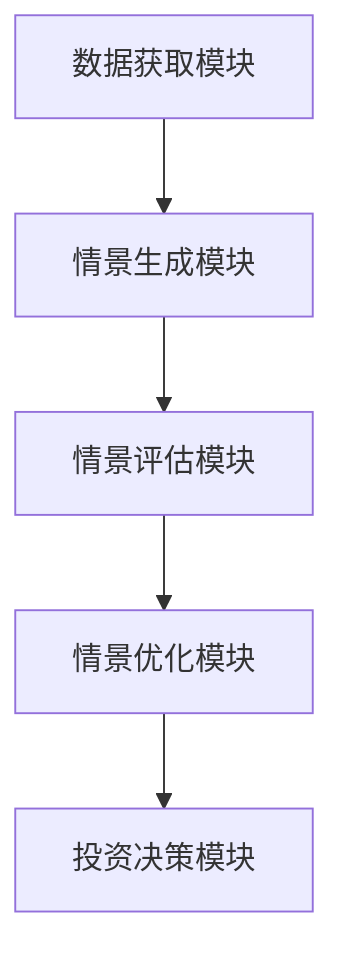
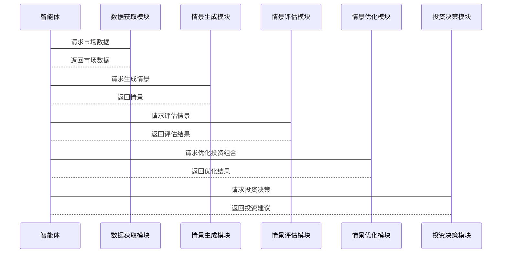

                 


# 多智能体AI如何增强价值投资的情景分析能力

---

## 关键词：
多智能体AI、价值投资、情景分析、分布式计算、强化学习、联邦学习

---

## 摘要：
本文探讨了多智能体AI在价值投资中的应用，重点分析了多智能体AI如何通过协同学习和分布式计算增强情景分析能力。文章从多智能体AI的基本概念出发，结合价值投资的核心原理，详细阐述了多智能体AI在情景分析中的算法实现、系统设计和实际案例。通过数学模型、算法流程图和代码实现，本文为读者提供了全面的技术解读，展示了多智能体AI在金融领域的巨大潜力。

---

# 第1章: 多智能体AI与价值投资的背景与概念

## 1.1 多智能体AI的基本概念
### 1.1.1 多智能体系统定义
多智能体系统（Multi-Agent System, MAS）是由多个相互作用的智能体组成的分布式系统，每个智能体都有独立的目标和决策能力。智能体之间通过通信和协作完成复杂的任务。

### 1.1.2 多智能体与单智能体的区别
| 特性 | 单智能体 | 多智能体 |
|------|----------|----------|
| 决策 | 中央化   | 分布化   |
| 通信 | 无       | 有       |
| 协作 | 无       | 有       |

### 1.1.3 多智能体在金融领域的应用潜力
多智能体AI在金融领域的应用包括股票预测、风险评估、投资组合优化等。其分布式计算和协作能力使其成为金融分析的理想工具。

---

## 1.2 价值投资的核心概念
### 1.2.1 价值投资的定义与特点
价值投资是一种通过分析企业内在价值来判断股票价格的投资策略，强调长期持有优质资产。

### 1.2.2 价值投资的基本原理
价值投资的核心在于发现市场价格与内在价值的偏差，通过分析企业的财务状况、行业地位和竞争优势来判断投资价值。

### 1.2.3 价值投资在金融市场的应用场景
价值投资广泛应用于股票投资、资产配置和风险管理等领域。

---

## 1.3 多智能体AI与价值投资的结合
### 1.3.1 多智能体AI在金融分析中的优势
多智能体AI能够通过分布式计算和协同学习，从多个维度分析市场数据，提供更全面的投资建议。

### 1.3.2 价值投资与多智能体AI的契合点
多智能体AI能够模拟多个投资者的行为，分析市场情绪，从而帮助价值投资者发现潜在的投资机会。

### 1.3.3 多智能体AI如何增强情景分析能力
通过多智能体协同学习，AI能够生成多种市场情景，并评估每种情景下的投资策略，从而增强情景分析能力。

---

## 1.4 本章小结
本章介绍了多智能体AI和价值投资的基本概念，分析了多智能体AI在金融领域的应用潜力，并探讨了其与价值投资的契合点。

---

# 第2章: 多智能体AI的核心概念与原理

## 2.1 多智能体系统的组成与特征
### 2.1.1 多智能体系统的组成要素
多智能体系统由智能体、环境、通信协议和协作机制组成。

### 2.1.2 多智能体与价值投资的契合点
多智能体系统能够模拟多个投资者的行为，分析市场动态，为价值投资提供支持。

### 2.1.3 多智能体系统的协作与协调
多智能体系统通过通信和协作机制实现任务分配和资源优化。

---

## 2.2 多智能体AI的算法原理
### 2.2.1 分布式计算与多智能体协作
分布式计算通过将任务分解到多个智能体完成，提高了计算效率和系统的容错性。

### 2.2.2 多智能体强化学习
多智能体强化学习通过智能体之间的协作和竞争，优化整体决策。

### 2.2.3 联邦学习与知识共享
联邦学习允许智能体在不共享数据的情况下进行模型训练，保护隐私的同时实现知识共享。

---

## 2.3 多智能体AI在情景分析中的应用
### 2.3.1 情景分析的基本概念
情景分析是通过模拟不同市场条件下的投资结果，评估投资策略的稳健性。

### 2.3.2 多智能体如何构建情景模型
多智能体AI通过分析市场数据和投资者行为，生成多种市场情景。

### 2.3.3 多智能体AI在情景分析中的优势
多智能体AI能够实时更新市场情景，并根据最新信息调整投资策略。

---

## 2.4 本章小结
本章详细讲解了多智能体AI的核心概念与算法原理，并分析了其在情景分析中的应用优势。

---

# 第3章: 价值投资的数学模型与分析方法

## 3.1 价值投资的基本数学模型
### 3.1.1 股票估值的核心公式
股票的内在价值可以通过现金流折现模型（DCF）计算：
$$ \text{内在价值} = \sum_{t=1}^{n} \frac{\text{现金流}_t}{(1 + r)^t} $$

### 3.1.2 现金流折现模型（DCF）
DCF模型通过预测企业未来现金流并折现，计算其内在价值。

### 3.1.3 市盈率与市净率分析
市盈率（P/E）= 股价 / 每股净利润  
市净率（P/B）= 股价 / 每股净资产

---

## 3.2 多智能体AI在价值投资中的数学建模
### 3.2.1 多智能体协同学习的数学框架
多智能体协同学习通过优化目标函数实现：
$$ J = \sum_{i=1}^{N} J_i $$

### 3.2.2 情景分析的数学模型
情景分析通过生成多种市场情景，并评估每种情景下的投资结果。

### 3.2.3 多智能体决策优化的数学表达
多智能体决策优化通过优化每个智能体的策略，实现整体最优。

---

## 3.3 案例分析: 多智能体AI在某股票分析中的应用
### 3.3.1 案例背景介绍
以某科技公司为例，分析其股票的内在价值和市场情景。

### 3.3.2 多智能体AI分析过程
通过多智能体协同学习，生成多种市场情景，并评估每种情景下的投资策略。

### 3.3.3 分析结果与投资决策
根据分析结果，调整投资组合，优化投资策略。

---

## 3.4 本章小结
本章通过数学模型和案例分析，展示了多智能体AI在价值投资中的应用。

---

# 第4章: 多智能体AI增强情景分析能力的算法实现

## 4.1 多智能体强化学习算法
### 4.1.1 多智能体强化学习的基本原理
多智能体强化学习通过智能体之间的协作和竞争，优化整体决策。

### 4.1.2 多智能体协同学习的挑战
多智能体协同学习面临通信开销大、协作机制复杂等问题。

### 4.1.3 基于异步优势 actor-critic 的算法实现
异步优势 actor-critic 算法通过分布式计算，提高了学习效率。

---

## 4.2 情景分析的算法实现
### 4.2.1 情景生成算法
情景生成算法通过模拟市场动态，生成多种市场情景。

### 4.2.2 情景评估算法
情景评估算法通过分析每种情景下的投资结果，评估投资策略的稳健性。

### 4.2.3 情景优化算法
情景优化算法通过调整投资组合，优化整体投资收益。

---

## 4.3 算法实现的数学模型
### 4.3.1 多智能体协同学习的数学模型
$$ J = \sum_{i=1}^{N} J_i $$

### 4.3.2 情景分析的数学公式
$$ \text{投资收益} = \sum_{t=1}^{T} \text{收益}_t $$

### 4.3.3 多智能体决策优化的数学表达
$$ \theta_i = \arg\max_{\theta_i} J_i $$

---

## 4.4 本章小结
本章详细讲解了多智能体AI增强情景分析能力的算法实现，包括多智能体强化学习和情景分析的具体实现。

---

# 第5章: 多智能体AI在价值投资中的系统设计

## 5.1 项目介绍
### 5.1.1 项目背景
本项目旨在通过多智能体AI技术，增强价值投资的情景分析能力。

### 5.1.2 项目目标
实现一个多智能体AI系统，能够生成多种市场情景，并评估每种情景下的投资策略。

---

## 5.2 系统功能设计
### 5.2.1 数据获取模块
数据获取模块负责收集市场数据，包括股票价格、财务数据等。

### 5.2.2 情景生成模块
情景生成模块通过模拟市场动态，生成多种市场情景。

### 5.2.3 情景评估模块
情景评估模块分析每种情景下的投资结果，评估投资策略的稳健性。

### 5.2.4 情景优化模块
情景优化模块通过调整投资组合，优化整体投资收益。

---

## 5.3 系统架构设计
### 5.3.1 系统架构图


### 5.3.2 系统接口设计
系统接口包括数据输入接口、情景生成接口和投资决策接口。

### 5.3.3 系统交互流程图


---

## 5.4 本章小结
本章通过系统设计，展示了如何通过多智能体AI技术增强价值投资的情景分析能力。

---

# 第6章: 项目实战——多智能体AI在价值投资中的应用

## 6.1 环境安装
### 6.1.1 安装Python
安装Python 3.8或更高版本。

### 6.1.2 安装依赖库
安装numpy、pandas、scikit-learn、tensorflow等依赖库。

---

## 6.2 系统核心实现源代码
### 6.2.1 数据预处理
```python
import numpy as np
import pandas as pd

# 读取数据
data = pd.read_csv('stock_data.csv')

# 数据预处理
data = data.dropna()
data = (data - data.mean()) / data.std()
```

### 6.2.2 情景生成
```python
def generate_scenario(data):
    scenario = data + np.random.normal(0, 0.1, data.shape)
    return scenario
```

### 6.2.3 情景评估
```python
def evaluate_scenario(scenario, model):
    predictions = model.predict(scenario)
    return np.mean(predictions)
```

### 6.2.4 情景优化
```python
def optimize_portfolio(scenarios, models):
    optimal_portfolio = []
    for scenario in scenarios:
        best_prediction = -float('inf')
        best_model = None
        for model in models:
            prediction = model.predict(scenario)
            if prediction > best_prediction:
                best_prediction = prediction
                best_model = model
        optimal_portfolio.append(best_model)
    return optimal_portfolio
```

---

## 6.3 案例分析
### 6.3.1 案例背景
以某科技公司为例，分析其股票的内在价值和市场情景。

### 6.3.2 数据分析
通过数据分析，生成多种市场情景，并评估每种情景下的投资策略。

### 6.3.3 投资决策
根据分析结果，调整投资组合，优化整体投资收益。

---

## 6.4 本章小结
本章通过项目实战，展示了如何通过多智能体AI技术增强价值投资的情景分析能力。

---

# 第7章: 总结与展望

## 7.1 总结
多智能体AI通过分布式计算和协同学习，能够显著增强价值投资的情景分析能力。本文详细讲解了多智能体AI的核心概念、算法实现和系统设计，并通过项目实战展示了其实际应用。

---

## 7.2 展望
未来的研究方向包括多智能体AI的优化算法、情景分析的动态更新和多智能体系统的实时性提升。此外，多智能体AI在其他金融领域的应用也值得进一步探索。

---

## 7.3 最佳实践 tips
- 多智能体AI的核心在于智能体之间的协作与协调。
- 情景分析的关键在于生成多样化的市场情景，并评估每种情景下的投资策略。
- 项目实战中，数据预处理和模型训练是核心步骤。

---

## 7.4 小结
多智能体AI在价值投资中的应用前景广阔，通过不断优化算法和系统设计，能够为投资者提供更精准的投资决策支持。

---

## 7.5 注意事项
- 多智能体AI的通信机制设计复杂，需注意系统性能的优化。
- 情景分析的准确性依赖于数据质量和模型的训练效果。
- 项目实战中，需注意数据隐私和模型的可解释性。

---

## 7.6 拓展阅读
建议读者进一步阅读以下文献，深入了解多智能体AI在金融领域的应用：
1. 现代投资组合理论
2. 多智能体强化学习算法
3. 联邦学习与数据隐私保护

---

# 附录: 参考文献

（此处列出参考文献的具体内容）

---

# 结束语

感谢您的阅读！希望本文能够为您提供有价值的技术见解和实践指导。

