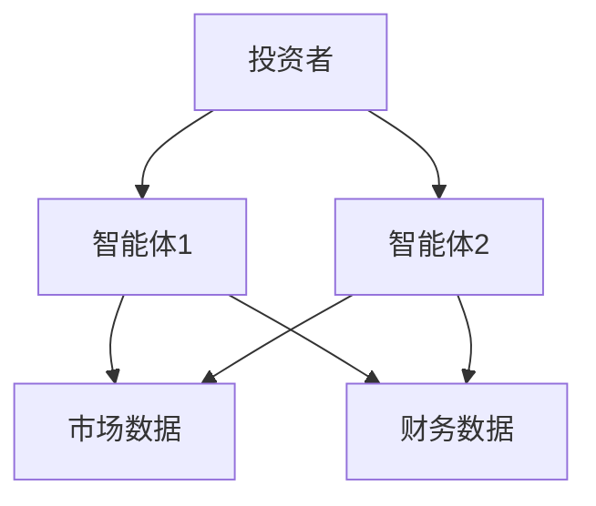
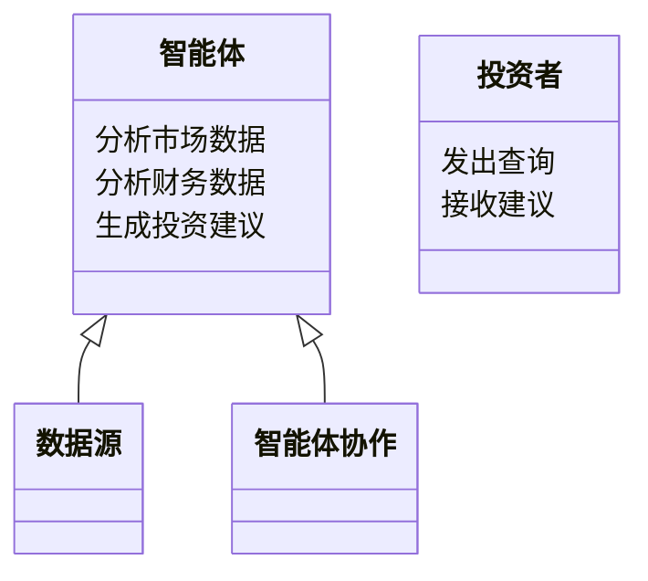
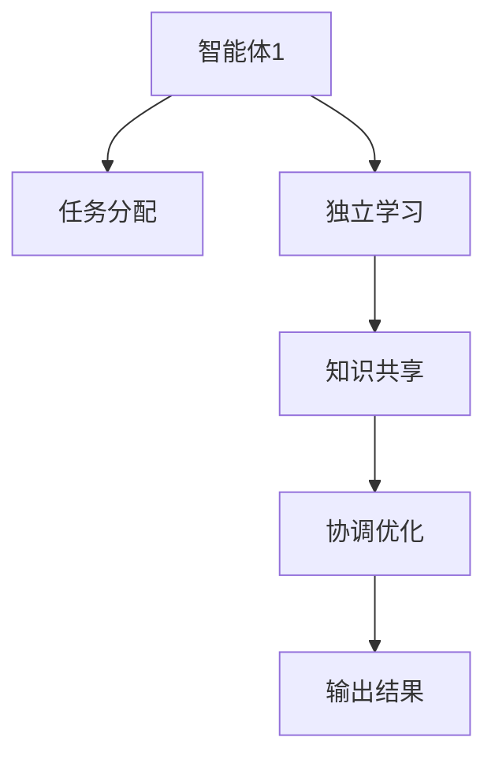
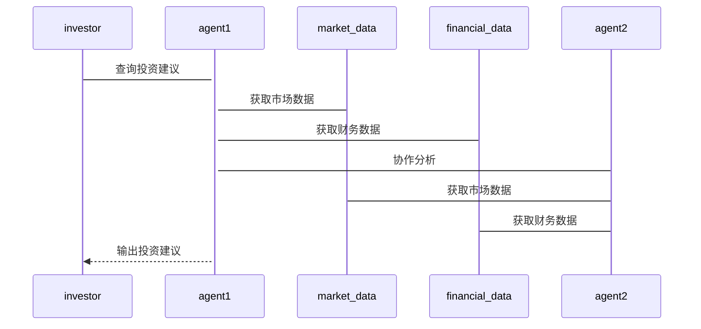

                 


# 多智能体AI如何增强价值投资的跨周期分析能力

---

## 关键词：
多智能体AI、价值投资、跨周期分析、协同学习、金融建模

---

## 摘要：
本文探讨了多智能体AI在价值投资中的应用，重点分析了其如何通过协同学习和分布计算提升跨周期分析能力。文章从多智能体AI的基本概念、价值投资的理论基础入手，详细阐述了多智能体AI在金融分析中的算法原理、系统架构设计以及实际应用案例。通过理论与实践相结合，本文揭示了多智能体AI如何帮助投资者在复杂多变的市场环境中做出更明智的投资决策。

---

## 第1章: 多智能体AI的定义与核心概念

### 1.1 多智能体AI的定义
#### 1.1.1 多智能体系统的基本概念
多智能体系统（Multi-Agent System, MAS）是由多个智能体组成的分布式系统，这些智能体通过协作和竞争完成复杂任务。每个智能体都有自己的目标、知识和行为规则，能够独立决策并与其他智能体交互。

#### 1.1.2 多智能体AI的核心特征
- **分布式性**：智能体独立运行，通过通信协作完成任务。
- **自主性**：每个智能体都有自主决策的能力。
- **社会性**：智能体之间通过交互实现信息共享和协同。
- **反应性**：能够实时感知环境并做出响应。

#### 1.1.3 多智能体AI与传统AI的区别
| 特性        | 多智能体AI                   | 传统AI                     |
|-------------|------------------------------|-----------------------------|
| 结构         | 分布式，多个智能体协作       | 集中式，单个模型处理问题     |
| 行为         | 智能体之间有交互             | 模型独立运行                 |
| 应用场景     | 复杂任务，如金融分析         | 简单任务，如分类、回归       |

### 1.2 价值投资的定义与理论基础
#### 1.2.1 价值投资的基本概念
价值投资是一种投资策略，通过分析企业的内在价值，寻找被市场低估的投资标的。其核心在于寻找价格低于内在价值的资产。

#### 1.2.2 价值投资的核心原则
- **安全边际**：买入价格远低于内在价值的资产。
- **长期视角**：关注企业的长期盈利能力。
- **逆向思维**：在市场恐慌时寻找机会。

#### 1.2.3 价值投资的实践方法
- **基本面分析**：分析企业的财务状况、行业地位、竞争优势等。
- **市场情绪分析**：判断市场的非理性波动。
- **跨周期分析**：分析企业在不同经济周期中的表现。

### 1.3 多智能体AI与价值投资的结合
#### 1.3.1 多智能体AI在金融领域的应用
多智能体AI可以用于股票预测、风险评估、投资组合优化等领域。通过多个智能体的协作，可以提高分析的准确性和全面性。

#### 1.3.2 价值投资中的跨周期分析需求
跨周期分析需要考虑不同经济周期中的市场波动、企业表现等因素。传统方法依赖经验丰富的分析师，而多智能体AI可以通过数据驱动的方式提高分析效率和准确性。

#### 1.3.3 多智能体AI如何增强跨周期分析能力
- **分布式计算**：多个智能体分别分析不同维度的数据，提高计算效率。
- **协同学习**：智能体之间共享信息，提升整体分析能力。
- **实时反馈**：智能体能够根据市场变化实时调整分析策略。

---

## 第2章: 多智能体AI的核心概念与联系

### 2.1 多智能体系统的结构
#### 2.1.1 多智能体系统的组成
- **智能体**：独立决策的个体。
- **环境**：智能体所处的外部世界。
- **通信机制**：智能体之间交互的渠道。
- **协调机制**：智能体协作的规则。

#### 2.1.2 智能体之间的交互关系
- **协作**：智能体之间共享信息，共同完成任务。
- **竞争**：智能体之间争夺资源，优化结果。

#### 2.1.3 系统的层次结构
- **个体层**：单个智能体的行为。
- **群体层**：多个智能体的协作。
- **系统层**：整个系统的运行和管理。

### 2.2 价值投资的核心要素
#### 2.2.1 价值投资的关键指标
- **市盈率（P/E）**：股价与每股收益的比率。
- **市净率（P/B）**：股价与每股净资产的比率。
- **股息率**：股息与股价的比率。

#### 2.2.2 跨周期分析的核心要素
- **经济周期**：不同阶段市场的表现不同。
- **行业周期**：不同行业在周期中的表现不同。
- **公司周期**：企业自身的增长周期。

#### 2.2.3 价值投资中的数据特征
- **财务数据**：收入、利润、现金流等。
- **市场数据**：股价、成交量、市场情绪等。
- **行业数据**：行业趋势、政策变化等。

### 2.3 多智能体AI与价值投资的结合模型
#### 2.3.1 多智能体AI的实体关系图


#### 2.3.2 价值投资的领域模型


#### 2.3.3 两者的结合方式
- **数据共享**：智能体之间共享市场和财务数据。
- **协同决策**：多个智能体共同生成投资建议。
- **实时反馈**：智能体根据市场变化实时调整分析策略。

---

## 第3章: 多智能体AI的算法原理

### 3.1 分布式计算与多智能体协同
#### 3.1.1 分布式计算的基本原理
分布式计算通过将任务分解到多个节点上并行处理，提高计算效率。多智能体AI利用分布式计算的优势，通过多个智能体协作完成复杂任务。

#### 3.1.2 协同学习的实现机制
协同学习是多智能体AI的核心算法之一，通过智能体之间的协作和知识共享，提高整体学习效果。

### 3.2 多智能体协同学习的算法流程
#### 3.2.1 算法流程
1. 初始化：智能体分配任务。
2. 并行学习：每个智能体独立学习。
3. 信息共享：智能体之间共享知识。
4. 协调优化：根据共享信息优化整体策略。
5. 输出结果：生成最终的投资建议。

#### 3.2.2 算法实现的mermaid流程图


#### 3.2.3 算法实现的Python代码示例
```python
class Agent:
    def __init__(self, id):
        self.id = id
        self.data = None

    def process_data(self, data):
        # 独立学习
        self.data = data
        # 协作学习
        return self.data

# 初始化多个智能体
agents = [Agent(i) for i in range(4)]

# 分配任务
task = "stock_analysis"

# 并行处理
from concurrent.futures import ThreadPoolExecutor
import pandas as pd

def process_agent(agent, task):
    if task == "stock_analysis":
        return agent.process_data(pd.DataFrame())

with ThreadPoolExecutor() as executor:
    futures = [executor.submit(process_agent, agent, task) for agent in agents]
    results = [future.result() for future in futures]

# 知识共享
shared_data = {}
for agent, result in zip(agents, results):
    shared_data[agent.id] = result

# 协调优化
optimized_data = {}
for key in shared_data:
    optimized_data[key] = shared_data[key]  # 示例优化逻辑
```

---

## 第4章: 系统分析与架构设计方案

### 4.1 问题场景介绍
在金融领域，跨周期分析需要考虑多个因素，包括经济周期、行业周期和公司周期。传统方法依赖经验丰富的分析师，而多智能体AI可以通过数据驱动的方式提高分析效率和准确性。

### 4.2 项目介绍
本项目旨在通过多智能体AI技术，增强价值投资的跨周期分析能力。系统将通过多个智能体协作，分析市场数据、财务数据和行业数据，生成投资建议。

### 4.3 系统功能设计
#### 4.3.1 领域模型


#### 4.3.2 系统架构设计


#### 4.3.3 系统接口设计
- **输入接口**：接收市场数据、财务数据和投资者查询。
- **输出接口**：输出投资建议和分析报告。

#### 4.3.4 系统交互


---

## 第5章: 项目实战

### 5.1 环境安装
需要安装以下依赖：
- Python 3.8+
- Pandas
- NumPy
- Matplotlib
- Scikit-learn
- Mermaid

### 5.2 系统核心实现源代码
```python
import pandas as pd
import numpy as np
from sklearn.metrics import accuracy_score
from concurrent.futures import ThreadPoolExecutor

class MarketAgent:
    def __init__(self, id):
        self.id = id
        self.data = None

    def analyze_market(self, data):
        # 示例分析方法
        self.data = data
        return self.data

class FinancialAgent:
    def __init__(self, id):
        self.id = id
        self.data = None

    def analyze_financial(self, data):
        # 示例分析方法
        self.data = data
        return self.data

def main():
    # 初始化智能体
    market_agents = [MarketAgent(i) for i in range(2)]
    financial_agents = [FinancialAgent(i) for i in range(2)]
    
    # 数据准备
    market_data = pd.DataFrame({'price': np.random.rand(100, 1)})
    financial_data = pd.DataFrame({'revenue': np.random.rand(100, 1)})
    
    # 并行处理
    with ThreadPoolExecutor() as executor:
        futures = []
        for agent in market_agents:
            futures.append(executor.submit(agent.analyze_market, market_data))
        for agent in financial_agents:
            futures.append(executor.submit(agent.analyze_financial, financial_data))
        for future in futures:
            print(future.result())
    
    # 知识共享
    shared_data = {}
    for agent in market_agents:
        shared_data[agent.id] = agent.data
    for agent in financial_agents:
        shared_data[agent.id] = agent.data
    
    # 协调优化
    optimized_data = {}
    for key in shared_data:
        optimized_data[key] = shared_data[key]
    
    # 输出结果
    print("Analysis completed.")

if __name__ == "__main__":
    main()
```

### 5.3 代码应用解读与分析
- **MarketAgent**：负责分析市场数据，如股价、成交量等。
- **FinancialAgent**：负责分析财务数据，如收入、利润等。
- ** ThreadPoolExecutor**：用于并行处理多个智能体的任务。
- **Knowledge Sharing**：智能体之间共享数据，提高整体分析能力。

### 5.4 实际案例分析
假设我们有4个智能体，其中2个负责分析市场数据，2个负责分析财务数据。通过并行计算和知识共享，系统能够快速生成投资建议。

### 5.5 项目小结
通过实际项目，我们可以看到多智能体AI在价值投资中的应用潜力。通过并行计算和知识共享，系统能够快速生成准确的投资建议。

---

## 第6章: 总结与展望

### 6.1 本文总结
本文探讨了多智能体AI在价值投资中的应用，重点分析了其如何通过协同学习和分布计算提升跨周期分析能力。通过理论与实践相结合，揭示了多智能体AI如何帮助投资者在复杂多变的市场环境中做出更明智的投资决策。

### 6.2 未来研究方向
- **智能体优化**：进一步优化智能体的协作机制。
- **多模态数据分析**：结合文本、图像等多种数据源。
- **实时分析能力**：提高系统的实时响应能力。

### 6.3 最佳实践 tips
- **数据质量**：确保数据的准确性和完整性。
- **模型调优**：根据实际需求调整模型参数。
- **团队协作**：多智能体AI需要团队协作开发。

### 6.4 总结
多智能体AI在价值投资中的应用前景广阔，通过不断优化和创新，未来将在金融领域发挥更大的作用。

---

## 参考文献
1. Russell, S. J., & Norvig, P. (2010). Artificial Intelligence: A Modern Approach.
2. Goodfellow, I., Bengio, Y., & Courville, A. (2016). Deep Learning.
3. Sun, G., & Pan, J. (2019). Multi-Agent Deep Reinforcement Learning for Stock Trading.

---

通过本文的详细阐述，我们可以看到多智能体AI在价值投资中的巨大潜力。通过不断的研究和实践，相信未来多智能体AI将在金融领域发挥更大的作用。

