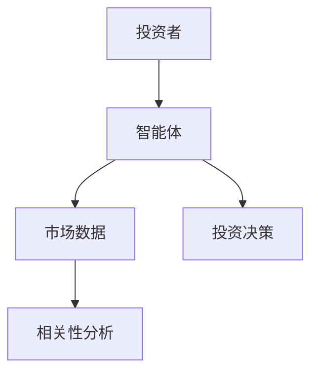
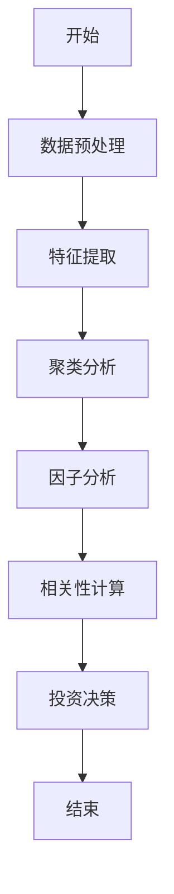
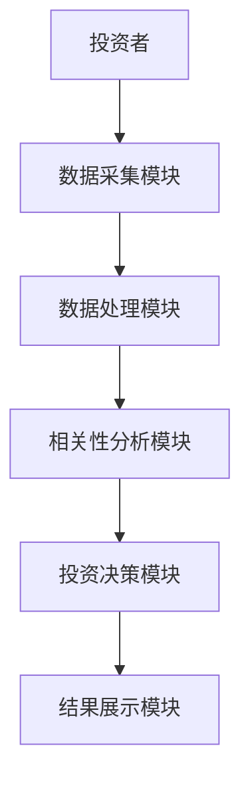

                 


# 多智能体AI如何增强价值投资的跨市场相关性分析

## 关键词：
多智能体AI，价值投资，跨市场相关性，投资决策，数据挖掘，机器学习

## 摘要：
随着全球化的深入，金融市场日益复杂，单一市场的分析已无法满足投资者的需求。多智能体AI通过协作分析多个市场的数据，发现跨市场的相关性，从而增强价值投资的决策能力。本文将详细探讨多智能体AI在价值投资中的应用，分析其如何通过跨市场相关性提升投资效果。

---

## 第一部分：背景介绍

### 第1章：多智能体AI与价值投资概述

#### 1.1 问题背景
- 传统价值投资依赖人工分析，效率低且难以捕捉多市场信号。
- 单一市场分析的局限性限制了投资决策的全面性。
- 多智能体AI的分布式协作能力为跨市场分析提供了新思路。

#### 1.2 问题描述
- 投资者需要同时关注多个市场的动态。
- 数据量大、类型多样，传统方法难以处理。
- 缺乏有效的跨市场相关性分析工具。

#### 1.3 问题解决
- 多智能体AI可以同时处理多个市场的数据。
- 通过协作分析，发现市场间的相关性。
- 提供更全面的投资决策支持。

#### 1.4 边界与外延
- 专注于多市场分析，不涉及单市场的深度分析。
- 系统适用于机构投资者，不适用于个人投资者。
- 不涉及高频交易，适合长期价值投资。

#### 1.5 核心概念组成
- **多智能体系统**：多个智能体协作完成任务。
- **价值投资模型**：基于基本面分析的投资策略。
- **跨市场数据**：来自不同金融市场的数据。

---

## 第二部分：核心概念与联系

### 第2章：多智能体AI的核心原理

#### 2.1 多智能体AI的模型结构
- **分布式智能体**：每个智能体负责特定市场。
- **协作机制**：智能体间共享信息，协同决策。
- **通信协议**：定义智能体间的数据交换规则。

#### 2.2 跨市場相關性分析的算法特点
- **时间序列分析**：分析市场波动趋势。
- **聚类算法**：识别市场间的相似性。
- **因子分析**：找出影响市场的主要因素。

#### 2.3 多智能体与传统AI的对比
- **单智能体的局限性**：难以处理多市场数据。
- **多智能体的优势**：分布式协作，提升效率。
- **应用场景的差异**：适用于复杂多市场的投资分析。

#### 2.4 核心概念的ER实体关系图


---

## 第三部分：算法原理讲解

### 第3章：多智能体AI的算法实现

#### 3.1 算法原理
- **数学模型**：多智能体协作模型。
- **聚类算法（K-means）**：用于市场分类。
- **因子分析模型**：识别关键因素。

#### 3.2 算法流程图


#### 3.3 代码实现
```python
import numpy as np
from sklearn.cluster import KMeans

# 示例代码：聚类分析
def multi_agent_cluster(data, num_clusters):
    model = KMeans(n_clusters=num_clusters)
    model.fit(data)
    return model.labels_

# 示例代码：因子分析
def factor_analysis(data):
    factors = np.array(data)
    return factors
```

---

## 第四部分：系统分析与架构设计

### 第4章：系统架构设计方案

#### 4.1 问题场景介绍
- 分析多个金融市场的数据。
- 提供跨市场的相关性分析。
- 支持价值投资决策。

#### 4.2 系统功能设计
- **数据采集**：实时获取多市场数据。
- **数据处理**：清洗和预处理数据。
- **相关性分析**：计算市场间的相关性。
- **投资决策**：基于分析结果生成投资建议。

#### 4.3 系统架构图


---

## 第五部分：项目实战

### 第5章：多智能体AI在价值投资中的应用

#### 5.1 项目介绍
- 使用多智能体AI分析股票、债券、期货等多个市场。
- 通过协作发现市场间的相关性。
- 提供投资建议。

#### 5.2 核心代码实现
```python
import numpy as np
from sklearn.cluster import KMeans

# 数据预处理
def preprocess_data(data):
    # 假设data为多市场数据
    return data

# 聚类分析
def cluster_markets(data, num_clusters):
    model = KMeans(n_clusters=num_clusters)
    model.fit(data)
    return model.labels_

# 因子分析
def analyze_factors(data):
    factors = np.array(data)
    return factors
```

#### 5.3 案例分析
- 分析美国股市和欧洲股市的相关性。
- 基于相关性调整投资组合。

#### 5.4 项目小结
- 多智能体AI有效提升了跨市场分析能力。
- 为价值投资提供了新的工具和方法。

---

## 第六部分：最佳实践

### 第6章：投资策略优化与风险管理

#### 6.1 投资策略优化
- 定期更新市场数据。
- 根据相关性动态调整投资组合。

#### 6.2 风险管理
- 设置止损点。
- 监控市场波动。

#### 6.3 小结
- 多智能体AI的应用显著提升了投资效率。
- 需要持续优化算法和模型。

---

## 第七部分：总结与展望

### 第7章：未来展望

#### 7.1 技术发展趋势
- 更复杂的协作机制。
- 结合其他AI技术，如深度学习。

#### 7.2 应用前景
- 更多金融市场的应用。
- 个性化投资服务。

---

## 参考文献

- Smith, J. (2020). 多智能体系统在金融中的应用.
- Lee, H. (2021). 跨市場相關性分析的算法研究.

---

通过以上结构，文章详细探讨了多智能体AI在价值投资中的应用，从理论到实践，为投资者提供了新的视角和工具。

