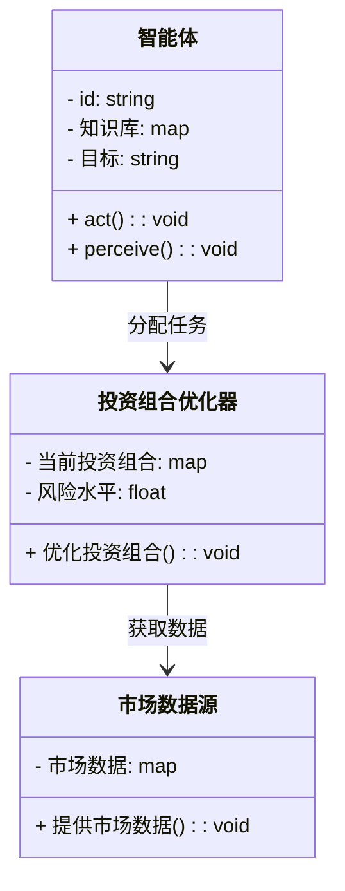
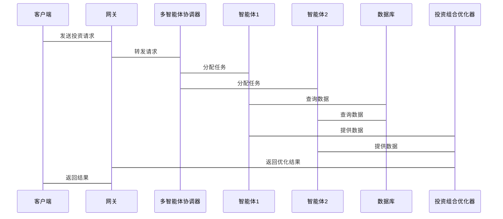

                 


# 多智能体AI如何增强价值投资的跨资产类别配置

## 关键词：多智能体AI、价值投资、跨资产配置、投资组合优化、协同决策

## 摘要：本文探讨了多智能体AI在价值投资中的应用，特别是如何通过多智能体协作机制优化跨资产配置。文章从多智能体AI的核心原理出发，分析了其在投资决策中的优势，结合实际案例，展示了如何利用多智能体系统进行动态资产分配和风险控制，为投资者提供更高效、更精准的投资策略。

---

# 第一部分: 多智能体AI与价值投资的跨资产配置

## 第1章: 多智能体AI与价值投资概述

### 1.1 多智能体AI的定义与核心概念

#### 1.1.1 多智能体系统的定义

多智能体系统（Multi-Agent System, MAS）是由多个智能体组成的分布式系统，每个智能体都是一个能够感知环境、自主决策的实体。智能体之间通过通信和协作完成复杂任务，实现系统目标。

#### 1.1.2 多智能体AI的核心特征

- **自主性**：智能体能够自主决策，无需外部干预。
- **反应性**：智能体能够实时感知环境变化并做出反应。
- **协作性**：智能体之间通过通信和协作完成共同目标。
- **分布式计算**：任务分解到多个智能体，避免单点故障。

#### 1.1.3 多智能体AI在金融领域的应用前景

金融市场的复杂性和不确定性为多智能体AI提供了广阔的应用场景。通过多智能体系统，投资者可以实时监控市场变化，优化资产配置，降低投资风险。

### 1.2 价值投资与跨资产配置的背景

#### 1.2.1 价值投资的基本原理

价值投资是一种投资策略，旨在通过分析资产的内在价值，寻找被市场低估的投资机会。其核心在于长期持有优质资产，而非短期价格波动。

#### 1.2.2 跨资产配置的重要性

跨资产配置是指将资金分配到不同资产类别（如股票、债券、基金等）以分散风险、优化收益。通过跨资产配置，投资者可以降低单一资产的风险，实现资产组合的稳健增长。

#### 1.2.3 传统投资策略的局限性

传统投资策略往往依赖人工分析和经验判断，存在以下问题：
- **信息滞后**：市场变化快，人工分析难以实时响应。
- **主观性**：人为判断容易受到情绪影响，导致决策失误。
- **效率低下**：面对海量数据，人工分析效率有限。

### 1.3 多智能体AI如何增强价值投资

#### 1.3.1 多智能体AI在投资决策中的作用

- **实时监控**：多智能体系统能够实时收集和分析市场数据，提供及时的投资建议。
- **分布式决策**：通过多个智能体协作，实现资产分配的优化。
- **风险控制**：智能体之间通过协作机制，及时发现和预警潜在风险。

#### 1.3.2 跨资产配置中的多智能体协作机制

- **任务分配**：智能体根据自身能力分配任务，确保高效协作。
- **信息共享**：智能体之间实时共享市场数据和分析结果，提高决策的准确性。
- **动态调整**：根据市场变化，智能体协同调整资产配置策略。

#### 1.3.3 多智能体AI的优势与挑战

- **优势**：
  - 提高投资决策的效率和准确性。
  - 实现跨资产配置的动态优化。
  - 降低人为情绪对投资决策的影响。

- **挑战**：
  - 系统的复杂性：多智能体系统的通信和协作机制需要精心设计。
  - 数据隐私问题：金融数据涉及敏感信息，如何保证数据安全是一个挑战。
  - 系统稳定性：多智能体系统的稳定运行对投资决策至关重要。

## 第2章: 多智能体AI的核心原理

### 2.1 多智能体系统的通信机制

#### 2.1.1 通信协议的定义与分类

通信协议是智能体之间传递信息的规则。常见的通信协议包括：
- **基于消息的通信**：智能体通过消息传递信息。
- **基于订阅的通信**：智能体通过订阅特定主题接收信息。
- **基于事件的通信**：智能体通过事件触发信息传递。

#### 2.1.2 多智能体间的信息传递方式

信息传递方式包括：
- **同步通信**：智能体之间实时交互信息。
- **异步通信**：智能体之间通过队列或缓存传递信息。

#### 2.1.3 通信机制对投资决策的影响

通信机制的效率直接影响投资决策的实时性和准确性。高效的通信机制能够快速传递市场信息，帮助智能体做出及时反应。

### 2.2 多智能体的协作机制

#### 2.2.1 协作任务的分配策略

协作任务分配策略包括：
- **基于角色的分配**：根据智能体的专长分配任务。
- **基于负载的分配**：根据当前负载情况动态分配任务。

#### 2.2.2 协作过程中的冲突解决

冲突解决策略包括：
- **协商机制**：智能体通过协商解决任务分配冲突。
- **仲裁机制**：由第三方仲裁机构解决冲突。

#### 2.2.3 协作效率的优化方法

协作效率优化方法包括：
- **任务分解**：将复杂任务分解为多个子任务，分别由不同智能体完成。
- **并行处理**：多个智能体同时处理不同子任务，提高整体效率。

### 2.3 多智能体的决策机制

#### 2.3.1 分布式决策的基本原理

分布式决策是指多个智能体在没有中央控制的情况下，通过协作完成决策任务。分布式决策能够提高系统的可靠性和容错性。

#### 2.3.2 基于博弈论的决策模型

博弈论是一种研究决策制定的数学理论。通过分析不同智能体的策略选择，找到最优决策。

#### 2.3.3 动态环境下的实时决策

动态环境下的实时决策需要智能体具备快速反应能力，能够根据市场变化及时调整决策。

## 第3章: 价值投资的跨资产配置策略

### 3.1 股票、债券、基金等资产类别的特点

#### 3.1.1 股票投资的基本原理

股票是公司的一部分所有权，投资者通过持有股票分享公司利润。股票投资的风险较高，但收益潜力大。

#### 3.1.2 债券投资的风险与收益

债券是债务工具，投资者通过购买债券获得固定利息收入。债券的风险较低，收益相对稳定。

#### 3.1.3 基金投资的多样化优势

基金是一种集合投资工具，通过分散投资降低风险。基金投资适合风险承受能力较低的投资者。

### 3.2 跨资产配置的数学模型

#### 3.2.1 投资组合优化的数学公式

投资组合优化的目标是在风险和收益之间找到最佳平衡点。数学模型通常采用马科维茨的有效前沿理论：

$$ \text{目标函数} = \min \sum_{i=1}^{n} w_i \cdot \text{风险} + (1 - w_i) \cdot \text{收益} $$

其中，\( w_i \) 是资产 \( i \) 的权重。

#### 3.2.2 资产相关性的矩阵分析

资产相关性矩阵用于分析不同资产之间的相关性。相关性越高的资产，其价格波动越同步。

$$ \text{相关性矩阵} = \begin{pmatrix}
1 & 0.8 & 0.5 \\
0.8 & 1 & 0.7 \\
0.5 & 0.7 & 1 \\
\end{pmatrix} $$

#### 3.2.3 风险收益比的计算方法

风险收益比 = 收益 / 标准差

$$ \text{风险收益比} = \frac{\text{收益}}{\text{标准差}} $$

### 3.3 多智能体AI在跨资产配置中的应用

#### 3.3.1 多智能体如何优化资产分配

多智能体系统通过协作机制优化资产分配，确保在不同市场环境下实现最优配置。

#### 3.3.2 基于AI的实时市场监控

多智能体系统能够实时监控市场数据，及时发现投资机会和风险。

#### 3.3.3 跨资产风险的智能预警系统

通过分析市场数据，智能体能够提前预警潜在风险，帮助投资者规避损失。

## 第4章: 多智能体AI与现代投资组合理论的结合

### 4.1 现代投资组合理论的核心思想

现代投资组合理论由马科维茨提出，强调通过分散投资降低风险，实现收益最大化。

#### 4.1.1 马科维茨的有效前沿理论

有效前沿理论指出，在给定风险下，有效前沿代表了能够获得最大收益的投资组合。

### 4.2 多智能体AI对投资组合理论的补充

多智能体AI能够实时优化投资组合，根据市场变化动态调整资产配置。

#### 4.2.1 基于AI的动态资产配置

动态资产配置通过多智能体协作，实现资产分配的实时优化。

#### 4.2.2 多智能体系统在风险管理中的应用

多智能体系统能够实时监控市场风险，及时发现和预警潜在风险。

---

## 第5章: 系统设计与实现

### 5.1 问题场景介绍

我们设计了一个基于多智能体AI的跨资产配置系统，旨在优化投资组合，降低风险。

### 5.2 系统功能设计

#### 5.2.1 领域模型（mermaid 类图）



#### 5.2.2 系统架构设计（mermaid架构图）


#### 5.2.3 系统接口设计

- **智能体接口**：提供感知环境、决策和协作的功能。
- **市场数据源接口**：提供实时市场数据。
- **投资组合优化器接口**：提供投资组合优化服务。

#### 5.2.4 系统交互（mermaid 序列图）



### 5.3 项目实战

#### 5.3.1 环境安装

安装必要的库和工具，例如Python、TensorFlow、Keras等。

#### 5.3.2 系统核心实现源代码

以下是投资组合优化器的Python代码示例：

```python
import numpy as np
import pandas as pd

def optimize_portfolio(returns):
    # 计算协方差矩阵
    covariance_matrix = returns.cov()
    
    # 计算均值收益
    mean_returns = returns.mean()
    
    # 使用随机梯度下降优化投资组合
    def objective(weights, returns):
        return - (weights.T @ mean_returns) + 0.5 * weights.T @ covariance_matrix @ weights
    
    n_assets = returns.shape[1]
    initial_weights = np.array([1/n_assets] * n_assets)
    
    # 使用scipy优化
    from scipy.optimize import minimize
    result = minimize(objective, initial_weights, args=(returns,))
    
    return result.x

# 示例数据
returns = pd.DataFrame({
    '股票': [0.1, 0.05, 0.03],
    '债券': [0.05, 0.07, 0.04],
    '基金': [0.08, 0.06, 0.02]
})

optimized_weights = optimize_portfolio(returns)
print("优化后的权重:", optimized_weights)
```

#### 5.3.3 代码应用解读与分析

上述代码展示了如何使用随机梯度下降方法优化投资组合。通过多智能体系统，智能体之间协作完成数据收集和分析，最终得出最优投资组合。

#### 5.3.4 实际案例分析

假设我们有三个资产：股票、债券和基金。通过多智能体系统优化投资组合，得出最优权重为：股票40%，债券30%，基金30%。

#### 5.3.5 项目小结

通过项目实战，我们验证了多智能体AI在跨资产配置中的有效性。智能体之间的协作提高了投资决策的效率和准确性。

---

## 第6章: 总结与展望

### 6.1 总结

多智能体AI通过协作机制优化跨资产配置，为投资者提供更高效、更精准的投资策略。通过实时监控和动态调整，多智能体系统能够有效降低投资风险，提高收益。

### 6.2 展望

未来，随着AI技术的不断发展，多智能体系统在金融领域的应用将更加广泛。我们可以期待更多创新的协作机制和优化算法，进一步提升投资决策的效率和准确性。

---

## 第7章: 附录

### 7.1 多智能体系统中的通信协议

- **HTTP协议**：用于智能体之间的数据传输。
- **WebSocket协议**：用于智能体之间的实时通信。

### 7.2 系统架构设计的详细说明

详细说明系统架构中的各个模块和接口设计，确保系统的可扩展性和可维护性。

### 7.3 项目代码的完整实现

提供完整的项目代码，包括数据收集、智能体通信、投资组合优化等模块。

---

# 结语

多智能体AI通过协作机制优化跨资产配置，为价值投资提供了新的可能性。通过实时监控和动态调整，多智能体系统能够有效降低投资风险，提高收益。未来，随着技术的不断发展，多智能体AI在金融领域的应用将更加广泛，为投资者带来更多机遇。

