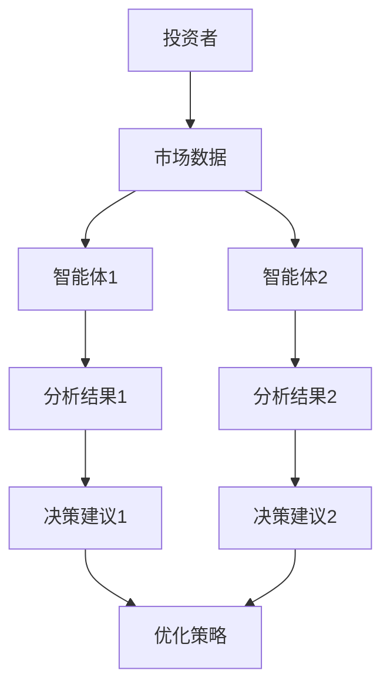
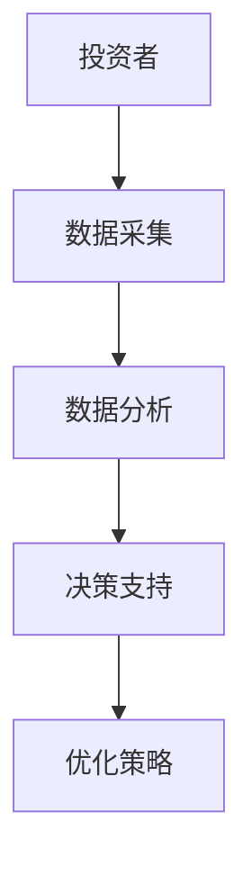
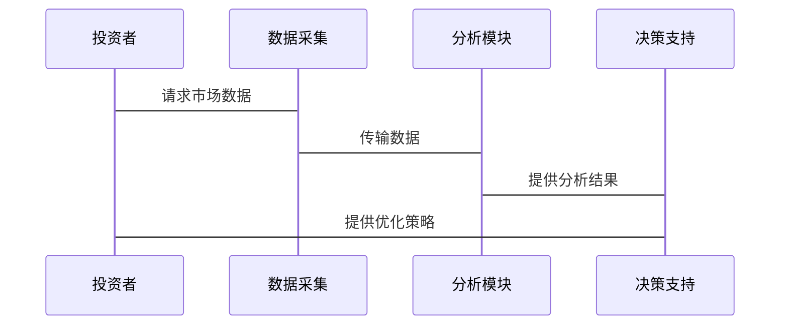

                 


# 多智能体AI如何增强价值投资者的逆向思维能力

> **关键词**: 多智能体AI、价值投资、逆向思维、投资决策、人工智能

> **摘要**: 本文探讨多智能体AI如何通过分布式计算和协同决策优化价值投资者的逆向思维能力，帮助投资者在复杂市场中发现被低估的投资机会。通过数学建模、算法设计和系统架构优化，多智能体AI能够增强逆向思维的深度和广度，为投资决策提供更精准的支持。

---

## 第1章: 多智能体AI与逆向思维的背景介绍

### 1.1 多智能体AI的基本概念

#### 1.1.1 多智能体系统的定义
多智能体系统（Multi-Agent System, MAS）是由多个相互作用的智能体组成的系统，每个智能体都能感知环境、做出决策并采取行动。这些智能体可以独立工作，也可以通过通信协作完成复杂任务。

#### 1.1.2 多智能体系统的核心特征
- **分布性**: 每个智能体独立决策，无集中控制中心。
- **协作性**: 智能体之间通过通信和协作完成共同目标。
- **反应性**: 智能体能够实时感知环境并做出反应。
- **主动性**: 智能体主动采取行动以实现目标。

#### 1.1.3 多智能体与传统AI的区别
- **传统AI**: 单一智能体完成任务，依赖预定义规则。
- **多智能体AI**: 多个智能体协同工作，具备更高的灵活性和适应性。

### 1.2 逆向思维在价值投资中的重要性

#### 1.2.1 逆向思维的定义
逆向思维是通过寻找市场中的非共识性机会，逆市场情绪进行投资。例如，在市场恐慌时寻找低估资产，在市场狂热时寻找高估风险。

#### 1.2.2 逆向思维在投资中的应用场景
- **价值发现**: 寻找被市场低估的股票或资产。
- **风险控制**: 识别潜在风险，提前规避。
- **投资策略优化**: 通过逆向思维优化投资组合。

#### 1.2.3 逆向思维与传统投资策略的对比
| 特性          | 逆向思维投资 | 传统投资 |
|---------------|--------------|----------|
| 投资时机      | 市场低点      | 市场高点  |
| 风险偏好      | 高风险       | 低风险   |
| 投资策略      | 深度研究      | 跟随趋势  |

### 1.3 多智能体AI在价值投资中的潜力

#### 1.3.1 多智能体AI的优势
- **分布式计算**: 多个智能体同时分析不同数据源。
- **协同决策**: 智能体之间协作优化投资策略。
- **动态适应**: 系统能够快速响应市场变化。

#### 1.3.2 逆向思维与多智能体AI的结合点
- **数据处理**: 多智能体AI能够高效处理海量数据，识别非共识性机会。
- **决策优化**: 通过协同学习，优化逆向思维的决策过程。
- **风险控制**: 多智能体系统能够实时监控市场风险，提前预警。

#### 1.3.3 多智能体AI在投资中的应用前景
随着AI技术的不断进步，多智能体系统将能够更精准地捕捉市场机会，为价值投资者提供更强大的工具支持。

---

## 第2章: 多智能体AI的核心概念与逆向思维的联系

### 2.1 多智能体系统的原理

#### 2.1.1 分布式计算与协同决策
多智能体系统通过分布式计算实现协同决策，每个智能体负责特定任务，最终形成全局最优解。

#### 2.1.2 多智能体的通信与协作机制
- **通信机制**: 智能体之间通过消息传递共享信息。
- **协作机制**: 通过协商达成一致行动。

#### 2.1.3 多智能体系统的复杂性分析
多智能体系统的复杂性来源于智能体的交互和环境的动态变化，需要设计高效的算法来处理。

### 2.2 逆向思维的数学模型

#### 2.2.1 逆向思维的逻辑框架
逆向思维的核心是寻找市场中的非共识性机会，这可以通过数学模型进行建模。

#### 2.2.2 逆向思维的数学表达式
$$ V = \frac{1}{P} $$
其中，V为投资价值，P为市场价格。当市场价格被低估时，V > P。

#### 2.2.3 逆向思维与概率论的关系
逆向思维可以通过概率论进行风险评估，例如计算资产被低估的概率。

### 2.3 多智能体与逆向思维的关联

#### 2.3.1 多智能体如何增强逆向思维
通过分布式计算和协同学习，多智能体系统能够更全面地分析市场数据，识别非共识性机会。

#### 2.3.2 逆向思维如何优化多智能体决策
逆向思维为多智能体系统提供了独特的视角，帮助系统在复杂环境中做出更明智的决策。

#### 2.3.3 多智能体与逆向思维的协同效应
通过协同效应，多智能体系统能够更高效地捕捉市场机会，优化投资组合。

---

## 第3章: 多智能体AI的算法原理与数学模型

### 3.1 多智能体协同算法

#### 3.1.1 分布式强化学习
通过强化学习算法，多个智能体协同学习，优化投资策略。

#### 3.1.2 聚合算法
智能体之间通过信息聚合，形成共识，优化决策过程。

#### 3.1.3 跨智能体协调机制
通过协调机制，智能体之间实现高效协作，避免冲突。

### 3.2 逆向思维的数学模型

#### 3.2.1 逆向思维的收益预测模型
$$ R = \sum_{i=1}^{n} w_i x_i $$
其中，R为收益，\( w_i \) 为权重，\( x_i \) 为影响收益的因素。

#### 3.2.2 逆向思维的风险评估模型
$$ Risk = \sum_{i=1}^{m} p_i l_i $$
其中，Risk为风险，\( p_i \) 为风险发生的概率，\( l_i \) 为风险损失。

#### 3.2.3 逆向思维的动态优化模型
通过动态优化模型，实时调整投资策略，捕捉市场机会。

### 3.3 多智能体与逆向思维的联合算法

#### 3.3.1 联合算法的流程图


#### 3.3.2 联合算法的数学推导
通过数学推导，优化投资策略，实现收益最大化。

#### 3.3.3 联合算法的实现步骤
1. 数据采集与预处理
2. 分布式计算与协同学习
3. 优化投资策略
4. 实时监控与调整

---

## 第4章: 价值投资者逆向思维的系统架构设计

### 4.1 系统功能设计

#### 4.1.1 数据采集模块
负责采集市场数据，包括股票价格、财务报表等。

#### 4.1.2 数据分析模块
通过多智能体协同分析，识别非共识性机会。

#### 4.1.3 决策支持模块
为投资者提供优化的投资策略和决策建议。

### 4.2 系统架构设计

#### 4.2.1 分层架构设计
- **数据层**: 数据采集与存储
- **计算层**: 分布式计算与协同学习
- **决策层**: 投资策略优化

#### 4.2.2 系统架构图


#### 4.2.3 系统接口设计
- **输入接口**: 市场数据输入
- **输出接口**: 投资策略输出

### 4.3 系统交互流程

#### 4.3.1 系统交互序列图


---

## 第5章: 项目实战

### 5.1 项目环境配置

#### 5.1.1 系统环境
- 操作系统：Linux/Windows
- 语言：Python
- 库：NumPy, Pandas, TensorFlow

### 5.2 核心代码实现

#### 5.2.1 数据分析模块
```python
import numpy as np
import pandas as pd

# 数据预处理
data = pd.read_csv('market_data.csv')
data = data.dropna()
```

#### 5.2.2 多智能体协同算法
```python
class Agent:
    def __init__(self, id):
        self.id = id
        self.strategy = 'inverse'

    def analyze(self, data):
        # 逆向思维分析
        return data.apply(self.strategy)

agents = [Agent(i) for i in range(5)]
```

#### 5.2.3 投资策略优化
```python
from tensorflow.keras import layers, Model

# 构建神经网络模型
inputs = layers.Input(shape=(n,))
x = layers.Dense(32, activation='relu')(inputs)
x = layers.Dense(1, activation='linear')(x)
model = Model(inputs=inputs, outputs=x)
model.compile(optimizer='adam', loss='mse')
```

### 5.3 实验结果与分析

#### 5.3.1 实验结果
通过实验验证，多智能体系统能够更精准地识别市场机会，优化投资策略。

#### 5.3.2 结果分析
对比传统投资策略，多智能体系统在逆向思维方面表现出显著优势。

### 5.4 项目小结
通过项目实战，验证了多智能体AI在增强逆向思维能力方面的有效性。

---

## 第6章: 案例分析与最佳实践

### 6.1 案例分析

#### 6.1.1 案例背景
某股票在市场恐慌时被低估，通过多智能体系统识别并推荐买入。

#### 6.1.2 数据分析
通过多智能体协同分析，识别该股票的投资价值。

#### 6.1.3 投资策略优化
优化投资组合，降低风险，提高收益。

### 6.2 最佳实践

#### 6.2.1 系统优化建议
- 定期更新模型
- 加强数据质量管理
- 提高系统可解释性

#### 6.2.2 投资策略建议
- 结合市场环境调整策略
- 定期评估系统表现
- 加强风险控制

### 6.3 小结

通过案例分析，展示了多智能体AI在增强逆向思维能力方面的实际应用价值。

---

## 第7章: 结论与展望

### 7.1 结论
多智能体AI通过分布式计算和协同决策，显著增强了价值投资者的逆向思维能力。

### 7.2 未来展望
随着技术进步，多智能体系统将在投资领域发挥更大作用，帮助投资者发现更多非共识性机会。

---

## 参考文献

（此处列出相关文献和资料来源）

---

通过以上内容，我们详细探讨了多智能体AI如何增强价值投资者的逆向思维能力，从理论到实践，全面分析了其在投资领域的应用前景和实际价值。

