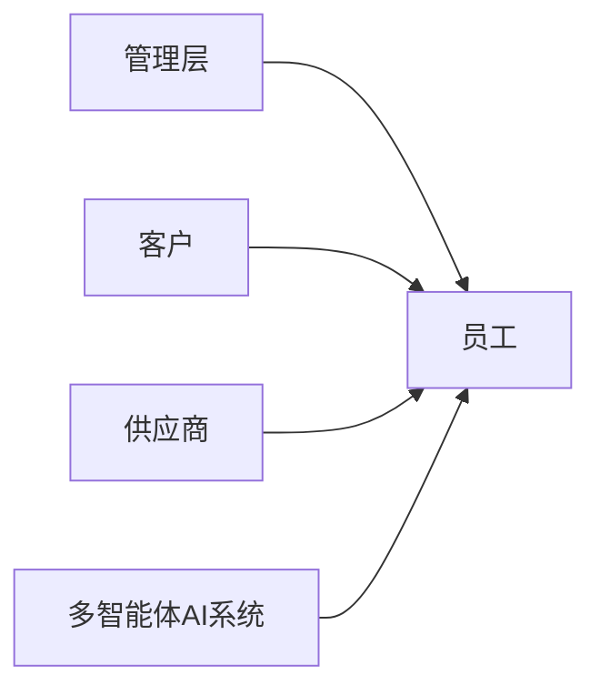
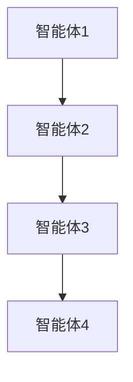
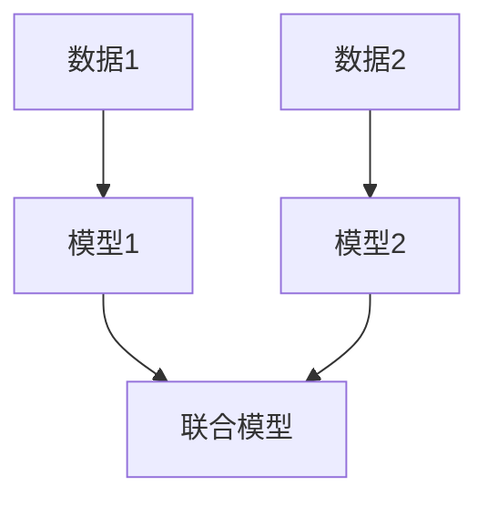
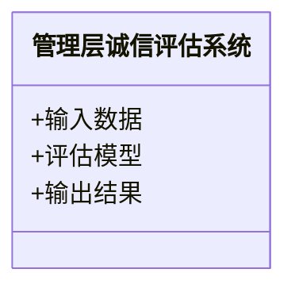
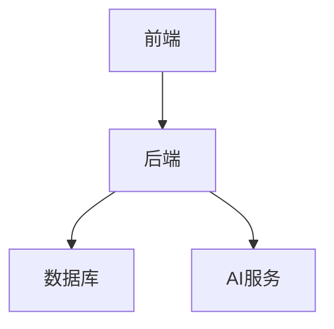
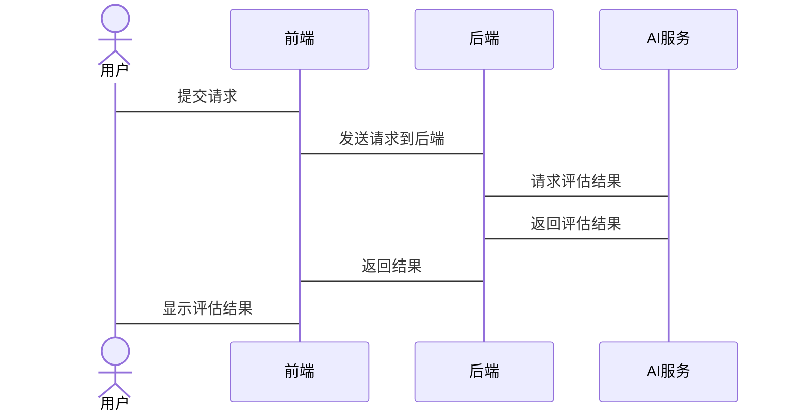

                 


# 多智能体AI如何增强管理层诚信评估的准确性

> 关键词：多智能体AI、管理层诚信评估、准确性、分布式系统、协作学习、系统架构

> 摘要：本文探讨了多智能体AI在提升管理层诚信评估准确性方面的应用。通过分析多智能体系统的协作机制、算法原理和系统架构，本文详细阐述了如何利用多智能体AI技术从多个维度综合评估管理层的诚信，从而提高评估的全面性和准确性。文章还结合实际案例，介绍了系统的实现过程和应用效果。

---

## 第1章：多智能体AI与管理层诚信评估的背景

### 1.1 问题背景

#### 1.1.1 管理层诚信评估的重要性
管理层的诚信是企业治理的核心要素，直接关系到企业的长期发展和利益相关者的信任。诚信的管理层能够做出符合道德和法律的决策，从而提升企业的声誉和市场竞争力。

#### 1.1.2 传统诚信评估的局限性
传统的诚信评估方法通常依赖于单一来源的数据，如财务报表或员工反馈，存在以下问题：
- 数据来源单一，评估结果可能片面。
- 评估过程缺乏动态性，难以捕捉管理层决策的实时变化。
- 评估标准不够统一，主观性较强。

#### 1.1.3 多智能体AI的优势
多智能体AI通过多个智能体的协作，能够从多个维度和渠道获取信息，进行综合分析，从而弥补传统评估方法的不足。其优势包括：
- 高度的并行性和分布式计算能力。
- 能够处理复杂、动态的评估场景。
- 提高评估结果的准确性和全面性。

### 1.2 问题描述

#### 1.2.1 管理层诚信评估的核心要素
管理层诚信评估的核心要素包括：
- 决策的透明度和合规性。
- 与利益相关者的互动和沟通。
- 企业内部治理和风险控制。

#### 1.2.2 当前评估方法的不足
- 数据来源单一，难以全面反映管理层的诚信状况。
- 评估过程缺乏实时性和动态性。
- 评估结果的主观性和片面性较高。

#### 1.2.3 引入多智能体AI的目标
通过引入多智能体AI，旨在构建一个动态、全面、准确的诚信评估系统，能够实时监控和分析管理层的行为，从而提高评估的准确性和可信度。

### 1.3 问题解决思路

#### 1.3.1 多智能体AI的定义与特点
多智能体AI是指由多个智能体组成的系统，每个智能体能够独立感知环境、做出决策，并通过协作完成复杂的任务。其特点包括：
- 分布式：智能体之间相互独立，但能够协同工作。
- 协作性：智能体之间通过通信和协调机制实现协作。
- 自适应性：能够根据环境变化动态调整行为。

#### 1.3.2 多智能体协作机制
多智能体协作机制包括以下几种：
- 任务分配：智能体之间根据各自的能力和当前任务的需求，分配任务。
- 信息共享：智能体之间共享相关信息，以提高整体的决策能力。
- 协调与冲突解决：通过协商和仲裁机制，解决智能体之间的冲突，确保协作顺利进行。

#### 1.3.3 多智能体AI在诚信评估中的应用
在管理层诚信评估中，多智能体AI可以应用于以下几个方面：
- 数据采集与分析：通过多个智能体从不同渠道采集数据，进行综合分析。
- 风险评估与预警：实时监控管理层的行为，识别潜在风险，发出预警。
- 决策支持：基于多维度的分析结果，为评估提供数据支持和决策依据。

---

## 第2章：多智能体AI与管理层诚信评估的核心概念

### 2.1 核心概念对比

#### 2.1.1 多智能体系统与单智能体系统的对比
| 比较维度 | 多智能体系统 | 单智能体系统 |
|----------|--------------|--------------|
| 系统结构 | 分布式、协作性 | 单一、集中式 |
| 计算能力 | 高度并行、分布式计算 | 单一计算节点 |
| 适应性 | 强，能够动态调整 | 较弱，适应性有限 |

#### 2.1.2 管理层诚信与员工诚信的对比
| 比较维度 | 管理层诚信 | 员工诚信 |
|----------|------------|------------|
| 关键性   | 高，直接影响企业战略 | 较低，主要影响日常运营 |
| 评估复杂性 | 高，涉及决策和战略规划 | 较低，主要基于日常行为 |
| 评估主体 | 企业高层和独立董事 | 人力资源部门 |

#### 2.1.3 多智能体AI与传统AI的对比
| 比较维度 | 多智能体AI | 传统AI |
|----------|------------|----------|
| 系统结构 | 分布式、协作性 | 单一、集中式 |
| 数据来源 | 多来源、多维度 | 单一来源 |
| 计算能力 | 高度并行、分布式计算 | 单一计算节点 |
| 应用场景 | 复杂、动态的场景 | 简单、静态的场景 |

### 2.2 实体关系图



### 2.3 核心概念属性对比表

| 概念         | 属性           | 描述                                                                 |
|--------------|----------------|----------------------------------------------------------------------|
| 多智能体AI    | 分布式         | 系统由多个智能体组成，能够独立工作并协作完成任务。                      |
| 管理层诚信   | 信任度         | 基于管理层的行为和决策，评估其诚信程度。                                |
| 传统AI       | 单一智能体     | 由一个中心化的模型或算法进行决策，缺乏分布式协作能力。                |

---

## 第3章：多智能体AI在诚信评估中的算法原理

### 3.1 多智能体协作机制



### 3.2 联合学习算法



### 3.3 数学模型

$$y = f(x)$$

其中，$x$ 表示输入特征，$y$ 表示预测结果。

---

## 第4章：系统架构设计

### 4.1 系统功能设计



### 4.2 系统架构图



### 4.3 接口设计

- 输入接口：接收来自多个智能体的实时数据流。
- 输出接口：向用户或系统提供评估结果和建议。

### 4.4 系统交互



---

## 第5章：项目实战

### 5.1 环境安装

安装必要的依赖项，如Python、TensorFlow、Keras等。

### 5.2 系统核心实现源代码

```python
# 多智能体协作机制实现
class Agent:
    def __init__(self, id):
        self.id = id
        self.data = []
    
    def collect_data(self):
        # 从数据源收集数据
        pass
    
    def analyze(self):
        # 分析数据，返回评估结果
        pass

class MultiAgentSystem:
    def __init__(self, agents):
        self.agents = agents
    
    def run(self):
        for agent in self.agents:
            agent.collect_data()
        results = [agent.analyze() for agent in self.agents]
        return results

# 联合学习算法实现
class FederatedLearning:
    def __init__(self, agents):
        self.agents = agents
    
    def train(self):
        # 各智能体本地训练
        for agent in self.agents:
            agent.train_locally()
        # 联合训练
        weights = self.average_weights()
        for agent in self.agents:
            agent.update_weights(weights)
    
    def average_weights(self):
        # 计算平均权重
        pass
```

### 5.3 实际案例分析

以某公司为例，利用多智能体AI系统评估其管理层的诚信。通过收集财务数据、员工反馈、客户评价等多维度信息，系统能够更全面地评估管理层的诚信程度，并提供实时预警和决策支持。

---

## 第6章：总结与展望

### 6.1 总结
多智能体AI通过协作学习和分布式计算，能够显著提高管理层诚信评估的准确性和全面性。通过合理设计系统架构和算法，可以实现对管理层行为的实时监控和动态评估。

### 6.2 展望
未来，随着多智能体AI技术的不断发展，管理层诚信评估将更加智能化和精准化。同时，还需要进一步研究如何解决多智能体系统中的信任问题和数据隐私保护问题，以确保系统的安全性和可靠性。

---

## 第7章：注意事项与最佳实践

### 7.1 注意事项
- 数据隐私保护：确保在多智能体协作过程中，数据的安全性和隐私性。
- 智能体之间的信任机制：设计合理的信任机制，防止恶意攻击和数据篡改。
- 系统的可扩展性：确保系统能够适应数据量和评估维度的增长。

### 7.2 最佳实践
- 定期更新和优化评估模型，确保系统的准确性和有效性。
- 加强多智能体系统的安全性设计，防止潜在的安全威胁。
- 提供用户友好的界面和交互方式，方便用户使用和管理。

---

## 第8章：进一步阅读与拓展

### 8.1 拓展阅读
- 《Multi-Agent Systems: Complexity and Cognitive Reasoning》
- 《Distributed Machine Learning: Theory and Practice》

### 8.2 拓展思考
- 研究如何将多智能体AI应用于其他领域的诚信评估，如金融、教育等。
- 探讨多智能体系统在动态环境下的适应性和鲁棒性。

