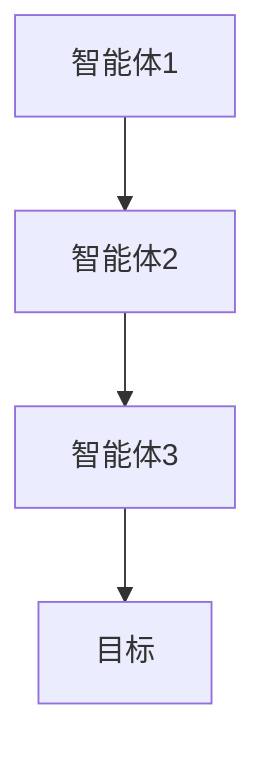
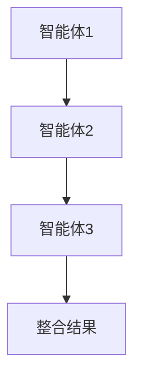
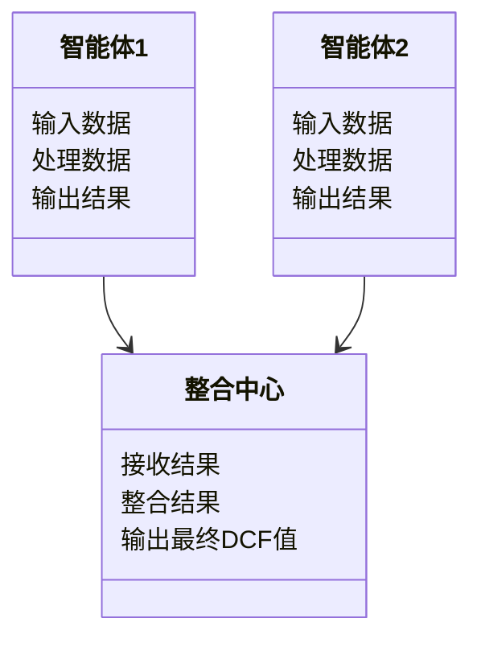
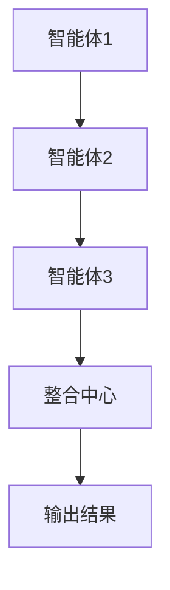
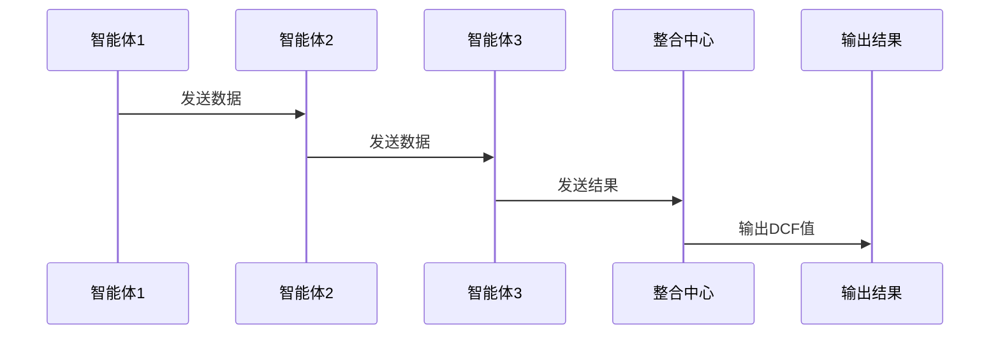

                 


```markdown
# 多智能体AI如何改进巴菲特的现金流折现模型

## 关键词：多智能体AI，现金流折现模型，巴菲特投资理念，分布式计算，金融建模

## 摘要：本文探讨了多智能体AI如何优化巴菲特的现金流折现模型，通过详细分析多智能体系统的协作算法、数学模型和系统架构，展示了如何利用多智能体协同计算来提升现金流预测的准确性和效率，为金融建模提供了新的视角和方法。

---

# 第一部分: 多智能体AI与现金流折现模型的背景与概念

## 第1章: 多智能体AI与现金流折现模型概述

### 1.1 多智能体AI的基本概念

#### 1.1.1 多智能体系统的定义
- 多智能体系统是由多个智能体组成的分布式系统，每个智能体能够感知环境、自主决策并协同工作。
- 智能体之间的通信与协作是多智能体系统的核心特征。

#### 1.1.2 多智能体系统的特点与优势
| 特性 | 描述 |
|------|------|
| 分布式 | 每个智能体负责特定任务，降低单点故障风险 |
| 协作性 | 智能体之间通过通信和协商完成共同目标 |
| 自适应性 | 系统能够根据环境变化动态调整策略 |

#### 1.1.3 多智能体AI在金融领域的应用潜力
- 提高金融模型的预测精度
- 加强风险评估和管理
- 优化投资组合决策

### 1.2 巴菲特现金流折现模型的背景

#### 1.2.1 现金流折现模型的基本原理
现金流折现模型（DCF）通过将未来现金流折现，评估企业的内在价值。
$$DCF = \sum_{t=1}^{n} \frac{CF_t}{(1 + r)^t}$$

#### 1.2.2 巴菲特投资理念的核心要素
- 重视企业的内在价值
- 注重企业的现金流状况
- 长期投资策略

#### 1.2.3 现金流折现模型的局限性与改进方向
- 依赖于准确的现金流预测
- 折现率的选择具有主观性
- 单一模型难以应对复杂市场环境

### 1.3 多智能体AI与现金流折现模型的结合

#### 1.3.1 多智能体AI在现金流预测中的作用
- 分解预测任务，提高预测精度
- 综合多源数据，增强模型鲁棒性
- 动态调整预测模型，适应市场变化

#### 1.3.2 多智能体协同如何优化现金流折现模型
- 通过协作计算提升预测效率
- 利用分布式计算降低计算复杂度
- 实现模型参数的自适应优化

#### 1.3.3 理论基础与实际应用的结合
- 将多智能体系统应用于DCF模型的具体步骤
- 展现多智能体协同在DCF模型中的实际效果

### 1.4 本章小结
- 本章介绍了多智能体AI的基本概念及其在金融领域的潜力
- 阐述了现金流折现模型的基本原理和局限性
- 探讨了多智能体AI如何优化现金流折现模型

---

# 第二部分: 多智能体AI的核心概念与算法原理

## 第2章: 多智能体AI的核心概念与联系

### 2.1 多智能体系统的实体关系图


### 2.2 多智能体AI的协作算法

#### 2.2.1 分布式计算流程


### 2.3 算法原理与数学模型

#### 2.3.1 现金流折现模型的数学公式
$$DCF = \sum_{t=1}^{n} \frac{CF_t}{(1 + r)^t}$$

#### 2.3.2 多智能体协同优化的数学模型
$$DCF_{optimized} = \sum_{t=1}^{n} \frac{CF_{t}^{optimized}}{(1 + r)^t}$$

---

# 第三部分: 系统分析与架构设计

## 第3章: 系统分析与架构设计方案

### 3.1 问题场景介绍
- 多智能体协同计算DCF模型的应用场景
- 系统需要实现的主要功能

### 3.2 系统功能设计


### 3.3 系统架构设计


### 3.4 系统接口设计
- 智能体间的通信接口
- 整合中心的接收接口

### 3.5 系统交互流程


---

# 第四部分: 项目实战与优化

## 第4章: 项目实战与优化

### 4.1 环境安装
```bash
pip install numpy pandas scikit-learn
```

### 4.2 系统核心实现源代码

#### 4.2.1 智能体协作计算
```python
import numpy as np
import pandas as pd

def compute_cash_flow(input_data):
    # 示例计算
    return np.sum(input_data)

# 多智能体协作计算
def multi_agent_dcf_prediction(data, num_agents):
    agents = []
    for i in range(num_agents):
        agents.append(data.iloc[i::num_agents])
    results = [compute_cash_flow(agent) for agent in agents]
    return sum(results)
```

#### 4.2.2 现金流折现计算
```python
def discounted_cash_flow(cash_flows, discount_rate):
    return sum(cash_flows / (1 + discount_rate)**t for t in range(len(cash_flows)))
```

### 4.3 案例分析与详细解读
- 使用多智能体协同计算现金流
- 与传统DCF模型结果对比
- 分析优化效果

### 4.4 项目小结
- 展示优化成果
- 总结项目经验

---

# 第五部分: 总结与展望

## 第5章: 总结与展望

### 5.1 本章总结
- 多智能体AI在现金流折现模型中的应用价值
- 优化后的模型优势

### 5.2 未来展望
- 多智能体AI在金融建模中的更多应用
- 技术的进一步发展与改进

### 5.3 最佳实践 Tips
- 合理分配任务，提升效率
- 定期更新模型，适应市场变化

### 5.4 小结
- 强调多智能体AI的重要性
- 展望未来研究方向

### 5.5 注意事项
- 数据质量和准确性
- 系统维护与更新
- 安全与隐私保护

### 5.6 拓展阅读
- 推荐相关书籍和文章
- 提供进一步学习的资源

---

# 结语

通过本文的详细分析，我们展示了多智能体AI如何改进巴菲特的现金流折现模型，为金融建模提供了新的思路。希望本文对读者在这一领域的研究和实践有所启发。
```

