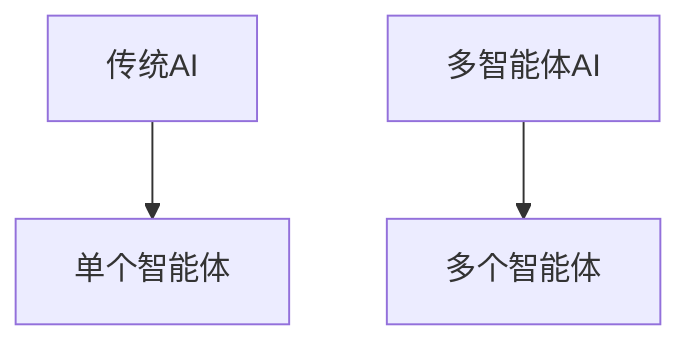
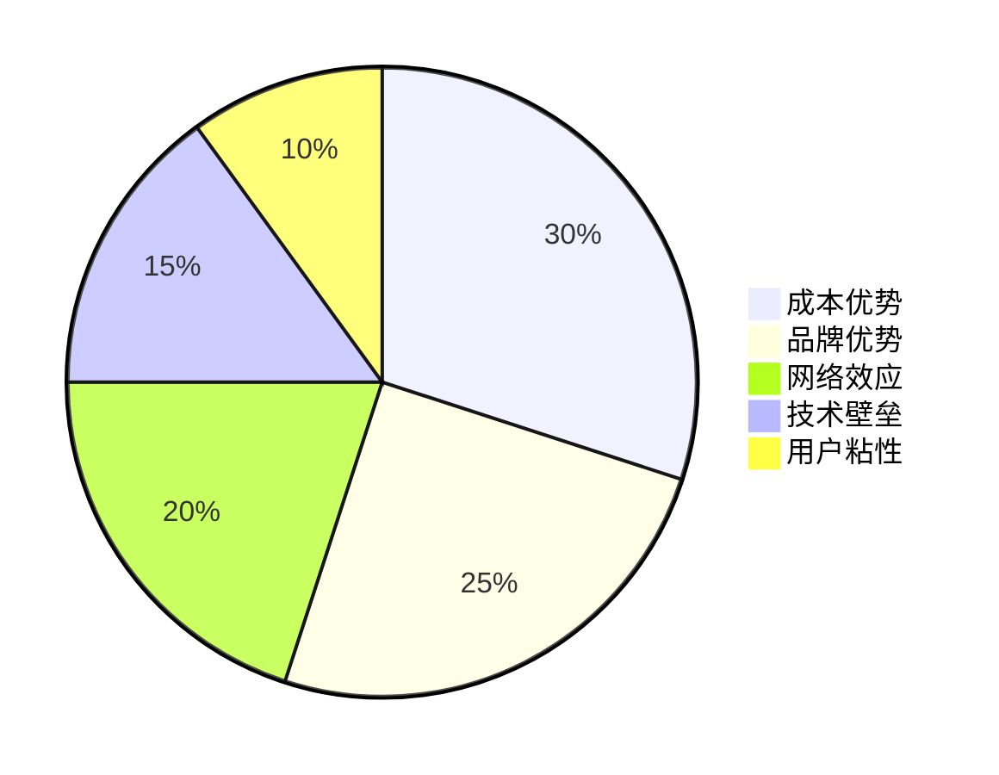
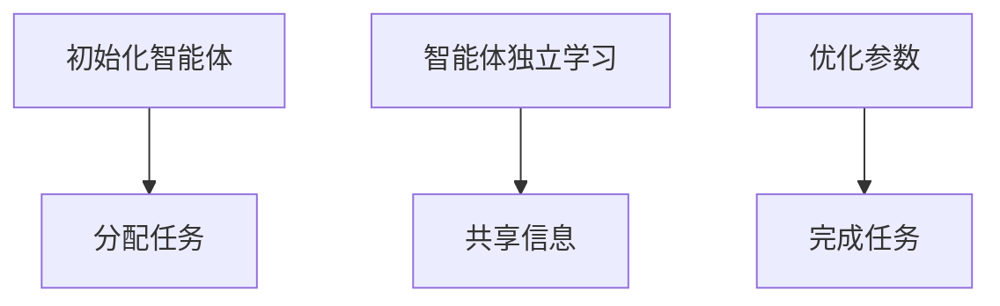
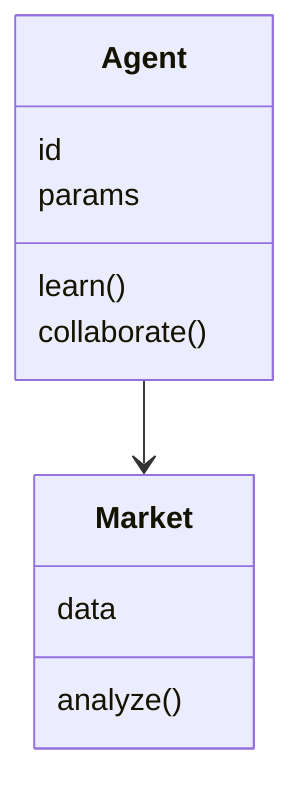

                 


# 多智能体AI如何改进巴菲特的经济护城河评估方法

## 关键词

多智能体AI, 经济护城河, 巴菲特投资策略, AI协同学习, 股票分析

## 摘要

本文探讨了多智能体AI在改进巴菲特经济护城河评估方法中的应用。通过分析多智能体AI的优势、经济护城河的核心要素、以及两者的结合方式，展示了如何利用AI技术提升投资决策的准确性和效率。文章详细介绍了多智能体AI的算法原理、系统架构，并通过实际案例分析，验证了其在经济护城河评估中的有效性。

---

## 第1章：多智能体AI的定义与特点

### 1.1 多智能体AI的定义

#### 1.1.1 多智能体AI的基本概念

多智能体AI（Multi-Agent AI）是指由多个相互协作或竞争的智能体组成的系统。每个智能体都有一定的自主性，能够感知环境、做出决策并执行动作。多个智能体通过通信和协作，共同完成复杂任务。

$$
\text{多智能体AI的核心：协作与分布式智能}
$$

#### 1.1.2 多智能体AI的核心特征

| 特征 | 描述 |
|------|------|
| 分布式智能 | 每个智能体独立运作，共同完成任务 |
| 协作性 | 智能体之间可以通信和协作 |
| 自主性 | 智能体能够自主决策和行动 |
| 动态性 | 系统环境和智能体状态动态变化 |

#### 1.1.3 多智能体AI与传统AI的区别



---

### 1.2 多智能体AI的优势与应用场景

#### 1.2.1 多智能体AI的优势

- **分布式计算**：任务分解更高效，单点故障风险降低。
- **协作能力**：多个智能体可以互补优势，完成复杂任务。
- **动态适应**：系统能够快速响应环境变化。

#### 1.2.2 多智能体AI的主要应用场景

- **经济分析**：用于市场预测、投资决策等。
- **游戏AI**：如MOBA游戏中的多智能体协作。
- **自动驾驶**：车辆之间的协同与通信。

#### 1.2.3 多智能体AI在经济分析中的潜力

多智能体AI可以模拟市场行为，分析企业间的竞争关系，为投资决策提供支持。

---

## 第2章：巴菲特的经济护城河理论

### 2.1 经济护城河的定义与核心要素

#### 2.1.1 经济护城河的基本概念

经济护城河是指企业在行业中建立的竞争优势，使其能够长期保持高利润率。常见的护城河类型包括：

1. **成本优势**：企业生产成本低于竞争对手。
2. **品牌优势**：强大的品牌影响力。
3. **网络效应**：用户越多，产品价值越高。

#### 2.1.2 经济护城河的核心要素

| 要素 | 描述 |
|------|------|
| 竞争优势 | 企业在市场中的独特优势 |
| 定价权 | 企业能否提高产品价格而不失去客户 |
| 技术壁垒 | 企业拥有的技术专利或专有技术 |
| 用户粘性 | 用户转换成本高 |

#### 2.1.3 经济护城河的分类与特征对比



---

### 2.2 巴菲特投资策略中的经济护城河评估方法

#### 2.2.1 巴菲特投资策略概述

巴菲特的投资策略强调寻找具有强大护城河的企业，长期持有优质资产，实现稳定收益。

#### 2.2.2 经济护城河评估方法的优缺点

| 优点 | 缺点 |
|------|------|
| 稳定性高 | 评估过程主观性强 |
| 长期视角 | 无法快速适应市场变化 |
| 简单易懂 | 无法量化竞争优势 |

#### 2.2.3 经济护城河评估方法的边界与外延

经济护城河评估方法主要用于长期投资决策，适用于成熟行业和龙头企业。

---

## 第3章：多智能体AI在经济护城河评估中的应用

### 3.1 多智能体AI在经济数据处理中的优势

#### 3.1.1 多智能体AI的数据处理能力

多智能体AI能够同时处理多种数据源，包括文本、数值和图像数据。

$$
\text{多智能体AI的数据处理流程：} \\
\text{数据输入} \rightarrow \text{特征提取} \rightarrow \text{模型训练} \rightarrow \text{结果输出}
$$

#### 3.1.2 多智能体AI在经济分析中的潜力

通过模拟市场行为，多智能体AI可以帮助投资者更好地理解市场动态，发现潜在的投资机会。

---

## 第4章：多智能体AI协同学习算法的原理与实现

### 4.1 多智能体协同学习的核心原理

#### 4.1.1 协同学习的定义

协同学习是指多个智能体通过协作完成任务，每个智能体贡献自己的知识和能力。

#### 4.1.2 协同学习的数学模型

$$
\text{协同学习的目标函数：} \\
\arg \max_{\theta_1, \theta_2, \dots, \theta_n} \sum_{i=1}^{n} f(\theta_i)
$$

其中，$\theta_i$ 表示第 $i$ 个智能体的参数，$f(\theta_i)$ 表示智能体的任务目标。

#### 4.1.3 协同学习的实现步骤

1. 初始化多个智能体，每个智能体具有初始参数。
2. 每个智能体独立完成任务，更新自己的参数。
3. 智能体之间共享信息，调整参数以优化整体目标。

---

### 4.2 多智能体协同学习的算法实现

#### 4.2.1 算法流程



#### 4.2.2 算法代码实现

```python
class Agent:
    def __init__(self, id):
        self.id = id
        self.params = {}  # 初始化参数

    def learn(self, data):
        # 智能体独立学习
        pass

    def collaborate(self, other_agents):
        # 智能体协作
        pass

def multi_agent_learning(num_agents):
    agents = [Agent(i) for i in range(num_agents)]
    for agent in agents:
        agent.learn(data)
    for agent in agents:
        agent.collaborate(agents)
    return agents

# 示例调用
agents = multi_agent_learning(5)
```

---

## 第5章：系统分析与架构设计方案

### 5.1 系统功能设计

#### 5.1.1 领域模型



#### 5.1.2 系统架构设计


---

## 第6章：项目实战

### 6.1 环境安装与代码实现

#### 6.1.1 环境安装

```bash
pip install numpy matplotlib
```

#### 6.1.2 核心代码实现

```python
import numpy as np

def evaluate护城河(enterprise):
    # 评估企业护城河
    pass

class MultiAgentAI:
    def __init__(self, num_agents):
        self.agents = [Agent(i) for i in range(num_agents)]

    def评估经济护城河(self, enterprises):
        # 调用多智能体评估护城河
        pass

# 示例调用
ai = MultiAgentAI(5)
enterprises = [...]  # 输入企业数据
results = ai.评估经济护城河(enterprises)
```

---

## 第7章：总结与展望

### 7.1 总结

多智能体AI通过协作学习和分布式计算，显著提升了经济护城河评估的效率和准确性。本文详细介绍了多智能体AI的原理、系统架构以及实际应用。

### 7.2 展望

未来，多智能体AI在经济护城河评估中的应用将更加广泛，结合区块链、大数据等技术，进一步提升投资决策的智能化水平。

---

通过本文的分析，我们看到多智能体AI为巴菲特的经济护城河评估方法带来了新的可能性，也为投资决策提供了更强大的工具支持。

