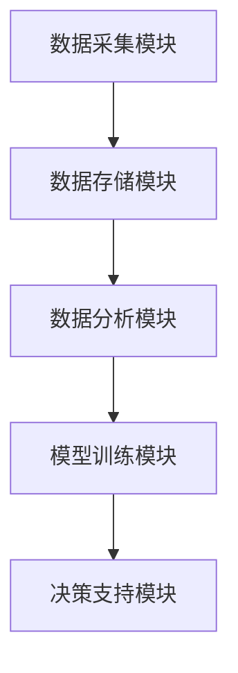

                 


# 多智能体AI如何改进巴菲特的财报分析方法

> 关键词：多智能体AI，巴菲特，财报分析，投资策略，数据分析

> 摘要：本文探讨如何利用多智能体人工智能技术改进巴菲特的经典财报分析方法。通过分析多智能体AI的核心原理和其在财务数据分析中的应用，结合实际案例，阐述多智能体AI如何提升财报分析的效率和准确性，为投资者提供更强大的决策支持工具。

---

## 第一部分：背景介绍

### 第1章：多智能体AI的基本概念

#### 1.1 多智能体AI的定义与特点
多智能体AI（Multi-Agent AI）是指由多个具有独立决策能力的智能体组成的系统。这些智能体能够协同工作，通过信息共享和任务分配完成复杂的任务。

- **定义**：多智能体AI是一种分布式智能系统，由多个智能体组成，每个智能体都能独立执行任务，通过通信和协作完成整体目标。
- **特点**：
  - 分布式计算：任务由多个智能体分担。
  - 协作性：智能体之间通过通信和协作完成复杂任务。
  - 自适应性：智能体能够根据环境变化调整策略。

#### 1.2 多智能体AI的应用场景
在金融领域，多智能体AI可以用于实时数据分析、投资决策支持和风险评估。

- **金融领域的应用**：
  - 实时数据分析：快速处理大量财务数据。
  - 投资决策支持：通过多智能体协作提供更准确的分析结果。
  - 风险评估：多个智能体协同工作，提高风险预测的准确性。

### 第2章：巴菲特财报分析方法的介绍

#### 2.1 巴菲特投资理念的核心
巴菲特的“价值投资”理念强调通过分析企业的财务报表，识别具有长期投资价值的公司。

- **价值投资原则**：
  - 重视企业的基本面分析。
  - 着重于企业的盈利能力、财务状况和竞争优势。
  - 长期持有优质股票，追求稳定的收益。

#### 2.2 巴菲特分析法的局限性
传统的巴菲特分析法依赖人工判断，存在效率低、信息处理能力有限的问题。

- **局限性**：
  - 数据处理效率低：人工分析需要大量时间。
  - 信息处理能力有限：难以处理海量数据。
  - 市场变化响应慢：人工分析难以实时应对市场变化。

### 第3章：多智能体AI与巴菲特分析法的结合

#### 3.1 结合的背景与动机
随着金融市场的数据量激增，传统的分析方法难以满足需求。多智能体AI的引入可以提高分析效率和准确性。

- **背景**：
  - 数据量大：金融市场数据复杂多样，人工分析难以覆盖。
  - 实时性要求高：需要快速响应市场变化。
  - 分析复杂：多维度数据需要综合分析。

#### 3.2 结合的实现方式
通过多智能体AI的协同工作，实现对财务数据的深度分析和实时监控。

- **实现方式**：
  - 数据采集：多智能体协同采集和处理财务数据。
  - 数据分析：智能体之间协作进行数据挖掘和预测。
  - 结果输出：系统自动生成分析报告，辅助投资决策。

---

## 第二部分：多智能体AI的核心概念与联系

### 第4章：多智能体AI的核心原理

#### 4.1 多智能体系统的基本架构
多智能体系统由多个智能体组成，每个智能体都有自己的任务和目标。

- **基本架构**：
  - 智能体：具有感知、决策和行动能力。
  - 通信机制：智能体之间通过通信模块共享信息。
  - 协作机制：通过任务分配和协同完成整体目标。

#### 4.2 多智能体AI的算法原理
多智能体AI通过分布式计算和协作学习实现高效的数据分析。

- **算法原理**：
  - 分布式计算：任务分解到多个智能体完成。
  - 联合学习：智能体共享知识，提高整体性能。
  - 自适应优化：智能体根据反馈调整策略。

---

## 第三部分：算法原理讲解

### 第5章：多智能体AI的算法实现

#### 5.1 数据预处理与特征提取
- **数据预处理**：
  - 清洗数据，处理缺失值和异常值。
  - 数据标准化，确保各维度数据一致。

- **特征提取**：
  - 从财务数据中提取关键指标，如净利润率、资产负债率等。

#### 5.2 模型训练与预测
- **模型训练**：
  - 使用机器学习算法，如随机森林和XGBoost，训练分类模型。
  - 通过分布式计算提高训练效率。

- **模型预测**：
  - 对企业财务数据进行预测，评估投资价值。

---

## 第四部分：系统分析与架构设计方案

### 第6章：系统架构设计

#### 6.1 系统功能设计
- **功能模块**：
  - 数据采集模块：采集企业财务数据。
  - 数据分析模块：对数据进行预处理和特征提取。
  - 模型训练模块：训练分类模型，预测投资价值。
  - 决策支持模块：提供投资建议和风险预警。

#### 6.2 系统架构图


---

## 第五部分：项目实战

### 第7章：项目实战

#### 7.1 环境安装
- **安装Python环境**：使用Anaconda或虚拟环境。
- **安装依赖库**：如Pandas、Scikit-learn、XGBoost等。

#### 7.2 核心代码实现
```python
import pandas as pd
from sklearn.ensemble import RandomForestClassifier
from xgboost import XGBClassifier
from sklearn.metrics import accuracy_score

# 数据预处理
data = pd.read_csv('financial_data.csv')
data = data.dropna()  # 删除缺失值
data = (data - data.min()) / (data.max() - data.min())  # 标准化

# 特征提取
features = data.drop(columns=['target'])
target = data['target']

# 模型训练
model_RF = RandomForestClassifier(n_estimators=100)
model_RF.fit(features, target)

model_XG = XGBClassifier(n_estimators=100)
model_XG.fit(features, target)

# 模型预测
predictions_RF = model_RF.predict(features)
predictions_XG = model_XG.predict(features)

# 模型评估
accuracy_RF = accuracy_score(target, predictions_RF)
accuracy_XG = accuracy_score(target, predictions_XG)

print(f'Random Forest Accuracy: {accuracy_RF}')
print(f'XGBoost Accuracy: {accuracy_XG}')
```

#### 7.3 代码解读与分析
- **数据预处理**：清洗数据，标准化处理。
- **特征提取**：从财务数据中提取关键指标。
- **模型训练**：使用随机森林和XGBoost算法训练分类模型。
- **模型预测**：对财务数据进行预测，评估投资价值。
- **模型评估**：计算模型的准确率，评估模型性能。

---

## 第六部分：小结与注意事项

### 第8章：小结与注意事项

#### 8.1 小结
- 多智能体AI通过分布式计算和协作学习，显著提高了财报分析的效率和准确性。
- 本文结合巴菲特的分析方法，展示了多智能体AI在投资决策中的应用价值。

#### 8.2 注意事项
- **数据隐私**：在处理财务数据时，需注意数据隐私保护。
- **模型更新**：定期更新模型，确保其适应市场变化。
- **性能优化**：优化算法和系统架构，提高运行效率。

---

## 第七部分：拓展阅读

### 第9章：拓展阅读

#### 9.1 相关书籍
- 《多智能体系统》：深入探讨多智能体系统的原理和应用。
- 《巴菲特投资策略》：详细讲解巴菲特的价值投资理念。

#### 9.2 技术博客
- 多智能体AI在金融领域的应用：深入探讨多智能体AI在金融领域的具体应用。
- 投资决策支持系统：分析投资决策支持系统的构建和优化。

---

通过以上分析，我们可以看到，多智能体AI在改进巴菲特财报分析方法方面具有巨大潜力。结合多智能体AI的分布式计算和协作学习能力，可以显著提高分析效率和准确性，为投资者提供更强大的决策支持工具。

