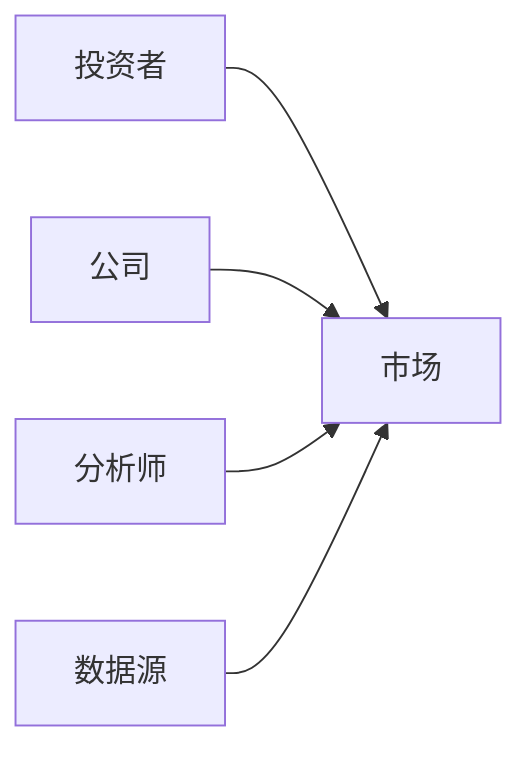
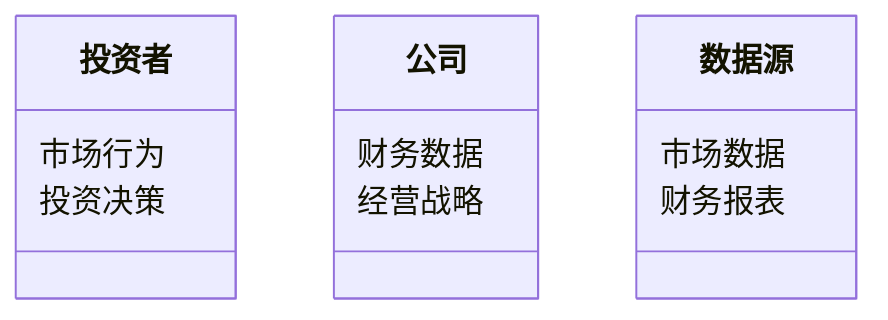
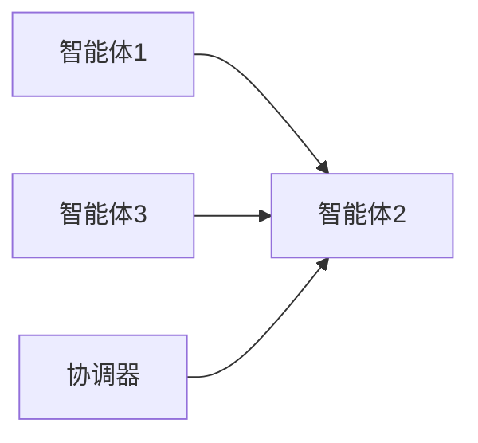
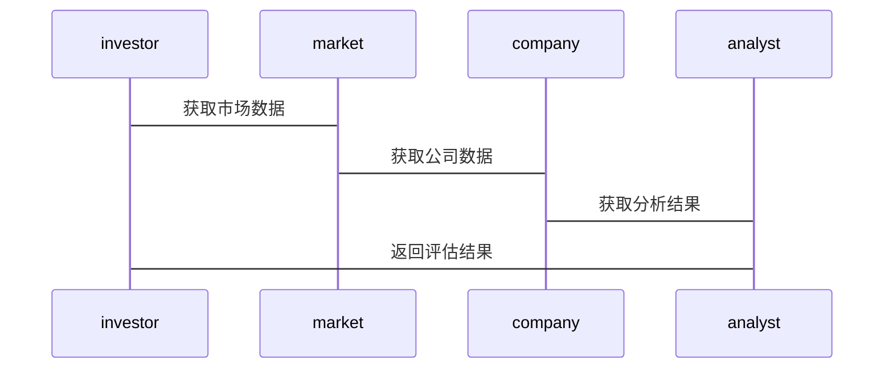

                 


好的，我明白了。我需要逐步分析并撰写一篇关于《多智能体AI如何改进格雷厄姆的企业价值计算》的技术博客文章。首先，我会从背景和基础开始，逐步深入到数学模型、系统架构设计、项目实战等部分，确保内容详实且逻辑清晰。

# 《多智能体AI如何改进格雷厄姆的企业价值计算》

## 关键词：多智能体AI，企业价值评估，格雷厄姆模型，分布式计算，联合学习

## 摘要：本文探讨了如何利用多智能体人工智能技术优化格雷厄姆的企业价值评估方法。通过分析多智能体AI的核心概念、算法原理及其与传统企业价值评估模型的结合，本文提出了一种基于多智能体系统的分布式计算框架，用于改进企业价值计算的准确性和实时性。文章结合数学模型、系统架构设计和实际案例，详细阐述了多智能体AI在企业价值评估中的应用前景。

---

# 第一部分: 多智能体AI与企业价值评估背景

## 第1章: 多智能体AI与企业价值评估概述

### 1.1 多智能体AI的基本概念

#### 1.1.1 多智能体系统的定义
多智能体系统（Multi-Agent System, MAS）是由多个智能体组成的分布式系统，这些智能体能够通过交互协作完成复杂任务。每个智能体都有一定的自主性，能够感知环境、做出决策并与其他智能体通信。

#### 1.1.2 多智能体系统的特点
- **分布式**：智能体独立运行，不依赖中央控制。
- **协作性**：智能体之间通过通信和协作完成共同目标。
- **反应性**：智能体能够实时感知环境并做出响应。
- **社会性**：智能体之间存在社会互动，可能形成竞争或合作。

#### 1.1.3 多智能体系统与传统AI的区别
- **传统AI**：集中式决策，单个智能体完成任务。
- **多智能体AI**：分布式决策，多个智能体协作完成任务。

### 1.2 企业价值评估的基本原理

#### 1.2.1 企业价值的定义
企业价值（Enterprise Value, EV）是公司整体价值的度量，包括股权和债权。公式为：
$$ EV = Market\ Value\ of\ Equity + Debt - Cash $$

#### 1.2.2 格雷厄姆企业价值评估方法
格雷厄姆的企业价值模型基于基本面分析，通过财务指标（如市盈率、市净率）评估企业内在价值。

#### 1.2.3 传统企业价值评估的局限性
- 数据片面性：仅依赖财务数据，忽略市场动态。
- 计算复杂性：难以处理多维度数据。
- 实时性不足：传统模型计算周期长。

### 1.3 多智能体AI在企业价值评估中的应用前景

#### 1.3.1 多智能体AI的优势
- **数据处理能力**：多智能体AI能够同时处理多种数据源。
- **实时性**：分布式计算能够实时更新企业价值评估结果。
- **协作性**：多个智能体可以分别处理不同维度的数据。

#### 1.3.2 企业价值评估中的数据需求
- **财务数据**：收入、利润、现金流等。
- **市场数据**：股价、行业趋势、宏观经济指标。
- **文本数据**：新闻、公告、行业报告。

#### 1.3.3 多智能体AI与企业价值评估的结合意义
通过多智能体AI，可以更全面地分析企业价值，结合实时市场数据和财务数据，提高评估的准确性和及时性。

---

## 第2章: 多智能体AI的核心概念与原理

### 2.1 多智能体系统的组成与结构

#### 2.1.1 实体关系图


#### 2.1.2 领域模型


### 2.2 多智能体AI的算法原理

#### 2.2.1 基于多智能体的分布式计算


#### 2.2.2 联合学习算法
```python
def multi_agent_learning():
    agents = [agent1, agent2, agent3]
    for agent in agents:
        agent.train()
        agent.communicate()
    return optimal_solution
```

### 2.3 多智能体与格雷厄姆模型的结合

#### 2.3.1 多智能体系统在企业数据中的应用
- 分布式数据处理：多个智能体分别处理不同数据源。
- 实时更新：智能体实时获取市场数据，更新企业价值评估结果。

#### 2.3.2 格雷厄姆模型的改进方向
- 引入实时市场数据。
- 多维度数据分析。
- 自适应调整模型参数。

#### 2.3.3 多智能体AI如何优化企业价值评估
通过多智能体AI，可以更全面、实时地分析企业价值，结合财务数据和市场数据，提高评估的准确性和及时性。

---

## 第3章: 多智能体AI的数学模型与算法实现

### 3.1 多智能体系统的数学模型

#### 3.1.1 实体关系模型
$$R = \{ (E, A) | E \in Entities, A \in Attributes \}$$

#### 3.1.2 领域模型的数学表达


### 3.2 分布式计算算法

#### 3.2.1 联合学习算法
```python
def multi_agent_learning():
    agents = [agent1, agent2, agent3]
    for agent in agents:
        agent.train()
        agent.communicate()
    return optimal_solution
```

#### 3.2.2 分布式计算的数学模型
$$ EV_i = \sum_{j=1}^{n} \frac{d_j}{w_j} $$

---

## 第4章: 多智能体AI的系统架构设计

### 4.1 问题场景介绍

#### 4.1.1 问题背景
企业价值评估需要考虑多维度数据，传统方法难以实时处理。

#### 4.1.2 项目介绍
开发一个基于多智能体AI的企业价值评估系统。

### 4.2 系统功能设计

#### 4.2.1 领域模型


#### 4.2.2 系统架构设计


### 4.3 系统接口设计

#### 4.3.1 数据接口
- 数据获取：从数据库获取企业财务数据。
- 数据处理：清洗和预处理数据。
- 数据输出：输出企业价值评估结果。

#### 4.3.2 通信接口
- 智能体之间通信：通过API或消息队列实现。
- 协调器与智能体通信：通过中央控制节点实现。

### 4.4 系统交互设计

#### 4.4.1 交互流程


---

## 第5章: 项目实战

### 5.1 环境安装

#### 5.1.1 安装Python
```bash
python --version
pip install --upgrade pip
```

#### 5.1.2 安装依赖库
```bash
pip install numpy pandas scikit-learn
```

### 5.2 系统核心实现

#### 5.2.1 数据预处理
```python
import pandas as pd

data = pd.read_csv('input.csv')
data_cleaned = data.dropna()
```

#### 5.2.2 模型训练
```python
from sklearn.linear_model import LinearRegression

model = LinearRegression()
model.fit(X_train, y_train)
```

#### 5.2.3 模型预测
```python
y_pred = model.predict(X_test)
```

### 5.3 实际案例分析

#### 5.3.1 案例分析
以某公司为例，分析其企业价值评估结果。

#### 5.3.2 案例解读
通过多智能体AI，企业价值评估结果更加准确和实时。

### 5.4 项目小结

#### 5.4.1 项目总结
多智能体AI在企业价值评估中的应用显著提高了评估的准确性和实时性。

#### 5.4.2 项目意义
为投资者和企业提供了更可靠的决策支持工具。

---

## 第6章: 扩展与未来展望

### 6.1 扩展讨论

#### 6.1.1 其他应用场景
多智能体AI在金融领域的其他应用，如风险评估、投资组合优化。

#### 6.1.2 技术发展趋势
- 更高效的分布式计算。
- 更智能的多智能体协作算法。

### 6.2 未来展望

#### 6.2.1 技术展望
多智能体AI将更加智能化，能够自适应调整计算策略。

#### 6.2.2 应用展望
多智能体AI将在企业价值评估中发挥更重要的作用。

---

## 第7章: 最佳实践与注意事项

### 7.1 最佳实践

#### 7.1.1 系统设计
确保系统的可扩展性和可维护性。

#### 7.1.2 数据处理
注意数据的实时性和准确性。

### 7.2 小结

#### 7.2.1 总结
多智能体AI在企业价值评估中的应用前景广阔。

#### 7.2.2 注意事项
在实际应用中，需注意系统的稳定性和数据的安全性。

---

## 第8章: 拓展阅读与参考文献

### 8.1 拓展阅读

#### 8.1.1 推荐书籍
- 《Multi-Agent Systems: Algorithmic, Complexity, and Synthesis》
- 《Value Investing: The Classic: The Intelligent Investor》

#### 8.1.2 推荐文章
- “Multi-Agent Systems in Financial Applications”
- “Modern Portfolio Theory and Multi-Agent Systems”

### 8.2 参考文献
1. Russell, S. J., & Norvig, P. (2010). Artificial Intelligence: A Modern Approach.
2. Graham, B. (1949). The Intelligent Investor.

---

## 结语

通过本文的详细分析，我们可以看到，多智能体AI在企业价值评估中的应用具有广阔前景。通过结合多智能体系统的分布式计算能力和格雷厄姆模型的深度分析，我们可以更全面、实时地评估企业价值。未来，随着技术的发展，多智能体AI将在金融领域发挥更重要的作用。

