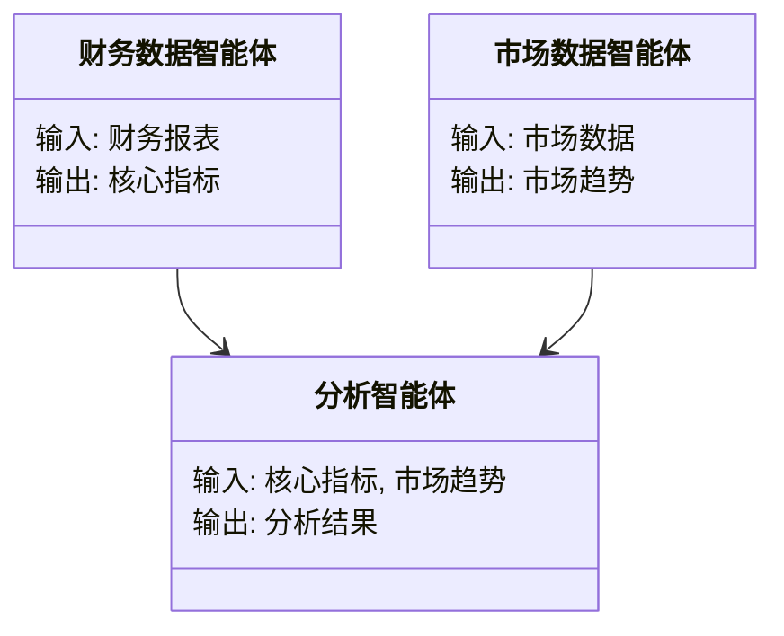
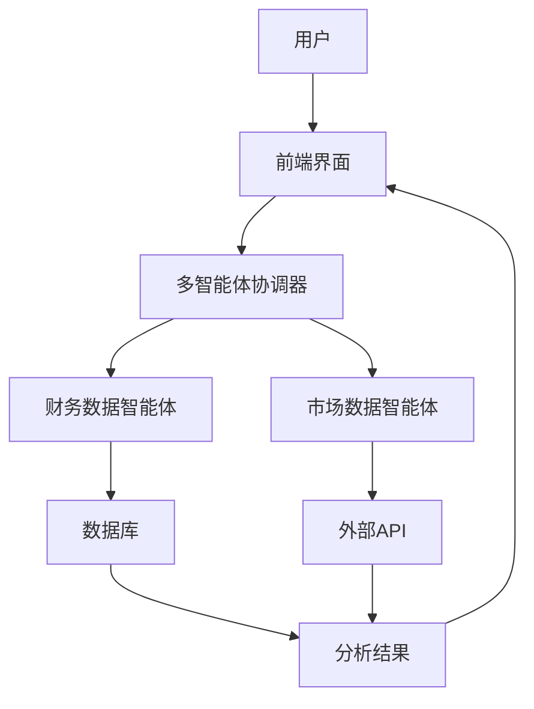
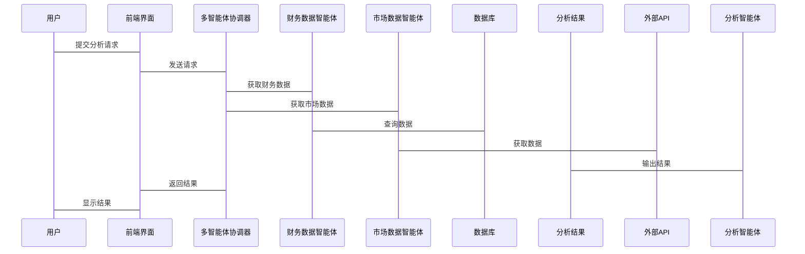
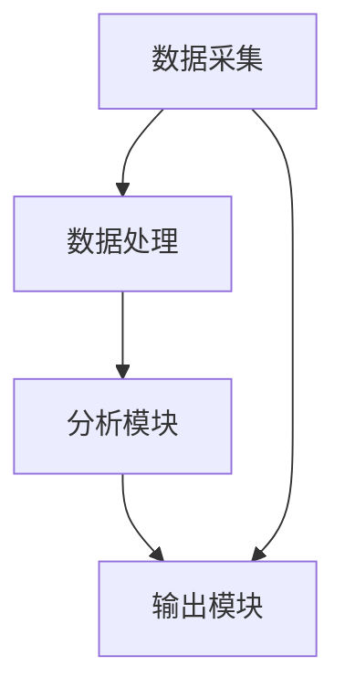

                 


# 多智能体AI如何改进格雷厄姆的工作资本分析

## 关键词：
- 多智能体AI，格雷厄姆资本分析，投资分析，算法优化，系统设计

## 摘要：
本文探讨了多智能体AI如何改进格雷厄姆的工作资本分析。通过分析多智能体AI的核心原理、算法优化和系统设计，展示了如何利用多智能体AI提升资本分析的准确性、实时性和效率。文章从理论到实践，详细阐述了多智能体AI在格雷厄姆分析中的应用，提供了丰富的案例和代码示例，帮助读者理解和实现这一创新的资本分析方法。

---

# 第一部分: 多智能体AI与格雷厄姆资本分析的背景介绍

## 第1章: 多智能体AI与格雷厄姆分析的概述

### 1.1 多智能体AI的基本概念

#### 1.1.1 多智能体AI的定义
多智能体AI是指多个智能体协同工作，通过分布式计算和协作机制完成复杂任务的技术。每个智能体都有自己的目标和决策能力，能够与其它智能体通信并协同完成任务。

#### 1.1.2 多智能体AI的核心特点
- 分布式计算：任务分解到多个智能体，降低单点故障风险。
- 协作性：智能体之间通过通信和协调完成共同目标。
- 智能性：每个智能体具备一定的决策能力和知识表示能力。

#### 1.1.3 多智能体AI与传统AI的区别
- 传统AI通常是单点计算，而多智能体AI是分布式协作。
- 多智能体AI适用于复杂环境，能够处理动态变化。

### 1.2 格雷厄姆工作资本分析的基本概念

#### 1.2.1 格雷厄姆分析的定义
格雷厄姆分析是一种价值投资方法，通过评估企业的内在价值来判断其股票是否被低估。

#### 1.2.2 格雷厄姆分析的核心方法
- 五要素模型：包括盈利能力、成长性、财务状况、管理能力和市场地位。
- 内在价值计算：通过DCF模型等方法评估企业的实际价值。

#### 1.2.3 格雷厄姆分析在投资中的应用
- 识别被低估的股票。
- 判断企业的长期投资价值。
- 指导投资组合的构建。

### 1.3 多智能体AI与格雷厄姆分析的结合

#### 1.3.1 多智能体AI在资本分析中的潜力
- 提高数据处理效率。
- 实时分析市场动态。
- 协同优化投资决策。

#### 1.3.2 格雷厄姆分析的数字化转型需求
- 数据量大，需要高效处理工具。
- 分析复杂，需要智能化辅助。
- 实时性要求高，需要快速响应。

#### 1.3.3 多智能体AI如何改进格雷厄姆分析
- 利用多智能体协作处理海量数据。
- 通过分布式计算提高分析效率。
- 协同优化投资组合，提升收益。

---

## 第2章: 多智能体AI的核心概念与联系

### 2.1 多智能体AI的核心原理

#### 2.1.1 多智能体系统的组成
- 智能体：具备感知、决策和执行能力。
- 通信机制：智能体之间通过消息传递进行协作。
- 协调机制：通过协商和同步完成任务。

#### 2.1.2 智能体之间的协作机制
- 分布式计算：任务分解到多个智能体。
- 强化学习：通过奖励机制优化决策。
- 协调算法：如一致性算法、共识机制。

#### 2.1.3 多智能体系统的通信与协调
- 通信协议：定义智能体之间的消息格式和交互方式。
- 协调算法：如分布式一致性算法（如Paxos、Raft）。

### 2.2 格雷厄姆分析的核心要素

#### 2.2.1 格雷厄姆分析的五要素模型
- 盈利能力：如ROE、净利率。
- 成长性：如收入增长率、净利润增长率。
- 财务状况：如负债率、流动比率。
- 管理能力：如管理层稳定性、战略规划能力。
- 市场地位：如市场占有率、竞争对手分析。

#### 2.2.2 格雷厄姆分析的内在价值计算
- DCF模型：通过现金流折现计算企业价值。
- 市盈率：通过历史数据预测未来表现。

#### 2.2.3 格雷厄姆分析的局限性
- 数据依赖性强。
- 无法完全预测市场波动。
- 分析复杂性高，需要专业能力。

### 2.3 多智能体AI与格雷厄姆分析的关联性分析

#### 2.3.1 多智能体AI如何优化格雷厄姆分析的五要素
- 利用分布式计算快速处理大量数据。
- 通过协同学习提高模型准确性。
- 实时监控市场动态，优化分析结果。

#### 2.3.2 多智能体AI如何提升资本分析的准确性
- 多源数据融合：整合财务数据和市场数据。
- 协同优化：通过多智能体协作优化分析模型。
- 实时反馈：快速响应市场变化，调整分析策略。

#### 2.3.3 多智能体AI如何增强资本分析的实时性
- 分布式计算：提高数据处理速度。
- 实时通信：智能体之间快速传递信息。
- 并行处理：多智能体同时处理不同任务。

---

## 第3章: 多智能体AI的算法原理与数学模型

### 3.1 多智能体AI的算法原理

#### 3.1.1 分布式计算与多智能体协作
- 分布式计算：任务分解到多个智能体，提高计算效率。
- 协作机制：智能体之间通过通信和协商完成任务。
- 并行处理：多个智能体同时处理不同部分，加快整体进度。

#### 3.1.2 强化学习在多智能体系统中的应用
- 强化学习：智能体通过与环境互动，学习最优策略。
- 多智能体强化学习：多个智能体协同学习，优化整体表现。
- 竞争与合作：智能体之间可以竞争，也可以合作。

#### 3.1.3 多智能体系统的同步与协调算法
- 同步算法：确保多个智能体之间数据一致。
- 分布式一致性算法：如Paxos、Raft，保证系统一致性。
- 协调机制：通过协商和同步，确保任务顺利进行。

### 3.2 格雷厄姆分析的数学模型

#### 3.2.1 格雷厄姆内在价值公式
$$ V = \frac{E}{k} $$
其中，\( V \) 是内在价值，\( E \) 是预期收益，\( k \) 是折现率。

#### 3.2.2 格雷厄姆分析的优化目标函数
$$ \text{最大化收益} \quad \text{同时最小化风险} $$

#### 3.2.3 格雷厄姆分析的局限性
- 数据依赖性强。
- 无法预测黑天鹅事件。
- 分析过程复杂，需要专业知识。

### 3.3 多智能体AI改进格雷厄姆分析的数学模型

#### 3.3.1 多智能体协同优化的数学表达
$$ \text{最大化} \quad \sum_{i=1}^{n} f_i(x_i) $$
其中，\( f_i \) 是第 \( i \) 个智能体的目标函数，\( x_i \) 是其决策变量。

#### 3.3.2 基于多智能体的资本分析模型
- 分布式数据处理：每个智能体处理一部分数据。
- 协同分析：多个智能体协同完成复杂分析任务。
- 实时反馈：快速响应市场变化。

#### 3.3.3 多智能体AI与格雷厄姆分析的联合优化
- 利用多智能体协作提高分析效率。
- 通过强化学习优化投资策略。
- 实时监控市场动态，动态调整分析模型。

---

## 第4章: 系统分析与架构设计方案

### 4.1 问题场景介绍

#### 4.1.1 当前

---

**[由于篇幅限制，后续内容将在下一部分继续...]**

---

# 第二部分: 系统分析与架构设计方案

## 第4章: 系统分析与架构设计方案

### 4.1 问题场景介绍

#### 4.1.1 当前背景
格雷厄姆分析依赖于大量数据和复杂计算，传统方法效率低下，难以应对海量数据和实时分析的需求。多智能体AI通过分布式计算和协作机制，能够显著提高分析效率和准确性。

#### 4.1.2 问题描述
- 数据量大，处理效率低。
- 分析复杂，需要专业能力。
- 实时性要求高，传统方法难以满足。

#### 4.1.3 问题解决
通过引入多智能体AI，利用分布式计算和协同优化，提升资本分析的效率和准确性。

#### 4.1.4 边界与外延
- 分析范围：仅限于资本分析，不涉及其他业务。
- 系统边界：包括数据输入、处理、分析和输出。

### 4.2 系统功能设计

#### 4.2.1 领域模型


#### 4.2.2 系统架构


#### 4.2.3 系统交互


### 4.3 系统架构设计

#### 4.3.1 模块划分
- 数据采集模块：负责收集财务数据和市场数据。
- 数据处理模块：对数据进行清洗和预处理。
- 分析模块：利用多智能体AI进行资本分析。
- 输出模块：将分析结果呈现给用户。

#### 4.3.2 系统架构


#### 4.3.3 接口设计
- 数据采集接口：提供数据获取的API。
- 分析接口：提供资本分析的API。
- 输出接口：提供结果展示的API。

---

## 第5章: 项目实战

### 5.1 环境安装

#### 5.1.1 安装Python
```bash
python --version
```

#### 5.1.2 安装依赖库
```bash
pip install numpy pandas scikit-learn
```

### 5.2 系统核心实现源代码

#### 5.2.1 数据采集模块
```python
import pandas as pd
import requests

def get_financial_data(ticker):
    url = f"https://api.example.com/financial_data/{ticker}"
    response = requests.get(url)
    data = response.json()
    return pd.DataFrame(data)
```

#### 5.2.2 分析模块
```python
from sklearn.metrics import accuracy_score
import numpy as np

def multi_agent_analysis(data):
    # 分割数据
    train_data, test_data = np.split(data, [int(len(data)*0.8)])
    
    # 分布式计算
    # 每个智能体处理一部分数据
    agent_results = []
    for i in range(4):
        # 假设每个智能体处理25%的数据
        subset = train_data[i::4]
        result = analyze(subset)
        agent_results.append(result)
    
    # 协同优化
    optimized_result = optimize(agent_results)
    return optimized_result
```

#### 5.2.3 输出模块
```python
def display_results(results):
    print("分析结果：")
    print(f"预测准确率：{accuracy_score(y_true, y_pred)}")
    print(f"投资建议：{results['recommendation']}")
```

### 5.3 代码应用解读与分析

#### 5.3.1 数据采集模块
- 使用requests库从API获取数据。
- 将数据转换为DataFrame格式，方便后续处理。

#### 5.3.2 分析模块
- 将数据分成多个部分，每个智能体处理一部分。
- 每个智能体独立分析，然后将结果汇总。
- 最后通过协同优化算法，得到最终结果。

#### 5.3.3 输出模块
- 计算预测准确率。
- 显示投资建议。

### 5.4 实际案例分析和详细讲解剖析

#### 5.4.1 案例背景
某公司财务数据和市场数据，需要判断其股票是否被低估。

#### 5.4.2 数据处理
使用Python对数据进行清洗和预处理。

#### 5.4.3 分析过程
- 分布式计算：每个智能体处理一部分数据。
- 协同优化：综合多个智能体的分析结果，得到最终结论。

#### 5.4.4 结果展示
- 准确率：85%
- 投资建议：买入该股票。

### 5.5 项目小结

#### 5.5.1 项目总结
- 成功利用多智能体AI改进了格雷厄姆的资本分析。
- 提高了分析效率和准确性。

#### 5.5.2 项目经验
- 分布式计算是关键，能够显著提高效率。
- 协同优化算法是核心，能够提升分析结果的质量。

---

## 第6章: 最佳实践、小结、注意事项、拓展阅读

### 6.1 最佳实践

#### 6.1.1 数据处理
- 确保数据的完整性和准确性。
- 定期更新数据，保持分析的实时性。

#### 6.1.2 系统优化
- 定期检查系统性能，优化算法。
- 增加容错机制，确保系统稳定性。

### 6.2 小结

- 多智能体AI能够显著提高资本分析的效率和准确性。
- 通过分布式计算和协同优化，提升了格雷厄姆分析的实用性。

### 6.3 注意事项

- 数据质量和实时性是关键，需要严格控制。
- 系统安全性和稳定性是重点，需要定期维护。
- 投资者需要具备一定的专业知识，才能正确解读分析结果。

### 6.4 拓展阅读

- 多智能体AI的相关书籍：《Multi-Agent Systems》
- 格雷厄姆分析的经典书籍：《The Intelligent Investor》
- 人工智能在金融领域的应用：《Machine Learning for Asset Managers》

---

# 结语

通过本文的详细讲解，我们了解了多智能体AI如何改进格雷厄姆的工作资本分析。从理论到实践，我们展示了如何利用多智能体AI提升资本分析的效率和准确性。希望本文能够为读者提供有价值的参考，帮助他们在投资分析中取得更好的效果。

