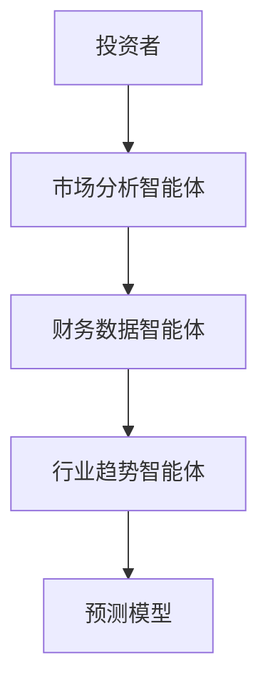
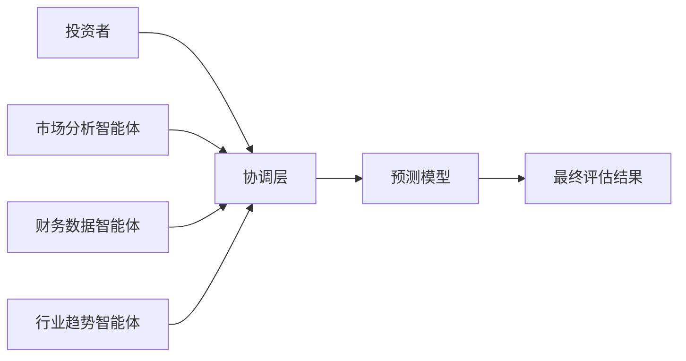
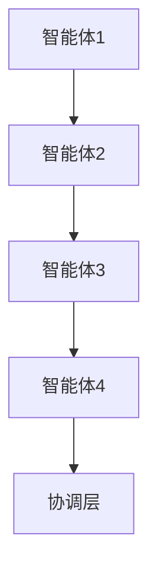
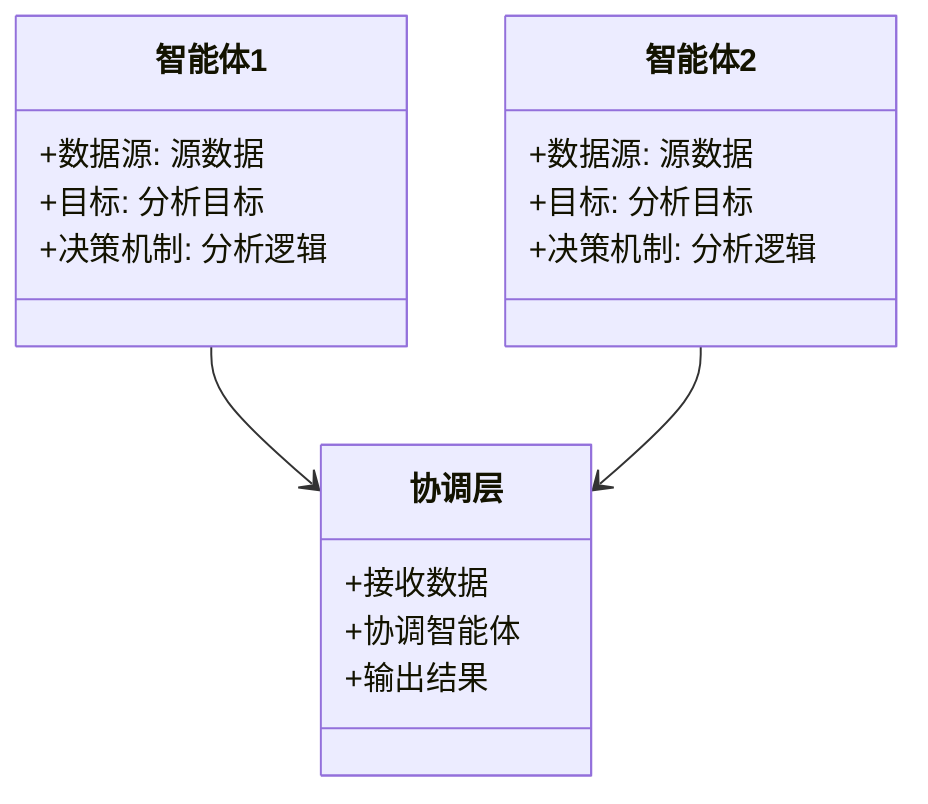
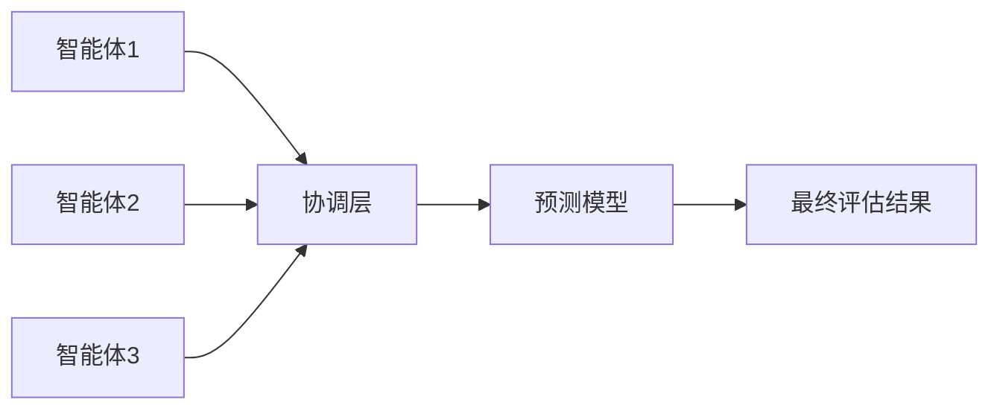
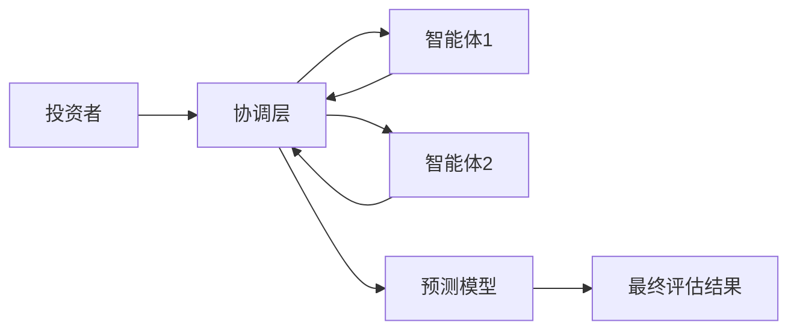

                 


# 多智能体AI如何改进费雪的未来增长潜力评估

## 关键词：多智能体AI、费雪增长潜力、金融评估、分布式计算、协作学习

## 摘要：  
本文探讨了如何利用多智能体人工智能技术来改进费雪未来增长潜力的评估。通过分析多智能体AI的核心概念、算法原理以及系统架构，结合实际案例，展示了多智能体AI在金融评估中的优势和应用价值。文章详细介绍了从系统设计到项目实现的全过程，并提出了相关的最佳实践和未来研究方向。

---

# 多智能体AI如何改进费雪的未来增长潜力评估

## 引言

在金融领域，准确评估企业的未来增长潜力对于投资者和管理层至关重要。传统的增长潜力评估方法依赖于财务数据、市场分析和专家判断，但随着数据量的激增和市场环境的复杂化，这种方法逐渐暴露出效率低下和准确性不足的问题。多智能体人工智能（Multi-Agent AI）作为一种新兴的技术，通过分布式计算和协作学习，能够显著提升评估的准确性和效率。

---

## 第一部分：多智能体AI的基本概念与背景

### 第1章：多智能体AI的定义与特点

#### 1.1 多智能体AI的定义与特点

多智能体AI是指由多个智能体组成的系统，每个智能体都有自己的目标、知识和决策机制。这些智能体通过通信和协作，共同完成复杂的任务。以下是多智能体AI的核心特点：

1. **分布式智能**：多个智能体协同工作，避免单点故障。
2. **自主性**：每个智能体能够自主决策，无需中央控制。
3. **协作性**：智能体之间通过通信和协商，实现协同目标。
4. **动态性**：能够适应环境的变化，实时调整策略。

#### 1.2 费雪增长潜力评估的背景

费雪增长潜力评估是一种用于预测企业未来增长能力的方法，传统方法依赖于财务指标和市场分析，但存在以下问题：

1. **数据维度单一**：仅依赖财务数据，忽略了市场动态和行业趋势。
2. **计算效率低下**：传统方法需要手动分析大量数据，耗时且效率低。
3. **模型局限性**：传统模型难以捕捉市场环境的复杂性。

#### 1.3 多智能体AI在费雪增长潜力评估中的结合意义

多智能体AI通过分布式计算和协作学习，能够显著提升费雪增长潜力评估的效率和准确性。以下是其主要优势：

1. **数据处理能力**：多智能体AI能够同时处理多种类型的数据，提高评估的全面性。
2. **实时反馈机制**：智能体能够实时调整模型参数，适应市场变化。
3. **协作优化**：通过智能体之间的协作，优化评估结果，提升准确性。

---

## 第二部分：多智能体AI的核心概念与联系

### 第2章：多智能体AI的核心概念与联系

#### 2.1 多智能体系统的实体关系分析

以下是多智能体系统中各实体的关系图：



#### 2.2 多智能体AI与费雪增长潜力评估的系统架构设计

以下是多智能体AI与费雪增长潜力评估的系统架构图：



#### 2.3 多智能体AI与费雪增长潜力评估的核心要素对比

以下是多智能体AI与传统AI在费雪增长潜力评估中的对比分析：

| 对比维度 | 多智能体AI | 传统AI |
|----------|------------|--------|
| 数据处理能力 | 高 | 低 |
| 分布式计算 | 支持 | 不支持 |
| 实时反馈机制 | 支持 | 不支持 |
| 智能体协作 | 支持 | 不支持 |

---

## 第三部分：多智能体AI的算法原理

### 第3章：多智能体AI的算法原理

#### 3.1 多智能体协作算法

以下是多智能体协作算法的流程图：



以下是多智能体协作算法的数学模型：

$$一致性协议：\sum_{i=1}^{n} w_i x_i = c$$

$$分布式计算：x_i = \frac{c}{\sum_{i=1}^{n} w_i}$$

#### 3.2 多智能体博弈论模型

以下是博弈论模型的数学表达：

$$纳什均衡：\forall i, u_i(x_i, x_{-i}) \geq u_i(y_i, x_{-i})$$

---

## 第四部分：系统分析与架构设计

### 第4章：系统分析与架构设计

#### 4.1 问题场景介绍

在费雪增长潜力评估中，传统方法存在以下问题：

1. **数据处理能力不足**：传统方法难以处理多源异构数据。
2. **计算效率低下**：传统方法需要手动分析大量数据，耗时且效率低。
3. **模型局限性**：传统模型难以捕捉市场环境的复杂性。

#### 4.2 项目介绍

本项目旨在通过多智能体AI技术，改进费雪增长潜力评估的准确性。通过构建一个多智能体系统，实现数据的实时分析和模型的动态优化。

#### 4.3 系统功能设计

以下是系统功能设计的类图：



#### 4.4 系统架构设计

以下是系统架构设计的架构图：



#### 4.5 系统接口设计

以下是系统接口设计的序列图：



---

## 第五部分：项目实战

### 第5章：项目实战

#### 5.1 环境安装

以下是项目环境安装的代码：

```bash
pip install numpy pandas scikit-learn
```

#### 5.2 核心代码实现

以下是核心代码实现：

```python
import numpy as np
import pandas as pd
from sklearn.cluster import KMeans

# 定义智能体类
class Agent:
    def __init__(self, data):
        self.data = data
        self.model = KMeans(n_clusters=3)
        self.model.fit(data)

    def get_prediction(self):
        return self.model.predict(self.data)

# 协调层类
class Coordinator:
    def __init__(self, agents):
        self.agents = agents

    def coordinate(self):
        predictions = [agent.get_prediction() for agent in self.agents]
        return predictions

# 使用示例
data = pd.DataFrame({
    'feature1': [1, 2, 3],
    'feature2': [4, 5, 6]
})

agent1 = Agent(data)
agent2 = Agent(data)
coordinator = Coordinator([agent1, agent2])
result = coordinator.coordinate()
print(result)
```

#### 5.3 实际案例分析

以下是实际案例分析：

假设我们有一个包含财务数据和市场趋势的费雪增长潜力评估项目。通过多智能体AI，我们能够同时分析财务数据和市场趋势，提供更准确的评估结果。

---

## 第六部分：总结与展望

### 第6章：总结与展望

#### 6.1 总结

通过本文的分析，我们可以看到多智能体AI在费雪增长潜力评估中的巨大潜力。多智能体AI通过分布式计算和协作学习，能够显著提升评估的效率和准确性。

#### 6.2 展望

未来，随着多智能体AI技术的不断发展，我们可以期待更多创新的应用场景，如实时市场监控、动态风险评估等。同时，我们也需要进一步研究多智能体AI在金融领域的最佳实践和优化方法。

---

## 结语

多智能体AI作为一种新兴的技术，正在改变我们评估企业未来增长潜力的方式。通过本文的分析，我们相信多智能体AI将在金融领域发挥越来越重要的作用。

---

## 附录

### 附录A：代码实现

以下是完整的代码实现：

```python
import numpy as np
import pandas as pd
from sklearn.cluster import KMeans

# 定义智能体类
class Agent:
    def __init__(self, data):
        self.data = data
        self.model = KMeans(n_clusters=3)
        self.model.fit(data)

    def get_prediction(self):
        return self.model.predict(self.data)

# 协调层类
class Coordinator:
    def __init__(self, agents):
        self.agents = agents

    def coordinate(self):
        predictions = [agent.get_prediction() for agent in self.agents]
        return predictions

# 使用示例
data = pd.DataFrame({
    'feature1': [1, 2, 3],
    'feature2': [4, 5, 6]
})

agent1 = Agent(data)
agent2 = Agent(data)
coordinator = Coordinator([agent1, agent2])
result = coordinator.coordinate()
print(result)
```

### 附录B：参考文献

1. Russell, S., & Norvig, P. (2010). Artificial Intelligence: A Modern Approach.
2. Fisher, R. A. (1925). The use of multiple tests of significance.

---

希望这篇文章能够帮助读者更好地理解多智能体AI在费雪增长潜力评估中的应用，并为实际应用提供有价值的参考。

