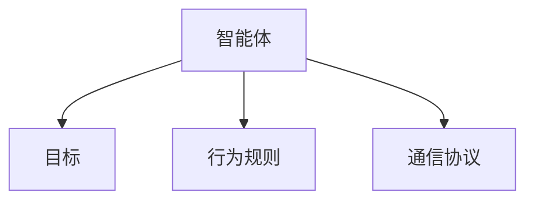
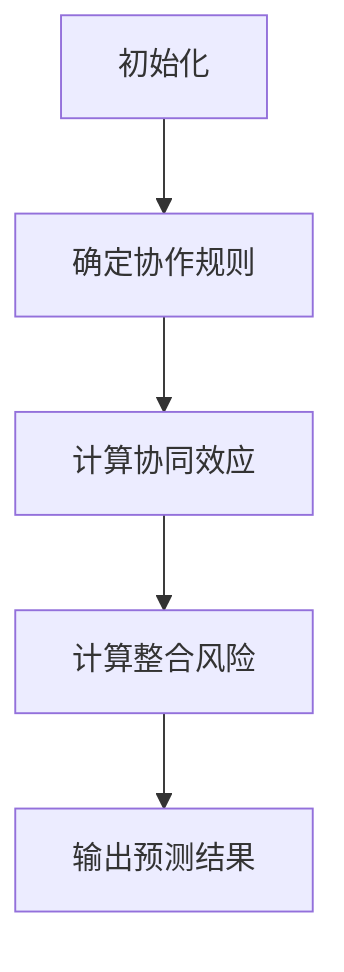
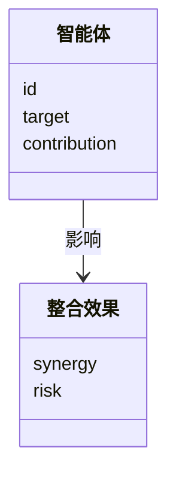
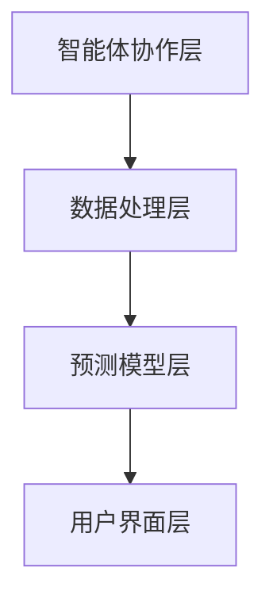

                 


# 《多智能体AI如何预测并购后整合效果》

> 关键词：多智能体AI，并购整合，预测模型，协同学习，企业战略

> 摘要：本文将深入探讨多智能体AI在预测企业并购后整合效果中的应用。通过分析多智能体系统的协作机制，结合数学模型和实际案例，详细阐述如何利用多智能体AI技术来优化并购整合策略，降低整合风险，并提升整合效率。

---

# 第1章 多智能体AI与并购整合的背景

## 1.1 多智能体AI的背景与现状
### 1.1.1 多智能体AI的定义与特点
多智能体AI是指由多个相互作用的智能体组成的系统，这些智能体能够通过协作完成复杂任务。其特点包括分布式性、自主性、协作性和动态性。

### 1.1.2 多智能体AI在企业中的应用现状
多智能体AI已经在供应链管理、金融投资、智能制造等领域得到广泛应用。例如，智能体可以协调多个部门的工作流程，优化资源分配。

### 1.1.3 多智能体AI的优势与挑战
优势包括提高决策效率、增强系统鲁棒性；挑战则包括智能体之间的通信复杂性和协作难度。

## 1.2 并购整合的背景与挑战
### 1.2.1 并购整合的定义与流程
并购整合是指企业在收购其他企业后，将其业务、文化、战略等进行融合的过程。流程包括尽职调查、战略规划、资源整合等。

### 1.2.2 并购整合中的常见问题
常见的问题包括文化冲突、资源浪费、管理混乱等，这些问题可能导致整合失败或成本增加。

### 1.2.3 多智能体AI在并购整合中的应用潜力
多智能体AI可以模拟企业内部的不同部门，通过协作预测整合效果，优化整合策略。

## 1.3 多智能体AI与并购整合的结合
### 1.3.1 多智能体AI在并购整合中的作用
多智能体AI可以模拟企业的组织结构，分析不同部门之间的协作效果，预测整合后的表现。

### 1.3.2 多智能体AI如何预测整合效果
通过分析企业的历史数据和市场趋势，多智能体AI可以预测整合后的协同效应和潜在风险。

### 1.3.3 多智能体AI预测整合效果的创新性
利用多智能体AI预测整合效果是一种创新性的方法，能够提高预测的准确性和全面性。

## 1.4 本章小结
本章介绍了多智能体AI的背景、特点以及在企业中的应用现状，分析了并购整合的背景与挑战，并探讨了多智能体AI在并购整合中的应用潜力。

---

# 第2章 多智能体AI的核心概念与联系

## 2.1 多智能体AI的核心概念
### 2.1.1 多智能体系统的基本构成
多智能体系统由多个智能体组成，每个智能体都有自己的目标和行为规则。

### 2.1.2 多智能体系统的协作机制
智能体之间通过通信协议进行协作，例如使用分布式优化模型或博弈论模型。

### 2.1.3 多智能体系统的通信协议
通信协议定义了智能体之间的信息传递方式，例如通过消息队列或事件驱动机制。

## 2.2 多智能体AI与并购整合的关系
### 2.2.1 多智能体AI在并购整合中的角色
多智能体AI可以模拟企业的组织结构，分析不同部门之间的协作效果。

### 2.2.2 多智能体AI如何分析整合风险
通过分析企业的历史数据和市场趋势，多智能体AI可以预测整合后的协同效应和潜在风险。

### 2.2.3 多智能体AI如何优化整合策略
多智能体AI可以通过模拟不同整合方案，找到最优的整合策略，例如通过分布式优化模型进行预测。

## 2.3 多智能体AI的核心概念对比表
| 概念 | 特性 | 示例 |
|------|------|------|
| 智能体 | 独立性 | 各部门 |
| 协作机制 | 分布式优化 | 部门间协作 |
| 通信协议 | 事件驱动 | 信息传递 |

## 2.4 多智能体AI的ER实体关系图


## 2.5 本章小结
本章详细讲解了多智能体AI的核心概念，包括多智能体系统的构成、协作机制和通信协议，并分析了多智能体AI在并购整合中的应用。

---

# 第3章 多智能体AI预测并购整合效果的数学模型

## 3.1 多智能体AI的协作模型
### 3.1.1 分布式优化模型
分布式优化模型通过局部优化实现全局最优，例如使用拉格朗日乘数法进行优化。

### 3.1.2 博弈论模型
博弈论模型通过分析智能体之间的博弈关系，预测整合效果。例如，纳什均衡可以用于预测整合后的稳定状态。

### 3.1.3 融合模型
融合模型结合分布式优化和博弈论模型，综合考虑局部优化和全局均衡。

## 3.2 并购整合的数学模型
### 3.2.1 整合效果的评估指标
整合效果可以通过协同效应、成本节约等指标进行评估。

### 3.2.2 整合风险的预测模型
整合风险可以通过分析历史数据和市场趋势，使用回归分析进行预测。

### 3.2.3 多智能体协作的数学公式
$$ \text{协同效应} = \sum_{i=1}^{n} \text{智能体}_i \times \text{贡献度}_i $$

## 3.3 算法实现
### 3.3.1 算法步骤
1. 初始化智能体及其目标。
2. 确定智能体之间的协作规则。
3. 计算协同效应和整合风险。
4. 输出预测结果。

### 3.3.2 算法流程图


### 3.3.3 Python代码示例
```python
def calculate_synergy(agents, contributions):
    return sum(a * c for a, c in zip(agents, contributions))

agents = [0.5, 0.3, 0.2]
contributions = [0.8, 0.6, 0.4]
synergy = calculate_synergy(agents, contributions)
print(synergy)  # 输出协同效应
```

## 3.4 本章小结
本章通过数学模型和算法实现，详细讲解了多智能体AI预测并购整合效果的方法，包括分布式优化模型和博弈论模型的应用。

---

# 第4章 系统分析与架构设计方案

## 4.1 问题场景介绍
### 4.1.1 并购整合的业务流程
并购整合包括尽职调查、战略规划、资源整合等阶段。

### 4.1.2 系统需求分析
系统需要实时分析企业的数据，预测整合效果，并提供优化建议。

## 4.2 系统功能设计
### 4.2.1 领域模型


### 4.2.2 系统架构设计


### 4.2.3 系统接口设计
系统接口包括数据输入接口、模型调用接口和结果展示接口。

## 4.3 本章小结
本章通过系统分析与架构设计，详细讲解了多智能体AI预测并购整合效果的实现方案，包括领域模型、系统架构和接口设计。

---

# 第5章 项目实战

## 5.1 环境安装与配置
### 5.1.1 安装Python
安装Python 3.8及以上版本，并安装必要的库，如NumPy和scikit-learn。

### 5.1.2 安装依赖项
安装依赖项，例如：
```bash
pip install numpy scikit-learn
```

## 5.2 核心代码实现
### 5.2.1 数据预处理
读取企业数据，进行特征提取和数据清洗。

### 5.2.2 模型训练
使用机器学习算法训练预测模型，例如使用随机森林进行协同效应预测。

### 5.2.3 模型预测
输入企业的数据，运行模型，输出整合效果的预测结果。

## 5.3 案例分析
### 5.3.1 数据来源与处理
以某企业并购案例为例，进行数据处理和特征提取。

### 5.3.2 模型训练与验证
训练模型并验证其准确性，例如使用交叉验证评估模型性能。

### 5.3.3 预测结果分析
分析模型预测结果，评估整合效果，并提出优化建议。

## 5.4 本章小结
本章通过实际案例，详细讲解了多智能体AI预测并购整合效果的实现过程，包括环境配置、代码实现和案例分析。

---

# 第6章 总结与展望

## 6.1 总结
本文详细探讨了多智能体AI在预测并购整合效果中的应用，通过数学模型和实际案例，展示了其在企业战略中的潜力。

## 6.2 展望
未来的研究方向包括优化多智能体协作算法，探索更复杂的并购整合场景，以及结合其他AI技术（如深度学习）提升预测精度。

## 6.3 注意事项
在实际应用中，需要考虑数据质量和模型的可解释性，确保预测结果的准确性和实用性。

## 6.4 拓展阅读
推荐读者阅读相关领域的书籍和论文，深入学习多智能体AI和并购整合的知识。

---

通过以上目录大纲，读者可以系统地了解多智能体AI在预测并购整合效果中的应用，从理论到实践，逐步掌握相关知识和技能。

