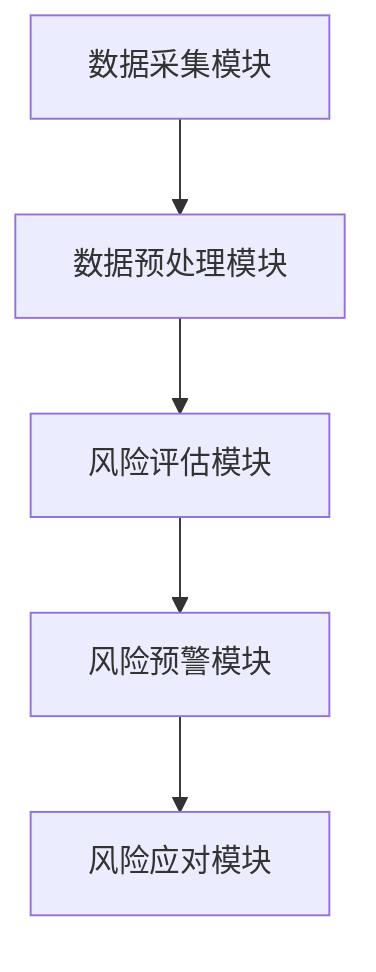
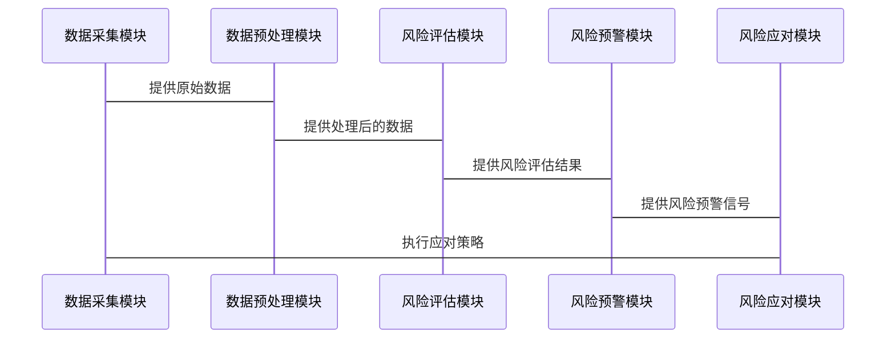

                 


# 多智能体AI系统在价值投资中的风险管理应用

---

## 关键词

- 多智能体系统
- 风险管理
- 价值投资
- AI算法
- 投资策略

---

## 摘要

本文探讨了多智能体AI系统在价值投资中的风险管理应用。首先，介绍了多智能体系统的基本概念和风险管理的核心原理。然后，详细分析了多智能体系统在风险识别、量化和控制中的具体应用，并结合数学模型和算法原理进行了深入讲解。最后，通过实际案例展示了多智能体AI系统在风险管理中的优势，并提出了未来研究的方向。

---

# 第一部分: 多智能体AI系统与风险管理基础

## 第1章: 多智能体AI系统概述

### 1.1 多智能体系统的基本概念

#### 1.1.1 多智能体系统的定义与特点

多智能体系统（Multi-Agent System，MAS）是由多个智能体组成的分布式系统，这些智能体能够通过协作完成复杂的任务。与单智能体系统相比，MAS具有以下特点：

- **分布式性**：智能体之间通过分布式协作完成任务。
- **自主性**：每个智能体都具有一定的自主决策能力。
- **协作性**：智能体之间需要通过通信和协调完成共同目标。
- **动态性**：系统环境和智能体之间的关系是动态变化的。

#### 1.1.2 多智能体系统的核心要素

多智能体系统的核心要素包括：

1. **智能体**：能够感知环境并采取行动的实体。
2. **通信机制**：智能体之间交换信息的方式。
3. **协作机制**：智能体之间协作完成任务的规则。
4. **环境**：智能体所处的外部环境。

#### 1.1.3 多智能体系统与单智能体系统的区别

| 属性 | 单智能体系统 | 多智能体系统 |
|------|-------------|--------------|
| 决策中心化 | 是 | 否 |
| 信息共享 | 低 | 高 |
| 系统复杂性 | 低 | 高 |

### 1.2 风险管理的基本概念

#### 1.2.1 风险管理的定义与目标

风险管理是指通过识别、评估和应对潜在风险，以最小化其对目标的影响。在金融领域，风险管理的核心目标是降低投资组合的潜在损失。

#### 1.2.2 风险管理的核心原则

1. **全面性**：覆盖所有可能的风险来源。
2. **及时性**：及时识别和应对风险。
3. **灵活性**：根据环境变化调整风险管理策略。

#### 1.2.3 风险管理在金融领域的应用

在价值投资中，风险管理是确保投资组合稳定增值的关键。通过有效的风险管理，投资者可以降低市场波动对投资组合的影响。

### 1.3 多智能体AI系统在风险管理中的应用前景

#### 1.3.1 多智能体系统在金融领域的潜力

多智能体系统在金融领域的潜力主要体现在以下几个方面：

1. **复杂环境下的决策支持**：多智能体系统能够处理复杂金融环境中的不确定性。
2. **分布式协作**：多个智能体可以协作完成风险评估和应对任务。
3. **实时响应**：多智能体系统能够快速响应市场变化。

#### 1.3.2 风险管理在价值投资中的重要性

价值投资强调长期持有优质资产，但市场波动和经济周期变化仍然会影响投资组合的价值。有效的风险管理可以确保投资组合的稳定增长。

#### 1.3.3 多智能体系统如何提升风险管理效率

多智能体系统通过分布式协作和实时通信，能够快速识别和应对潜在风险。这使得风险管理更加高效和精准。

---

## 第2章: 多智能体系统与风险管理的核心概念

### 2.1 多智能体系统的协作机制

#### 2.1.1 分布式协作的基本原理

分布式协作是指多个智能体通过分布式的方式完成协作任务。每个智能体负责特定的任务，并通过通信机制共享信息。

#### 2.1.2 协作中的通信与协调问题

通信和协调是多智能体协作中的关键问题。智能体之间需要通过通信机制共享信息，并通过协调机制解决冲突。

#### 2.1.3 协作中的冲突解决策略

1. **协商机制**：通过协商解决冲突。
2. **仲裁机制**：通过仲裁解决无法协商的冲突。
3. **优先级机制**：根据任务优先级自动解决冲突。

### 2.2 风险管理的核心模型

#### 2.2.1 风险评估模型的构建

风险评估模型用于量化潜在风险的影响。常见的风险评估模型包括VaR（Value at Risk）和CVaR（Conditional Value at Risk）。

#### 2.2.2 风险预警机制的设计

风险预警机制通过实时监控市场数据，识别潜在风险并发出预警信号。

#### 2.2.3 风险应对策略的制定

根据风险评估结果，制定相应的风险应对策略，例如调整投资组合或分散投资。

### 2.3 多智能体系统与风险管理的结合点

#### 2.3.1 多智能体系统在风险识别中的应用

多智能体系统可以通过分布式感知和协作，识别潜在风险。

#### 2.3.2 多智能体系统在风险量化中的应用

通过多智能体系统，可以更准确地量化潜在风险的影响。

#### 2.3.3 多智能体系统在风险控制中的应用

多智能体系统可以通过协作机制，实时调整投资组合，降低风险敞口。

### 2.4 本章小结

---

## 第3章: 多智能体协作算法

### 3.1 多智能体协作的基本算法

#### 3.1.1 分布式协作算法概述

分布式协作算法是一种基于分布式计算的协作方法。常见的分布式协作算法包括分布式一致性算法和分布式共识算法。

#### 3.1.2 基于博弈论的协作算法

博弈论是一种研究策略互动的理论。在多智能体系统中，可以通过博弈论模型来设计协作策略。

#### 3.1.3 基于强化学习的协作算法

强化学习是一种通过试错方式学习策略的方法。在多智能体系统中，强化学习可以用于协作决策。

### 3.2 风险管理中的多智能体协作模型

#### 3.2.1 模型的基本框架

多智能体协作模型通常包括以下几个部分：

1. **智能体**：负责感知环境和执行任务。
2. **通信机制**：智能体之间共享信息的方式。
3. **协作机制**：智能体之间协作完成任务的规则。
4. **目标函数**：衡量协作效果的指标。

#### 3.2.2 模型的输入与输出

模型的输入包括市场数据、投资组合信息等，输出包括风险评估结果和应对策略。

#### 3.2.3 模型的训练与优化

通过机器学习算法，可以对多智能体协作模型进行训练和优化，提高其协作效率和风险应对能力。

### 3.3 算法的数学模型与公式

#### 3.3.1 协作算法的数学表达

多智能体协作算法可以通过数学模型进行描述。例如，分布式一致性算法可以表示为：

$$ x_i^{(k+1)} = \frac{1}{n} \sum_{j=1}^{n} x_j^{(k)} $$

其中，\( x_i^{(k+1)} \) 表示第 \( i \) 个智能体在第 \( k+1 \) 轮的值，\( n \) 表示智能体的数量。

#### 3.3.2 风险评估的数学模型

风险评估模型可以表示为：

$$ \text{VaR} = \text{quantile}(P, \alpha) $$

其中，\( P \) 表示概率分布，\( \alpha \) 表示置信水平。

#### 3.3.3 算法的收敛性分析

通过数学分析，可以证明多智能体协作算法的收敛性。例如，分布式一致性算法的收敛性可以通过线性代数的方法进行证明。

### 3.4 本章小结

---

## 第4章: 系统分析与架构设计

### 4.1 系统功能设计

#### 4.1.1 数据采集模块

数据采集模块负责收集市场数据、投资组合信息等。

#### 4.1.2 风险评估模块

风险评估模块通过数学模型评估潜在风险。

#### 4.1.3 风险预警模块

风险预警模块实时监控市场数据，发出风险预警信号。

#### 4.1.4 风险应对模块

风险应对模块根据风险评估结果，制定应对策略并执行。

### 4.2 系统功能流程设计

#### 4.2.1 数据采集流程

1. 收集市场数据。
2. 数据预处理。
3. 数据存储。

#### 4.2.2 风险评估流程

1. 数据输入。
2. 风险评估模型计算。
3. 风险评估结果输出。

#### 4.2.3 风险预警流程

1. 实时监控市场数据。
2. 风险预警模型计算。
3. 发出风险预警信号。

#### 4.2.4 风险应对流程

1. 根据风险评估结果，制定应对策略。
2. 执行应对策略。
3. 监控策略执行效果。

### 4.3 系统架构设计

#### 4.3.1 系统架构图



#### 4.3.2 系统接口设计

系统接口包括数据输入接口、模型调用接口和结果输出接口。

#### 4.3.3 系统交互流程



### 4.4 本章小结

---

## 第5章: 项目实战

### 5.1 环境安装

安装Python、NumPy、Pandas、Matplotlib、Scikit-learn等库。

### 5.2 核心代码实现

#### 5.2.1 数据采集模块

```python
import pandas as pd

def collect_data():
    data = pd.read_csv('market_data.csv')
    return data
```

#### 5.2.2 风险评估模块

```python
from sklearn.ensemble import RandomForestRegressor

def risk_assessment(data):
    model = RandomForestRegressor()
    model.fit(data[['market_return', 'volatility'], data['risk']]
    return model.predict(new_data)
```

#### 5.2.3 风险预警模块

```python
import numpy as np

def risk预警(data):
    threshold = np.quantile(data['risk'], 0.95)
    if data['risk'] > threshold:
        return '高风险'
    else:
        return '低风险'
```

#### 5.2.4 风险应对模块

```python
def risk应对(strategy):
    if strategy == '分散投资':
        print('执行分散投资策略')
    elif strategy == '对冲策略':
        print('执行对冲策略')
```

### 5.3 案例分析

假设我们有一个包含多只股票的投资组合，我们需要通过多智能体系统进行风险管理。

#### 5.3.1 数据采集与预处理

```python
data = collect_data()
processed_data = preprocess(data)
```

#### 5.3.2 风险评估

```python
risk_assessment(processed_data)
```

#### 5.3.3 风险预警

```python
risk_预警(processed_data)
```

#### 5.3.4 风险应对

```python
risk_应对('分散投资')
```

### 5.4 本章小结

---

## 第6章: 总结与展望

### 6.1 本章总结

本文探讨了多智能体AI系统在价值投资中的风险管理应用。通过理论分析和实际案例，展示了多智能体系统在风险识别、量化和控制中的优势。

### 6.2 未来研究方向

未来的研究方向包括：

1. **算法优化**：进一步优化多智能体协作算法，提高风险管理效率。
2. **系统扩展**：将多智能体系统应用于更复杂的金融场景。
3. **数据融合**：探索多源数据的融合，提高风险评估的准确性。

### 6.3 注意事项

在实际应用中，需要注意数据质量和模型的泛化能力。

### 6.4 拓展阅读

推荐阅读相关领域的书籍和论文，深入了解多智能体系统和风险管理的最新研究。

---

## 参考文献

（此处列出参考文献）

---

通过以上内容，读者可以全面了解多智能体AI系统在价值投资中的风险管理应用，从理论到实践，逐步掌握相关知识和技能。

