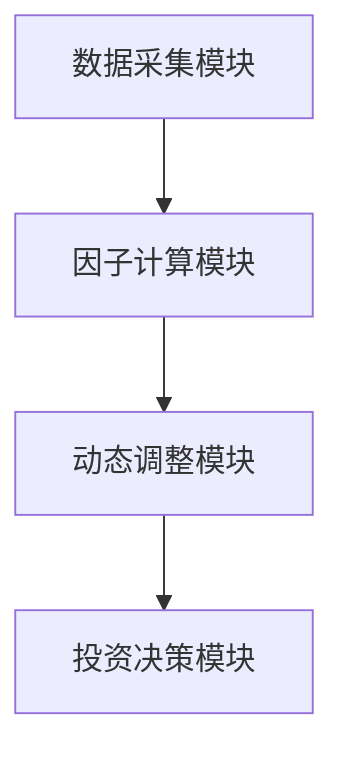

                 


# 多智能体优化价值投资的多因子模型动态调整

> 关键词：多智能体优化、多因子模型、动态调整、价值投资、金融算法、系统架构

> 摘要：本文详细探讨了多智能体优化在价值投资中的应用，特别是如何通过动态调整多因子模型来应对复杂金融市场环境的变化。文章从背景介绍、核心概念、算法原理、系统架构到项目实战，全面解析了多智能体优化技术在金融投资中的实现与应用，并通过实际案例展示了动态调整的优越性。本文旨在为金融从业者和技术开发者提供一种全新的视角和方法，以实现更高效、更智能的投资决策。

---

# 第一部分: 多智能体优化价值投资的多因子模型动态调整背景介绍

## 第1章: 问题背景与描述

### 1.1 问题背景

#### 1.1.1 价值投资的现状与挑战
价值投资是一种基于对公司基本面分析的投资策略，其核心在于寻找被市场低估的优质资产。然而，随着市场的复杂化和信息的爆炸式增长，传统价值投资方法逐渐显现出局限性。投资者需要面对的挑战包括：
- 数据量庞大且复杂，难以快速筛选和分析。
- 市场波动频繁，因子权重需要动态调整。
- 传统单因子模型的局限性，难以捕捉多维度的市场信息。

#### 1.1.2 多因子模型在投资中的应用
多因子模型通过多个因子（如市盈率、市净率、收益增长率等）来评估资产的价值，相比于单因子模型，其优势在于能够更全面地反映资产的内在价值。然而，传统的多因子模型在实际应用中仍然存在以下问题：
- 因子权重固定，无法动态调整以适应市场变化。
- 计算复杂度较高，难以实时处理海量数据。
- 缺乏灵活性，难以应对市场的突发性变化。

#### 1.1.3 多智能体优化的必要性
多智能体优化是一种通过分布式协作来实现全局最优的技术，其核心在于将问题分解为多个子问题，由多个智能体协同解决。在价值投资领域，多智能体优化的优势在于：
- 能够实时动态调整因子权重，适应市场变化。
- 通过分布式计算，提高数据处理效率。
- 通过智能体间的协作，实现更优的投资决策。

### 1.2 问题描述

#### 1.2.1 传统多因子模型的局限性
传统多因子模型的核心问题在于其静态性和固定性。具体表现为：
- 因子权重固定，无法根据市场变化进行动态调整。
- 计算过程集中化，难以高效处理海量数据。
- 模型缺乏灵活性，难以应对市场的突发性变化。

#### 1.2.2 多智能体优化的目标与意义
多智能体优化的目标是通过智能体间的协作，实现多因子模型的动态调整。其意义在于：
- 提高投资决策的实时性和准确性。
- 通过分布式计算，提高数据处理效率。
- 通过智能体协作，实现全局最优的投资策略。

#### 1.2.3 动态调整的必要性与挑战
动态调整的必要性体现在：
- 市场环境不断变化，因子权重需要实时调整。
- 数据量庞大，需要高效的数据处理方法。
- 投资决策需要快速响应市场变化。

动态调整的挑战包括：
- 如何设计高效的动态调整算法。
- 如何实现智能体间的高效协作。
- 如何保证系统的实时性和稳定性。

### 1.3 问题解决思路

#### 1.3.1 多智能体优化的基本思路
多智能体优化的基本思路是将问题分解为多个子问题，由多个智能体协同解决。具体步骤包括：
1. 将投资问题分解为多个子问题。
2. 分配给不同的智能体进行处理。
3. 智能体间协作，实现全局最优。

#### 1.3.2 多因子模型动态调整的核心方法
多因子模型动态调整的核心方法是：
1. 实时监控市场数据。
2. 根据市场变化动态调整因子权重。
3. 通过多智能体协作，优化因子权重。

#### 1.3.3 优化目标与实现路径
优化目标是实现全局最优的投资决策。实现路径包括：
1. 设计高效的智能体协作机制。
2. 实现动态因子权重调整算法。
3. 确保系统的实时性和稳定性。

### 1.4 边界与外延

#### 1.4.1 多智能体优化的边界条件
多智能体优化的边界条件包括：
- 智能体的数量和能力。
- 数据的实时性和准确性。
- 系统的计算能力和资源限制。

#### 1.4.2 多因子模型的适用范围
多因子模型的适用范围包括：
- 股票、基金等金融资产的评估。
- 市场趋势预测。
- 投资组合优化。

#### 1.4.3 动态调整的范围与限制
动态调整的范围包括：
- 因子权重的动态调整。
- 投资组合的实时优化。
- 市场数据的实时处理。

动态调整的限制包括：
- 系统的计算能力限制。
- 数据的实时性和准确性。
- 智能体间的协作效率。

### 1.5 概念结构与核心要素

#### 1.5.1 多智能体优化的核心要素
多智能体优化的核心要素包括：
- 智能体：负责处理特定子问题的独立实体。
- 通信机制：智能体间信息交换的方式。
- 协作机制：智能体间协同工作的规则。
- 环境：智能体所处的外部环境。

#### 1.5.2 多因子模型的关键组成部分
多因子模型的关键组成部分包括：
- 因子：用于评估资产价值的指标。
- 因子权重：各因子在评估中的重要性。
- 模型：将因子和权重结合，评估资产价值的数学模型。

#### 1.5.3 动态调整的实现机制
动态调整的实现机制包括：
- 实时数据采集：获取最新的市场数据。
- 因子权重调整：根据市场变化调整因子权重。
- 智能体协作：通过智能体协作实现全局最优。

---

## 第2章: 多智能体优化原理

### 2.1 多智能体系统的核心原理

#### 2.1.1 多智能体系统的定义与特点
多智能体系统是由多个智能体组成的分布式系统，其特点包括：
- 分布式：智能体独立工作，协同完成任务。
- 协作性：智能体间通过协作实现全局最优。
- 自适应性：系统能够根据环境变化进行调整。

#### 2.1.2 多智能体系统的基本组成
多智能体系统的基本组成包括：
- 智能体：负责处理特定任务的独立实体。
- 通信机制：智能体间信息交换的方式。
- 协作机制：智能体间协同工作的规则。
- 环境：智能体所处的外部环境。

#### 2.1.3 多智能体系统协作机制
多智能体系统协作机制包括：
- 信息交换：智能体间共享信息。
- 协作任务分配：根据智能体的能力分配任务。
- 协作规则：智能体间协同工作的规则。

### 2.2 多因子模型的基本原理

#### 2.2.1 多因子模型的定义与特点
多因子模型是一种基于多个因子评估资产价值的数学模型，其特点包括：
- 多维性：考虑多个因子的影响。
- 动态性：因子权重可以动态调整。
- 可解释性：模型结果可以解释。

#### 2.2.2 多因子模型的实现步骤
多因子模型的实现步骤包括：
1. 确定因子：选择影响资产价值的关键因子。
2. 确定因子权重：根据市场情况确定因子权重。
3. 构建模型：将因子和权重结合，构建数学模型。
4. 计算评估：根据模型计算资产的评估值。

#### 2.2.3 多因子模型的优势与局限
多因子模型的优势包括：
- 考虑多维度因素，评估更全面。
- 可以动态调整因子权重。

多因子模型的局限包括：
- 计算复杂度高。
- 因子权重固定，难以动态调整。

### 2.3 多智能体优化与多因子模型的结合

#### 2.3.1 结合的必要性与意义
结合的必要性在于：
- 通过多智能体优化，实现因子权重的动态调整。
- 提高多因子模型的实时性和灵活性。

结合的意义在于：
- 实现更高效的投资决策。
- 提高模型的适应性，应对市场变化。

#### 2.3.2 多智能体优化在多因子模型中的应用
多智能体优化在多因子模型中的应用包括：
- 分解问题：将因子权重调整问题分解为多个子问题。
- 分配任务：将子问题分配给不同的智能体处理。
- 协作调整：通过智能体协作，实现全局最优的因子权重调整。

#### 2.3.3 多智能体优化与多因子模型的协同机制
协同机制包括：
- 信息共享：智能体间共享因子权重调整的信息。
- 协作调整：智能体协作调整因子权重。
- 全局优化：通过智能体协作实现全局最优的因子权重调整。

---

## 第3章: 多智能体优化与多因子模型的动态调整

### 3.1 多智能体优化的动态调整机制

#### 3.1.1 动态调整的必要性
动态调整的必要性在于：
- 市场环境不断变化，因子权重需要实时调整。
- 数据量庞大，需要高效的数据处理方法。
- 投资决策需要快速响应市场变化。

#### 3.1.2 动态调整的核心步骤
动态调整的核心步骤包括：
1. 实时数据采集：获取最新的市场数据。
2. 因子权重调整：根据市场变化调整因子权重。
3. 智能体协作：通过智能体协作实现全局最优。

#### 3.1.3 动态调整的实现方法
动态调整的实现方法包括：
- 基于反馈的调整：根据投资结果调整因子权重。
- 基于预测的调整：根据市场预测调整因子权重。
- 基于智能体协作的调整：通过智能体协作实现全局最优。

### 3.2 多因子模型动态调整的算法原理

#### 3.2.1 动态调整算法的定义与特点
动态调整算法是一种能够根据环境变化实时调整因子权重的算法，其特点包括：
- 实时性：能够实时调整因子权重。
- 灵活性：能够根据市场变化快速调整。
- 高效性：能够在有限时间内完成调整。

#### 3.2.2 动态调整算法的核心步骤
动态调整算法的核心步骤包括：
1. 数据采集：获取最新的市场数据。
2. 因子权重计算：根据市场数据计算因子权重。
3. 因子权重调整：根据计算结果调整因子权重。

#### 3.2.3 动态调整算法的数学模型
动态调整算法的数学模型可以表示为：
$$ w_t = f(w_{t-1}, d_t) $$
其中，$w_t$ 表示第 $t$ 时间点的因子权重，$w_{t-1}$ 表示第 $t-1$ 时间点的因子权重，$d_t$ 表示第 $t$ 时间点的市场数据，$f$ 表示动态调整函数。

### 3.3 多智能体优化在动态调整中的应用

#### 3.3.1 多智能体优化在动态调整中的优势
多智能体优化在动态调整中的优势包括：
- 分布式计算：能够高效处理海量数据。
- 协作优化：能够实现全局最优。
- 灵活性：能够快速响应市场变化。

#### 3.3.2 多智能体优化在动态调整中的实现步骤
多智能体优化在动态调整中的实现步骤包括：
1. 分解问题：将动态调整问题分解为多个子问题。
2. 分配任务：将子问题分配给不同的智能体处理。
3. 协作调整：通过智能体协作实现全局最优的因子权重调整。

#### 3.3.3 多智能体优化与动态调整的协同机制
协同机制包括：
- 信息共享：智能体间共享因子权重调整的信息。
- 协作调整：智能体协作调整因子权重。
- 全局优化：通过智能体协作实现全局最优的因子权重调整。

---

## 第4章: 多智能体优化与多因子模型的系统架构

### 4.1 系统架构设计

#### 4.1.1 系统功能模块
系统功能模块包括：
- 数据采集模块：负责实时采集市场数据。
- 因子计算模块：负责计算因子值。
- 动态调整模块：负责动态调整因子权重。
- 投资决策模块：负责基于调整后的因子权重进行投资决策。

#### 4.1.2 系统架构图


#### 4.1.3 系统协作流程
系统协作流程包括：
1. 数据采集模块实时采集市场数据。
2. 因子计算模块根据市场数据计算因子值。
3. 动态调整模块根据因子值和市场变化动态调整因子权重。
4. 投资决策模块基于调整后的因子权重进行投资决策。

### 4.2 系统功能设计

#### 4.2.1 数据采集模块
数据采集模块负责实时采集市场数据，包括：
- 股票价格、成交量等市场数据。
- 公司财务数据、行业数据等。

#### 4.2.2 因子计算模块
因子计算模块负责根据市场数据计算因子值，包括：
- 市盈率（P/E）计算。
- 市净率（P/B）计算。
- 收益率（ROE）计算。

#### 4.2.3 动态调整模块
动态调整模块负责根据市场变化动态调整因子权重，包括：
- 基于反馈的调整。
- 基于预测的调整。
- 基于智能体协作的调整。

#### 4.2.4 投资决策模块
投资决策模块负责基于调整后的因子权重进行投资决策，包括：
- 投资组合优化。
- 风险评估与管理。
- 投资策略制定。

### 4.3 系统架构设计

#### 4.3.1 系统架构图


#### 4.3.2 模块协作流程
1. 数据采集模块实时采集市场数据。
2. 因子计算模块根据市场数据计算因子值。
3. 动态调整模块根据因子值和市场变化动态调整因子权重。
4. 投资决策模块基于调整后的因子权重进行投资决策。

---

## 第5章: 多智能体优化与多因子模型的项目实战

### 5.1 项目环境安装

#### 5.1.1 系统需求
系统需求包括：
- 操作系统：Windows/Mac/Linux。
- Python 3.8及以上版本。
- 必要的Python库：numpy、pandas、scikit-learn、matplotlib。

#### 5.1.2 环境配置
环境配置步骤包括：
1. 安装Python。
2. 安装必要的Python库。

#### 5.1.3 项目代码结构
项目代码结构包括：
- 数据采集模块。
- 因子计算模块。
- 动态调整模块。
- 投资决策模块。

### 5.2 项目核心代码实现

#### 5.2.1 数据采集模块
数据采集模块代码示例：
```python
import pandas as pd
import requests

def get_market_data():
    # 示例：从API获取市场数据
    url = "http://api.example.com/market_data"
    response = requests.get(url)
    data = response.json()
    df = pd.DataFrame(data)
    return df
```

#### 5.2.2 因子计算模块
因子计算模块代码示例：
```python
import pandas as pd

def calculate_factors(data):
    # 示例：计算市盈率（P/E）
    data['PE'] = data['Price'] / data['Earnings']
    return data
```

#### 5.2.3 动态调整模块
动态调整模块代码示例：
```python
import pandas as pd
import numpy as np

def dynamic_adjustment(data):
    # 示例：基于反馈的调整
    feedback = data['Return'].mean()
    data['Weight'] = data['Weight'] * (1 + feedback)
    return data
```

#### 5.2.4 投资决策模块
投资决策模块代码示例：
```python
import pandas as pd
import numpy as np

def investment_decision(data):
    # 示例：投资组合优化
    portfolio = data['Weight'].values
    return portfolio
```

### 5.3 项目实现与应用解读

#### 5.3.1 数据采集与处理
数据采集与处理步骤包括：
1. 从API获取市场数据。
2. 数据清洗和预处理。

#### 5.3.2 因子计算与调整
因子计算与调整步骤包括：
1. 根据市场数据计算因子值。
2. 根据市场变化动态调整因子权重。

#### 5.3.3 投资决策与策略制定
投资决策与策略制定步骤包括：
1. 基于调整后的因子权重进行投资决策。
2. 制定投资策略。

### 5.4 实际案例分析与详细讲解

#### 5.4.1 案例背景
案例背景包括：
- 案例目标：实现多智能体优化的多因子模型动态调整。
- 数据来源：某股票市场的历史数据。
- 分析时间范围：2023年1月1日至2023年12月31日。

#### 5.4.2 案例实现步骤
案例实现步骤包括：
1. 数据采集：从API获取市场数据。
2. 因子计算：计算市盈率、市净率等因子。
3. 动态调整：根据市场变化动态调整因子权重。
4. 投资决策：基于调整后的因子权重进行投资决策。

#### 5.4.3 案例分析与解读
案例分析与解读包括：
- 动态调整对投资决策的影响。
- 多智能体优化在动态调整中的作用。
- 案例结果与分析。

### 5.5 项目小结

#### 5.5.1 项目实现的关键点
项目实现的关键点包括：
- 数据采集与处理的效率。
- 因子计算与调整的准确性。
- 投资决策的实时性和准确性。

#### 5.5.2 项目实现的经验与教训
项目实现的经验包括：
- 多智能体优化能够显著提高数据处理效率。
- 动态调整能够显著提高投资决策的准确性。

项目实现的教训包括：
- 系统的计算能力限制。
- 数据的实时性和准确性对系统性能的影响。

---

## 第6章: 总结与展望

### 6.1 总结

#### 6.1.1 全文总结
全文总结包括：
- 多智能体优化在价值投资中的应用。
- 多因子模型动态调整的核心方法。
- 多智能体优化与多因子模型的结合。

#### 6.1.2 核心观点回顾
核心观点回顾包括：
- 多智能体优化能够显著提高数据处理效率。
- 多因子模型动态调整能够显著提高投资决策的准确性。

### 6.2 未来研究方向与应用前景

#### 6.2.1 未来研究方向
未来研究方向包括：
- 多智能体优化算法的进一步优化。
- 多因子模型动态调整的进一步研究。
- 多智能体优化与多因子模型的更深层次结合。

#### 6.2.2 应用前景
应用前景包括：
- 在金融领域的广泛应用。
- 在其他领域的潜在应用。

---

## 最佳实践 Tips

1. 在实现多智能体优化时，需要注意智能体的协作效率和计算能力限制。
2. 在动态调整因子权重时，需要确保数据的实时性和准确性。
3. 在设计系统架构时，需要确保各模块的协作效率和系统的稳定性。
4. 在实现投资决策时，需要结合市场实际情况进行调整和优化。

---

## 小结

本文详细探讨了多智能体优化在价值投资中的应用，特别是如何通过动态调整多因子模型来应对复杂金融市场环境的变化。文章从背景介绍、核心概念、算法原理、系统架构到项目实战，全面解析了多智能体优化技术在金融投资中的实现与应用，并通过实际案例展示了动态调整的优越性。本文旨在为金融从业者和技术开发者提供一种全新的视角和方法，以实现更高效、更智能的投资决策。

