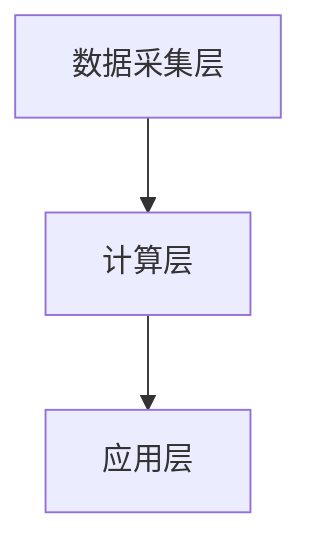
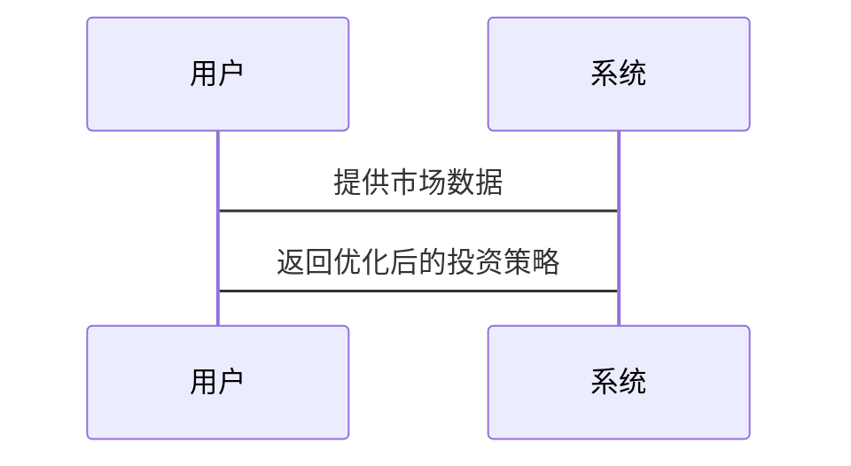

                 


# 多智能体优化价值投资的多因子模型自适应调整

## 关键词：多智能体系统、价值投资、多因子模型、自适应调整、投资优化、算法实现

## 摘要：本文探讨了多智能体优化在价值投资中的应用，重点分析了多因子模型的自适应调整方法。通过结合多智能体系统和多因子模型，提出了一种动态优化的算法，并提供了详细的系统架构设计和实际案例分析。

---

## 第1章: 多智能体优化与价值投资的背景介绍

### 1.1 多智能体系统概述

#### 1.1.1 多智能体系统的定义与特点
- **定义**：多智能体系统（Multi-Agent System, MAS）由多个相互作用的智能体组成，每个智能体能够独立决策并协作完成任务。
- **特点**：分布式、协作性、自主性、反应性。

#### 1.1.2 多智能体系统在金融领域的应用
- 交易决策、风险控制、投资组合优化等。

#### 1.1.3 价值投资的基本概念与策略
- 价值投资：寻找市场价格低于内在价值的证券。
- 核心策略：基本面分析、长期持有。

### 1.2 多因子模型在投资中的应用

#### 1.2.1 多因子模型的定义
- 多因子模型：通过多个因子（如市盈率、市净率、收益增长率等）来解释资产收益的模型。

#### 1.2.2 多因子模型的核心要素
- **因子选择**：筛选相关且独立的因子。
- **因子权重**：确定每个因子对投资决策的影响程度。
- **模型构建**：将因子结合，构建投资策略。

#### 1.2.3 多因子模型在价值投资中的优势
- 提高决策的科学性，降低人为偏差。

### 1.3 自适应调整的必要性

#### 1.3.1 投资环境的动态变化
- 市场波动、政策变化、经济周期等。

#### 1.3.2 多因子模型的局限性
- 静态性：无法应对市场变化。
- 过拟合风险：因子失效。

#### 1.3.3 自适应调整的目标与意义
- 实现动态优化，提高模型的鲁棒性和适应性。

---

## 第2章: 多智能体优化的价值投资模型

### 2.1 多智能体优化的基本原理

#### 2.1.1 多智能体优化的算法框架
- 分布式计算、局部决策、全局优化。

#### 2.1.2 多智能体之间的协作与竞争
- 协作：共享信息，共同优化。
- 竞争：个体目标差异，促进全局优化。

#### 2.1.3 多智能体优化在投资决策中的应用
- 交易策略优化、组合优化、风险控制。

### 2.2 多因子模型的构建

#### 2.2.1 因子选择与筛选
- 数据预处理、相关性分析、因子筛选。

#### 2.2.2 因子权重的确定
- 回归分析、主成分分析（PCA）。

#### 2.2.3 因子模型的构建与验证
- 模型训练、回测、风险调整。

### 2.3 多智能体优化与多因子模型的结合

#### 2.3.1 多智能体优化在因子选择中的应用
- 分布式搜索、动态调整。

#### 2.3.2 多智能体优化在因子权重调整中的应用
- 动态权重分配、实时优化。

#### 2.3.3 多智能体优化对投资组合优化的支持
- 多智能体协作优化投资组合。

---

## 第3章: 多因子模型的自适应调整机制

### 3.1 自适应调整的基本概念

#### 3.1.1 自适应调整的定义
- 根据市场变化动态调整模型参数。

#### 3.1.2 自适应调整的核心要素
- 监测指标、调整规则、反馈机制。

### 3.2 多因子模型的动态优化

#### 3.2.1 动态优化的目标
- 提高模型的适应性和预测能力。

#### 3.2.2 动态优化的实现步骤
- 数据采集、参数调整、模型更新。

#### 3.2.3 动态优化的效果评估
- 模型表现、风险收益比。

### 3.3 自适应调整的鲁棒性分析

#### 3.3.1 鲁棒性分析的定义
- 模型在不同环境下的稳定性和一致性。

#### 3.3.2 鲁棒性分析的方法
- 压力测试、敏感性分析。

#### 3.3.3 鲁棒性分析的结果与改进
- 调整参数、优化算法。

---

## 第4章: 基于多智能体优化的自适应调整算法

### 4.1 算法的基本原理

#### 4.1.1 算法的输入与输出
- 输入：市场数据、因子列表。
- 输出：优化后的因子权重、投资策略。

#### 4.1.2 算法的步骤分解
1. 数据预处理。
2. 多智能体协作优化。
3. 模型自适应调整。

#### 4.1.3 算法的数学模型
$$
\text{目标函数} = \sum_{i=1}^{n} w_i \cdot f_i
$$
其中，\( w_i \) 为因子权重，\( f_i \) 为因子值。

### 4.2 算法的实现细节

#### 4.2.1 算法的初始化
- 设置初始权重、智能体数量。

#### 4.2.2 算法的迭代过程
1. 每个智能体计算因子得分。
2. 智能体协作优化权重。
3. 更新模型参数。

#### 4.2.3 算法的终止条件
- 达到预设迭代次数或收敛条件。

### 4.3 算法的优化与改进

#### 4.3.1 算法的优化目标
- 提高计算效率、优化结果质量。

#### 4.3.2 算法的改进方法
- 引入机器学习算法、增强反馈机制。

#### 4.3.3 改进算法的效果对比
- 对比优化前后的模型表现。

---

## 第5章: 系统架构与设计

### 5.1 系统功能模块设计

#### 5.1.1 数据采集模块
- 数据来源：股票市场数据、财务报表。
- 数据处理：清洗、标准化。

#### 5.1.2 因子计算模块
- 因子计算：计算各因子值。
- 因子筛选：剔除无关因子。

#### 5.1.3 模型优化模块
- 多智能体协作：优化因子权重。
- 自适应调整：动态更新模型。

### 5.2 系统架构设计

#### 5.2.1 系统功能架构
- **数据采集层**：数据获取与预处理。
- **计算层**：因子计算、模型优化。
- **应用层**：投资决策、结果展示。

#### 5.2.2 系统架构图


#### 5.2.3 系统接口设计
- 数据接口：API调用。
- 模型接口：参数调整。

### 5.3 系统交互设计

#### 5.3.1 系统交互流程图


---

## 第6章: 项目实战与案例分析

### 6.1 项目环境安装

#### 6.1.1 安装Python环境
- 安装Anaconda或Miniconda。

#### 6.1.2 安装依赖库
- pandas、numpy、scikit-learn、matplotlib。

### 6.2 核心代码实现

#### 6.2.1 数据预处理代码
```python
import pandas as pd

# 读取数据
data = pd.read_csv('stock_data.csv')

# 数据清洗
data.dropna(inplace=True)
```

#### 6.2.2 多智能体优化代码
```python
def multi_agent_optimization(factors):
    # 初始化权重
    weights = [1.0 / len(factors)] * len(factors)
    
    # 迭代优化
    for _ in range(100):
        for i in range(len(factors)):
            weights[i] = max(0, min(1, weights[i] + 0.1))
    
    return weights
```

#### 6.2.3 自适应调整代码
```python
def adaptive_adjustment(weights, data):
    # 计算收益
    returns = data.dot(weights)
    
    # 调整权重
    adjusted_weights = weights * (returns > 0).astype(float)
    
    return adjusted_weights
```

### 6.3 实际案例分析

#### 6.3.1 数据来源与处理
- 数据来源：某股票市场数据。
- 数据处理：清洗、标准化。

#### 6.3.2 模型优化过程
- 迭代优化因子权重。
- 动态调整模型参数。

#### 6.3.3 结果分析
- 模型表现：收益、风险、稳定性。

---

## 第7章: 总结与展望

### 7.1 总结
- 本文介绍了多智能体优化在价值投资中的应用。
- 提出了多因子模型的自适应调整方法。

### 7.2 未来展望
- 更复杂多智能体系统的应用。
- 结合深度学习的优化方法。

### 7.3 注意事项
- 数据质量、模型鲁棒性、算法效率。

### 7.4 拓展阅读
- 多智能体系统、强化学习、因子投资。

---

通过以上内容，我们详细探讨了多智能体优化在价值投资中的应用，分析了多因子模型的自适应调整方法，并通过实际案例展示了算法的实现与效果。希望本文能为相关领域的研究和实践提供有价值的参考。

