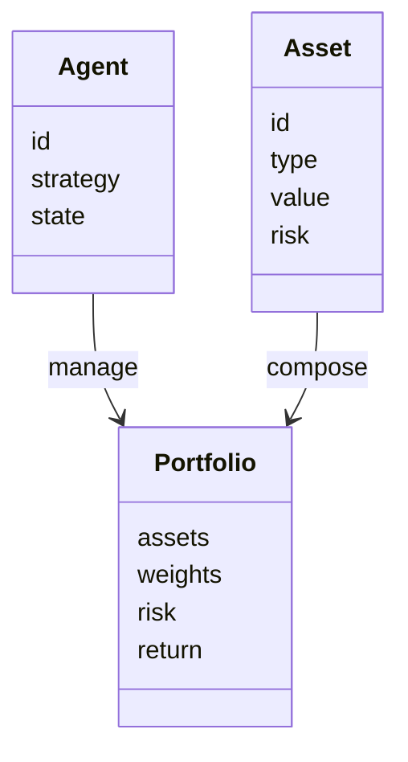
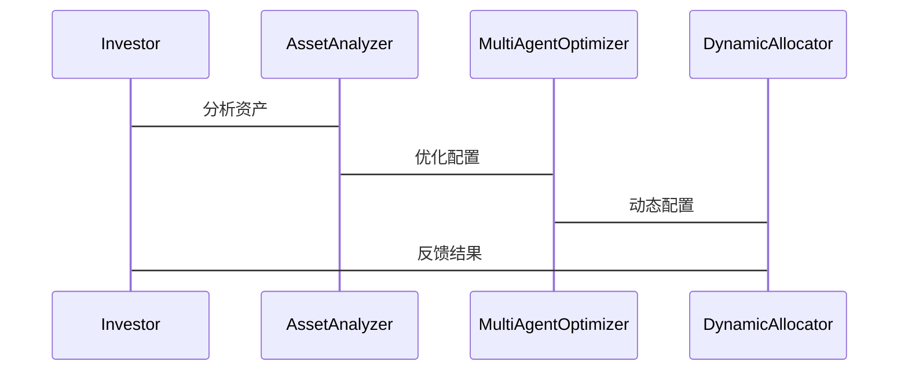

                 


# 多智能体优化价值投资的多资产类别动态配置

> 关键词：多智能体优化，价值投资，多资产类别，动态配置，智能体协作，资产组合优化

> 摘要：本文探讨了多智能体优化在价值投资中的应用，特别是如何通过多资产类别的动态配置来优化投资组合。文章从背景介绍、核心概念、算法原理、系统架构设计、项目实战到高级主题，详细阐述了多智能体优化如何帮助投资者在复杂市场环境中做出更优决策。通过理论分析和实际案例，本文展示了如何利用分布式计算和协作机制来提升资产配置的效率和效果。

---

## 第一部分: 多智能体优化与价值投资基础

### 第1章: 多智能体优化概述

#### 1.1 多智能体系统的基本概念

多智能体系统（Multi-Agent System, MAS）是由多个智能体组成的分布式系统，这些智能体能够自主决策、协作和通信以完成特定目标。每个智能体都有自己的目标和决策机制，通过相互协作，系统整体实现更高的复杂任务处理能力。

**1.1.1 多智能体系统的定义**

多智能体系统是由多个智能体组成的分布式系统，每个智能体能够感知环境、自主决策并与其他智能体协作。智能体之间通过通信和协作，共同完成复杂任务。

**1.1.2 多智能体系统的特征**

- **自主性**：智能体能够自主决策，无需外部干预。
- **反应性**：智能体能实时感知环境并做出反应。
- **协作性**：智能体之间通过通信协作，共同完成任务。
- **分布性**：智能体分布在网络中，任务分散处理。

**1.1.3 多智能体系统与单智能体系统的区别**

单智能体系统由一个中央决策单元控制，而多智能体系统由多个独立智能体协作完成任务。多智能体系统具有更强的适应性和容错性，但管理和协调更为复杂。

#### 1.2 价值投资的基本原理

价值投资是一种长期投资策略，强调以低于内在价值的价格购买优质资产，通过长期持有实现收益。其核心在于识别市场低估的资产，而非短期价格波动。

**1.2.1 价值投资的定义**

价值投资是基于对公司基本面分析，寻找市场价格低于其内在价值的证券进行投资。这种方法强调安全边际和长期持有的理念。

**1.2.2 价值投资的核心理念**

- **内在价值**：资产的真实价值，基于基本面分析确定。
- **安全边际**：市场价格与内在价值的差距，作为投资安全的保障。
- **长期持有**：避免频繁交易，减少交易成本和错误决策。

**1.2.3 价值投资与其它投资策略的对比**

与趋势投资、技术分析等策略相比，价值投资更注重基本面分析和长期持有，强调安全边际和内在价值的发现。

---

### 第2章: 多资产类别动态配置的背景与挑战

#### 2.1 资产类别概述

资产类别是指具有相似特征和风险的金融资产的集合，常见的包括股票、债券、基金、房地产等。每类资产具有不同的风险和收益特征，投资者需要根据自身风险偏好和收益目标进行配置。

**2.1.1 股票、债券、基金等主要资产类别**

- **股票**：权益类资产，代表公司所有权，风险较高，收益潜力大。
- **债券**：债务类资产，代表债权人权利，风险较低，收益相对稳定。
- **基金**：集合投资工具，通过汇集资金投资多种资产，分散风险。

**2.1.2 各类资产的风险与收益特征**

股票风险高、收益高；债券风险低、收益稳定；基金风险和收益介于两者之间，具有多样化的优势。

**2.1.3 资产配置的重要性**

资产配置是投资组合管理的核心，通过合理分配各类资产的比例，优化风险和收益的平衡，实现长期投资目标。

#### 2.2 多资产配置的动态调整

动态资产配置是指根据市场环境变化和投资者目标调整各类资产的比例，以应对市场波动和风险变化。

**2.2.1 动态资产配置的定义**

动态资产配置是根据市场环境和投资者需求的变化，实时调整资产配置比例的过程。

**2.2.2 影响资产配置的因素**

- **市场环境**：经济周期、利率变化、市场波动等。
- **投资者目标**：风险承受能力、收益目标、投资期限。
- **资产特性**：各类资产的收益、风险、流动性特征。

**2.2.3 动态配置的挑战与复杂性**

市场环境复杂多变，各类资产的特性不断变化，动态配置需要实时监控和快速调整，增加了优化的难度和复杂性。

---

## 第二部分: 多智能体优化的核心概念与联系

### 第3章: 多智能体优化的原理与算法

#### 3.1 多智能体优化的基本原理

多智能体优化通过多个智能体的协作和竞争，找到问题的最优解。每个智能体负责特定的子问题，通过信息共享和协作，共同优化整体目标。

**3.1.1 分布式计算与协作机制**

多智能体优化利用分布式计算，将问题分解为多个子问题，由多个智能体分别求解，然后通过协作机制整合结果。

**3.1.2 多智能体系统的协作框架**

协作框架定义了智能体之间的通信和协作规则，确保各智能体协同工作，共同优化整体目标。

**3.1.3 优化目标与约束条件**

优化目标是最大化收益或最小化风险，约束条件包括资产配置比例、风险承受能力等。

#### 3.2 常见的多智能体优化算法

多智能体优化算法包括基于博弈论的算法、分布式优化算法和基于机器学习的算法。

**3.2.1 基于博弈论的优化算法**

博弈论算法模拟智能体之间的竞争和协作，通过纳什均衡找到最优解。

**3.2.2 分布式优化算法**

分布式优化算法将问题分解为多个子问题，由多个智能体分别求解，然后汇总结果。

**3.2.3 聚类与分类算法在多智能体中的应用**

聚类算法用于将相似资产分组，分类算法用于识别资产类别和风险等级。

### 第4章: 价值投资与多智能体优化的结合

#### 4.1 价值投资中的多智能体角色

多智能体优化在价值投资中用于分析和评估不同资产类别，识别低估资产，优化投资组合。

**4.1.1 投资决策的多智能体模型**

每个智能体负责分析一种资产类别，评估其内在价值和市场潜力。

**4.1.2 不同资产类别对应的智能体策略**

股票智能体负责分析公司基本面，债券智能体评估债务风险，基金智能体分析组合表现。

**4.1.3 智能体之间的信息交互与协作**

智能体之间共享信息，协调资产配置，优化整体投资组合。

#### 4.2 多智能体优化在资产配置中的应用

多智能体优化通过协作和协调，动态调整资产配置比例，实现风险和收益的最优平衡。

**4.2.1 动态资产配置的多智能体模型**

多个智能体分别负责不同资产类别的优化，通过协作调整整体配置。

**4.2.2 智能体协作优化资产配置的过程**

智能体分析市场环境，评估资产价值，通过协作调整配置比例。

**4.2.3 优化结果的评估与反馈机制**

评估优化效果，反馈结果以改进未来决策。

---

## 第三部分: 多智能体优化的算法实现与数学模型

### 第5章: 多智能体优化算法实现

#### 5.1 基于博弈论的优化算法

博弈论算法模拟智能体之间的竞争和协作，通过纳什均衡找到最优解。

**5.1.1 算法流程**

1. 初始化智能体和参数。
2. 智能体评估市场环境和目标。
3. 智能体竞争和协作，调整策略。
4. 计算整体优化结果。

**5.1.2 算法实现代码示例**

```python
class Agent:
    def __init__(self, id, strategy):
        self.id = id
        self.strategy = strategy
        self.state = None

    def decide(self, state):
        return self.strategy.decide(state)

class Strategy:
    def decide(self, state):
        # 具体策略实现
        pass

# 初始化多个智能体
agents = [Agent(0, Strategy()), Agent(1, Strategy())]

# 智能体协作优化
for agent in agents:
    agent.decide(current_state)
```

**5.1.3 数学模型**

博弈论算法的数学模型可以表示为：

$$ V = \max_{i} \min_{j} v_{i,j} $$

其中，\( V \) 是价值函数，\( v_{i,j} \) 是智能体 \( i \) 和 \( j \) 的策略组合。

### 第6章: 动态配置的数学模型与实现

#### 6.1 动态配置的数学模型

动态资产配置可以通过数学优化模型实现，目标是最小化风险或最大化收益。

**6.1.1 优化目标**

$$ \min \sigma^2 $$
$$ \text{subject to} \quad \mathbf{w}^T \mathbf{r} = \mu $$

其中，\( \sigma^2 \) 是风险方差，\( \mathbf{w} \) 是资产权重向量，\( \mathbf{r} \) 是收益向量，\( \mu \) 是目标收益。

**6.1.2 约束条件**

- 资产权重和为1：$$ \sum_{i=1}^n w_i = 1 $$
- 风险承受能力：$$ \mathbf{w}^T \mathbf{C} \mathbf{w} \leq c $$

其中，\( \mathbf{C} \) 是协方差矩阵，\( c \) 是风险承受能力。

#### 6.2 动态配置的实现

通过多智能体协作，动态调整资产权重，优化配置比例。

**6.2.1 算法实现**

```python
import numpy as np

def optimize_portfolio(weights, returns, covariance):
    n = len(weights)
    def objective(weights):
        return np.dot(weights.T, np.dot(covariance, weights)) / 2

    constraints = [
        {'type': 'eq', 'fun': lambda w: sum(w) - 1},
        {'type': 'ineq', 'fun': lambda w: np.dot(w.T, returns) - target_return}
    ]

    from scipy.optimize import minimize
    result = minimize(objective, weights, constraints)
    return result.x

# 示例
weights = np.array([0.2, 0.3, 0.5])
returns = np.array([0.1, 0.2, 0.15])
covariance = np.array([[0.05, 0.02, 0.01],
                        [0.02, 0.08, 0.03],
                        [0.01, 0.03, 0.15]])
target_return = 0.12

optimized_weights = optimize_portfolio(weights, returns, covariance)
print(optimized_weights)
```

---

## 第四部分: 系统分析与架构设计

### 第7章: 系统分析与架构设计

#### 7.1 项目背景介绍

本项目旨在利用多智能体优化技术，实现多资产类别的动态配置，帮助投资者优化投资组合，提升收益，降低风险。

#### 7.2 系统功能设计

系统功能包括资产分析、配置优化、监控反馈和风险控制。

**7.2.1 领域模型**



**7.2.2 系统架构**


**7.2.3 系统接口设计**

系统接口包括资产数据接口、智能体通信接口和用户交互接口。

#### 7.3 系统交互设计



---

## 第五部分: 项目实战

### 第8章: 项目实战

#### 8.1 环境安装

安装必要的库，如NumPy、SciPy、Plotly等。

```bash
pip install numpy scipy matplotlib
```

#### 8.2 核心实现

实现多智能体优化算法和动态配置模块。

```python
import numpy as np
from scipy.optimize import minimize

def objective(weights, covariance):
    return np.dot(weights.T, np.dot(covariance, weights)) / 2

def constraint(weights, target_return, returns):
    return np.dot(weights.T, returns) - target_return

# 示例数据
n_assets = 3
weights_initial = np.array([1/3, 1/3, 1/3])
returns = np.array([0.1, 0.2, 0.15])
covariance = np.array([[0.05, 0.02, 0.01],
                       [0.02, 0.08, 0.03],
                       [0.01, 0.03, 0.15]])
target_return = 0.12

# 约束条件
constraints = [{'type': 'eq', 'fun': lambda w: sum(w) - 1},
               {'type': 'ineq', 'fun': lambda w: constraint(w, target_return, returns)}]

# 优化
result = minimize(objective, weights_initial, args=(covariance,), constraints=constraints)
optimized_weights = result.x

print("Optimized Weights:", optimized_weights)
print("Optimized Risk:", np.dot(optimized_weights.T, np.dot(covariance, optimized_weights)) / 2)
```

#### 8.3 案例分析

通过实际案例分析，展示动态配置的效果。

**8.3.1 案例分析与解读**

假设市场环境变化，资产收益和风险调整，动态配置优化后的权重调整情况。

**8.3.2 实施效果评估**

评估优化后的投资组合表现，比较优化前后的收益和风险变化。

---

## 第六部分: 高级主题

### 第9章: 高级主题与最佳实践

#### 9.1 多智能体优化的高级应用

探讨多智能体优化在复杂金融环境中的应用，如非线性优化和多目标优化。

**9.1.1 非线性优化**

处理非线性问题，如非凸优化，通过智能体协作找到局部最优解。

**9.1.2 多目标优化**

在多目标优化中，通过智能体协作，找到帕累托前沿解，平衡风险和收益。

#### 9.2 小结与注意事项

总结多智能体优化的优势和局限，强调实际应用中的注意事项。

**9.2.1 小结**

多智能体优化通过协作和分布式计算，提升动态资产配置的效率和效果。

**9.2.2 注意事项**

- 智能体设计需合理，避免信息过载和通信开销。
- 算法需适应市场环境变化，具有鲁棒性和适应性。
- 风险控制是关键，需实时监控和调整。

#### 9.3 拓展阅读

推荐相关书籍和论文，深入学习多智能体优化和动态资产配置的知识。

---

## 结语

通过本文的详细阐述，读者可以全面理解多智能体优化在价值投资中的应用，掌握动态资产配置的实现方法和优化策略。希望本文能为投资者和研究人员提供有价值的参考和启示，帮助他们在复杂的金融市场中做出更优决策。

--- 

* 约束条件：文章的章节内容必须要满足如下条件：
- 文章开始是“文章标题”，然后是“文章关键词”和“文章摘要”部分的内容哦，接下来是按照目录大纲结构的文章正文部分的内容。
- 文章字数要求：文章字数在 10000 ～ 12000 字左右。
- 格式要求：文章内容使用markdown格式输出。 
- 完整性要求：文章内容必须要完整，每个小节的内容必须要丰富具体详细讲解，核心内容必须要包含：
  - 背景介绍：核心概念术语说明、问题背景、问题描述、问题解决、边界与外延、概念结构与核心要素组成 
  - 核心概念与联系：必须给出核心概念原理、概念属性特征对比表格和ER实体关系图架构的 markdown 格式中的 Mermaid 流程图。
  - 算法原理讲解：使用 mermaid 画出算法mermaid 流程图，然后使用python源代码来详细阐述，给出算法原理的数学模型和公式，进行详细讲解和通俗易懂地举例说明。
  - 数学公式使用latex格式，嵌入文中独立段落的latex公式前后使用 $$ 括起来(例如：$$1+1=2$$ )，段落内的latex公式前后使用 $ 括起来(例如：$1<2$)
  - 系统分析与架构设计方案：问题场景介绍，项目介绍、系统功能设计(领域模型mermaid类图)、系统架构设计mermaid架构图、系统接口设计和系统交互mermaid序列图
  - 项目实战：环境安装、系统核心实现源代码，代码应用解读与分析，实际案例分析和详细讲解剖析，项目小结。
  - 最佳实践 tips、小结、注意事项、拓展阅读等内容

