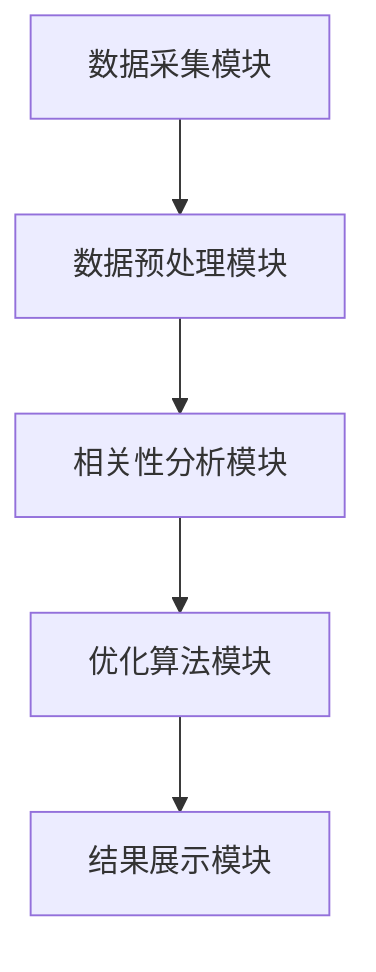

                 


# 多智能体优化价值投资的多资产类别相关性分析

## 关键词：多智能体优化、价值投资、资产相关性、投资组合优化、金融数据分析

## 摘要：  
本文探讨了多智能体优化（MAS）在价值投资中的应用，特别是如何通过多资产类别相关性分析优化投资组合。文章从背景、核心概念、算法原理、系统架构到项目实战，详细阐述了多智能体优化与相关性分析的结合，展示了如何通过MAS提升投资决策的科学性和效率。

---

# 第一部分：多智能体优化与价值投资概述

## 第1章：多智能体优化与价值投资概述

### 1.1 多智能体优化的基本概念

#### 1.1.1 多智能体系统（MAS）的定义
多智能体系统（Multi-Agent System, MAS）是由多个智能体（Agent）组成的分布式系统，这些智能体能够自主决策、协作并解决问题。MAS的核心在于智能体之间的互动与协作，能够在复杂环境中实现全局优化。

#### 1.1.2 多智能体优化的定义与特点
多智能体优化是指通过多个智能体的协同工作，实现特定目标的优化过程。其特点包括分布性、协作性、自主性和动态性。MAS优化能够处理复杂问题，如资源分配、路径规划等。

#### 1.1.3 多智能体优化在金融投资中的应用
在金融领域，MAS优化常用于投资组合管理、风险控制和市场预测。通过多个智能体协作，投资者能够更好地捕捉市场机会，优化资产配置。

---

### 1.2 价值投资的基本概念

#### 1.2.1 价值投资的定义与核心理念
价值投资是一种投资策略，强调以低于公平价值的价格买入优质资产。其核心理念是寻找市场低估的资产，并长期持有，等待其价值回归。

#### 1.2.2 价值投资与传统投资方法的区别
与技术分析等短期交易策略不同，价值投资注重基本面分析，强调长期持有的理念。MAS优化为价值投资提供了技术支持，帮助投资者更科学地识别低估资产。

#### 1.2.3 价值投资在多资产类别中的应用
在股票、债券、基金等多种资产类别中，价值投资策略均可应用。通过MAS优化，投资者能够同时分析多个资产类别，发现跨资产的投资机会。

---

### 1.3 多资产类别相关性分析的必要性

#### 1.3.1 多资产类别相关性的定义
资产相关性是指不同资产价格波动之间的关联性。相关性分析帮助投资者理解不同资产之间的联动关系，优化投资组合的风险与收益平衡。

#### 1.3.2 相关性分析在投资组合优化中的作用
通过相关性分析，投资者可以降低投资组合的系统性风险，提高收益。在多资产配置中，相关性分析是优化投资组合的核心工具。

#### 1.3.3 多智能体优化如何提升相关性分析的效率
MAS优化通过分布式计算和协作学习，显著提升了相关性分析的效率。多个智能体可以同时处理大量数据，快速找到最优资产配置方案。

---

## 第2章：多智能体优化与价值投资的核心概念

### 2.1 多智能体优化的核心原理

#### 2.1.1 多智能体系统的组成与功能
MAS由多个智能体、环境和通信机制组成。智能体通过感知环境、自主决策并与其他智能体协作，实现全局优化目标。

#### 2.1.2 多智能体优化的算法特点
MAS优化算法强调分布性和协作性，常用算法包括强化学习、遗传算法和粒子群优化。这些算法能够在复杂环境中找到全局最优解。

#### 2.1.3 多智能体优化与传统优化方法的对比
传统优化方法（如线性规划）通常处理单目标问题，而MAS优化能够处理多目标、动态环境下的复杂问题。

---

### 2.2 价值投资与多资产类别相关性分析的联系

#### 2.2.1 价值投资中的多资产配置策略
价值投资者通常关注单一资产类别，但通过MAS优化，可以扩展到多资产配置。相关性分析帮助投资者理解不同资产类别之间的相互作用。

#### 2.2.2 相关性分析对投资组合风险控制的作用
通过分析不同资产的相关性，投资者可以分散风险，避免过度集中投资。相关性分析是构建稳健投资组合的关键步骤。

#### 2.2.3 多智能体优化如何辅助价值投资决策
MAS优化能够快速分析海量数据，帮助投资者发现市场低估的资产。通过协作学习，智能体可以优化投资策略，提高决策效率。

---

### 2.3 本章小结

通过MAS优化，价值投资者能够更科学地进行多资产配置，降低投资风险，提升收益。相关性分析是MAS优化的重要工具，帮助投资者优化投资组合。

---

# 第三部分：多智能体优化的算法原理

## 第3章：多智能体优化算法

### 3.1 多智能体优化算法的原理

#### 3.1.1 基于强化学习的MAS优化算法
强化学习是一种通过试错优化决策的算法。在MAS优化中，智能体通过与环境互动，学习最优策略。

#### 3.1.2 基于遗传算法的MAS优化
遗传算法模拟生物进化过程，通过选择、交叉和变异操作，优化目标函数。MAS优化中，多个智能体可以同时进化，寻找最优解。

#### 3.1.3 基于粒子群优化的MAS算法
粒子群优化算法模拟鸟群觅食行为，通过粒子之间的协作，找到全局最优解。MAS优化中，多个粒子可以同时优化不同目标。

---

### 3.2 多资产相关性分析算法

#### 3.2.1 基于协方差矩阵的分解算法
协方差矩阵反映资产之间的相关性。通过矩阵分解，可以提取资产的相关性特征，优化投资组合。

#### 3.2.2 基于图论的资产相关性分析
图论方法将资产视为图节点，通过边权重反映资产相关性。相关性分析可以转化为图的最短路径或社区发现问题。

---

## 第4章：算法的数学模型与公式

### 4.1 多智能体优化的数学模型

#### 4.1.1 强化学习的数学模型
强化学习的数学模型包括状态、动作、奖励和策略空间。通过马尔可夫决策过程（MDP），智能体学习最优策略。

#### 4.1.2 遗传算法的数学模型
遗传算法的数学模型包括编码、选择、交叉和变异操作。通过优化适应度函数，算法找到全局最优解。

---

### 4.2 相关性分析的数学公式

#### 4.2.1 协方差矩阵的计算公式
协方差矩阵用于衡量资产之间的相关性：
$$ \text{Cov}(X,Y) = E[(X - E[X])(Y - E[Y])] $$

#### 4.2.2 相关系数矩阵的计算公式
相关系数矩阵反映资产相关性的标准化程度：
$$ \rho_{XY} = \frac{\text{Cov}(X,Y)}{\sigma_X \sigma_Y} $$

---

## 第5章：系统架构与设计

### 5.1 系统架构设计

#### 5.1.1 系统功能模块
系统功能模块包括数据采集、相关性分析、优化算法和结果展示。通过模块化设计，系统能够高效处理数据并优化投资组合。

#### 5.1.2 系统架构图
以下是系统的架构图：



---

### 5.2 接口设计

#### 5.2.1 数据接口
数据接口负责从数据源获取资产数据，包括股票价格、债券收益率等。

#### 5.2.2 优化接口
优化接口接收优化目标和约束条件，调用MAS优化算法，返回最优资产配置方案。

---

## 第6章：项目实战

### 6.1 环境安装

#### 6.1.1 安装Python环境
安装Python 3.8及以上版本，并安装必要的库，如NumPy、Pandas、Scipy。

#### 6.1.2 安装相关依赖
安装Scikit-learn、Matplotlib等数据分析和可视化库。

---

### 6.2 核心算法实现

#### 6.2.1 强化学习MAS优化算法实现
以下是强化学习MAS优化算法的Python代码示例：

```python
import numpy as np
import gym
from gym import spaces

class MultiAgentStockEnv(gym.Env):
    def __init__(self, asset_data):
        self.asset_data = asset_data
        self.observation_space = spaces.Box(low=0, high=1, shape=(len(asset_data),))
        self.action_space = spaces.Box(low=0, high=1, shape=(len(asset_data),))
        self.current_step = 0

    def reset(self):
        self.current_step = 0
        return self.asset_data[self.current_step]

    def step(self, action):
        self.current_step += 1
        return self.asset_data[self.current_step], reward, done, info
```

---

#### 6.2.2 相关性分析算法实现
以下是基于协方差矩阵的相关性分析代码：

```python
import numpy as np

def calculate_correlation_matrix(assets_returns):
    cov_matrix = np.cov(assets_returns)
    correlation_matrix = cov_matrix / np.sqrt(np.diag(cov_matrix))[:, np.newaxis]
    return correlation_matrix
```

---

### 6.3 实际案例分析

#### 6.3.1 数据获取与预处理
从金融数据源获取股票、债券等资产的收益率数据，并进行标准化处理。

#### 6.3.2 相关性分析与优化
使用MAS优化算法，分析不同资产的相关性，优化投资组合的收益与风险比。

---

### 6.4 代码解读与分析

通过上述代码，我们可以实现MAS优化和相关性分析，优化投资组合。代码首先定义了一个多智能体环境，然后实现强化学习算法，最后计算相关性矩阵。

---

## 第7章：最佳实践与小结

### 7.1 最佳实践

#### 7.1.1 数据质量的重要性
确保数据的准确性和完整性，避免噪声数据影响分析结果。

#### 7.1.2 算法选择的注意事项
根据具体问题选择合适的算法，避免过度复杂的模型。

---

### 7.2 小结

通过MAS优化和相关性分析，投资者能够更科学地进行多资产配置，优化投资组合。本文详细讲解了MAS优化的核心原理、相关性分析的数学模型，并通过案例展示了算法的实现过程。

---

## 第8章：注意事项与拓展阅读

### 8.1 注意事项

#### 8.1.1 模型的局限性
MAS优化算法在处理复杂问题时可能存在计算成本高、收敛速度慢的问题。

#### 8.1.2 数据的动态性
金融市场数据具有动态性，需要定期更新模型和数据。

---

### 8.2 拓展阅读

#### 8.2.1 推荐书籍
- 《多智能体系统与应用》
- 《投资学原理》

#### 8.2.2 推荐博客
- 多智能体优化与投资组合优化的最新研究

---

通过本文的详细讲解，读者可以掌握多智能体优化在价值投资中的应用，并通过相关性分析优化投资组合。希望本文能够为投资者和研究者提供有价值的参考。

