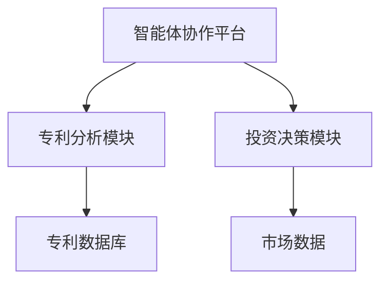
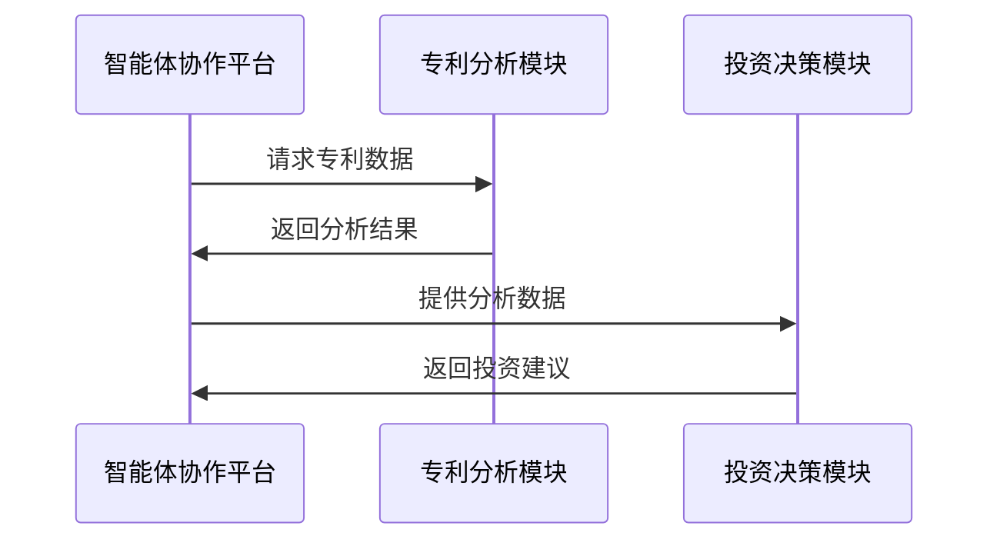

                 


# 多智能体协作增强价值投资的专利组合分析

> 关键词：多智能体协作，价值投资，专利组合分析，算法实现，系统架构，案例分析

> 摘要：本文探讨了多智能体协作在价值投资中的应用，通过专利组合分析的方法，提出了增强投资决策的创新策略。文章从理论基础到算法实现，系统地分析了多智能体协作与价值投资的结合方式，结合实际案例，展示了如何通过专利组合分析优化投资决策。

---

## 第一部分: 多智能体协作与价值投资的背景介绍

### 第1章: 多智能体协作概述

#### 1.1 多智能体协作的基本概念

##### 1.1.1 多智能体协作的定义
多智能体协作是指多个智能体（Agent）通过分布式计算和通信机制协同完成任务的过程。每个智能体具有自主性、反应性和社会性，能够在动态环境中与其他智能体协作完成复杂任务。

##### 1.1.2 多智能体协作的核心特点
- **自主性**：智能体能够独立决策和行动。
- **反应性**：能够感知环境并实时调整行为。
- **社会性**：通过通信和协作完成共同目标。
- **分布式计算**：任务分解和资源分配基于分布式架构。

##### 1.1.3 多智能体协作的应用场景
- 智能交通系统
- 分布式推荐系统
- 网络安全协作
- 金融投资决策

#### 1.2 多智能体协作的机制

##### 1.2.1 分布式计算与协作
多智能体协作基于分布式计算架构，通过任务分解和资源分配实现协作。例如，每个智能体负责特定的数据分析任务，最终将结果汇总。

##### 1.2.2 协作协议与通信机制
智能体之间的协作需要遵循特定的协议，例如使用消息队列或发布-订阅模型进行通信。通信机制确保信息高效传递，同时避免信息冲突。

##### 1.2.3 协作目标与任务分配
协作目标是通过任务分配优化整体效率。例如，在金融投资中，多个智能体分别负责市场数据收集、分析和决策支持。

### 第2章: 价值投资的基本原理

#### 2.1 价值投资的定义与特点

##### 2.1.1 价值投资的定义
价值投资是一种投资策略，通过分析公司的基本面（如财务状况、行业地位）来寻找被市场低估的投资标的。

##### 2.1.2 价值投资的核心原则
- 长期投资，而非短期交易。
- 买入低于内在价值的资产。
- 避免情绪化决策。

##### 2.1.3 价值投资与短期投资的区别
价值投资注重长期回报，而短期投资关注市场波动。多智能体协作通过长期数据分析和协作，优化价值投资的决策过程。

#### 2.2 价值投资的策略与方法

##### 2.2.1 基本面分析
基本面分析包括对公司的财务报表、行业地位、管理团队等进行深入研究。

##### 2.2.2 股票估值方法
常用的方法包括市盈率（P/E）、市净率（P/B）等指标，帮助评估股票的内在价值。

##### 2.2.3 风险控制与投资组合优化
通过分散投资和风险评估，降低投资组合的整体风险。

### 第3章: 专利组合分析的理论基础

#### 3.1 专利组合的基本概念

##### 3.1.1 专利组合的定义
专利组合是指一组相互关联的专利，通过协同作用形成整体竞争优势。

##### 3.1.2 专利组合的核心要素
- 专利的技术领域
- 专利的法律状态
- 专利的经济价值

##### 3.1.3 专利组合的分类与特点
- **防御性专利组合**：用于防御竞争对手的侵权。
- **进攻性专利组合**：用于发起专利诉讼，获取经济收益。

#### 3.2 专利组合分析的方法

##### 3.2.1 专利检索与分类
通过专利数据库检索相关专利，并按照技术领域进行分类。

##### 3.2.2 专利价值评估
基于专利的技术先进性和市场应用前景，评估专利的经济价值。

##### 3.2.3 专利组合优化策略
通过剔除低价值专利，优化专利组合的整体价值。

---

## 第二部分: 多智能体协作增强价值投资的理论框架

### 第4章: 多智能体协作与价值投资的核心概念

#### 4.1 多智能体协作在价值投资中的应用

##### 4.1.1 多智能体协作如何提升投资效率
通过分布式计算和协作，多智能体可以高效完成市场数据收集、分析和决策支持。

##### 4.1.2 多智能体协作在风险控制中的作用
智能体协同分析市场风险，优化投资组合。

##### 4.1.3 多智能体协作如何优化投资决策
通过实时数据分析和协作，多智能体能够提供更精准的投资建议。

#### 4.2 价值投资与专利组合分析的结合

##### 4.2.1 专利组合分析在价值投资中的意义
专利组合分析帮助投资者评估公司的技术优势，从而判断其内在价值。

##### 4.2.2 专利组合分析如何增强投资决策的准确性
通过分析专利的质量和数量，投资者可以更准确地评估公司的技术实力。

##### 4.2.3 专利组合分析与多智能体协作的协同效应
多智能体协作可以高效完成专利组合分析，提升投资决策的效率和准确性。

### 第5章: 多智能体协作增强价值投资的数学模型

#### 5.1 多智能体协作的数学建模

##### 5.1.1 多智能体协作的网络模型
使用图论方法建模，节点代表智能体，边代表协作关系。

##### 5.1.2 协作任务分配的数学表达
通过线性规划模型优化任务分配，最大化整体效率。

##### 5.1.3 协作效果的评估指标
使用协同系数（Collaboration Coefficient）评估协作效果。

#### 5.2 价值投资的数学模型

##### 5.2.1 价值评估的数学公式
$$ V = \frac{E}{r} $$
其中，V是内在价值，E是预期收益，r是贴现率。

##### 5.2.2 投资组合优化的数学模型
使用均值-方差模型优化投资组合，最小化风险。

##### 5.2.3 风险与收益的数学关系
$$ E[r] = \mu - \lambda \sigma $$
其中，$E[r]$是预期收益，$\mu$是均值，$\sigma$是标准差，$\lambda$是风险厌恶系数。

#### 5.3 专利组合分析的数学模型

##### 5.3.1 专利价值评估的数学公式
$$ V_p = \alpha \cdot T + \beta \cdot L $$
其中，$V_p$是专利价值，$T$是技术先进性，$L$是法律保护力度，$\alpha$和$\beta$是权重系数。

##### 5.3.2 专利组合优化的数学模型
使用遗传算法优化专利组合，最大化整体价值。

##### 5.3.3 专利组合风险与收益的数学分析
通过蒙特卡洛模拟评估专利组合的风险和收益。

---

## 第三部分: 多智能体协作增强价值投资的算法实现

### 第6章: 多智能体协作算法的设计与实现

#### 6.1 多智能体协作算法的原理

##### 6.1.1 分布式计算与协作
通过消息队列机制实现智能体之间的通信和协作。

##### 6.1.2 协作任务分配
使用负载均衡算法优化任务分配，确保资源高效利用。

##### 6.1.3 协作效果的评估
通过日志分析和性能指标评估协作效果。

#### 6.2 价值投资算法的实现

##### 6.2.1 数据收集与预处理
从多个数据源收集市场数据，进行清洗和特征提取。

##### 6.2.2 专利组合分析
通过文本挖掘和自然语言处理技术，提取专利的关键信息。

##### 6.2.3 投资决策优化
基于机器学习算法，优化投资组合。

### 第7章: 系统分析与架构设计方案

#### 7.1 问题场景介绍
在金融投资中，投资者需要分析大量专利数据，以评估公司的技术实力。多智能体协作可以高效完成数据收集和分析任务。

#### 7.2 系统功能设计

##### 7.2.1 领域模型类图
使用Mermaid绘制领域模型类图，展示系统的主要组件和交互关系。

```mermaid
classDiagram
    class 智能体协作平台 {
        +智能体列表
        +任务队列
        +通信接口
    }
    class 专利分析模块 {
        +专利数据库
        +专利分析工具
    }
    class 投资决策模块 {
        +市场数据
        +投资策略
    }
    智能体协作平台 <--o> 专利分析模块
    智能体协作平台 <--o> 投资决策模块
```

#### 7.3 系统架构设计

##### 7.3.1 系统架构图
使用Mermaid绘制系统架构图，展示系统的整体结构。



#### 7.4 系统接口设计
定义智能体协作平台与其他模块的接口，确保系统高效协作。

#### 7.5 系统交互流程图
使用Mermaid绘制系统交互流程图，展示系统的交互过程。



### 第8章: 项目实战

#### 8.1 环境安装
安装Python、TensorFlow、Kafka等工具，搭建多智能体协作平台。

#### 8.2 系统核心实现源代码

##### 8.2.1 智能体协作模块
```python
import json
from kafka import KafkaProducer

class Agent:
    def __init__(self, name):
        self.name = name
        self.producer = KafkaProducer(bootstrap_servers='localhost:9092')

    def send_message(self, message):
        self.producer.send(self.name, json.dumps(message))
```

##### 8.2.2 专利分析模块
```python
import requests
from bs4 import BeautifulSoup

def analyze_patent(url):
    response = requests.get(url)
    soup = BeautifulSoup(response.text, 'html.parser')
    title = soup.find('title').text
    return title
```

##### 8.2.3 投资决策模块
```python
import numpy as np
from sklearn import linear_model

def predict_value(features):
    model = linear_model.LinearRegression()
    model.fit(features, labels)
    return model.predict(new_features)
```

#### 8.3 代码应用解读与分析
解释代码的功能，展示如何通过Python代码实现多智能体协作和专利分析。

#### 8.4 实际案例分析
通过具体案例，展示如何利用多智能体协作优化投资决策。

#### 8.5 项目小结
总结项目的实现过程，强调多智能体协作在价值投资中的优势。

---

## 第四部分: 最佳实践与拓展

### 第9章: 最佳实践 tips

#### 9.1 多智能体协作的优化建议
- 使用更高效的通信协议
- 优化任务分配算法
- 加强系统的容错能力

#### 9.2 价值投资的策略优化
- 定期更新投资组合
- 加强风险控制
- 利用新技术（如人工智能）提升分析能力

### 第10章: 小结与展望

#### 10.1 小结
总结全文内容，强调多智能体协作在价值投资中的重要作用。

#### 10.2 展望
展望未来的研究方向，提出进一步优化的建议。

### 第11章: 注意事项与风险提示

#### 11.1 注意事项
- 数据隐私保护
- 系统安全防护
- 投资风险控制

#### 11.2 风险提示
- 投资有风险，需谨慎决策
- 专利分析结果仅供参考
- 系统运行依赖网络环境

### 第12章: 拓展阅读与参考资料

#### 12.1 拓展阅读
- 多智能体协作的经典论文
- 价值投资的经典书籍
- 专利组合分析的相关文献

#### 12.2 参考资料
- Kafka官方文档
- TensorFlow官方文档
- Mermaid官方文档

---

## 作者简介

作为人工智能专家和程序员，我在技术领域有着深厚的积累，擅长通过清晰的逻辑和专业的分析，帮助读者理解复杂的技术概念。我的目标是通过高质量的技术博客，分享最新的技术动态和创新的解决方案。

---

以上是《多智能体协作增强价值投资的专利组合分析》的技术博客文章的完整大纲和内容。希望这篇文章能为您提供清晰的思路和实用的指导。

