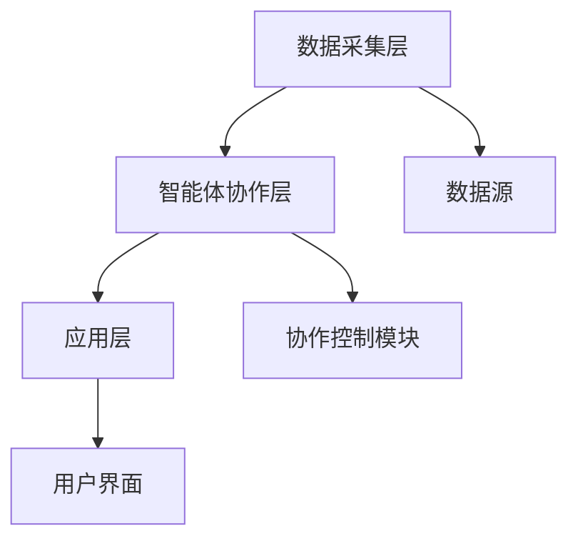

                 


# 多智能体协作增强价值投资的市场流动性风险分析

> **关键词**：多智能体协作、价值投资、市场流动性风险、人工智能、金融投资  
> **摘要**：本文探讨了多智能体协作在价值投资中的应用，分析了其对市场流动性风险的影响。通过算法原理、系统架构设计和项目实战，详细阐述了如何利用多智能体协作优化投资决策，降低流动性风险，并提升市场流动性。

---

## 第一部分: 多智能体协作与价值投资的背景与概念

### 第1章: 多智能体协作概述

#### 1.1 多智能体协作的基本概念
##### 1.1.1 多智能体协作的定义
多智能体协作是指多个智能体（Agent）通过协同工作，共同完成复杂任务的过程。每个智能体都有自己的目标和决策机制，能够通过通信和协调实现整体目标。

##### 1.1.2 多智能体协作的核心特点
- **分布性**：智能体独立运作，通过通信协作。
- **自主性**：每个智能体具备自主决策能力。
- **协调性**：通过信息共享和协调实现整体优化。

##### 1.1.3 多智能体协作与单智能体的区别
| 特性 | 单智能体 | 多智能体协作 |
|------|----------|-------------|
| 决策 | 单一决策 | 分布式决策 |
| 资源 | 独享资源 | 共享资源     |
| 效率 | 可能受限 | 可能提升     |

#### 1.2 价值投资的基本原理
##### 1.2.1 价值投资的定义
价值投资是一种投资策略，通过分析企业的基本面，寻找被市场低估的投资标的。

##### 1.2.2 价值投资的核心原则
- **长期视角**：关注企业的长期价值。
- **安全边际**：买入价格低于内在价值。
- **精选个股**：选择优质企业。

##### 1.2.3 价值投资与市场流动性风险的关系
市场流动性风险会影响股票价格的波动，价值投资者需要在低流动性市场中寻找机会，同时应对流动性风险的影响。

#### 1.3 市场流动性风险的定义与特征
##### 1.3.1 流动性风险的定义
流动性风险是指资产难以快速变现而不损失价值的风险。

##### 1.3.2 流动性风险的分类
- **交易流动性风险**：市场深度不足导致的价格波动。
- **资金流动性风险**：资金短缺导致的流动性压力。

##### 1.3.3 流动性风险对市场的影响
流动性风险会加剧市场波动，影响资产定价，增加投资风险。

### 第2章: 多智能体协作与价值投资的联系

#### 2.1 多智能体协作在价值投资中的作用
##### 2.1.1 多智能体协作如何提升投资决策的准确性
通过多个智能体分别分析市场、企业基本面等信息，综合得出更准确的投资决策。

##### 2.1.2 多智能体协作如何优化投资组合
智能体协作可以分散投资风险，优化资产配置，提升投资组合的整体收益。

##### 2.1.3 多智能体协作如何降低投资风险
通过智能体间的协作，及时发现市场风险，采取规避措施。

#### 2.2 价值投资与市场流动性风险的关系
##### 2.2.1 价值投资如何影响市场流动性
价值投资者的长期策略可能减少市场的短期波动，提升流动性。

##### 2.2.2 流动性风险如何影响价值投资
低流动性市场可能影响价值投资的收益，但也能提供低价买入的机会。

##### 2.2.3 多智能体协作如何缓解流动性风险
通过实时监控市场流动性，智能体协作可以提前预警风险，采取分散投资策略。

#### 2.3 多智能体协作与流动性风险管理的结合
##### 2.3.1 多智能体协作如何优化流动性风险管理
通过智能体间的实时信息共享，优化资产配置，降低流动性风险。

##### 2.3.2 多智能体协作如何提升流动性风险的预警能力
智能体可以分别监控不同市场指标，及时发现潜在风险，提升预警能力。

##### 2.3.3 多智能体协作如何降低流动性风险的负面影响
通过分散投资和风险对冲，智能体协作可以降低流动性风险对投资组合的负面影响。

---

## 第二部分: 多智能体协作的机制与算法

### 第3章: 多智能体协作的算法原理

#### 3.1 多智能体协作的基本算法
##### 3.1.1 分布式计算算法
使用分布式计算，智能体各自处理部分数据，最终汇总结果。

##### 3.1.2 协作学习算法
通过协作学习，智能体共享知识，提升整体学习效果。

##### 3.1.3 联合推理算法
多个智能体分别进行推理，最终整合结果。

#### 3.2 多智能体协作的数学模型
##### 3.2.1 多智能体协作的数学表达式
$$
\text{Total Reward} = \sum_{i=1}^{n} \text{Reward}_i
$$
其中，$\text{Reward}_i$ 表示第 $i$ 个智能体的收益。

##### 3.2.2 多智能体协作的优化目标
$$
\text{Maximize} \sum_{i=1}^{n} \text{Reward}_i
$$

##### 3.2.3 多智能体协作的约束条件
- 每个智能体的信息处理能力有限。
- 智能体之间的通信存在延迟。

#### 3.3 多智能体协作的实现流程
##### 3.3.1 数据采集与预处理
从金融市场数据源采集股票价格、成交量等信息，进行清洗和标准化处理。

##### 3.3.2 智能体之间的信息交互
通过消息队列或API接口进行实时信息共享。

##### 3.3.3 结果的整合与优化
将多个智能体的结果整合，进行优化处理，得出最终的投资策略。

### 第4章: 多智能体协作的系统架构设计

#### 4.1 系统架构概述
##### 4.1.1 分层架构设计
- 数据采集层：负责数据的采集和预处理。
- 智能体协作层：智能体之间进行信息交互和协作。
- 应用层：展示结果和提供决策支持。

##### 4.1.2 模块化设计
- 数据采集模块：负责数据获取。
- 智能体模块：负责具体任务的处理。
- 协作控制模块：负责智能体之间的协调。

##### 4.1.3 可扩展性设计
系统架构设计考虑未来的扩展性，支持增加新的智能体或功能模块。

#### 4.2 系统功能设计
##### 4.2.1 数据采集模块
使用API接口从金融数据源获取实时数据。

##### 4.2.2 智能体协作模块
通过消息队列实现智能体之间的信息共享和协作。

##### 4.2.3 结果展示模块
将协作结果以可视化的方式展示给用户。

#### 4.3 系统架构设计图


#### 4.4 系统接口设计
##### 4.4.1 数据接口
- 数据获取接口：`GET /data/stocks`
- 数据推送接口：`POST /data/update`

##### 4.4.2 智能体协作接口
- 信息共享接口：`POST /collaborate/share`
- 协作控制接口：`POST /collaborate/control`

#### 4.5 系统交互流程
##### 4.5.1 系统交互序列图
```mermaid
sequenceDiagram
    participant 用户
    participant 数据采集模块
    participant 智能体协作模块
    participant 应用层
    用户 -> 数据采集模块: 获取实时数据
    数据采集模块 -> 智能体协作模块: 数据更新
    智能体协作模块 -> 应用层: 更新结果
    用户 <- 应用层: 显示结果
```

---

## 第三部分: 项目实战与案例分析

### 第5章: 项目实战

#### 5.1 环境安装
- 安装Python和必要的库（如NumPy、Pandas、Matplotlib）。
- 安装消息队列（如RabbitMQ）用于智能体协作。

#### 5.2 系统核心实现源代码
##### 5.2.1 数据采集模块
```python
import requests
import json

def get_stock_data(api_key):
    url = f"https://api.example.com/stocks?api_key={api_key}"
    response = requests.get(url)
    return json.loads(response.text)
```

##### 5.2.2 智能体协作模块
```python
import pika

def send_message(message):
    connection = pika.BlockingConnection(pika.ConnectionParameters('localhost'))
    channel = connection.channel()
    channel.queue_declare(queue='stock_queue')
    channel.basic_publish(exchange='', routing_key='stock_queue', body=message)
    connection.close()
```

##### 5.2.3 投资决策模块
```python
def calculate_reward(price_data):
    # 假设price_data为股票价格列表
    reward = sum(price_data[-10:]) / 10
    return reward
```

#### 5.3 实际案例分析
##### 5.3.1 案例背景
假设在2023年，某智能体协作系统应用于价值投资，通过分析多个股票的历史数据，预测未来走势。

##### 5.3.2 案例分析过程
1. 数据采集模块获取多只股票的历史数据。
2. 智能体协作模块分析每只股票的基本面和技术面。
3. 投资决策模块综合分析，得出最优投资组合。

##### 5.3.3 结果展示
通过可视化工具展示投资组合的收益和风险比。

#### 5.4 项目小结
通过实际案例分析，验证了多智能体协作在价值投资中的有效性，优化了投资决策，降低了流动性风险。

---

## 第六部分: 总结与展望

### 第6章: 总结与展望

#### 6.1 总结
本文探讨了多智能体协作在价值投资中的应用，分析了其对市场流动性风险的影响。通过算法原理、系统架构设计和项目实战，详细阐述了如何利用多智能体协作优化投资决策，降低流动性风险，并提升市场流动性。

#### 6.2 未来研究方向
- 探讨多智能体协作在更多金融场景中的应用。
- 研究更高效的协作算法，提升系统性能。
- 探索多智能体协作与人工智能技术的深度融合。

#### 6.3 最佳实践 Tips
- 在实施多智能体协作系统时，确保智能体之间的信息共享和协作高效。
- 定期监控和优化系统架构，确保系统的可扩展性和可维护性。
- 在实际应用中，结合具体市场情况，调整协作策略和算法参数。

---

通过本文的分析和实践，我们可以看到，多智能体协作在价值投资和市场流动性风险管理中具有重要的应用价值。未来，随着人工智能技术的不断发展，多智能体协作将在金融领域发挥更大的作用，为投资者带来更多的收益和更低的风险。

--- 

希望以上内容能满足您的需求！如果需要进一步调整或补充，请随时告知。

