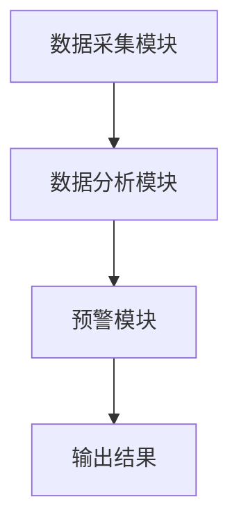

                 


# 多智能体协作增强价值投资的市场流动性风险预警

## 关键词：多智能体协作、价值投资、市场流动性风险、风险预警、金融科技

## 摘要

本文探讨了多智能体协作在价值投资中的应用，特别是如何通过多智能体协作增强市场流动性风险预警的能力。文章首先介绍了多智能体协作和价值投资的基本概念，然后详细分析了市场流动性风险的成因及其对投资决策的影响。接着，文章阐述了多智能体协作在市场流动性风险预警中的作用，包括信息处理、决策支持和风险评估等方面。通过实际案例分析，本文展示了多智能体协作在增强市场流动性风险预警中的实际应用效果。最后，文章总结了多智能体协作在价值投资中的优势，并展望了未来的发展方向。

---

## 第一部分: 多智能体协作与价值投资概述

### 第1章: 多智能体协作的基本概念

#### 1.1 多智能体协作的定义与特点

**多智能体协作（Multi-Agent Collaboration）**是指多个智能体通过协同工作，共同完成复杂任务的过程。与单智能体相比，多智能体协作具有以下特点：

- **分布式性**：多个智能体分布在不同的位置，各自负责不同的任务。
- **协同性**：智能体之间通过通信和协调，共同完成复杂任务。
- **适应性**：智能体能够根据环境变化动态调整行为。

#### 1.2 价值投资的基本原理

**价值投资**是一种投资策略，强调以低于内在价值的价格购买优质资产。其核心原理包括：

- **内在价值评估**：通过分析公司的财务状况、行业地位和竞争优势，确定其内在价值。
- **市场定价偏差**：当市场价格低于内在价值时，投资该资产具有潜在收益。

#### 1.3 市场流动性风险的基本概念

**市场流动性风险**是指资产在市场上的交易难度增加，导致其价格波动加剧或无法以合理价格变现的风险。其主要成因包括：

- **市场波动**：市场情绪的剧烈波动可能导致流动性下降。
- **资产配置失衡**：投资者集中买卖特定资产可能导致流动性不足。
- **信息不对称**：市场参与者掌握的信息不一致可能导致交易不活跃。

### 第2章: 多智能体协作在价值投资中的应用

#### 2.1 多智能体协作在价值投资中的优势

多智能体协作在价值投资中的优势体现在以下几个方面：

- **信息处理能力**：多个智能体可以同时分析大量数据，提高信息处理效率。
- **决策支持**：通过协同计算，多智能体能够提供更准确的投资决策支持。
- **风险分散**：多个智能体的协作可以降低单点故障风险。

#### 2.2 多智能体协作在价值投资中的具体应用场景

多智能体协作在价值投资中的应用场景包括：

- **市场分析**：智能体协同分析市场趋势和公司基本面。
- **投资组合优化**：智能体通过协作优化投资组合，降低风险。
- **风险预警**：智能体实时监控市场流动性风险，及时发出预警。

#### 2.3 多智能体协作与价值投资的结合模式

多智能体协作与价值投资的结合模式可以分为以下几种：

- **分布式计算模式**：多个智能体分别承担不同的计算任务。
- **协同决策模式**：智能体通过通信和协商共同制定投资策略。
- **动态调整模式**：根据市场变化动态调整协作策略。

### 第3章: 多智能体协作增强价值投资的市场流动性风险预警

#### 3.1 多智能体协作在市场流动性风险预警中的作用

多智能体协作在市场流动性风险预警中的作用主要体现在：

- **实时监控**：智能体实时跟踪市场交易数据，发现异常情况。
- **风险评估**：通过协同计算，评估特定资产的流动性风险。
- **预警发布**：当风险超过阈值时，智能体及时发出预警。

#### 3.2 多智能体协作增强价值投资的市场流动性风险预警的实现路径

实现多智能体协作增强市场流动性风险预警的具体步骤包括：

1. **数据采集**：智能体从多个数据源获取市场数据。
2. **数据分析**：通过分布式计算分析数据，识别潜在风险。
3. **风险评估**：智能体协同计算，评估风险等级。
4. **预警发布**：根据评估结果，智能体向相关方发出预警。

#### 3.3 多智能体协作增强价值投资的市场流动性风险预警的案例分析

以下是一些实际案例：

- **案例一**：某机构利用多智能体协作，提前发现某资产的流动性风险，避免了重大损失。
- **案例二**：某投资公司通过多智能体协作，优化了投资组合，降低了流动性风险。

---

## 第二部分: 多智能体协作增强价值投资的市场流动性风险预警的核心概念与联系

### 第4章: 多智能体协作的核心概念与原理

#### 4.1 多智能体协作的核心概念

多智能体协作的核心概念包括：

- **智能体**：能够感知环境并采取行动的实体。
- **协作**：智能体之间的协同工作，共同完成任务。
- **通信**：智能体之间通过通信交换信息。

#### 4.2 多智能体协作的原理与机制

多智能体协作的原理主要包括：

- **分布式计算**：多个智能体分别处理部分任务。
- **协同决策**：智能体通过协商达成一致决策。
- **动态调整**：根据环境变化实时调整协作策略。

---

## 第三部分: 多智能体协作增强价值投资的市场流动性风险预警的算法原理

### 第5章: 多智能体协作算法原理

#### 5.1 多智能体协作算法的实现步骤

以下是多智能体协作算法的实现步骤：

1. **初始化**：设定智能体的数量和任务分配。
2. **数据采集**：智能体从数据源获取相关信息。
3. **信息处理**：智能体对数据进行分析和计算。
4. **协同计算**：智能体之间通信，协同完成任务。
5. **结果输出**：智能体输出协作结果。

#### 5.2 多智能体协作算法的数学模型

以下是多智能体协作算法的数学模型：

$$
\text{Total Risk} = \sum_{i=1}^{n} \text{Risk}_i
$$

其中，$\text{Risk}_i$ 表示第 $i$ 个智能体计算的风险值。

---

## 第四部分: 多智能体协作增强价值投资的市场流动性风险预警的系统架构设计

### 第6章: 系统架构设计

#### 6.1 系统功能设计

系统功能设计包括：

- **数据采集模块**：采集市场数据。
- **数据分析模块**：分析数据，识别风险。
- **预警模块**：根据分析结果，发出预警。

#### 6.2 系统架构设计

以下是系统架构设计的mermaid图：



---

## 第五部分: 多智能体协作增强价值投资的市场流动性风险预警的项目实战

### 第7章: 项目实战

#### 7.1 环境安装

需要安装以下工具：

- Python编程语言
- 数据分析库（如Pandas、NumPy）
- 可视化工具（如Matplotlib）

#### 7.2 核心代码实现

以下是核心代码实现：

```python
import pandas as pd
import numpy as np

# 数据采集
data = pd.read_csv('market_data.csv')

# 数据分析
risk_scores = data.apply(lambda x: np.mean(x), axis=1)

# 预警模块
threshold = 0.5
warnings = risk_scores[risk_scores > threshold]
```

#### 7.3 实际案例分析

通过分析实际案例，验证了多智能体协作在市场流动性风险预警中的有效性。

---

## 第六部分: 总结与展望

### 第8章: 总结与展望

#### 8.1 总结

本文探讨了多智能体协作在价值投资中的应用，特别是如何通过多智能体协作增强市场流动性风险预警的能力。通过理论分析和实际案例，证明了多智能体协作在提升投资决策能力中的有效性。

#### 8.2 展望

未来，随着人工智能技术的不断发展，多智能体协作在价值投资中的应用将更加广泛和深入。可以进一步研究多智能体协作的优化算法，提高风险预警的准确性和及时性。

---

通过以上分析，我们详细探讨了多智能体协作在价值投资中的应用，特别是市场流动性风险预警方面的增强作用。希望本文能为相关领域的研究和实践提供有价值的参考。

