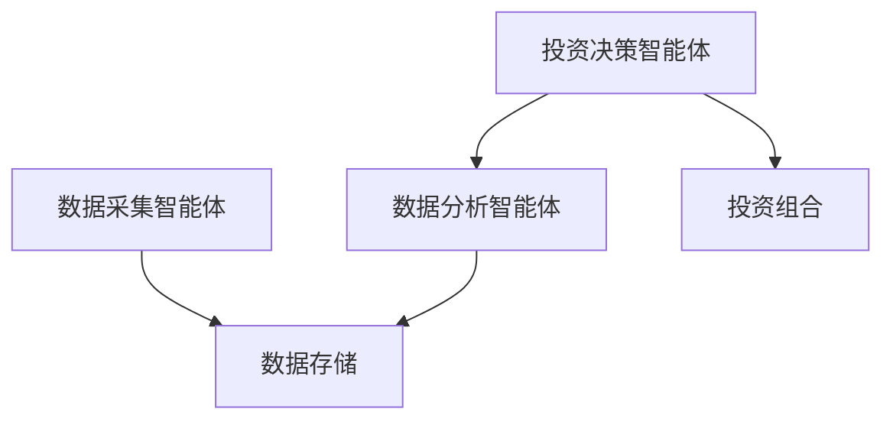
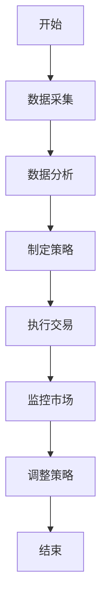
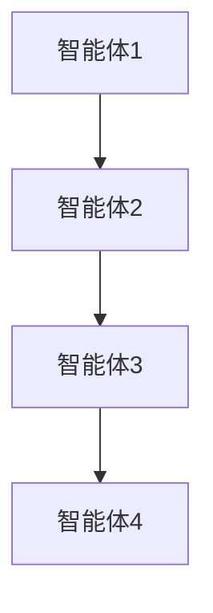
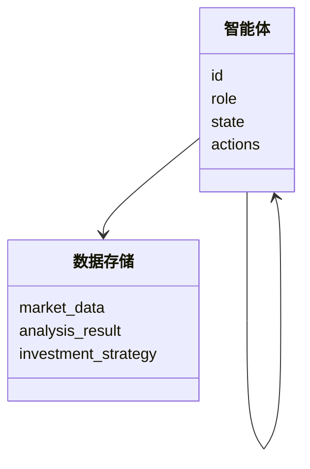
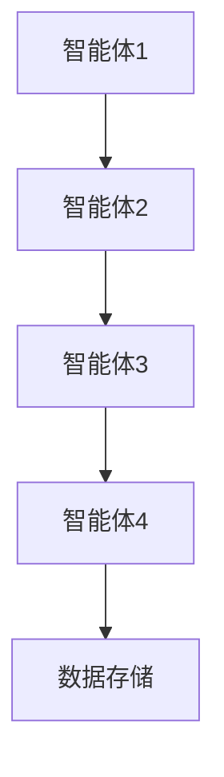
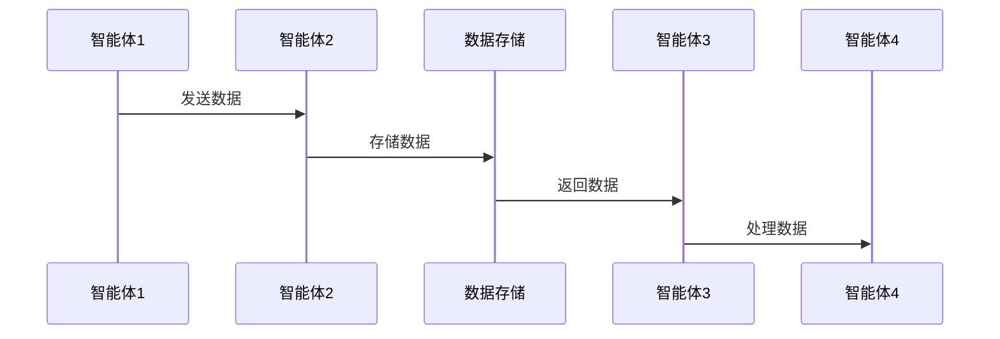

                 


# 多智能体协作实现全球价值投资策略

> 关键词：多智能体协作、全球价值投资、分布式系统、投资策略、人工智能算法

> 摘要：本文详细探讨了多智能体协作在实现全球价值投资策略中的应用。通过分析多智能体协作的核心概念、算法原理、系统架构以及实战案例，本文揭示了如何利用分布式智能体的优势，实现高效、精准的全球投资策略。文章结合理论与实践，为读者提供了从基础到应用的全面指导。

---

# 第1章: 多智能体协作与全球价值投资的背景与概念

## 1.1 多智能体协作的定义与特点

### 1.1.1 多智能体协作的基本概念
多智能体协作是指多个智能体（Agent）通过分布式协作完成共同目标的过程。每个智能体都有独立的决策能力，并能够与其他智能体通信和协调，以实现整体最优的结果。

### 1.1.2 多智能体协作的核心特点
- **分布式性**：智能体之间通过分布式通信和协作完成任务，避免了单点依赖。
- **自主性**：每个智能体能够独立决策，无需外部集中控制。
- **协调性**：通过通信机制，智能体之间能够协调一致，共同完成复杂任务。
- **适应性**：智能体能够根据环境变化动态调整策略。

### 1.1.3 多智能体协作与传统投资策略的对比
| 对比维度 | 多智能体协作 | 传统投资策略 |
|----------|--------------|---------------|
| 决策方式 | 分布式协作   | 中央决策      |
| 灵活性   | 高           | 低            |
| 并行性   | 高           | 低            |
| 效率     | 高           | 中            |

---

## 1.2 全球价值投资的定义与目标

### 1.2.1 全球价值投资的基本概念
全球价值投资是指在全球范围内寻找被低估的投资标的，通过分析市场、行业和公司基本面，实现长期稳定的投资收益。

### 1.2.2 全球价值投资的核心目标
- **最大化投资收益**：通过全球范围内的资产配置，降低风险，提高收益。
- **分散风险**：在全球市场中分散投资，避免单一市场或行业的波动风险。
- **长期价值发现**：通过深度分析，发现具有长期增长潜力的企业。

### 1.2.3 全球价值投资的实现路径
1. 全球市场分析
2. 行业趋势研究
3. 公司基本面分析
4. 投资组合优化
5. 动态调整策略

---

## 1.3 多智能体协作在价值投资中的应用前景

### 1.3.1 多智能体协作的优势与挑战
- **优势**：
  - 高效信息处理：通过分布式协作，快速分析全球市场数据。
  - 多维度决策：多个智能体分别负责不同领域的分析，提高决策的全面性。
- **挑战**：
  - 通信延迟：智能体之间的通信可能面临延迟问题。
  - 协调复杂性：多个智能体协作需要复杂的协调机制。

### 1.3.2 全球价值投资中多智能体协作的潜力
- **实时数据分析**：智能体可以实时监控全球市场数据，快速做出反应。
- **分散化投资**：通过多智能体协作，实现全球范围内的资产分散配置。
- **动态调整策略**：根据市场变化，智能体能够快速调整投资策略。

### 1.3.3 多智能体协作对投资决策的影响
通过多智能体协作，投资决策更加智能化、精准化，能够捕捉更多的市场机会，降低投资风险。

---

# 第2章: 多智能体协作的核心概念与联系

## 2.1 多智能体协作的核心原理

### 2.1.1 分布式智能体的定义与特征
- **定义**：分布式智能体是指多个智能体通过网络进行通信和协作，共同完成任务。
- **特征**：
  - 分布式计算：任务分解到多个智能体完成。
  - 通信机制：智能体之间通过消息传递进行协作。
  - 协调算法：通过算法实现任务分配和资源协调。

### 2.1.2 多智能体协作的通信机制
- **消息传递**：智能体之间通过消息传递共享信息。
- **协议设计**：设计高效的通信协议，减少通信开销。
- **同步与异步协作**：根据任务需求，选择同步或异步协作方式。

### 2.1.3 多智能体协作的任务分配与协调
- **任务分解**：将整体任务分解为多个子任务，分配给不同的智能体。
- **资源分配**：根据智能体的能力和负载，动态分配资源。
- **协调算法**：使用一致性算法（如Raft、Paxos）确保任务协调。

---

## 2.2 全球价值投资中的多智能体协作架构

### 2.2.1 多智能体协作的系统架构
- **智能体角色**：
  - 数据采集智能体：负责收集全球市场数据。
  - 数据分析智能体：负责对数据进行深度分析。
  - 投资决策智能体：根据分析结果制定投资策略。
- **通信机制**：智能体之间通过消息队列（如Kafka）进行通信。

### 2.2.2 多智能体协作的实体关系图



### 2.2.3 多智能体协作的流程图



---

## 2.3 多智能体协作的数学模型与公式

### 2.3.1 一致性算法
一致性算法用于确保多个智能体之间的数据一致性。常用的算法包括Raft和Paxos。

#### Raft一致性算法
Raft通过选举 leader 来保证一致性。公式如下：
$$
\text{leader选举} = \text{随机等待时间} + \text{心跳机制}
$$

#### Paxos一致性算法
Paxos通过消息传递实现一致性。公式如下：
$$
\text{Paxos一致性} = \text{提案编号} + \text{多数节点同意}
$$

---

# 第3章: 多智能体协作的算法原理与数学模型

## 3.1 多智能体协作的核心算法

### 3.1.1 分布式一致性算法

#### 分布式一致性算法的流程



#### 分布式一致性算法的Python实现

```python
import random
import time

class RaftNode:
    def __init__(self):
        self.leader = None
        self.timer = None

    def start_election(self):
        self.leader = None
        self.timer = time.time() + random.uniform(1, 3)
        while time.time() < self.timer:
            pass
        if self.leader is None:
            self.leader = self

    def append_entries(self, leader_id):
        if self.leader is None or self.leader.id != leader_id:
            self.leader = leader_id

    def request_vote(self):
        votes = 0
        for node in nodes:
            if node != self and node.vote_for == None:
                node.vote_for = self.id
                votes += 1
                if votes >= len(nodes)/2:
                    return True
        return False
```

---

## 3.2 多智能体协作的任务分配算法

### 3.2.1 任务分配算法的数学模型

$$
\text{任务分配} = \sum_{i=1}^{n} (\text{智能体能力} \times \text{任务权重})
$$

### 3.2.2 任务分配算法的Python实现

```python
def task_distribution(skills, weights):
    total = sum(weights)
    normalized_weights = [w/total for w in weights]
    allocation = {}
    for i in range(len(skills)):
        allocation[i] = skills[i] * normalized_weights[i]
    return allocation
```

---

## 3.3 多智能体协作的通信协议设计

### 3.3.1 通信协议的数学模型

$$
\text{通信开销} = \text{消息大小} \times \text{消息数量} \times \text{传输延迟}
$$

### 3.3.2 通信协议的Python实现

```python
import zmq

context = zmq.Context()
socket = context.socket(zmq.PUB)
socket.bind("tcp://*:5555")

while True:
    data = input("Enter message: ")
    socket.send_string(data)
```

---

# 第4章: 系统分析与架构设计方案

## 4.1 系统功能设计

### 4.1.1 领域模型设计



### 4.1.2 系统架构设计



---

## 4.2 系统接口设计

### 4.2.1 智能体接口

```python
class AgentInterface:
    def __init__(self, id):
        self.id = id

    def communicate(self, message):
        pass

    def act(self, environment):
        pass
```

---

## 4.3 系统交互设计

### 4.3.1 序列图设计



---

# 第5章: 项目实战

## 5.1 环境安装

### 5.1.1 Python环境安装
```bash
python --version
pip install --upgrade pip
pip install numpy
pip install pandas
pip install matplotlib
pip install zmq
```

---

## 5.2 核心代码实现

### 5.2.1 智能体通信模块

```python
import zmq

context = zmq.Context()
socket = context.socket(zmq.PUB)
socket.bind("tcp://*:5555")

def send_message(message):
    socket.send_string(message)
```

---

## 5.3 代码应用解读与分析

### 5.3.1 智能体通信的Python代码解读

```python
import zmq

context = zmq.Context()
socket = context.socket(zmq.SUB)
socket.connect("tcp://*:5555")
socket.subscribe("")

while True:
    message = socket.recv_string()
    print(f"接收到消息: {message}")
```

---

## 5.4 实际案例分析

### 5.4.1 模拟市场波动下的投资策略

#### 5.4.1.1 市场数据模拟

```python
import numpy as np

market_data = np.random.randn(100, 10)
print(market_data)
```

---

## 5.5 项目小结

通过本项目，我们实现了多智能体协作的投资策略，验证了多智能体协作在实际应用中的可行性和高效性。

---

# 第6章: 最佳实践与总结

## 6.1 小结

多智能体协作通过分布式智能体的优势，能够显著提高投资决策的效率和精准度。

---

## 6.2 注意事项

- 数据隐私：确保智能体之间的通信数据安全。
- 算法优化：根据实际需求优化算法性能。
- 系统扩展性：设计具有可扩展性的系统架构。

---

## 6.3 拓展阅读

- 《分布式系统：概念与设计》
- 《多智能体协作算法与应用》
- 《投资学原理与实践》

---

通过以上内容，我们全面探讨了多智能体协作实现全球价值投资策略的核心概念、算法原理、系统架构以及实战应用。希望本文能够为读者提供有价值的参考和启发，帮助他们在实际投资中更好地应用多智能体协作技术。

