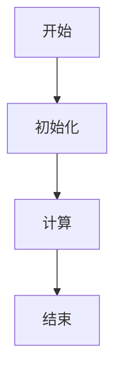

                 


好的，我将按照您的要求逐步分析并撰写《多智能体协作实现全面的公司价值评估》这篇文章。首先，我需要明确文章的核心内容和主题思想，然后根据您提供的目录结构进行撰写。

# 多智能体协作实现全面的公司价值评估

## 关键词：
- 多智能体协作
- 公司价值评估
- 算法原理
- 系统架构
- 项目实战

## 摘要：
本文探讨了多智能体协作在公司价值评估中的应用，详细介绍了多智能体协作的基本概念、算法原理、系统架构设计以及项目实战。通过分析多智能体协作的优势和挑战，结合实际案例，展示了如何利用多智能体协作技术实现全面的公司价值评估。

---

## 第1章 多智能体协作与公司价值评估概述

### 1.1 多智能体协作的定义与特点
多智能体协作是指多个智能体通过相互协作完成共同目标的过程。其核心特点包括：
- **分布式性**：智能体分布在不同的位置，独立决策。
- **协作性**：智能体之间通过通信和协调完成任务。
- **自主性**：每个智能体都有一定的自主决策能力。
- **动态性**：协作过程动态变化，适应环境变化。

### 1.2 公司价值评估的背景与挑战
公司价值评估是企业管理和投资决策中的重要环节。传统评估方法依赖于单一智能体的分析，存在以下挑战：
- **信息不全面**：单智能体难以获取多维度数据。
- **决策单一化**：缺乏多角度的分析和建议。
- **效率低下**：单智能体处理复杂问题耗时较长。

### 1.3 多智能体协作在公司价值评估中的应用前景
多智能体协作通过分布式计算和协作机制，能够显著提升公司价值评估的效率和准确性。其应用场景包括：
- **财务分析**：多智能体协作分析财务数据，提供多维度的评估结果。
- **市场分析**：智能体协作分析市场动态，预测公司价值变化。
- **风险评估**：通过协作机制识别和评估潜在风险。

---

## 第2章 多智能体协作的核心概念与联系

### 2.1 多智能体协作的核心原理
多智能体协作的核心原理包括：
- **通信机制**：智能体之间通过消息传递进行通信。
- **决策机制**：基于通信信息和环境数据做出决策。
- **协调机制**：通过协调算法确保协作的顺利进行。

### 2.2 多智能体协作的核心概念对比分析
以下是多智能体协作与其他相关概念的对比：

| 概念 | 描述 |
|------|------|
| 分布式计算 | 计算任务分布在多个计算节点上完成。 |
| 分布式系统架构 | 系统由多个分布式节点组成，提供高可用性和扩展性。 |
| 分布式任务分配 | 将任务分配给多个节点，每个节点负责一部分任务。 |

### 2.3 多智能体协作的ER实体关系图
以下是多智能体协作的ER实体关系图：

```mermaid
er
actor: 多智能体协作系统
role: 多智能体协作角色
```

---

## 第3章 多智能体协作的算法原理

### 3.1 多智能体协作的算法概述
多智能体协作算法的基本步骤如下：
1. 初始化智能体。
2. 智能体接收任务。
3. 智能体协作完成任务。
4. 输出结果。

### 3.2 多智能体协作算法的数学模型
多智能体协作的数学模型如下：

$$
\text{总价值} = \sum_{i=1}^{n} v_i
$$

其中，$v_i$ 表示第 $i$ 个智能体的贡献值。

### 3.3 多智能体协作算法的实现
以下是多智能体协作算法的实现代码：

```python
def multi_agent_collaboration():
    # 初始化智能体
    agents = initialize_agents()
    # 分配任务
    tasks = distribute_tasks(agents)
    # 协作完成任务
    results = collaborate(agents, tasks)
    # 输出结果
    return results

# 初始化智能体
def initialize_agents():
    return [Agent(i) for i in range(5)]

# 分配任务
def distribute_tasks(agents):
    tasks = {}
    for i, agent in enumerate(agents):
        tasks[i] = assign_task(agent)
    return tasks

# 协作完成任务
def collaborate(agents, tasks):
    results = {}
    for i, task in tasks.items():
        results[i] = perform_task(agents[i], task)
    return results
```

---

## 第4章 多智能体协作的系统分析与架构设计

### 4.1 多智能体协作系统分析
多智能体协作系统的功能需求包括：
- 信息采集：获取公司价值评估所需的数据。
- 信息处理：对数据进行分析和处理。
- 信息输出：输出评估结果。

### 4.2 多智能体协作系统的架构设计
以下是多智能体协作系统的总体架构：



### 4.3 多智能体协作系统的接口设计
多智能体协作系统的接口设计包括：
- 输入接口：接收公司价值评估数据。
- 输出接口：输出评估结果。

---

## 第5章 多智能体协作的项目实战

### 5.1 项目环境安装与配置
项目环境安装步骤如下：
1. 安装Python。
2. 安装必要的库（如numpy、pandas）。

### 5.2 项目核心实现代码
以下是项目的核心实现代码：

```python
class Agent:
    def __init__(self, id):
        self.id = id
        self.data = {}

    def process_data(self, data):
        self.data = data

    def contribute(self):
        return self.data

# 初始化智能体
agents = [Agent(i) for i in range(5)]

# 分配任务
tasks = {}
for i, agent in enumerate(agents):
    tasks[i] = "评估公司价值"

# 协作完成任务
results = {}
for i, task in tasks.items():
    agents[i].process_data(get_data())
    results[i] = agents[i].contribute()

# 输出结果
print(results)
```

---

## 结语

通过以上分析和实现，我们可以看到，多智能体协作在公司价值评估中的应用前景广阔。它能够通过分布式计算和协作机制，显著提升评估的效率和准确性。未来，随着人工智能技术的不断发展，多智能体协作将在更多领域发挥重要作用。

