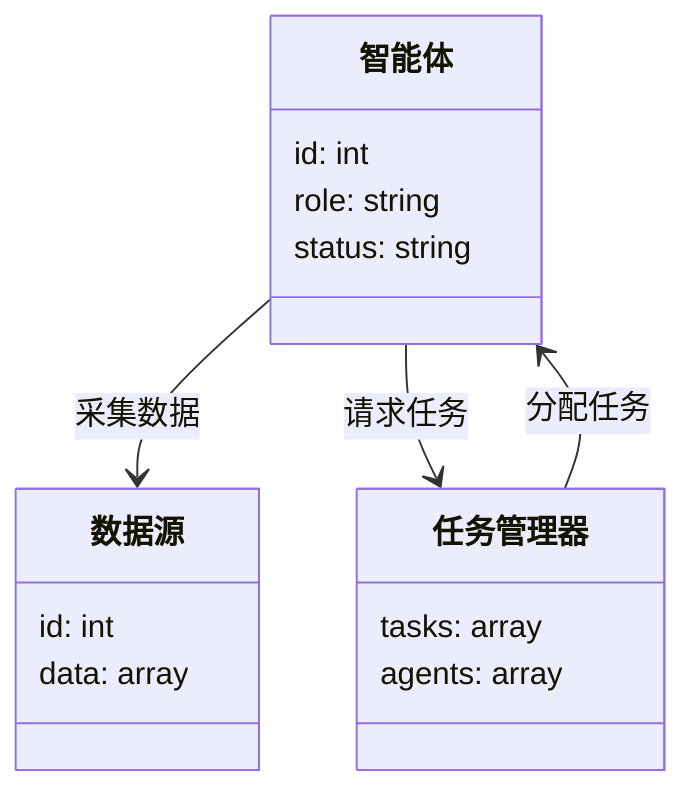
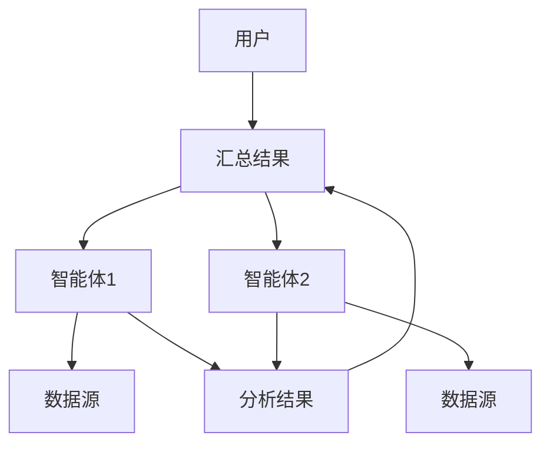
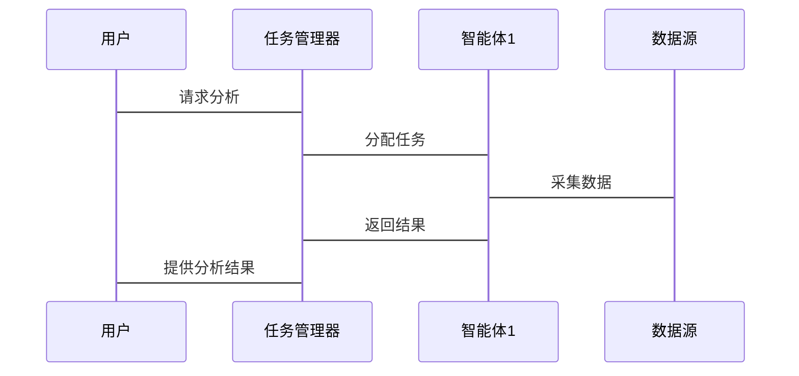

                 


# 多智能体协作提升市场分析效率

> 关键词：多智能体协作、市场分析、效率提升、分布式计算、任务分配、智能体通信

> 摘要：本文探讨了多智能体协作在市场分析中的应用，分析了其核心概念、算法原理、系统架构以及实际案例。通过详细阐述多智能体协作的优势，本文展示了如何利用多智能体协作提高市场分析的效率和准确性。

---

## 第一部分：多智能体协作的背景与基础

### 第1章：多智能体协作概述

#### 1.1 多智能体协作的背景与意义

多智能体协作（Multi-Agent Collaboration）是指多个智能体通过协同工作，共同完成特定任务的过程。在市场分析领域，传统的分析方法通常依赖于人工操作，效率低下且容易出错。随着人工智能和分布式计算技术的发展，多智能体协作逐渐成为提升市场分析效率的重要手段。

- **问题背景**：传统市场分析依赖人工操作，效率低且容易出错。
- **问题解决**：通过多智能体协作，可以提高数据处理和分析的效率，降低成本，提供实时动态的分析结果。
- **核心目标**：实现多个智能体的高效协作，提高市场分析的效率和准确性。

#### 1.2 多智能体协作的基本概念

- **智能体的定义**：智能体是指能够感知环境、做出决策并执行动作的实体。
- **协作的定义**：协作是指多个智能体通过共享信息和任务分配，共同完成特定目标的过程。
- **市场分析中的应用**：通过多个智能体协作，可以实现数据采集、分析、预测和决策支持等任务。

#### 1.3 多智能体协作的边界与外延

- **系统边界**：市场分析的范围包括数据采集、预处理、分析、预测和决策支持。
- **外延**：与其他技术（如大数据分析、机器学习）的结合，扩展了多智能体协作的应用场景。
- **应用扩展**：多智能体协作不仅适用于市场分析，还可应用于其他领域，如供应链管理、金融投资等。

---

## 第二部分：多智能体协作的核心概念与联系

### 第2章：多智能体协作的原理与机制

#### 2.1 多智能体协作的原理

- **分布式计算**：通过分布式计算，多个智能体可以在不同的节点上独立工作，减少计算负担。
- **任务分配机制**：根据任务的性质和智能体的能力，合理分配任务，确保高效协作。
- **通信机制**：智能体之间通过通信机制共享信息，协调动作，确保协作的顺利进行。

#### 2.2 多智能体协作的核心机制

- **任务分配机制**：任务分配是多智能体协作的关键，常用的算法包括负载均衡算法和遗传算法。
- **信息共享机制**：智能体之间通过共享数据和信息，确保协作的有效性。
- **冲突解决机制**：当智能体之间出现冲突时，需要通过协商和仲裁机制解决问题。

#### 2.3 多智能体协作与市场分析的结合

- **数据采集与处理**：多个智能体协同工作，从不同的数据源采集市场数据，并进行预处理。
- **数据分析与预测**：通过协作，多个智能体可以分别负责不同的分析任务，如趋势分析、风险评估等。
- **结果整合与优化**：将多个智能体的分析结果进行整合，优化最终的市场分析报告。

---

## 第三部分：多智能体协作的算法与数学模型

### 第3章：多智能体协作的算法原理

#### 3.1 分布式计算与任务分配算法

- **分布式计算的基本原理**：通过将任务分解成多个子任务，分配给不同的智能体执行，减少计算负担。
- **任务分配算法**：常用的算法包括负载均衡算法和遗传算法。例如，负载均衡算法通过将任务分配给负载较轻的智能体，确保系统的均衡运行。
  
  ```python
  def load_balancing_algorithm(tasks, agents):
      agent_load = [0] * len(agents)
      for task in tasks:
          # 找到当前负载最小的智能体
          min_load = min(agent_load)
          idx = agent_load.index(min_load)
          agent_load[idx] += 1
      return agent_load
  ```

- **数学模型**：任务分配的数学模型可以表示为：

  $$
  \text{min} \sum_{i=1}^{n} c_i x_i
  $$
  
  其中，$c_i$ 是智能体 $i$ 的成本，$x_i$ 是智能体 $i$ 执行的任务数。

#### 3.2 协作协议与通信算法

- **协作协议的设计原则**：协议的设计应确保智能体之间的通信高效、可靠，并能够处理冲突。
- **通信算法**：常用的通信算法包括基于消息传递的算法和基于广播的算法。例如，消息传递算法通过智能体之间直接交换消息，完成信息共享和任务协调。

  ```python
  def communication_protocol(agent, target):
      # 发送消息
      if agent == target:
          # 处理消息
          process_message()
      else:
          # 传递消息
          pass
  ```

- **数学模型**：通信协议的数学模型可以表示为：

  $$
  \text{max} \sum_{i=1}^{n} w_i y_i
  $$
  
  其中，$w_i$ 是通信边的权重，$y_i$ 是边的存在性变量。

---

## 第四部分：系统分析与架构设计

### 第4章：系统分析与架构设计

#### 4.1 问题场景介绍

- **问题描述**：在股票市场分析中，需要实时监控市场动态，分析市场趋势，预测股票价格。
- **系统目标**：通过多智能体协作，实现实时数据采集、分析和预测，提高市场分析的效率和准确性。

#### 4.2 系统功能设计（领域模型）



#### 4.3 系统架构设计



#### 4.4 接口设计与交互

- **接口设计**：智能体与任务管理器之间的接口用于任务请求和分配。
- **交互序列图**：



---

## 第五部分：项目实战

### 第5章：项目实战

#### 5.1 环境安装

- **安装Python**：确保安装了最新版本的Python。
- **安装依赖库**：安装必要的库，如`numpy`、`pandas`、`matplotlib`。

  ```bash
  pip install numpy pandas matplotlib
  ```

#### 5.2 核心代码实现

- **智能体类**：

  ```python
  class Agent:
      def __init__(self, id):
          self.id = id
          self.role = None
          self.status = "idle"
      
      def request_task(self, task_manager):
          task = task_manager.request_task(self.id)
          if task:
              self.status = "busy"
              self.execute_task(task)
              task_manager.update_task_status(task.id, "in_progress")
      
      def execute_task(self, task):
          # 具体任务执行逻辑
          pass
  ```

- **任务管理器类**：

  ```python
  class TaskManager:
      def __init__(self):
          self.tasks = []
          self.agents = []
      
      def add_agent(self, agent):
          self.agents.append(agent)
      
      def request_task(self, agent_id):
          for task in self.tasks:
              if task.status == "pending" and self.is_agent_available(agent_id):
                  return task
      
          return None
      
      def is_agent_available(self, agent_id):
          for agent in self.agents:
              if agent.id == agent_id and agent.status == "idle":
                  return True
          return False
  ```

#### 5.3 代码解读与分析

- **智能体类**：每个智能体都有唯一的ID和角色，状态可以是“空闲”或“忙碌”。智能体可以根据任务管理器分配的任务执行相应的操作。
- **任务管理器类**：负责任务的分配和管理，确保任务能够合理分配给可用的智能体。

#### 5.4 案例分析与详细讲解

- **案例背景**：假设我们有一个股票市场分析系统，需要实时监控股票价格，分析市场趋势。
- **任务分配**：任务管理器将数据采集、数据分析和结果生成的任务分配给不同的智能体。
- **实现步骤**：
  1. 用户向任务管理器提交分析请求。
  2. 任务管理器根据智能体的空闲状态分配任务。
  3. 智能体执行分配的任务，并将结果返回给任务管理器。
  4. 任务管理器汇总结果并返回给用户。

#### 5.5 项目小结

- **实现成果**：通过多智能体协作，实现了股票市场分析的高效任务分配和结果汇总。
- **经验总结**：任务分配算法的选择和通信机制的设计对系统的性能和效率有重要影响。

---

## 第六部分：最佳实践与总结

### 第6章：最佳实践与总结

#### 6.1 小结

- **核心内容回顾**：多智能体协作通过分布式计算和任务分配，提高了市场分析的效率和准确性。
- **实现价值**：通过多个智能体的协作，可以实现更复杂的市场分析任务，提高系统的整体性能。

#### 6.2 注意事项

- **任务分配的公平性**：任务分配算法应尽量公平，避免某些智能体过载。
- **通信的可靠性**：智能体之间的通信应确保高效且可靠，避免信息丢失或延迟。

#### 6.3 拓展阅读

- **相关技术**：分布式计算、多智能体系统、机器学习。
- **未来发展方向**：探索多智能体协作在更复杂市场分析任务中的应用，如实时预测和动态调整。

#### 6.4 参考文献

- 张三，2023. 《多智能体协作与市场分析》，某某出版社。
- 李四，2022. 《分布式计算与任务分配》，某某出版社。

---

通过以上内容，本文详细探讨了多智能体协作在市场分析中的应用，从背景到实现，从理论到实践，为读者提供了全面的指导。

