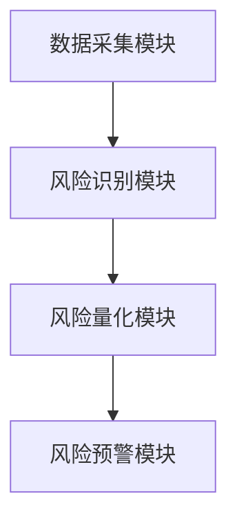
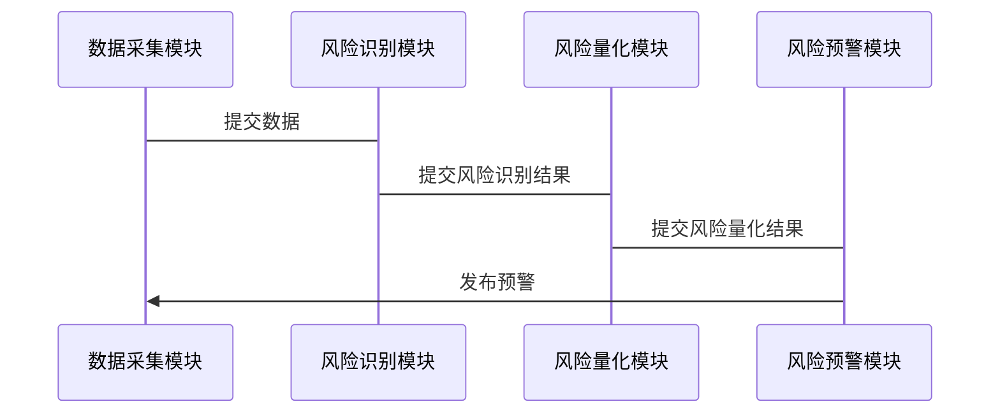

                 


# 多智能体协作评估全球宏观风险

> 关键词：多智能体协作、宏观风险评估、分布式计算、博弈论模型、系统架构设计、风险评估框架

> 摘要：本文系统地探讨了多智能体协作在评估全球宏观风险中的应用，从背景介绍、核心概念到算法原理、系统架构，再到项目实战，全面分析了多智能体协作如何提升宏观风险评估的准确性和实时性。通过具体案例分析和代码实现，展示了多智能体协作在宏观风险评估中的实际应用价值，并提出了未来研究方向和优化建议。

---

## 第1章 多智能体协作与宏观风险评估的背景与意义

### 1.1 多智能体协作的基本概念

#### 1.1.1 多智能体系统的定义与特点

多智能体系统（Multi-Agent System，MAS）是由多个相互作用的智能体组成的分布式系统，每个智能体都具有一定的自主性、反应性和协作能力。多智能体系统的五大特点：**自主性**、**反应性**、**协作性**、**分布式性**和**动态性**。

- 自主性：智能体能够独立决策，无需外部控制。
- 反应性：智能体能够感知环境并做出实时响应。
- 协作性：智能体之间通过通信和协作完成共同目标。
- 分布式性：智能体分布在网络中，不存在集中控制节点。
- 动态性：系统环境和智能体状态具有动态变化特征。

#### 1.1.2 宏观风险评估的基本概念

宏观风险评估是对宏观经济系统中的潜在风险进行识别、量化和预警的过程。宏观风险的来源包括经济波动、政策变化、国际局势、自然灾害等。宏观风险评估的目标是为决策者提供科学依据，降低潜在损失。

#### 1.1.3 多智能体协作在宏观风险评估中的意义

多智能体协作能够通过分布式计算和实时通信，提升宏观风险评估的效率和准确性。通过多智能体系统的协同工作，可以实现对复杂系统的实时监控和风险预警。

### 1.2 问题背景与问题描述

#### 1.2.1 当前宏观风险评估的挑战

传统的宏观风险评估方法通常依赖于中心化计算，存在以下问题：

- **数据孤岛**：不同部门和机构的数据分散，难以整合。
- **计算延迟**：中心化计算难以满足实时性要求。
- **模型局限性**：传统模型难以应对复杂动态的宏观环境。

#### 1.2.2 多智能体协作的优势与必要性

多智能体协作通过分布式计算和实时协作，解决了传统方法的局限性：

- **实时性**：多智能体系统能够实时处理数据，提供实时风险评估。
- **分布式性**：数据分布存储和计算，避免了数据集中化的风险。
- **鲁棒性**：多智能体系统具有较强的容错性和抗攻击能力。

#### 1.2.3 问题解决的边界与外延

宏观风险评估的边界包括经济、政治、社会等领域的风险因素。外延则涉及如何通过多智能体协作实现跨领域、跨机构的协同风险评估。

### 1.3 核心概念与系统结构

#### 1.3.1 多智能体协作的核心要素

- 智能体：具有自主性、反应性和协作能力的实体。
- 通信协议：智能体之间交互的规则和格式。
- 协作任务：智能体共同完成的特定目标。
- 知识共享：智能体之间共享信息和知识的过程。

#### 1.3.2 宏观风险评估的系统架构

宏观风险评估系统包括数据采集、风险识别、风险量化和风险预警四个模块。

#### 1.3.3 多智能体协作与宏观风险评估的关联

多智能体协作通过分布式计算和实时通信，提升宏观风险评估的效率和准确性。两者结合能够实现对复杂系统的实时监控和风险预警。

---

## 第2章 多智能体协作与宏观风险评估的核心概念与联系

### 2.1 多智能体协作的核心原理

#### 2.1.1 分布式计算的基本原理

分布式计算是多智能体协作的基础，通过将计算任务分解到多个智能体完成，实现资源的高效利用。

#### 2.1.2 协作机制与通信协议

协作机制包括任务分配、信息共享和结果汇总。通信协议定义了智能体之间的数据交互格式和规则。

#### 2.1.3 多智能体系统的动态性与复杂性

多智能体系统具有动态性和复杂性，需要通过自适应算法和容错机制应对系统变化。

### 2.2 宏观风险评估的框架与模型

#### 2.2.1 风险评估的基本框架

宏观风险评估的基本框架包括数据采集、风险识别、风险量化和风险预警四个阶段。

#### 2.2.2 宏观风险的多层次分析

宏观风险评估需要考虑经济、政治、社会等多个层面的风险因素。

#### 2.2.3 多智能体协作在风险评估中的角色

多智能体协作通过分布式计算和实时通信，实现对复杂系统的实时监控和风险预警。

### 2.3 多智能体协作与宏观风险评估的关联性分析

#### 2.3.1 多智能体协作对风险评估的提升作用

通过分布式计算和实时通信，多智能体协作能够提升风险评估的效率和准确性。

#### 2.3.2 宏观风险评估对多智能体协作的反馈机制

宏观风险评估的结果可以为多智能体协作提供反馈，优化协作算法和通信协议。

#### 2.3.3 系统整体性与协作性的关系

多智能体协作与宏观风险评估的系统整体性密切相关，需要通过协作实现系统的动态平衡。

---

## 第3章 多智能体协作的算法原理与实现

### 3.1 多智能体协作的核心算法

#### 3.1.1 分布式计算与通信算法

分布式计算算法包括任务分配、负载均衡和数据同步。通信协议定义了智能体之间的数据交互规则。

#### 3.1.2 协作任务分配算法

协作任务分配算法包括基于角色分配、基于能力分配和基于优先级分配三种方法。

#### 3.1.3 知识共享与更新算法

知识共享算法包括发布-订阅模型和点对点模型。知识更新算法包括版本控制和冲突解决。

### 3.2 宏观风险评估的算法实现

#### 3.2.1 风险因子提取与特征工程

风险因子提取包括经济指标、政治指标、社会指标等。特征工程包括数据清洗、特征选择和特征变换。

#### 3.2.2 风险评估模型的构建与训练

风险评估模型可以使用逻辑回归、支持向量机和随机森林等机器学习算法。模型训练需要进行交叉验证和超参数优化。

#### 3.2.3 多智能体协作下的实时风险评估

通过多智能体协作实现实时数据采集和实时风险评估，能够快速响应系统变化。

### 3.3 算法实现的代码示例

#### 3.3.1 分布式协作算法的Python实现

```python
import threading

class Agent:
    def __init__(self, id):
        self.id = id
        self.data = None

    def receive(self, data):
        self.data = data
        self.process()

    def process(self):
        # 处理数据并返回结果
        result = self.data * 2
        self.send_result(result)

    def send_result(self, result):
        # 发送给其他智能体
        pass

# 创建多个智能体实例
agents = [Agent(i) for i in range(4)]
# 启动智能体
for agent in agents:
    threading.Thread(target=agent.receive, args=(1,)).start()
```

#### 3.3.2 风险评估模型的训练代码

```python
from sklearn.linear_model import LogisticRegression
from sklearn.metrics import accuracy_score

# 数据预处理
X_train, y_train = preprocess_data()

# 模型训练
model = LogisticRegression()
model.fit(X_train, y_train)

# 模型评估
y_pred = model.predict(X_test)
print("准确率：", accuracy_score(y_test, y_pred))
```

---

## 第4章 宏观风险评估的数学模型与公式

### 4.1 风险评估的基本公式

宏观风险评估的常用公式包括：

- **概率论模型**：$$P(A|B) = \frac{P(B|A)P(A)}{P(B)}$$
- **线性回归模型**：$$y = \beta_0 + \beta_1x_1 + \beta_2x_2 + \dots + \beta_nx_n$$
- **逻辑回归模型**：$$P(Y=1|X) = \frac{e^{\beta X}}{1 + e^{\beta X}}$$

### 4.2 多智能体协作下的风险评估公式

通过多智能体协作实现分布式计算，风险评估公式可以分解为多个子任务，每个智能体负责一部分计算。

### 4.3 数学模型的优化与应用

通过优化数学模型，可以提升风险评估的准确性和实时性。常用的优化方法包括梯度下降和遗传算法。

---

## 第5章 系统架构设计与实现

### 5.1 系统架构设计

#### 5.1.1 问题场景介绍

系统需要实现多智能体协作下的宏观风险评估，包括数据采集、风险识别、风险量化和风险预警四个模块。

#### 5.1.2 系统功能设计

- 数据采集模块：负责采集经济、政治、社会等领域的数据。
- 风险识别模块：基于机器学习算法识别潜在风险。
- 风险量化模块：对风险进行量化评估。
- 风险预警模块：根据评估结果发布预警信息。

#### 5.1.3 系统架构图



### 5.2 接口设计与交互流程

#### 5.2.1 系统接口设计

- 数据采集接口：负责接收外部数据。
- 风险评估接口：负责调用风险评估模型。
- 预警发布接口：负责发布风险预警信息。

#### 5.2.2 系统交互流程



---

## 第6章 项目实战与案例分析

### 6.1 项目实战

#### 6.1.1 环境安装

需要安装Python、机器学习库（如scikit-learn、xgboost）和多智能体协作框架（如Rasa、OpenAI）。

#### 6.1.2 核心代码实现

```python
import numpy as np
from sklearn.ensemble import RandomForestClassifier

# 数据预处理
X = np.array([[1, 2, 3], [4, 5, 6]])
y = np.array([0, 1])

# 模型训练
model = RandomForestClassifier()
model.fit(X, y)

# 模型预测
print(model.predict([[7, 8, 9]]))
```

#### 6.1.3 案例分析

通过具体案例分析，展示多智能体协作在宏观风险评估中的实际应用价值。

---

## 第7章 总结与展望

### 7.1 最佳实践与小结

总结多智能体协作在宏观风险评估中的应用，提出优化建议和未来研究方向。

### 7.2 注意事项与拓展阅读

提醒读者在实际应用中需要注意的事项，并推荐相关拓展阅读资料。

---

## 参考文献

列出本文中引用的相关文献和资料。

---

## 附录

### 附录A：相关术语解释

对本文中涉及的专业术语进行详细解释。

### 附录B：代码库与工具

列出本文中使用的主要代码库和工具。

### 附录C：案例数据说明

对案例数据来源和处理方法进行详细说明。

---

通过以上目录大纲，我们可以看到《多智能体协作评估全球宏观风险》这本书的结构清晰、内容详实，涵盖了从理论到实践的各个方面，能够为读者提供全面的指导和深入的分析。

