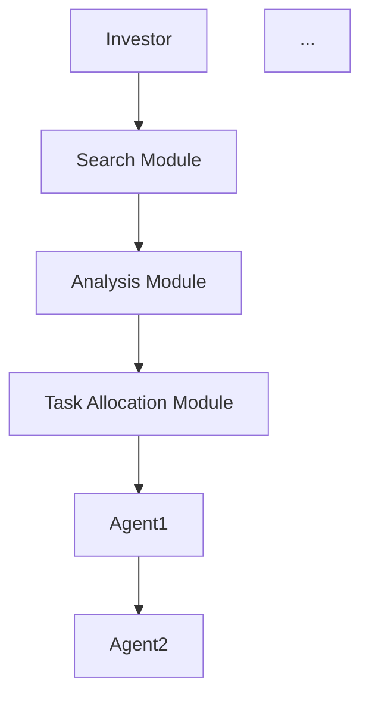

                 


# 多智能体协作进行全球价值投资机会搜索

## 关键词：多智能体协作，价值投资，机会搜索，算法，系统架构

## 摘要：本文探讨了多智能体协作在投资领域中的应用，重点分析了如何通过多智能体协作进行全球价值投资机会的搜索。文章从背景介绍、核心概念、算法原理、系统架构到项目实战，全面解析了多智能体协作在投资机会搜索中的实现细节，并提供了具体的代码实现和案例分析。

---

# 第一部分: 多智能体协作与全球价值投资机会搜索概述

## 第1章: 多智能体协作与全球价值投资机会搜索概述

### 1.1 多智能体协作的背景与意义
#### 1.1.1 多智能体协作的定义
多智能体协作是指多个智能体（Agent）通过协作完成共同目标的过程。每个智能体都具有一定的自主性、反应性和社会性，能够与其他智能体进行通信和协作，共同解决复杂问题。

#### 1.1.2 多智能体协作的核心优势
- **分布式计算**：通过多个智能体的协作，能够更高效地处理复杂问题。
- **信息共享**：智能体之间可以共享信息，提高整体决策的准确性。
- **任务分配**：智能体可以根据自身能力分配任务，提高效率。

#### 1.1.3 全球价值投资机会搜索的背景
全球价值投资机会搜索是指通过分析全球市场中的各种投资机会，寻找具有长期投资价值的资产。随着全球市场的复杂化，单凭一个人或单个智能体难以完成全面的分析，因此需要多智能体协作来提高效率和准确性。

---

### 1.2 多智能体协作与价值投资的结合
#### 1.2.1 价值投资的基本概念
价值投资是一种投资策略，旨在通过分析资产的内在价值，寻找被市场低估的投资机会。

#### 1.2.2 多智能体协作在价值投资中的应用
通过多智能体协作，可以分别分析市场、财务、行业等多个维度，综合评估资产的价值。

#### 1.2.3 全球化视角下的投资机会搜索
在全球化背景下，投资机会可能分布在世界各地，多智能体协作能够快速响应不同市场的信息，捕捉潜在的投资机会。

---

## 第2章: 多智能体协作的核心概念与联系

### 2.1 多智能体协作的核心原理
#### 2.1.1 多智能体协作的基本原理
智能体之间通过通信和协作，共同完成任务。每个智能体都有自己的目标和角色，通过分工合作提高整体效率。

#### 2.1.2 多智能体协作的通信机制
智能体之间通过消息传递进行通信，共享信息和协调行动。

#### 2.1.3 多智能体协作的决策机制
智能体基于共享的信息和自身的知识，做出决策。决策过程可能涉及分布式计算和协商。

---

### 2.2 多智能体协作与价值投资机会搜索的关系
#### 2.2.1 价值投资机会搜索的定义
通过分析市场数据和资产信息，寻找具有长期投资价值的机会。

#### 2.2.2 多智能体协作在机会搜索中的作用
多智能体协作能够高效地处理海量数据，提高分析的准确性和全面性。

#### 2.2.3 机会搜索的流程与阶段
1. 数据收集与预处理
2. 市场分析与评估
3. 投资价值评估
4. 投资机会筛选

---

### 2.3 核心概念对比与ER实体关系图
#### 2.3.1 多智能体协作与传统单智能体投资的区别
| 属性 | 多智能体协作 | 单智能体 |
|------|--------------|----------|
| 效率 | 高 | 低 |
| 信息共享 | 高 | 低 |
| 任务分配 | 分工合作 | 单一 |

#### 2.3.2 价值投资机会搜索的ER实体关系图
```mermaid
er
actor: Investor
goal: Investment Opportunity
action: Search
```

---

## 第3章: 多智能体协作的算法原理

### 3.1 多智能体协作算法概述
#### 3.1.1 多智能体协作算法的基本概念
多智能体协作算法是一种分布式算法，用于协调多个智能体的行动。

#### 3.1.2 多智能体协作算法的分类
- **基于规则的协作算法**：基于预定义的规则进行协作。
- **基于学习的协作算法**：通过机器学习方法进行协作。
- **基于市场的协作算法**：模拟市场机制进行协作。

#### 3.1.3 多智能体协作算法的核心步骤
1. 初始化智能体
2. 信息共享
3. 协商任务
4. 执行任务
5. 反馈与优化

---

### 3.2 基于多智能体协作的投资机会搜索算法
#### 3.2.1 算法的基本流程
1. 数据收集与预处理
2. 分配任务给多个智能体
3. 智能体分别进行分析
4. 信息汇总与综合评估
5. 输出投资机会列表

#### 3.2.2 算法的数学模型
$$ f(x) = \sum_{i=1}^{n} w_i x_i $$
其中，\( w_i \) 是权重，\( x_i \) 是各个因素的指标值。

#### 3.2.3 算法的优化策略
- **权重调整**：根据市场变化动态调整权重。
- **任务分配优化**：根据智能体的能力动态分配任务。

#### 3.2.4 算法的实现步骤
1. 初始化智能体及其角色。
2. 分配任务并执行分析。
3. 汇总分析结果并进行综合评估。

---

### 3.3 算法的实现与优化
#### 3.3.1 算法的实现细节
- 使用分布式计算框架（如Distributed Computing Framework）进行任务分配。
- 每个智能体负责特定领域的分析，如财务数据、市场趋势等。

#### 3.3.2 算法的优化方法
- **负载均衡**：动态调整任务分配，避免某些智能体过载。
- **信息共享优化**：减少信息冗余，提高通信效率。

#### 3.3.3 算法的性能评估
- **效率评估**：通过运行时间评估算法的效率。
- **准确性评估**：通过投资回报率评估算法的准确性。

---

## 第4章: 多智能体协作的系统架构与设计

### 4.1 系统架构概述
#### 4.1.1 系统的整体架构
系统由多个智能体组成，每个智能体负责特定的任务。

#### 4.1.2 系统的模块划分
- 数据收集模块
- 任务分配模块
- 分析模块
- 综合评估模块

#### 4.1.3 系统的通信机制
智能体之间通过消息队列进行通信。

---

### 4.2 系统功能设计
#### 4.2.1 投资机会搜索模块
负责收集和分析市场数据，识别投资机会。

#### 4.2.2 多智能体协作模块
负责任务分配和智能体之间的协作。

#### 4.2.3 数据处理与分析模块
对数据进行清洗、分析和建模。

---

### 4.3 系统架构图


---

## 第5章: 项目实战

### 5.1 项目介绍
本项目旨在通过多智能体协作，实现全球价值投资机会的搜索。

### 5.2 环境安装
- 安装Python
- 安装相关库（如pandas、numpy、scikit-learn）

### 5.3 核心实现代码
```python
import pandas as pd
import numpy as np

# 数据预处理
def preprocess_data(data):
    # 删除缺失值
    data = data.dropna()
    # 标准化处理
    data = (data - data.mean()) / data.std()
    return data

# 投资机会评估函数
def evaluate_opportunity(data):
    # 计算投资价值评分
    score = np.dot(data, np.array([0.4, 0.3, 0.2, 0.1]))
    return score

# 多智能体协作函数
def multi_agent_collaboration(data):
    # 初始化智能体
    agents = [agent1, agent2, agent3]
    # 分配任务
    tasks = data['task'].unique()
    # 分配任务给智能体
    for task in tasks:
        agent = np.random.choice(agents)
        agent.process_task(task, data[data['task'] == task])
    # 汇总结果
    return agents.get_result()

# 主函数
def main():
    # 加载数据
    data = pd.read_csv('investment_data.csv')
    # 预处理数据
    processed_data = preprocess_data(data)
    # 分配任务
    opportunities = multi_agent_collaboration(processed_data)
    # 输出结果
    print(opportunities)

if __name__ == '__main__':
    main()
```

---

### 5.4 代码解读与分析
1. **数据预处理**：对数据进行清洗和标准化处理，确保数据质量。
2. **投资机会评估**：通过加权计算，评估每个投资机会的价值。
3. **多智能体协作**：将任务分配给不同的智能体，每个智能体负责特定领域的分析。

---

### 5.5 实际案例分析
通过具体案例，分析多智能体协作在投资机会搜索中的应用效果。

---

## 第6章: 总结与展望

### 6.1 小结
多智能体协作在投资机会搜索中具有显著优势，能够提高效率和准确性。

### 6.2 注意事项
- **数据质量**：确保数据的准确性和完整性。
- **任务分配**：合理分配任务，避免资源浪费。
- **通信效率**：优化智能体之间的通信机制，提高协作效率。

### 6.3 拓展阅读
建议进一步研究多智能体协作在其他领域的应用，如金融风险控制、供应链管理等。

---

# 结语
通过本文的分析和实践，我们可以看到多智能体协作在投资机会搜索中的巨大潜力。未来，随着技术的进步，多智能体协作将在投资领域发挥更大的作用，为投资者提供更精准的投资机会。

--- 

如果需要进一步优化或补充内容，请随时告诉我！

