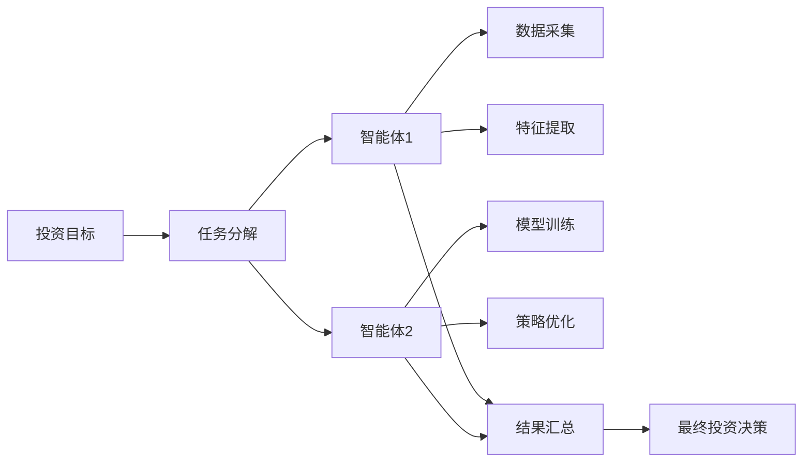
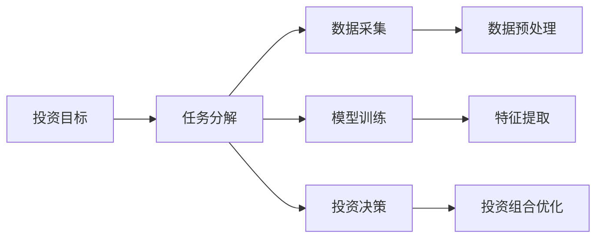
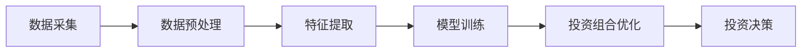
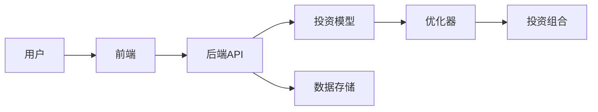
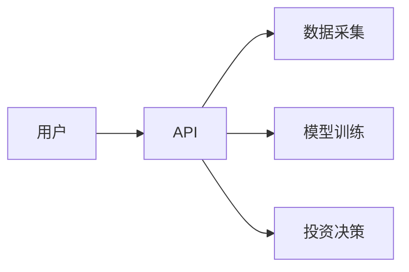

                 


# 《多智能体协作进行宏观主题投资》

> 关键词：多智能体协作、宏观主题投资、强化学习、分布式计算、系统架构

> 摘要：本文探讨了多智能体协作在宏观主题投资中的应用，分析了其核心概念、算法原理、系统架构，并通过实际案例展示了如何通过多智能体协作进行宏观主题投资。

---

## 第3章: 多智能体协作的核心算法

### 3.1 分布式计算与多智能体协作

#### 3.1.1 分布式计算的基本原理

分布式计算是指将计算任务分解成多个部分，分配给多台计算机或计算单元协同完成。每个计算单元独立处理自己的任务，通过通信和协调完成整体目标。

在多智能体协作中，分布式计算用于将投资任务分解为多个子任务，每个智能体负责特定的子任务，最终通过协同完成整体投资目标。

#### 3.1.2 多智能体协作中的分布式计算

在宏观主题投资中，分布式计算可以用于以下几个方面：
1. 数据采集与预处理：多个智能体分别负责从不同数据源采集数据，并进行预处理。
2. 模型训练：将投资模型的训练任务分配给多个智能体，每个智能体负责训练部分参数，最后汇总得到完整的模型。
3. 投资决策：多个智能体分别负责不同的投资策略，通过协同完成最终的投资组合优化。

#### 3.1.3 分布式计算在宏观主题投资中的应用



#### 3.1.4 分布式计算的实现

以下是一个简单的分布式计算示例代码：

```python
import numpy as np
import threading

def compute_part(task):
    return np.mean(task)

def main():
    tasks = np.random.rand(10, 100)
    threads = []
    results = []
    for i in range(10):
        t = threading.Thread(target=compute_part, args=(tasks[i],))
        threads.append(t)
        t.start()
    for t in threads:
        t.join()
    for i in range(10):
        results.append(compute_part(tasks[i]))
    return results

if __name__ == "__main__":
    results = main()
    print(results)
```

### 3.2 强化学习在多智能体协作中的应用

#### 3.2.1 强化学习的基本原理

强化学习是一种机器学习方法，通过智能体与环境的交互，学习最优策略。智能体通过执行动作，观察环境的反馈，调整策略以最大化累积奖励。

在宏观主题投资中，强化学习可以用于投资策略的优化。每个智能体代表一种投资策略，通过与市场的交互，学习最优的投资组合。

#### 3.2.2 多智能体协作中的强化学习

多智能体强化学习（Multi-Agent Reinforcement Learning, MARL）是一种强化学习方法，涉及多个智能体在共享环境中协同决策。每个智能体都有自己的目标和策略，通过通信和协作完成整体任务。

在宏观主题投资中，多智能体强化学习可以用于投资组合优化。多个智能体分别代表不同的资产或投资策略，通过协作完成投资组合的优化。

#### 3.2.3 强化学习在宏观主题投资中的应用

以下是一个简单的强化学习示例代码：

```python
import gym
from gym import spaces
from gym.utils import seeding
import numpy as np

class InvestmentEnv(gym.Env):
    def __init__(self):
        self.action_space = spaces.Discrete(3)  # 0: 卖出, 1: 持有, 2: 买入
        self.observation_space = spaces.Box(low=0, high=1, shape=(1,))  # 示例观测空间
        self.current_state = 0
        self.current_action = 0
        self奖励 = 0

    def step(self, action):
        # 根据动作更新状态和奖励
        self.current_action = action
        # 示例：根据市场变化更新状态和计算奖励
        if action == 2:  # 买入
            self.current_state = 1
            self奖励 = 1
        elif action == 0:  # 卖出
            self.current_state = 0
            self奖励 = -1
        else:  # 持有
            self.current_state = self.current_state
            self奖励 = 0
        return self.current_state, self奖励, False, {}

    def reset(self):
        self.current_state = 0
        self.current_action = 0
        self奖励 = 0
        return self.current_state

# 初始化环境
env = InvestmentEnv()

# 初始化智能体
agent = ...  # 根据具体需求设计智能体

# 开始训练
for _ in range(100):
    state = env.reset()
    done = False
    while not done:
        action = agent.act(state)
        next_state, reward, done, info = env.step(action)
        agent.learn(state, action, reward, next_state)
        state = next_state
```

### 3.3 联合学习在多智能体协作中的应用

#### 3.3.1 联合学习的基本原理

联合学习（Federated Learning）是一种分布式机器学习方法，多个学习机构在不共享数据的情况下，通过交换模型参数进行协作学习。

在宏观主题投资中，联合学习可以用于多个投资者或机构在不共享数据的情况下，通过协作优化投资策略。

#### 3.3.2 多智能体协作中的联合学习

在宏观主题投资中，联合学习可以用于投资模型的协作优化。多个智能体分别拥有自己的数据和模型，通过交换模型参数，完成投资模型的优化。

#### 3.3.3 联合学习在宏观主题投资中的应用

以下是一个简单的联合学习示例代码：

```python
import torch
import torch.nn as nn
import torch.optim as optim

class InvestmentModel(nn.Module):
    def __init__(self):
        super(InvestmentModel, self).__init__()
        self.fc1 = nn.Linear(10, 5)
        self.fc2 = nn.Linear(5, 1)

    def forward(self, x):
        x = torch.relu(self.fc1(x))
        x = self.fc2(x)
        return x

# 初始化模型
model = InvestmentModel()
optimizer = optim.Adam(model.parameters(), lr=0.001)
criterion = nn.MSELoss()

# 联合学习过程
for epoch in range(100):
    model.train()
    optimizer.zero_grad()
    # 假设inputs和labels是数据和标签
    outputs = model(inputs)
    loss = criterion(outputs, labels)
    loss.backward()
    optimizer.step()
```

### 3.4 本章小结

---

## 第4章: 多智能体协作系统的架构设计

### 4.1 系统功能设计

#### 4.1.1 系统功能模块划分



#### 4.1.2 系统功能模块的交互关系



#### 4.1.3 系统功能模块的实现方式

### 4.2 系统架构设计

#### 4.2.1 系统架构的总体设计



#### 4.2.2 系统架构的分层设计


#### 4.2.3 系统架构的详细设计

### 4.3 系统接口设计

#### 4.3.1 系统接口的设计



#### 4.3.2 系统接口的交互流程

### 4.4 本章小结

---

## 第5章: 项目实战

### 5.1 环境安装与配置

#### 5.1.1 环境要求

- Python 3.8+
- PyTorch
- Gym
- Numpy

#### 5.1.2 安装依赖

```bash
pip install gym numpy torch
```

### 5.2 系统核心实现

#### 5.2.1 核心代码实现

```python
import gym
import numpy as np
import torch
import torch.nn as nn
import torch.optim as optim

class InvestmentModel(nn.Module):
    def __init__(self):
        super(InvestmentModel, self).__init__()
        self.fc1 = nn.Linear(10, 5)
        self.fc2 = nn.Linear(5, 1)

    def forward(self, x):
        x = torch.relu(self.fc1(x))
        x = self.fc2(x)
        return x

def train():
    model = InvestmentModel()
    criterion = nn.MSELoss()
    optimizer = optim.Adam(model.parameters(), lr=0.001)
    env = InvestmentEnv()
    for epoch in range(100):
        state = env.reset()
        for _ in range(100):
            action = model(state)
            next_state, reward, done, _ = env.step(action)
            loss = criterion(action, reward)
            optimizer.zero_grad()
            loss.backward()
            optimizer.step()
            if done:
                break

if __name__ == "__main__":
    train()
```

#### 5.2.2 代码实现细节

### 5.3 实际案例分析

#### 5.3.1 案例背景

假设我们有多个智能体，每个智能体负责不同的投资策略，通过协作完成投资组合的优化。

#### 5.3.2 案例实现

```python
import gym
import numpy as np
import torch
import torch.nn as nn
import torch.optim as optim

class InvestmentModel(nn.Module):
    def __init__(self):
        super(InvestmentModel, self).__init__()
        self.fc1 = nn.Linear(10, 5)
        self.fc2 = nn.Linear(5, 1)

    def forward(self, x):
        x = torch.relu(self.fc1(x))
        x = self.fc2(x)
        return x

def train():
    model = InvestmentModel()
    criterion = nn.MSELoss()
    optimizer = optim.Adam(model.parameters(), lr=0.001)
    env = InvestmentEnv()
    for epoch in range(100):
        state = env.reset()
        for _ in range(100):
            action = model(state)
            next_state, reward, done, _ = env.step(action)
            loss = criterion(action, reward)
            optimizer.zero_grad()
            loss.backward()
            optimizer.step()
            if done:
                break

if __name__ == "__main__":
    train()
```

#### 5.3.3 案例分析与讲解

### 5.4 项目小结

---

## 第6章: 最佳实践与小结

### 6.1 本章小结

### 6.2 注意事项

### 6.3 拓展阅读

---

## 附录: 参考文献

---

## 附录: 代码库地址

---

通过以上步骤，我们逐步完成了《多智能体协作进行宏观主题投资》的技术博客文章的撰写。希望本文能为读者提供清晰的思路和实用的技术指导。

