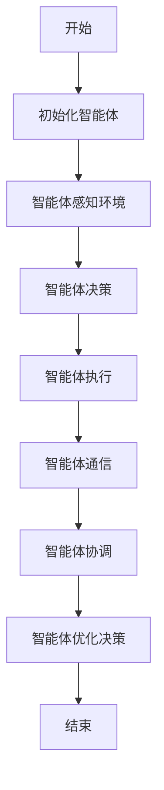
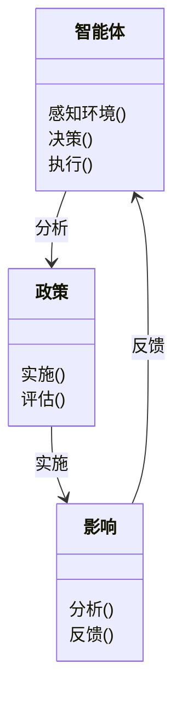
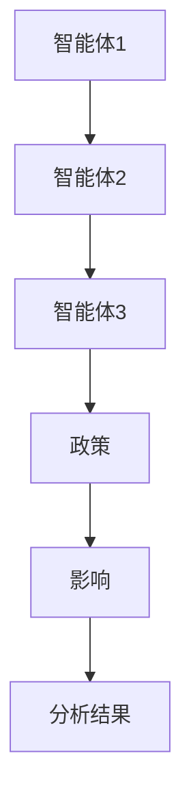
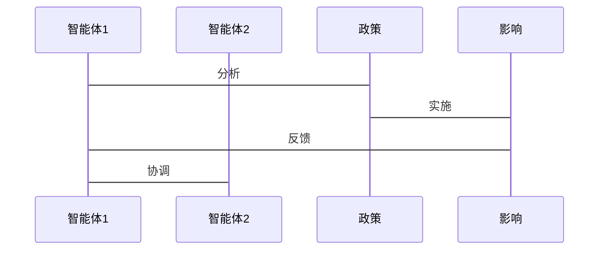

                 


# 多智能体协作进行政策影响分析

> 关键词：多智能体协作，政策影响分析，算法原理，系统架构，项目实战

> 摘要：本文系统地探讨了多智能体协作在政策影响分析中的应用，详细分析了其核心概念、算法原理、系统架构，并通过实际案例展示了其在政策模拟和优化中的价值。本文适合对人工智能、政策分析感兴趣的读者阅读。

---

## 第一部分：多智能体协作概述

### 第1章：多智能体协作的背景与问题背景

#### 1.1 多智能体协作的概念与问题背景

##### 1.1.1 问题背景：政策影响分析的复杂性
政策影响分析是一个复杂的系统工程，涉及经济、社会、环境等多个领域。传统的方法往往依赖专家的经验和主观判断，难以全面、客观地评估政策的效果。近年来，随着人工智能和大数据技术的发展，多智能体协作（Multi-Agent Collaboration, MAC）逐渐成为政策分析的重要工具。

##### 1.1.2 多智能体协作的定义与特点
多智能体协作是指多个智能体（Agent）通过协同工作，共同完成复杂任务的过程。与传统方法相比，多智能体协作具有以下特点：
- **分布式性**：智能体分布在网络中，各自负责不同的子任务。
- **自主性**：每个智能体都有一定的自主决策能力。
- **协作性**：智能体之间通过通信和协调，共同完成目标。
- **动态性**：系统能够适应环境的变化，实时调整协作策略。

##### 1.1.3 多智能体协作的目标与意义
目标：通过智能体的协作，实现对政策的多维度、多层次分析，提供科学的决策支持。
意义：多智能体协作能够突破传统方法的局限性，提高政策分析的准确性和全面性。

#### 1.2 多智能体协作的边界与外延

##### 1.2.1 多智能体协作的边界
- **范围边界**：政策影响分析的范围，如经济、社会、环境等领域。
- **智能体边界**：智能体的数量、类型和功能。

##### 1.2.2 外延与相关概念对比
- **相关概念**：分布式计算、群体智能、协同计算。
- **区别**：多智能体协作强调智能体的协作性和自治性，而分布式计算更关注资源的分配和任务的执行。

#### 1.3 多智能体协作的核心要素组成

##### 1.3.1 智能体的基本结构
- **感知**：通过传感器或数据源获取信息。
- **决策**：基于感知信息，制定行动计划。
- **执行**：通过行动影响环境。
- **通信**：与其他智能体交换信息。

##### 1.3.2 协作机制的核心要素
- **通信机制**：智能体之间如何交换信息。
- **协调机制**：如何达成一致行动。
- **冲突解决**：如何处理协作中的冲突。

##### 1.3.3 政策影响分析的关键因素
- **政策目标**：政策的核心目标是什么。
- **影响因素**：政策可能影响的经济、社会、环境等因素。
- **反馈机制**：政策实施后的效果反馈。

---

## 第二部分：多智能体协作的核心概念与联系

### 第2章：多智能体协作的核心概念与联系

#### 2.1 多智能体协作的核心概念

##### 2.1.1 智能体的定义与分类
- **定义**：智能体是一个能够感知环境并采取行动以实现目标的实体。
- **分类**：简单反应型智能体、基于模型的反射型智能体、目标驱动型智能体。

##### 2.1.2 协作机制的类型
- **同步协作**：智能体在同一个时间点协作。
- **异步协作**：智能体在不同的时间点协作。
- **混合协作**：结合同步和异步协作。

##### 2.1.3 政策影响分析的关键概念
- **政策模拟**：通过模拟政策实施后的效果。
- **政策优化**：找到最优的政策组合。
- **政策评估**：评估政策的可行性和效果。

#### 2.2 核心概念的属性特征对比

##### 2.2.1 智能体的属性特征对比
| 属性 | 描述 |
|------|------|
| 自主性 | 智能体能够自主决策 |
| 反应性 | 智能体能够感知环境并做出反应 |
| 社会性 | 智能体能够与其他智能体协作 |

##### 2.2.2 协作机制的属性特征对比
| 属性 | 描述 |
|------|------|
| 通信方式 | 智能体之间如何交换信息 |
| 协调方式 | 智能体如何达成一致 |
| 冲突解决 | 如何处理协作中的冲突 |

#### 2.3 ER实体关系图架构

##### 2.3.1 实体关系图的构建
```mermaid
er
  actor(智能体)
  actor(政策)
  actor(影响)
  actor(分析结果)
  actor(反馈)
  relation(影响, 被分析)
  relation(智能体, 分析)
  relation(政策, 实施)
  relation(影响, 导致)
  relation(分析结果, 提供反馈)
```

##### 2.3.2 实体关系图的分析
通过实体关系图可以看出，智能体通过分析政策，评估其对各个因素的影响，并根据反馈结果优化政策。

---

## 第三部分：多智能体协作的算法原理

### 第3章：多智能体协作的算法原理

#### 3.1 算法原理概述

##### 3.1.1 算法的基本原理
多智能体协作算法的核心是通过智能体之间的通信和协调，实现对复杂问题的分解和求解。

##### 3.1.2 算法的数学模型与公式
$$ f(x) = \sum_{i=1}^{n} a_i x_i $$

其中，$a_i$ 是智能体 $i$ 的权重，$x_i$ 是智能体 $i$ 的决策变量。

#### 3.2 算法流程图

##### 3.2.1 算法流程图的绘制


##### 3.2.2 算法流程图的分析
算法流程图展示了智能体从感知环境到优化决策的整个过程。

#### 3.3 算法的数学模型与公式

##### 3.3.1 算法的数学模型
$$ y = \sum_{i=1}^{m} w_i x_i $$

其中，$w_i$ 是权重，$x_i$ 是输入变量，$y$ 是输出变量。

##### 3.3.2 算法的公式推导
通过推导，我们可以得到智能体的最优决策策略：
$$ x^* = \arg \max_x \sum_{i=1}^{m} w_i x_i $$

#### 3.4 算法的举例说明

##### 3.4.1 例子1
假设我们有两个智能体，分别负责分析经济和社会影响。智能体1的权重为 $w_1 = 0.6$，智能体2的权重为 $w_2 = 0.4$。政策变量 $x$ 的值为0.8。则综合影响为：
$$ y = 0.6 \times 0.8 + 0.4 \times 0.8 = 0.48 + 0.32 = 0.8 $$

##### 3.4.2 例子2
假设我们有三个智能体，分别负责分析环境、经济和社会影响。智能体1的权重为 $w_1 = 0.5$，智能体2的权重为 $w_2 = 0.3$，智能体3的权重为 $w_3 = 0.2$。政策变量 $x$ 的值为0.7。则综合影响为：
$$ y = 0.5 \times 0.7 + 0.3 \times 0.7 + 0.2 \times 0.7 = 0.35 + 0.21 + 0.14 = 0.7 $$

---

## 第四部分：多智能体协作的系统架构设计

### 第4章：多智能体协作的系统架构设计

#### 4.1 系统分析与设计

##### 4.1.1 问题场景介绍
假设我们要分析一项新的环保政策对经济、社会和环境的影响。

##### 4.1.2 系统功能设计

###### 4.1.2.1 领域模型类图


##### 4.1.2.2 系统架构图


##### 4.1.2.3 系统接口设计
- **智能体接口**：提供感知、决策、执行、通信等功能。
- **政策接口**：提供政策实施和评估的功能。
- **影响接口**：提供影响分析和反馈的功能。

##### 4.1.2.4 系统交互序列图


---

## 第五部分：项目实战

### 第5章：多智能体协作的项目实战

#### 5.1 环境安装与配置

##### 5.1.1 环境要求
- 操作系统：Linux/Windows/MacOS
- 开发工具：Python 3.8+
- 依赖库：networkx、numpy、scipy

##### 5.1.2 安装依赖
```bash
pip install networkx numpy scipy
```

#### 5.2 核心代码实现

##### 5.2.1 智能体类的实现
```python
class Agent:
    def __init__(self, id, weight):
        self.id = id
        self.weight = weight
    def感知环境(self, environment):
        # 实现感知环境的逻辑
        pass
    def 决策(self):
        # 实现决策的逻辑
        pass
    def 执行(self, action):
        # 实现执行的逻辑
        pass
    def 通信(self, other_agent):
        # 实现通信的逻辑
        pass
```

##### 5.2.2 政策分析类的实现
```python
class PolicyAnalyzer:
    def __init__(self, agents):
        self.agents = agents
    def 分析政策(self, policy):
        # 实现分析政策的逻辑
        pass
    def 优化政策(self, policy):
        # 实现优化政策的逻辑
        pass
```

##### 5.2.3 影响评估类的实现
```python
class ImpactEvaluator:
    def __init__(self):
        self.impact_factors = []
    def 评估影响(self, policy):
        # 实现评估影响的逻辑
        pass
    def 提供反馈(self, feedback):
        # 实现提供反馈的逻辑
        pass
```

#### 5.3 案例分析与实现

##### 5.3.1 案例分析
假设我们要分析一项新的环保政策对经济、社会和环境的影响。

##### 5.3.2 代码实现
```python
# 初始化智能体
agent1 = Agent(1, 0.6)
agent2 = Agent(2, 0.4)
agent3 = Agent(3, 0.2)

# 初始化政策分析器
policy_analyzer = PolicyAnalyzer([agent1, agent2, agent3])

# 分析政策
policy = "环保政策"
impact = policy_analyzer.分析政策(policy)

# 优化政策
优化后的政策 = policy_analyzer.优化政策(policy)

# 评估影响
impact_evaluator = ImpactEvaluator()
impact_evaluator.评估影响(优化后的政策)

# 提供反馈
feedback = impact_evaluator.提供反馈(优化后的政策)
```

#### 5.4 项目小结

##### 5.4.1 核心代码实现总结
- 初始化智能体
- 分析政策
- 优化政策
- 评估影响
- 提供反馈

##### 5.4.2 实际案例分析总结
通过实际案例分析，我们可以看到多智能体协作在政策影响分析中的强大能力。

---

## 第六部分：最佳实践与小结

### 第6章：最佳实践与小结

#### 6.1 最佳实践

##### 6.1.1 系统设计中的注意事项
- **模块化设计**：确保系统模块化，便于维护和扩展。
- **通信机制**：设计合理的通信机制，确保智能体之间的高效协作。
- **容错设计**：设计合理的容错机制，确保系统健壮性。

##### 6.1.2 项目实施中的注意事项
- **需求分析**：充分分析需求，确保系统设计合理。
- **团队协作**：确保团队协作顺畅，分工明确。
- **测试与验证**：充分测试和验证系统，确保系统稳定性和可靠性。

#### 6.2 小结

##### 6.2.1 核心内容总结
- 多智能体协作的概念与特点
- 多智能体协作的核心概念与联系
- 多智能体协作的算法原理
- 多智能体协作的系统架构设计
- 多智能体协作的项目实战

##### 6.2.2 注意事项与未来展望
- 注意系统的扩展性和可维护性
- 未来可以进一步研究多智能体协作的优化算法

#### 6.3 拓展阅读

##### 6.3.1 推荐书籍
- 《Multi-Agent Systems》
- 《Policy Analysis》

##### 6.3.2 推荐论文
- "Multi-Agent Collaboration for Policy Impact Analysis"
- "Advances in Multi-Agent Systems"

---

## 附录：工具与数据集

### 附录A：工具列表

| 工具名称 | 描述 | 安装链接 |
|----------|------|----------|
| Python | 编程语言 | [Python官网](https://www.python.org/) |
| NetworkX | 图形库 | [NetworkX官网](https://networkx.github.io/) |
| Numpy | 数值计算库 | [Numpy官网](https://numpy.org/) |
| Scipy | 科学计算库 | [Scipy官网](https://scipy.org/) |

### 附录B：数据集

| 数据集名称 | 描述 | 下载链接 |
|------------|------|-----------|
| 政策数据集 | 包含各种政策的数据 | [政策数据集](https://example.com/policy_data) |
| 经济数据集 | 包含经济相关数据 | [经济数据集](https://example.com/economic_data) |
| 社会数据集 | 包含社会相关数据 | [社会数据集](https://example.com/social_data) |

### 附录C：参考文献

1. "Multi-Agent Systems" by ...（具体参考文献）

---

以上是《多智能体协作进行政策影响分析》的完整目录和内容大纲。

