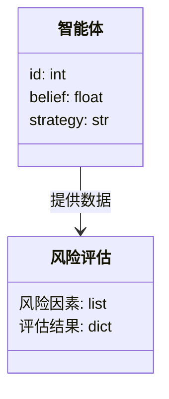
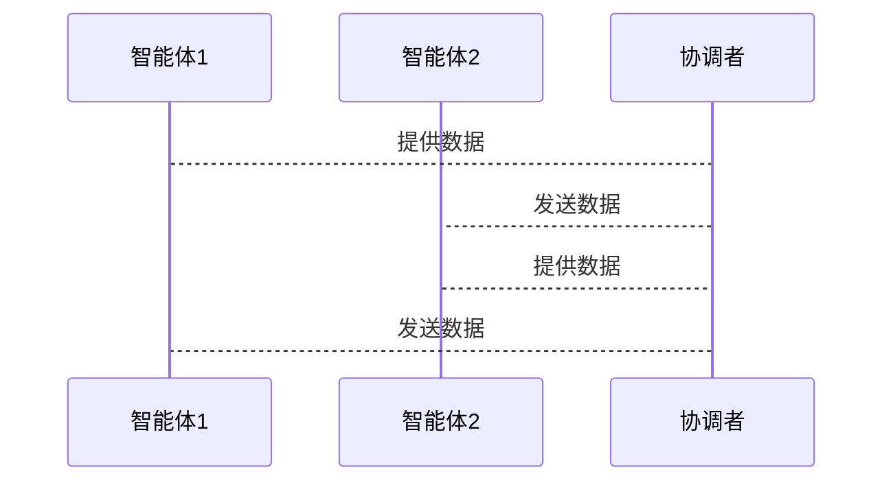

                 


# 多智能体协作进行系统性风险分析

## 关键词：多智能体协作、系统性风险分析、分布式计算、博弈论、系统架构设计、风险评估

## 摘要：  
本文探讨了多智能体协作在系统性风险分析中的应用，详细分析了多智能体协作的基本原理、系统性风险分析的核心要素，以及两者之间的联系。通过ER实体关系图和概念属性对比，明确了多智能体协作在系统性风险分析中的关键作用。结合具体算法和数学模型，阐述了多智能体协作在风险评估中的实际应用。通过系统架构设计和项目实战，展示了如何利用多智能体协作进行系统性风险分析，为相关领域提供了理论支持和实践指导。

---

# 第一部分: 多智能体协作与系统性风险分析的背景介绍

## 第1章: 多智能体协作与系统性风险分析概述

### 1.1 多智能体协作的基本概念

#### 1.1.1 多智能体系统的定义与特点
多智能体系统（Multi-Agent System, MAS）是由多个智能体（Agent）组成的分布式系统，这些智能体通过协作完成复杂任务。智能体具有自主性、反应性、主动性、社会性等特征，能够感知环境、自主决策并与其他智能体协作。

#### 1.1.2 系统性风险分析的定义与特点
系统性风险是指系统中某一组成部分的失败可能导致整个系统崩溃的风险。这种风险具有复杂性、关联性、难以预测性等特点，通常涉及多个因素的相互作用。

#### 1.1.3 多智能体协作在系统性风险分析中的作用
多智能体协作能够通过分布式计算和博弈论方法，模拟系统中各个因素之间的相互作用，从而识别和评估系统性风险。

### 1.2 系统性风险分析的背景与意义

#### 1.2.1 系统性风险的来源与特征
系统性风险的来源包括市场波动、金融杠杆、信息不对称等。其特征包括全局性、传染性、难以预测性等。

#### 1.2.2 系统性风险分析的重要性
系统性风险分析能够帮助我们识别潜在的系统性风险，提前制定应对策略，避免系统崩溃。

#### 1.2.3 多智能体协作的优势与必要性
多智能体协作能够通过分布式计算和博弈论方法，模拟系统中各个因素之间的相互作用，从而更准确地识别和评估系统性风险。

### 1.3 本章小结
本章介绍了多智能体协作和系统性风险分析的基本概念，分析了系统性风险的来源与特征，并探讨了多智能体协作在系统性风险分析中的作用和优势。

---

# 第二部分: 多智能体协作与系统性风险分析的核心概念与联系

## 第2章: 多智能体协作的核心概念

### 2.1 多智能体协作的原理

#### 2.1.1 多智能体协作的基本原理
多智能体协作是通过智能体之间的通信与协调，共同完成复杂任务的过程。智能体之间通过交换信息、协商决策，实现协作。

#### 2.1.2 多智能体协作的通信机制
智能体之间的通信机制包括发布-订阅模型、请求-响应模型等。通信内容包括状态、意图、行动等信息。

#### 2.1.3 多智能体协作的决策机制
智能体在协作过程中需要进行分布式决策，通常采用基于博弈论的方法，通过纳什均衡等概念确定最优策略。

### 2.2 系统性风险分析的核心要素

#### 2.2.1 系统性风险的构成要素
系统性风险的构成要素包括市场参与者、金融工具、金融机构、市场结构等。

#### 2.2.2 系统性风险的传播机制
系统性风险可以通过直接关联和间接关联传播，例如通过金融机构之间的相互依赖性传播风险。

#### 2.2.3 系统性风险的评估指标
系统性风险的评估指标包括系统脆弱性、系统杠杆率、系统相互依赖性等。

### 2.3 多智能体协作与系统性风险分析的联系

#### 2.3.1 多智能体协作在系统性风险分析中的应用
多智能体协作可以模拟市场参与者的决策行为，分析系统性风险的传播路径和影响范围。

#### 2.3.2 系统性风险分析对多智能体协作的促进作用
系统性风险分析需要多智能体协作的分布式计算能力和博弈论方法，从而推动多智能体协作技术的发展。

#### 2.3.3 两者结合的优势与挑战
两者结合的优势在于能够更准确地模拟系统的复杂性，提高风险分析的精度。挑战在于如何处理多智能体协作中的信息不对称和博弈冲突。

## 第3章: 多智能体协作与系统性风险分析的ER实体关系图

### 3.1 实体关系图的绘制

```mermaid
erDiagram
    participant A1 : 多智能体协作
    participant A2 : 系统性风险分析
    A1 --> A2 : 依赖于
    A2 --> A1 : 依赖于
```

### 3.2 概念属性特征对比表

| 属性 | 多智能体协作 | 系统性风险分析 |
|------|--------------|-----------------|
| 核心要素 | 智能体、通信机制、决策机制 | 系统、风险因素、传播路径 |
| 评估指标 | 协作效率、通信延迟、决策准确率 | 系统脆弱性、杠杆率、相互依赖性 |
| 传播机制 | 智能体间信息传递、决策影响 | 市场波动、金融杠杆、信息不对称 |

---

# 第三部分: 多智能体协作的算法原理讲解

## 第4章: 多智能体协作算法原理

### 4.1 多智能体协作的基本算法

#### 4.1.1 分布式belief updating算法

```mermaid
graph TD
    A[智能体A] --> B[智能体B]: 通信
    B --> C[智能体C]: 通信
    C --> D[智能体D]: 通信
```

Python实现：

```python
class Agent:
    def __init__(self, id):
        self.id = id
        self.belief = 0  # 初始信念

    def update_belief(self, neighbor_belief):
        self.belief = (self.belief + neighbor_belief) / 2

agents = [Agent(i) for i in range(4)]
for i in range(len(agents)):
    for j in range(i+1, len(agents)):
        agents[i].update_belief(agents[j].belief)
```

数学模型：

$$ belief_{i}^{new} = \frac{belief_{i} + belief_{j}}{2} $$

#### 4.1.2 Game-theoretic approaches算法

```mermaid
graph LR
    A[智能体A] --> G[博弈协调者]
    B[智能体B] --> G
    G --> A & B: 确定纳什均衡
```

Python实现：

```python
import numpy as np

def nash_equilibrium payoff_matrix):
    # 寻找纳什均衡
    strategies = payoff_matrix.shape[1]
    for profile in itertools.product(range(strategies), repeat=len(players)):
        if is_nash payoff_matrix, profile):
            return profile
    return None

def is_nash(payoff_matrix, profile):
    # 检查每个策略是否是最优反应
    for i in range(len(players)):
        current_payoff = payoff_matrix[players[i]][profile[i]]
        for other_profile in range(len(profile)):
            if other_profile != i:
                new_profile = list(profile)
                new_profile[i] = other_profile
                new_payoff = payoff_matrix[players[i]][new_profile[i]]
                if new_payoff > current_payoff:
                    return False
    return True
```

数学模型：

$$ NE = (s_1^*, s_2^*, ..., s_n^*) \text{，其中每个} s_i^* \text{是玩家i的最优反应} $$

---

# 第四部分: 系统分析与架构设计方案

## 第5章: 系统分析与架构设计

### 5.1 问题场景介绍

#### 5.1.1 项目介绍
我们设计了一个基于多智能体协作的系统性风险分析平台，用于评估金融市场的系统性风险。

#### 5.1.2 系统功能设计

##### 5.1.2.1 领域模型设计



##### 5.1.2.2 系统架构设计

```mermaid
container 系统边界 {
    智能体1
    智能体2
    智能体3
    协调者
}
```

##### 5.1.2.3 接口设计
- 智能体接口：通信接口、决策接口
- 协调者接口：协调接口、评估接口

##### 5.1.2.4 交互流程



### 5.2 系统实现

#### 5.2.1 环境安装
需要安装Python、numpy、itertools等库。

#### 5.2.2 核心代码实现

##### 5.2.2.1 智能体类实现

```python
class Agent:
    def __init__(self, id):
        self.id = id
        self.belief = 0  # 初始信念

    def update_belief(self, neighbor_belief):
        self.belief = (self.belief + neighbor_belief) / 2
```

##### 5.2.2.2 协调者类实现

```python
class Coordinator:
    def __init__(self, agents):
        self.agents = agents

    def coordinate(self):
        for i in range(len(self.agents)):
            for j in range(i+1, len(self.agents)):
                self.agents[i].update_belief(self.agents[j].belief)
```

##### 5.2.2.3 系统运行

```python
agents = [Agent(i) for i in range(4)]
coordinator = Coordinator(agents)
coordinator.coordinate()
```

#### 5.2.3 案例分析

##### 5.2.3.1 案例描述
假设我们有一个包含4个智能体的系统，每个智能体代表一个金融机构。我们希望评估这些金融机构之间的相互依赖性对系统性风险的影响。

##### 5.2.3.2 实施步骤
1. 初始化智能体的信念值。
2. 调用协调者进行信念更新。
3. 分析更新后的信念值，评估系统性风险。

##### 5.2.3.3 分析结果
通过分析智能体的信念更新过程，可以识别出哪些金融机构的失败可能引发系统性风险。

#### 5.2.4 项目小结
本项目通过多智能体协作模拟了金融机构之间的相互依赖性，成功识别了系统性风险的关键因素。

---

# 第五部分: 项目实战

## 第6章: 项目实战

### 6.1 环境安装

#### 6.1.1 安装Python
安装Python 3.8及以上版本。

#### 6.1.2 安装依赖
安装numpy、itertools等库。

```bash
pip install numpy itertools
```

### 6.2 核心代码实现

#### 6.2.1 智能体类实现

```python
class Agent:
    def __init__(self, id):
        self.id = id
        self.belief = 0  # 初始信念

    def update_belief(self, neighbor_belief):
        self.belief = (self.belief + neighbor_belief) / 2
```

#### 6.2.2 协调者类实现

```python
class Coordinator:
    def __init__(self, agents):
        self.agents = agents

    def coordinate(self):
        for i in range(len(self.agents)):
            for j in range(i+1, len(self.agents)):
                self.agents[i].update_belief(self.agents[j].belief)
```

#### 6.2.3 系统运行

```python
agents = [Agent(i) for i in range(4)]
coordinator = Coordinator(agents)
coordinator.coordinate()
```

### 6.3 案例分析

#### 6.3.1 案例描述
模拟一个包含4个金融机构的系统，评估它们之间的相互依赖性对系统性风险的影响。

#### 6.3.2 实施步骤
1. 初始化智能体的信念值。
2. 调用协调者进行信念更新。
3. 分析更新后的信念值，评估系统性风险。

#### 6.3.3 分析结果
通过分析智能体的信念更新过程，可以识别出哪些金融机构的失败可能引发系统性风险。

### 6.4 项目小结
本项目通过多智能体协作模拟了金融机构之间的相互依赖性，成功识别了系统性风险的关键因素。

---

# 第六部分: 总结与展望

## 第7章: 总结与展望

### 7.1 全文总结
本文探讨了多智能体协作在系统性风险分析中的应用，分析了多智能体协作的基本原理，系统性风险分析的核心要素，以及两者之间的联系。通过ER实体关系图和概念属性对比，明确了多智能体协作在系统性风险分析中的关键作用。结合具体算法和数学模型，阐述了多智能体协作在风险评估中的实际应用。通过系统架构设计和项目实战，展示了如何利用多智能体协作进行系统性风险分析，为相关领域提供了理论支持和实践指导。

### 7.2 展望
未来的研究方向包括：
1. 提高多智能体协作的效率和准确性。
2. 扩展系统性风险分析的应用领域。
3. 结合机器学习等技术，进一步提升系统性风险分析的能力。

---

# 结语

通过本文的探讨，我们希望读者能够深入了解多智能体协作在系统性风险分析中的应用，掌握相关的理论知识和实践技能，并能够在实际工作中灵活运用这些方法，为系统的安全性提供有力保障。

