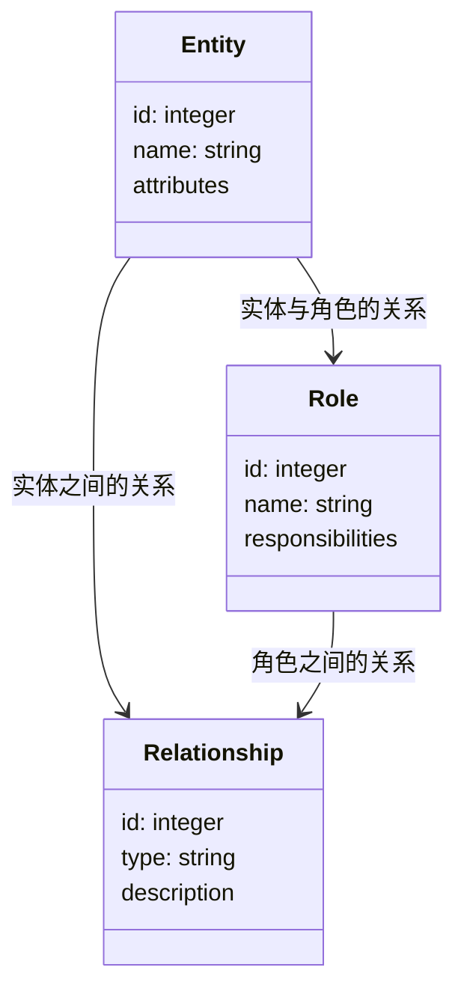

                 


# 多智能体协同分析供应链韧性

> 关键词：多智能体系统、供应链韧性、协同优化、分布式计算、供应链管理

> 摘要：供应链韧性是企业在复杂多变的市场环境中保持稳定运作的关键能力。本文通过分析多智能体协同在供应链韧性中的应用，探讨如何利用分布式计算、博弈论和优化算法等技术手段，提升供应链的整体抗风险能力和运营效率。文章结合理论分析和实际案例，深入剖析多智能体协同的核心机制，为企业构建更具韧性的供应链提供可行的解决方案。

---

# 多智能体协同分析供应链韧性

## 第1章: 供应链韧性的概念与重要性

### 1.1 供应链韧性的定义

#### 1.1.1 供应链的基本概念
供应链是指从供应商到消费者的整个流程中，涉及原材料采购、生产、分销、物流和销售等环节的系统。供应链的韧性是指系统在面对外部干扰（如自然灾害、疫情、市场波动等）时，能够迅速恢复并保持正常运作的能力。

#### 1.1.2 供应链韧性的内涵
供应链韧性不仅关注系统的抗干扰能力，还关注系统在干扰后的恢复速度和适应能力。一个有韧性的供应链能够在危机中快速调整策略，减少损失并恢复正常运作。

#### 1.1.3 供应链韧性与企业竞争力的关系
供应链韧性是企业竞争力的重要组成部分。在全球化和不确定性的环境下，供应链韧性决定了企业能否快速响应市场需求，降低运营风险，并在竞争中占据优势。

---

### 1.2 多智能体协同的概念

#### 1.2.1 多智能体系统的定义
多智能体系统（Multi-Agent System, MAS）是指由多个智能体组成的系统，每个智能体都是一个能够感知环境、自主决策、并与其他智能体协作的实体。

#### 1.2.2 多智能体系统的特点
- **自主性**：每个智能体都有一定的自主决策能力。
- **反应性**：智能体能够根据环境变化调整行为。
- **协作性**：智能体之间通过通信和协作完成共同目标。
- **分布性**：智能体分布在不同的位置，协同完成任务。

#### 1.2.3 多智能体协同在供应链中的应用
在供应链中，多智能体协同可以应用于需求预测、库存管理、物流调度、风险预警等多个环节。通过智能体之间的协作，供应链能够更高效地应对不确定性。

---

## 第2章: 供应链韧性分析的背景与挑战

### 2.1 供应链面临的挑战

#### 2.1.1 全球化带来的不确定性
全球化使得供应链跨越多个国家和地区，增加了复杂性和脆弱性。任何环节的中断都可能对整个供应链造成重大影响。

#### 2.1.2 疾病、自然灾害等突发事件的影响
突发事件（如疫情、地震）可能导致供应链中断，影响企业的正常运作。

#### 2.1.3 供应链复杂性与脆弱性
供应链涉及的环节多、参与者多，容易受到多种因素的影响，导致系统脆弱。

---

### 2.2 多智能体协同的优势

#### 2.2.1 提高供应链的响应能力
通过多智能体协同，供应链能够快速响应市场需求和突发事件，减少中断时间。

#### 2.2.2 优化资源分配与协同效率
智能体之间的协作能够优化资源分配，提高供应链的整体效率。

#### 2.2.3 增强供应链的抗风险能力
通过多智能体协同，供应链能够在突发事件中快速调整策略，增强抗风险能力。

---

## 第3章: 多智能体协同的核心原理

### 3.1 多智能体系统的组成

#### 3.1.1 实体与角色的定义
在供应链中，智能体可以是供应商、制造商、分销商、零售商或消费者。每个角色都有特定的职责和行为。

#### 3.1.2 实体之间的关系
通过通信和协作，实体之间形成复杂的关系网络。例如，供应商向制造商提供原材料，制造商向分销商提供产品。

#### 3.1.3 实体的属性与行为
每个实体都有自己的属性（如库存水平、生产能力）和行为（如订单处理、生产调度）。

---

### 3.2 多智能体协同的机制

#### 3.2.1 通信与信息共享
智能体之间通过通信共享信息，例如订单信息、库存状态、运输计划等。

#### 3.2.2 协作与任务分配
智能体之间协作完成任务，例如共同制定生产计划、分配运输资源。

#### 3.2.3 决策与协调
智能体根据共享信息自主决策，并通过协调机制确保决策的一致性和有效性。

---

## 第4章: 供应链韧性分析的数学模型与公式

### 4.1 供应链韧性评估指标

#### 4.1.1 指标选择的原则
选择评估指标时需要考虑指标的可测量性、相关性和实用性。

#### 4.1.2 常见评估指标
- **恢复时间**：供应链在中断后恢复到正常水平所需的时间。
- **中断成本**：中断期间的经济损失。
- **弹性指数**：衡量供应链在中断期间的适应能力。

#### 4.1.3 指标权重的确定
通过层次分析法（AHP）等方法确定各指标的权重。

---

### 4.2 多智能体协同的数学模型

#### 4.2.1 分布式优化模型
通过分布式优化算法，智能体之间协作优化供应链的整体成本和效率。

#### 4.2.2 协作决策模型
基于博弈论的协作决策模型，智能体通过博弈找到最优策略。

#### 4.2.3 网络流模型
将供应链视为网络流问题，通过优化网络流来提高供应链的韧性。

---

## 第5章: 供应链韧性分析的系统架构设计

### 5.1 问题场景介绍

#### 5.1.1 供应链韧性分析的目标
通过分析供应链的各个环节，识别潜在风险，并制定应对策略。

#### 5.1.2 问题的复杂性与挑战
供应链涉及多个环节和参与者，各环节之间存在复杂的依赖关系，增加了分析的难度。

#### 5.1.3 系统设计的必要性
通过系统化的设计，提高供应链的透明度和协同能力，降低风险。

---

### 5.2 系统功能设计

#### 5.2.1 领域模型设计（Mermaid类图）


---

## 第6章: 项目实战——电商平台的供应链韧性分析

### 6.1 环境安装

#### 6.1.1 安装Python和相关库
安装Python和必要的库，例如`numpy`、`pandas`、`scipy`等。

#### 6.1.2 安装依赖项
安装项目所需的依赖项，例如`networkx`用于网络分析。

#### 6.1.3 安装开发环境
安装Jupyter Notebook或其他开发环境。

---

### 6.2 核心代码实现

#### 6.2.1 供应链网络的构建
使用`networkx`库构建供应链网络。

```python
import networkx as nx
G = nx.DiGraph()
G.add_nodes_from(["Supplier", "Manufacturer", "Distributor", "Retailer", "Consumer"])
G.add_edges_from([("Supplier", "Manufacturer"), ("Manufacturer", "Distributor"), ("Distributor", "Retailer"), ("Retailer", "Consumer")])
```

#### 6.2.2 风险评估算法实现
实现基于博弈论的多智能体风险评估算法。

```python
def risk_assessment(G):
    # 通过博弈论计算每个节点的风险值
    pass
```

---

### 6.3 代码应用解读与分析

#### 6.3.1 供应链网络的可视化
使用`networkx`和`matplotlib`可视化供应链网络。

```python
import matplotlib.pyplot as plt
nx.draw(G, node_color='blue', edge_color='black')
plt.show()
```

#### 6.3.2 风险评估结果的解读
根据算法输出的风险评估结果，识别供应链中的高风险环节，并制定应对策略。

---

### 6.4 实际案例分析

#### 6.4.1 案例背景
分析某电商平台在疫情期间的供应链韧性表现。

#### 6.4.2 数据收集与处理
收集供应链各环节的数据，例如订单量、库存水平、运输时间等。

#### 6.4.3 数据分析与建模
使用多智能体协同模型分析供应链的韧性，并提出改进建议。

---

## 第7章: 小结与展望

### 7.1 最佳实践 tips

#### 7.1.1 数据驱动的决策
通过数据驱动的方法优化供应链的各个环节。

#### 7.1.2 智能化技术的应用
利用人工智能和大数据技术提高供应链的预测能力和应对能力。

#### 7.1.3 持续优化
定期评估和优化供应链的韧性，确保系统的灵活性和适应性。

---

### 7.2 小结

通过多智能体协同分析供应链韧性，企业能够更好地应对不确定性，提高供应链的整体抗风险能力和运营效率。

---

### 7.3 注意事项

- 在实际应用中，需注意数据隐私和安全问题。
- 多智能体协同需要各环节的良好配合，否则可能导致协调成本增加。
- 算法的选择和参数调优需要根据具体场景进行调整。

---

### 7.4 拓展阅读

- 建议阅读相关领域的书籍和论文，深入学习多智能体协同和供应链管理的知识。
- 关注行业动态，了解最新的技术应用和发展趋势。

---

通过以上目录和内容的安排，您可以逐步展开每一章的详细内容，结合实际案例和代码实现，深入分析多智能体协同在供应链韧性中的应用。

