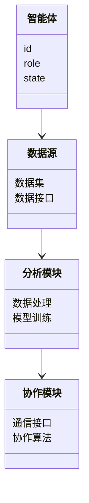

                 


好的，我们一步步来构建《多智能体协同分析全球价值链机会》的完整文章内容。由于篇幅限制，我将提供一个详细的大纲，并在每个部分提供简要的内容说明。

---

# 多智能体协同分析全球价值链机会

> 关键词：多智能体、协同分析、全球价值链、机会识别、算法原理、系统架构

> 摘要：本文深入探讨了多智能体协同在分析全球价值链机会中的应用。通过背景介绍、核心概念、算法原理、系统架构设计、项目实战和总结，全面分析了多智能体协同在优化全球价值链中的作用，展示了如何通过技术手段捕捉和利用全球价值链中的机会。

---

## 第1章: 多智能体协同系统概述

### 1.1 多智能体系统的基本概念

#### 1.1.1 多智能体系统的定义
多智能体系统（Multi-Agent System, MAS）是由多个智能体组成的系统，每个智能体都是一个能够感知环境、自主决策并采取行动的实体。智能体之间通过通信和协作完成复杂任务。

#### 1.1.2 多智能体系统的特征
- **自主性**：智能体能够自主决策。
- **反应性**：能够实时感知环境并做出反应。
- **协作性**：多个智能体通过协作完成共同目标。
- **分布性**：智能体之间分布式的计算和通信。

#### 1.1.3 多智能体系统与单智能体系统的区别
| 特性         | 单智能体系统              | 多智能体系统              |
|--------------|--------------------------|---------------------------|
| 系统结构     | 集中式                   | 分布式                   |
| 决策方式     | 单点决策                 | 分布式决策               |
| 通信需求     | 无                       | 高                       |
| 应用场景     | 简单任务                 | 复杂任务                 |

---

### 1.2 全球价值链分析的背景

#### 1.2.1 全球价值链的概念
全球价值链是指在全球范围内，不同国家和地区之间通过分工合作，共同生产和分配产品的链条。价值链的优化能够提高效率、降低成本。

#### 1.2.2 全球价值链的重要性
- 提高企业竞争力
- 降低成本
- 捕捉全球市场机会
- 优化资源配置

#### 1.2.3 多智能体协同在价值链分析中的作用
多智能体协同能够通过分布式计算和协作优化，帮助企业在全球价值链中找到最佳的合作伙伴和资源分配方案。

---

### 1.3 多智能体协同分析的必要性

#### 1.3.1 传统价值链分析的局限性
- 传统分析方法依赖人工判断，效率低
- 数据量大、复杂度高，难以处理
- 缺乏实时性和动态性

#### 1.3.2 多智能体协同的优势
- 分布式计算能力
- 实时协作
- 多目标优化

#### 1.3.3 多智能体协同在价值链优化中的应用
- 生产流程优化
- 供应链管理
- 市场机会识别

---

## 第2章: 全球价值链的机会分析

### 2.1 多智能体协同的机会识别

#### 2.1.1 机会识别的基本概念
机会识别是指通过分析市场、技术和资源等多方面因素，发现潜在的商业机会。

#### 2.1.2 多智能体协同在机会识别中的应用
- 数据收集与处理
- 数据分析与建模
- 机会评估与优先级排序

#### 2.1.3 全球价值链中的机会类型
- 市场机会
- 技术机会
- 资源机会

---

### 2.2 多智能体协同的机会分析方法

#### 2.2.1 数据收集与处理
- 数据来源：市场数据、企业数据、技术数据
- 数据清洗：去重、去噪
- 数据标准化：统一数据格式

#### 2.2.2 数据分析与建模
- 数据挖掘：使用机器学习算法发现潜在机会
- 建模：构建机会评估模型

#### 2.2.3 机会评估与优先级排序
- 评估指标：市场潜力、成本效益、风险评估
- 优先级排序：基于权重的排序方法

---

### 2.3 实际案例分析

#### 2.3.1 案例背景介绍
某跨国企业希望通过多智能体协同优化其全球供应链。

#### 2.3.2 多智能体协同的应用过程
- 数据收集与分析
- 智能体协作优化供应链
- 机会识别与实施

#### 2.3.3 案例分析结果与启示
通过多智能体协同，企业成功降低了成本，提高了效率。

---

## 第3章: 多智能体协同的核心概念与联系

### 3.1 多智能体协同的基本原理

#### 3.1.1 协同机制的定义
协同机制是指智能体之间通过通信和协作完成任务的方式。

#### 3.1.2 协同机制的分类
- 基于规则的协同
- 基于目标的协同
- 基于市场的协同

#### 3.1.3 协同机制的实现方式
- 通信协议
- 协作算法
- 分布式计算

---

### 3.2 多智能体协同与全球价值链的关系

#### 3.2.1 协同与价值链优化
- 协同机制能够优化全球价值链中的资源配置
- 协作算法能够提高供应链效率

#### 3.2.2 协同机制对价值链机会的影响
- 提高机会识别能力
- 优化机会评估过程
- 增强机会实施效果

---

## 第4章: 多智能体协同的算法原理

### 4.1 分布式计算算法

#### 4.1.1 分布式计算的基本原理
分布式计算是指将计算任务分解到多个节点上进行并行计算。

#### 4.1.2 分布式计算在多智能体协同中的应用
- 数据分发
- 任务分配
- 结果汇总

#### 4.1.3 分布式计算的实现步骤
1. 数据预处理
2. 任务分解
3. 并行计算
4. 结果合并

---

### 4.2 博弈论模型

#### 4.2.1 博弈论模型的基本原理
博弈论模型通过模拟各方的策略选择，找到最优解。

#### 4.2.2 博弈论模型在多智能体协同中的应用
- 供应链优化
- 市场竞争分析
- 资源分配

#### 4.2.3 博弈论模型的实现步骤
1. 定义博弈规则
2. 构建博弈树
3. 计算 Nash 均衡

---

## 第5章: 系统分析与架构设计

### 5.1 问题场景介绍

#### 5.1.1 项目背景
分析一个跨国企业的全球供应链优化问题。

#### 5.1.2 项目目标
通过多智能体协同优化供应链效率。

---

### 5.2 系统功能设计

#### 5.2.1 领域模型


---

### 5.3 系统架构设计

#### 5.3.1 系统架构图


---

## 第6章: 项目实战

### 6.1 环境安装

#### 6.1.1 安装Python
```bash
pip install python3
pip install numpy
pip install scikit-learn
```

#### 6.1.2 安装依赖
```bash
pip install mermaid
pip install matplotlib
```

---

### 6.2 核心实现

#### 6.2.1 数据处理代码
```python
import numpy as np
import pandas as pd

# 数据预处理
data = pd.read_csv('global_supply_chain.csv')
data.dropna(inplace=True)
```

#### 6.2.2 模型训练代码
```python
from sklearn.cluster import KMeans

# 聚类分析
model = KMeans(n_clusters=3)
model.fit(data)
```

#### 6.2.3 协作算法代码
```python
import requests

# 分布式计算
def distribute_task(task):
    response = requests.post('http://localhost:5000/task', json=task)
    return response.json()

distribute_task({'data': data})
```

---

### 6.3 案例分析

#### 6.3.1 案例背景
分析一个跨国企业的全球供应链优化问题。

#### 6.3.2 实施过程
1. 数据收集与处理
2. 模型训练
3. 分布式计算
4. 结果分析

---

## 第7章: 总结与展望

### 7.1 小结
通过多智能体协同，可以有效优化全球价值链中的资源配置，提高效率。

### 7.2 注意事项
- 数据隐私问题
- 系统安全性
- 算法优化

### 7.3 拓展阅读
- 《多智能体系统》
- 《全球价值链优化》

---

以上是《多智能体协同分析全球价值链机会》的详细目录和内容大纲。每个章节都包含了核心概念、算法原理、系统架构设计和项目实战等内容，确保读者能够全面理解和掌握多智能体协同在分析全球价值链机会中的应用。

