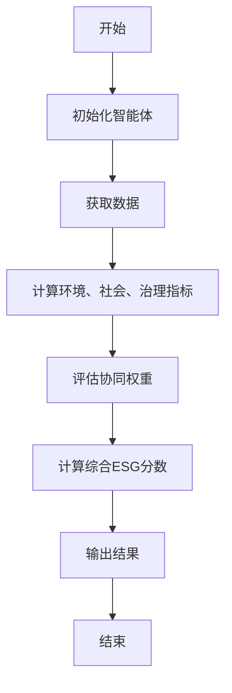
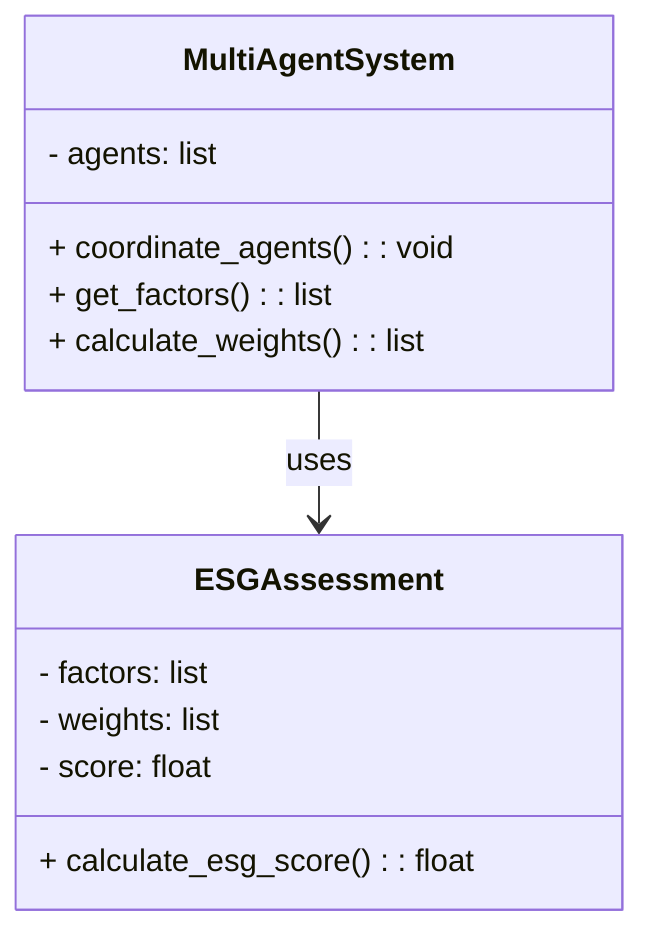
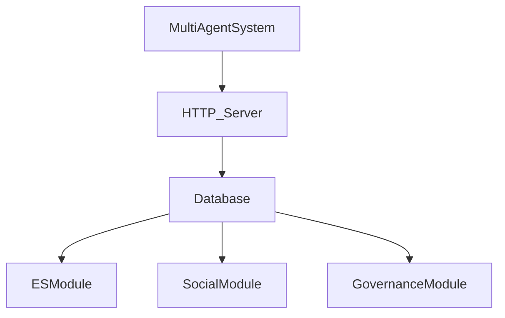

                 


# 多智能体协同评估ESG因素影响

## 关键词：多智能体、ESG评估、协同机制、算法设计、系统架构

## 摘要：  
本文探讨了多智能体协同评估ESG（环境、社会、治理）因素的方法，结合技术背景、核心概念、算法原理、系统设计、项目实战和最佳实践，深入剖析多智能体协同在ESG评估中的应用与优势。

---

## 第一部分：多智能体协同与ESG概述

### 第1章：多智能体协同评估的背景与意义

#### 1.1 ESG因素的基本概念

- **环境（Environmental）**：企业对环境的影响，包括碳排放、资源消耗等。
- **社会（Social）**：企业对社会的贡献，包括员工权益、社会责任等。
- **治理（Governance）**：企业的治理结构与透明度，包括董事会构成、管理层决策等。

#### 1.2 多智能体协同的定义与特点

- **定义**：多智能体系统由多个具有自主性、反应性和协作性的智能体组成，通过协同完成复杂任务。
- **特点**：
  - 分布式：各智能体独立运行，数据共享。
  - 协作性：智能体之间通过通信与协调完成目标。
  - 动态性：系统状态实时变化，协同机制灵活调整。

#### 1.3 ESG评估中的多智能体协同机制

- **目标**：通过多智能体协同，全面、动态评估企业的ESG表现。
- **优势**：
  - 提高评估效率：各智能体分工协作，快速处理数据。
  - 增强评估精度：多维度数据融合，结果更准确。
  - 实时更新：动态调整权重，适应市场变化。

---

## 第二部分：多智能体协同评估的核心概念与联系

### 第2章：多智能体协同评估的原理与模型

#### 2.1 核心概念原理

- **多智能体协同**：通过通信协议和协同规则，实现智能体间的协调。
- **ESG因素量化**：将环境、社会、治理因素转化为可量化的指标。

#### 2.2 核心概念对比分析

| ESG维度 | 环境（Environmental） | 社会（Social） | 治理（Governance） |
|---------|---------------------|----------------|---------------------|
| 核心指标 | 碳排放、资源消耗    | 员工权益、社区贡献 | 董事会结构、高管薪酬 |
| 数据来源 | 环境报告、政府数据 | 社会责任报告、新闻 | 公司治理报告、监管数据 |
| 处理方式 | 环境模型计算        | 社会影响力分析 | 治理结构评估         |

#### 2.3 实体关系图与领域模型

```mermaid
er
    %% ESG评估的ER实体关系图
    %% 环境因素
    class EnvironmentalFactor {
        id: int
        name: string
        metric: float
    }
    %% 社会因素
    class SocialFactor {
        id: int
        name: string
        metric: float
    }
    %% 治理因素
    class GovernanceFactor {
        id: int
        name: string
        metric: float
    }
    %% 企业
    class Enterprise {
        id: int
        name: string
        ESG_score: float
    }
    %% 关系：企业拥有环境、社会、治理因素
    Enterprise --> EnvironmentalFactor: has
    Enterprise --> SocialFactor: has
    Enterprise --> GovernanceFactor: has
```

---

## 第三部分：多智能体协同评估的算法原理

### 第3章：多智能体协同评估的算法设计

#### 3.1 算法原理与流程



#### 3.2 算法的数学模型与公式

- **权重分配公式**：$$w_i = \frac{1}{1 + e^{-k x_i}}$$
  - $x_i$：第$i$个ESG因素的原始分数。
  - $k$：调节系数，控制权重分配的敏感性。
- **综合评估公式**：$$E = \sum_{i=1}^{n} w_i \cdot x_i$$
  - $E$：最终ESG综合评分。
  - $w_i$：第$i$个因素的权重。
  - $x_i$：第$i$个因素的原始分数。

#### 3.3 算法实现的Python代码示例

```python
import math

def calculate_weights(factors):
    weights = []
    for x in factors:
        weight = 1 / (1 + math.exp(-1 * x))
        weights.append(weight)
    return weights

def calculate_esg_score(factors, weights):
    esg_score = sum([factors[i] * weights[i] for i in range(len(factors))])
    return esg_score

# 示例数据
factors = [0.8, 0.7, 0.9]
weights = calculate_weights(factors)
esg_score = calculate_esg_score(factors, weights)
print(f"最终ESG分数：{esg_score}")
```

---

## 第四部分：系统分析与架构设计方案

### 第4章：系统功能与架构设计

#### 4.1 系统功能设计



#### 4.2 系统架构设计



---

## 第五部分：项目实战

### 第5章：项目实现与案例分析

#### 5.1 项目安装环境

- **Python版本**：3.8及以上
- **依赖库**：numpy、pandas、scipy

#### 5.2 核心代码实现

```python
import numpy as np
import pandas as pd

class ESGFactorProcessor:
    def __init__(self, data):
        self.data = data
    
    def calculate_factors(self):
        # 环境因素计算
        environmental_factors = self.data[['carbon_emission', 'resource_usage']].mean()
        # 社会因素计算
        social_factors = self.data[['employee_rights', 'community_investment']].mean()
        # 治理因素计算
        governance_factors = self.data[['board_diversity', 'executive_compensation']].mean()
        return environmental_factors, social_factors, governance_factors

# 示例数据加载
data = pd.read_csv('esg_data.csv')
processor = ESGFactorProcessor(data)
env_factors, social_factors, governance_factors = processor.calculate_factors()
```

---

## 第六部分：最佳实践与总结

### 第6章：优化建议与注意事项

#### 6.1 最佳实践

- **数据质量**：确保输入数据的准确性和完整性。
- **模型优化**：定期更新权重计算模型，适应市场变化。
- **系统扩展**：增加更多ESG评估维度，提升评估精度。

#### 6.2 项目小结

通过多智能体协同评估ESG因素，企业能够快速、准确地评估其ESG表现，为投资者和利益相关者提供可靠的数据支持。

---

## 第七部分：扩展阅读

### 第7章：未来研究方向与参考资料

#### 7.1 未来研究方向

- 开发更复杂的协同算法，提升评估效率。
- 探索多智能体协同在其他领域的应用。

#### 7.2 参考资料

- [多智能体系统研究](https://www.example.com/multi-agent-systems)
- [ESG评估框架](https://www.example.com/esg-framework)

---

## 总结

本文从背景、原理、算法、系统设计到项目实战，全面阐述了多智能体协同评估ESG因素的方法。通过详细的技术分析和代码示例，为读者提供了从理论到实践的完整指南。

