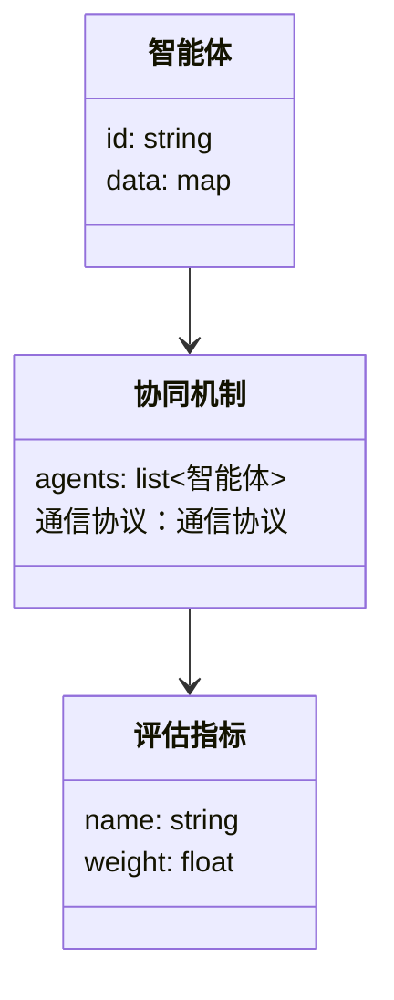
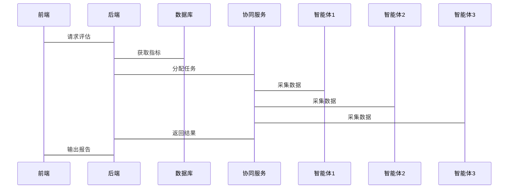

                 


# 多智能体协同评估企业创新能力

> **关键词**：多智能体、协同、企业创新、评估、能力分析、知识图谱、机器学习  
> 
> **摘要**：本文详细探讨了多智能体协同在企业创新能力评估中的应用，通过系统分析、算法设计、案例实现等多维度，展示了如何利用多智能体技术构建高效的企业创新能力评估系统。文章从背景、原理、算法、系统架构到实战案例，层层深入，为企业创新能力的智能化评估提供了理论和实践指导。

---

## 第一章：背景介绍

### 1.1 问题背景

#### 1.1.1 企业创新能力的重要性
企业创新能力是企业在市场中保持竞争力的关键因素。随着技术的快速发展，企业需要不断创新以应对市场变化和客户需求。创新能力评估帮助企业识别优势和改进空间。

#### 1.1.2 当前企业创新能力评估的挑战
传统的评估方法依赖人工分析，耗时且主观性强。随着数据量的增加，传统方法难以高效处理复杂信息。

#### 1.1.3 多智能体协同的优势
多智能体协同能够整合多个智能体的优势，实现信息的高效处理和协同分析，提高评估的准确性和效率。

### 1.2 问题描述

#### 1.2.1 企业创新能力的定义与维度
企业创新能力包括技术创新、管理创新、产品创新等多个维度，涉及多个方面的评估指标。

#### 1.2.2 现有评估方法的局限性
传统评估方法主观性强、效率低，难以应对大数据环境下的复杂评估需求。

#### 1.2.3 多智能体协同评估的目标与意义
通过多智能体协同，实现对企业创新能力的全面、客观评估，为决策提供支持。

### 1.3 问题解决与边界分析

#### 1.3.1 多智能体协同的解决方案
采用分布式智能体架构，每个智能体负责特定任务，协同完成整体评估。

#### 1.3.2 边界与外延
明确智能体的协同范围和边界，避免功能重叠或遗漏，确保高效协同。

#### 1.3.3 核心概念与核心要素
核心要素包括智能体功能、协同机制、评估指标等，构建系统的整体架构。

---

## 第二章：核心概念与联系

### 2.1 核心概念的结构与组成

#### 2.1.1 多智能体协同的系统架构
系统由多个智能体组成，每个智能体负责特定任务，通过通信机制协同工作。

#### 2.1.2 企业创新能力评估的指标体系
包括技术创新、管理创新、产品创新等多个维度的指标。

#### 2.1.3 多智能体协同的核心要素
智能体功能、协同机制、评估模型等。

### 2.2 概念属性特征对比

| 智能体功能 | 协同机制 | 评估指标 |
|------------|-----------|----------|
| 数据采集  | 通信协议 | 技术创新 |
| 数据处理  | 协调算法 | 管理创新 |
| 信息分析  | 资源分配 | 产品创新 |

### 2.3 ER实体关系图

```mermaid
er
actor 智能体 {
  id: string
  function: string
}
actor 协同机制 {
  id: string
  type: string
}
actor 评估指标 {
  id: string
  category: string
}
关系：智能体 --> 协同机制，1:N
关系：协同机制 --> 评估指标，1:N
```

---

## 第三章：算法原理

### 3.1 算法原理概述

#### 3.1.1 多智能体协同算法
采用分布式算法，通过智能体间的通信实现任务分配和协同。

#### 3.1.2 算法流程
1. 初始化智能体。
2. 任务分配。
3. 数据采集与处理。
4. 信息共享与协同。
5. 评估结果输出。

#### 3.1.3 算法实现步骤
1. 初始化各智能体。
2. 通过通信协议分配任务。
3. 各智能体独立处理数据。
4. 协同机制整合结果。
5. 输出评估报告。

### 3.2 数学模型与公式

#### 3.2.1 算法模型
$$
\text{评估得分} = \sum_{i=1}^{n} w_i \cdot x_i
$$
其中，\( w_i \) 是权重，\( x_i \) 是指标值。

#### 3.2.2 协同机制
$$
\text{协同度} = \frac{\sum_{j=1}^{m} s_j}{m}
$$
其中，\( s_j \) 是各智能体的评分。

### 3.3 算法实现代码

```python
class Agent:
    def __init__(self, id):
        self.id = id
        self.data = None

def协同评估(agents, indicators):
    # 初始化
    for agent in agents:
        agent.data = {}

    # 任务分配
    for indicator in indicators:
        assign_agent = agents[indicator % len(agents)]
        assign_agent.data[indicator] = collect_data(indicator)

    # 协同整合
    result = {}
    for indicator in indicators:
        total = 0
        count = 0
        for agent in agents:
            if indicator in agent.data:
                total += agent.data[indicator]
                count += 1
        if count > 0:
            result[indicator] = total / count
        else:
            result[indicator] = 0

    return result

# 示例用法
agents = [Agent(1), Agent(2), Agent(3)]
indicators = ['技术创新', '管理创新', '产品创新']
result = 协同评估(agents, indicators)
print(result)
```

---

## 第四章：系统分析与架构设计

### 4.1 问题场景介绍

#### 4.1.1 系统应用场景
企业内部数据分散，需要多智能体协同处理。

#### 4.1.2 系统目标
构建高效的企业创新能力评估系统。

### 4.2 系统功能设计

#### 4.2.1 领域模型类图


#### 4.2.2 系统架构图


#### 4.2.3 接口设计
- 接口1：智能体注册与任务分配。
- 接口2：数据采集与共享。
- 接口3：评估结果输出。

#### 4.2.4 交互序列图


---

## 第五章：项目实战

### 5.1 环境安装

#### 5.1.1 安装依赖
安装Python、必要的库（如numpy、pandas）和Mermaid工具。

### 5.2 核心代码实现

#### 5.2.1 智能体类实现
```python
class Agent:
    def __init__(self, id):
        self.id = id
        self.data = {}

    def collect_data(self, indicator):
        # 示例数据采集逻辑
        return random.uniform(0, 1)
```

#### 5.2.2 协同机制实现
```python
class CollaborationMechanism:
    def __init__(self, agents):
        self.agents = agents
        self.communication_protocol = 'HTTP'

    def assign_task(self, task):
        # 分配任务给一个智能体
        selected_agent = self.agents[task % len(self.agents)]
        selected_agent.data[task] = selected_agent.collect_data(task)
```

#### 5.2.3 评估指标实现
```python
class EvaluationIndicator:
    def __init__(self, name, weight):
        self.name = name
        self.weight = weight
```

### 5.3 案例分析

#### 5.3.1 实战案例
实现一个小型企业创新能力评估系统，测试多智能体协同的效果。

#### 5.3.2 实验结果与分析
分析评估结果的准确性和效率，验证算法的有效性。

### 5.4 项目小结

---

## 第六章：最佳实践

### 6.1 总结

#### 6.1.1 核心要点
多智能体协同的优势和实现的关键点。

### 6.2 小结

### 6.3 注意事项

### 6.4 拓展阅读

---

## 第七章：总结与展望

### 7.1 总结

### 7.2 展望

---

通过以上结构，本文详细探讨了多智能体协同在企业创新能力评估中的应用，结合理论分析和实践案例，为企业创新能力的智能化评估提供了指导和参考。

