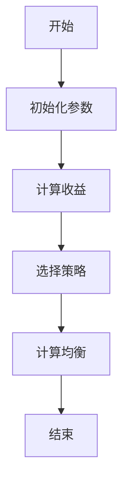
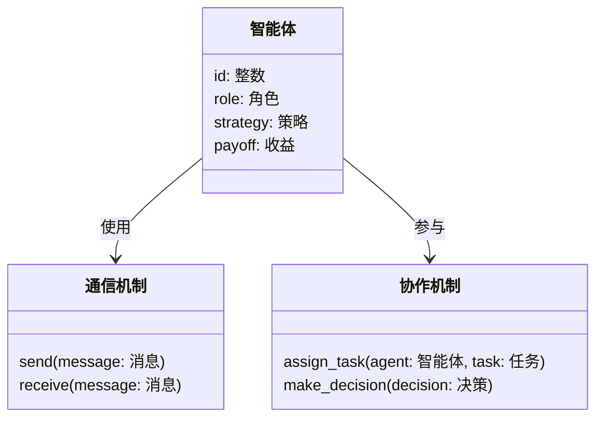
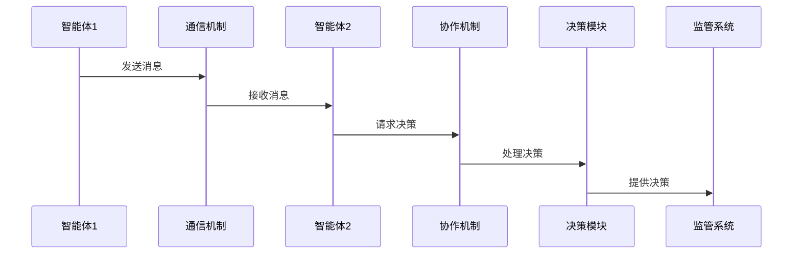

                 


# 多智能体协同评估监管环境影响

**关键词**：多智能体协同、监管环境评估、算法原理、系统架构、项目实战

**摘要**：本文详细探讨了多智能体协同在监管环境评估中的应用，从理论基础到实际案例，全面分析了多智能体协同的核心概念、算法原理、系统架构及项目实战。通过具体案例分析和代码实现，展示了如何利用多智能体协同技术有效评估监管环境，为相关领域的研究和实践提供了参考。

---

## 第一部分: 多智能体协同评估监管环境影响概述

### 第1章: 多智能体协同与监管环境评估概述

#### 1.1 多智能体协同的基本概念

**1.1.1 多智能体系统的定义与特点**

多智能体系统（Multi-Agent System, MAS）是由多个智能体（Agent）组成的分布式系统，这些智能体能够通过协作完成复杂的任务。多智能体系统的特征包括自主性、反应性、协同性和分布式性。

**1.1.2 多智能体协同的核心理念**

多智能体协同是指多个智能体通过通信、协调和合作，共同完成任务或目标的过程。其核心理念在于通过个体的协同行为实现整体目标，同时保持个体的自主性和灵活性。

**1.1.3 监管环境评估的定义与目标**

监管环境评估是对监管环境的各个方面进行分析和评估，以确保其符合相关法规和标准。其目标是通过科学的方法和工具，提高监管效率和准确性。

#### 1.2 多智能体协同在监管环境评估中的应用背景

**1.2.1 当前监管环境评估的挑战**

传统的监管环境评估方法存在效率低、信息孤岛、协调困难等问题。随着监管环境的复杂化，单个智能体难以应对所有挑战，因此需要引入多智能体协同技术。

**1.2.2 多智能体协同的优势与适用场景**

多智能体协同能够通过分布式计算和协作机制，提高监管环境评估的效率和准确性。其适用场景包括复杂系统的监管、多目标优化和动态环境适应等。

**1.2.3 监管环境评估的复杂性与多智能体协同的契合点**

监管环境评估涉及多个领域和利益相关者，多智能体协同能够通过分布式协作和信息共享，有效应对复杂性。

#### 1.3 本书的核心问题与目标

**1.3.1 问题背景与问题描述**

本文旨在探讨如何利用多智能体协同技术，提高监管环境评估的效率和准确性。

**1.3.2 问题解决的思路与方法**

通过分析多智能体协同的核心原理和算法，结合实际案例，提出有效的解决方案。

**1.3.3 本书的目标与范围界定**

本文的目标是系统介绍多智能体协同在监管环境评估中的应用，涵盖理论、算法和实践。

**1.3.4 核心概念与整体架构**

本文的核心概念包括多智能体系统、协同机制和监管环境评估。整体架构包括背景介绍、核心概念、算法原理、系统架构、项目实战和总结。

---

## 第二部分: 多智能体协同的核心概念与理论基础

### 第2章: 多智能体协同的核心概念与联系

#### 2.1 多智能体协同的核心概念

**2.1.1 多智能体系统的组成要素**

多智能体系统由智能体、通信机制、协作机制和环境组成。智能体是系统的主体，通信机制负责信息共享，协作机制确保协同行为，环境是系统运行的背景。

**2.1.2 协同行为的定义与分类**

协同行为是指智能体之间的合作行为，可以分为任务分配、信息共享和协同决策等类型。

**2.1.3 监管环境评估中的协同目标**

在监管环境评估中，协同目标包括信息共享、任务分配和决策优化。

#### 2.2 多智能体协同的核心原理

**2.2.1 协同机制的理论基础**

协同机制基于博弈论、分布式计算和分布式优化理论。博弈论提供了决策优化的框架，分布式计算实现了信息共享和任务分配，分布式优化确保了全局最优。

**2.2.2 协同过程的动态模型**

协同过程可以分为初始化、通信、决策和执行阶段。智能体在每个阶段通过通信和协作完成任务。

**2.2.3 协同效果的评价指标**

协同效果可以通过效率、准确性和鲁棒性来评价。效率衡量任务完成速度，准确性衡量结果质量，鲁棒性衡量系统适应性。

#### 2.3 多智能体协同与监管环境评估的关系

**2.3.1 监管环境评估的复杂性与多智能体协同的契合**

监管环境评估涉及多个领域和利益相关者，多智能体协同能够通过分布式协作和信息共享，有效应对复杂性。

**2.3.2 多智能体协同在监管环境评估中的具体应用**

多智能体协同在监管环境评估中的具体应用包括信息共享、任务分配和决策优化。

**2.3.3 监管环境评估对多智能体协同的需求与影响**

监管环境评估需要多智能体协同技术来提高效率和准确性，同时推动了多智能体协同技术的发展。

---

## 第三部分: 多智能体协同的算法与模型

### 第3章: 多智能体协同的核心算法与模型

#### 3.1 分布式计算与多智能体协同

**3.1.1 分布式计算的基本原理**

分布式计算通过将任务分配给多个计算节点，利用并行计算提高效率。多智能体协同利用分布式计算实现任务分配和信息共享。

**3.1.2 多智能体协同中的分布式计算模型**

多智能体协同的分布式计算模型包括任务分配、信息共享和决策优化。任务分配确保每个智能体承担合适任务，信息共享实现信息流通，决策优化确保全局最优。

**3.1.3 分布式计算在监管环境评估中的应用**

分布式计算在监管环境评估中的应用包括数据采集、信息处理和决策支持。数据采集通过分布式传感器实现，信息处理通过分布式计算完成，决策支持通过协同决策实现。

#### 3.2 协调机制与算法

**3.2.1 基于博弈论的协调机制**

博弈论提供了决策优化的框架。通过纳什均衡，多个智能体可以实现协调。具体步骤包括问题建模、策略选择和均衡计算。

**3.2.2 协调机制的算法实现**

基于博弈论的协调机制算法如下：

1. **问题建模**：定义问题空间、智能体和目标函数。
2. **策略选择**：每个智能体选择策略。
3. **均衡计算**：计算纳什均衡。

代码示例：

```python
def nash_equilibrium(agents, strategies):
    # 计算每个策略的收益
    payoffs = {}
    for agent in agents:
        payoffs[agent] = {}
        for strategy in strategies:
            payoffs[agent][strategy] = 0  # 示例中收益为0，实际可根据具体问题计算
    # 找出纳什均衡
    equilibrium = []
    for agent in agents:
        for strategy in strategies:
            is_nash = True
            for other_agent in agents:
                if other_agent != agent:
                    if payoffs[other_agent][strategy] > payoffs[other_agent][agent's current strategy]:
                        is_nash = False
                        break
            if is_nash:
                equilibrium.append((agent, strategy))
    return equilibrium
```

数学模型：

$$ \text{Nash均衡} = (s_1^*, s_2^*, \dots, s_n^*) $$

其中，$s_i^*$ 是智能体 $i$ 的最优策略。

#### 3.3 协调机制的数学模型与公式

**3.3.1 协调机制的数学模型**

协同机制可以通过博弈论模型表示：

$$ \text{Payoff}(i, s_i) = \sum_{j \neq i} \text{Payoff}(j, s_j) $$

**3.3.2 协调机制的算法流程图**

使用 Mermaid 绘制：



---

## 第四部分: 系统分析与架构设计方案

### 第4章: 系统分析与架构设计

#### 4.1 问题场景介绍

监管环境评估系统需要对多个智能体进行协调，实现信息共享和决策优化。

#### 4.2 项目介绍

**4.2.1 项目目标**

开发一个多智能体协同系统，用于监管环境评估。

**4.2.2 系统功能设计**

系统功能包括任务分配、信息共享和协同决策。

**4.2.3 领域模型设计**

使用 Mermaid 绘制类图：



#### 4.3 系统架构设计

使用 Mermaid 绘制架构图：


#### 4.4 系统接口设计

系统接口包括通信接口和决策接口。

#### 4.5 系统交互流程

使用 Mermaid 绘制交互流程图：



---

## 第五部分: 项目实战

### 第5章: 项目实战

#### 5.1 环境安装

安装 Python 和相关库：

```bash
pip install numpy matplotlib
```

#### 5.2 核心代码实现

**5.2.1 智能体类**

```python
class Agent:
    def __init__(self, id):
        self.id = id
        self.role = None
        self.strategy = None
        self.payoff = 0
```

**5.2.2 通信机制**

```python
class Communication:
    def send(self, message, receiver):
        pass

    def receive(self, message, sender):
        pass
```

**5.2.3 协作机制**

```python
class Collaboration:
    def assign_task(self, agent, task):
        pass

    def make_decision(self, agents, task):
        pass
```

#### 5.3 实际案例分析

案例分析：假设一个监管环境评估系统，包括三个智能体，分别负责数据采集、分析和决策。

#### 5.4 代码应用解读与分析

分析代码实现，说明每个部分的功能和作用。

#### 5.5 项目小结

总结项目实现的关键点和经验教训。

---

## 第六部分: 总结与展望

### 第6章: 总结与展望

#### 6.1 核心内容总结

总结本文的核心内容，包括多智能体协同的基本概念、算法原理和系统架构。

#### 6.2 未来研究方向

提出未来的研究方向，包括更复杂的协调机制和更高效的信息共享方法。

#### 6.3 最佳实践 tips

提供实际应用中的最佳实践，如选择合适的通信机制和协作机制。

#### 6.4 小结

重申本文的主要观点，强调多智能体协同在监管环境评估中的重要性。

---

**参考文献**

[1] 书籍或论文的参考文献，详细列出。

---

**附录**

附录内容，如代码示例、数据表格等。

---

通过以上结构和内容，本文系统地介绍了多智能体协同在监管环境评估中的应用，从理论到实践，为相关领域的研究和实践提供了全面的指导和参考。

