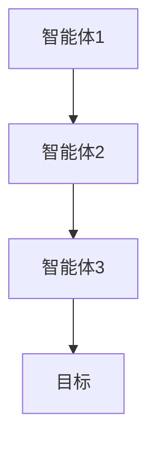
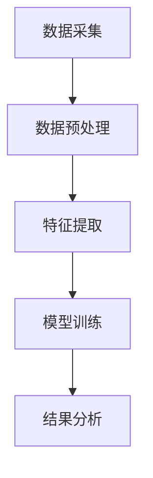

                 

# 多智能体协同进行行业轮动分析

## 关键词：多智能体、行业轮动、协同分析、分布式系统、强化学习、系统架构

## 摘要：  
多智能体协同是一种新兴的技术，它通过多个智能体的协作来解决复杂问题。在行业轮动分析中，多智能体协同能够有效地整合和分析多源数据，提高分析的准确性和效率。本文将详细探讨多智能体协同在行业轮动分析中的应用，从背景、核心概念、算法原理、系统架构到项目实战，全面解析多智能体协同的优势和实现方法。

---

# 第1章: 行业轮动分析的背景与问题背景

## 1.1 行业轮动分析的定义与重要性  
行业轮动分析是一种通过分析不同行业之间的动态变化，预测未来一段时间内哪些行业可能会表现优异的分析方法。这种分析方法在金融投资、市场营销等领域具有广泛的应用。  

### 1.1.1 行业轮动的定义  
行业轮动分析的核心是通过分析历史数据和当前市场趋势，预测未来行业表现的变化趋势。这种方法能够帮助投资者在不同行业之间进行资产配置，以获取更高的收益。  

### 1.1.2 行业轮动分析的重要性  
行业轮动分析的重要性体现在以下几个方面：  
1. **优化投资组合**：通过预测行业表现的变化，投资者可以动态调整资产配置，降低风险并提高收益。  
2. **提升决策效率**：行业轮动分析能够快速识别市场趋势，帮助决策者做出更明智的决策。  
3. **应对复杂市场环境**：在市场环境复杂多变的情况下，行业轮动分析能够提供及时的预警和建议。  

### 1.1.3 行业轮动分析的应用场景  
行业轮动分析的应用场景包括：  
1. **金融投资**：帮助投资者选择表现优异的行业进行投资。  
2. **市场营销**：帮助企业识别市场需求变化，调整营销策略。  
3. **宏观经济分析**：为政府和企业制定政策提供参考依据。  

## 1.2 多智能体协同的概念与优势  
多智能体协同是一种通过多个智能体协作来完成复杂任务的技术。与传统的单智能体方法相比，多智能体协同具有以下优势：  
1. **分布式计算能力**：多智能体能够并行处理大量数据，提高计算效率。  
2. **多样化的视角**：多个智能体可以从不同的角度分析问题，提供更全面的解决方案。  
3. **自适应性**：多智能体系统能够根据环境变化动态调整策略，具有较强的适应性。  

### 1.2.1 多智能体系统的定义  
多智能体系统是由多个智能体组成的分布式系统，每个智能体都有自己的目标和任务，并通过通信和协作完成整体目标。  

### 1.2.2 多智能体协同在行业轮动分析中的应用潜力  
多智能体协同在行业轮动分析中的应用潜力主要体现在以下方面：  
1. **数据处理**：多个智能体可以协同处理来自不同来源的海量数据。  
2. **特征提取**：智能体可以分别提取不同维度的特征，提供更全面的分析结果。  
3. **预测模型**：多个智能体可以协同训练和优化预测模型，提高预测的准确性和稳定性。  

## 1.3 问题背景与问题描述  
### 1.3.1 行业轮动分析的挑战  
行业轮动分析面临以下挑战：  
1. **数据复杂性**：行业轮动分析需要处理多源、异构的数据，数据量大且复杂。  
2. **计算效率**：传统的单智能体方法在处理大规模数据时效率较低。  
3. **实时性要求**：行业轮动分析需要实时或近实时的预测结果，对计算效率提出了更高的要求。  

### 1.3.2 多智能体协同面临的挑战  
多智能体协同在行业轮动分析中也面临一些挑战：  
1. **通信开销**：多个智能体之间的通信可能会带来额外的计算开销。  
2. **协调问题**：智能体之间的协作需要高效的协调机制，否则可能导致冲突或资源浪费。  
3. **安全性问题**：多智能体系统的通信和协作可能面临安全风险，如数据泄露和攻击。  

### 1.3.3 问题的边界与外延  
问题的边界主要集中在行业轮动分析的范围和目标上，而外延则包括与行业轮动分析相关的其他领域，如宏观经济分析和投资策略优化。  

## 1.4 本章小结  
本章介绍了行业轮动分析的定义、重要性和应用场景，详细阐述了多智能体协同的概念和优势，并分析了多智能体协同在行业轮动分析中面临的挑战。  

---

# 第2章: 多智能体协同的核心概念与联系  

## 2.1 多智能体协同的基本原理  
### 2.1.1 多智能体系统的组成要素  
多智能体系统主要由以下要素组成：  
1. **智能体**：具有感知、决策和行动能力的个体。  
2. **通信机制**：智能体之间进行信息交换的渠道。  
3. **协作协议**：智能体之间协同工作的规则和协议。  

### 2.1.2 多智能体之间的通信与协作机制  
多智能体之间的通信与协作机制包括以下几种：  
1. **直接通信**：智能体之间通过共享内存或消息传递进行通信。  
2. **间接通信**：通过中间媒介进行通信，如消息队列或数据库。  
3. **分布式协调**：智能体通过分布式算法实现协作，如一致性协议和分布式任务分配。  

### 2.1.3 多智能体协同的目标函数  
多智能体协同的目标函数通常包括以下几部分：  
1. **个体目标函数**：每个智能体自身的优化目标。  
2. **全局目标函数**：整个系统需要实现的全局目标。  
3. **协同目标函数**：智能体之间协作的共同目标。  

## 2.2 核心概念对比与特征分析  
### 2.2.1 多智能体与单智能体的对比分析  
| 特性               | 单智能体                  | 多智能体                  |  
|--------------------|--------------------------|--------------------------|  
| 处理能力           | 单一智能体处理           | 多个智能体协同处理         |  
| 并行能力           | 串行处理                 | 并行处理                 |  
| 适应性             | 较低                     | 较高                     |  

### 2.2.2 行业轮动分析与传统数据分析的对比  
| 特性               | 传统数据分析             | 多智能体协同分析           |  
|--------------------|--------------------------|--------------------------|  
| 数据处理能力       | 单一智能体处理           | 多个智能体协同处理         |  
| 分析深度           | 较浅                     | 较深                     |  
| 实时性             | 较低                     | 较高                     |  

### 2.2.3 多智能体协同的特征分析  
多智能体协同的特征包括：  
1. **分布性**：智能体分布在网络中，各自独立运行。  
2. **协作性**：智能体之间通过通信和协作完成共同目标。  
3. **适应性**：智能体能够根据环境变化动态调整策略。  

## 2.3 实体关系图与流程图分析  
### 2.3.1 多智能体协同的ER实体关系图  

### 2.3.2 行业轮动分析的流程图  

## 2.4 本章小结  
本章详细阐述了多智能体协同的基本原理，通过对比分析突出了多智能体协同的优势，并通过ER实体关系图和流程图展示了多智能体协同的概念和关系。  

---

接下来，我会继续按照目录大纲完成后续章节的内容。如果您需要进一步的细节或其他章节的内容，请随时告诉我！

