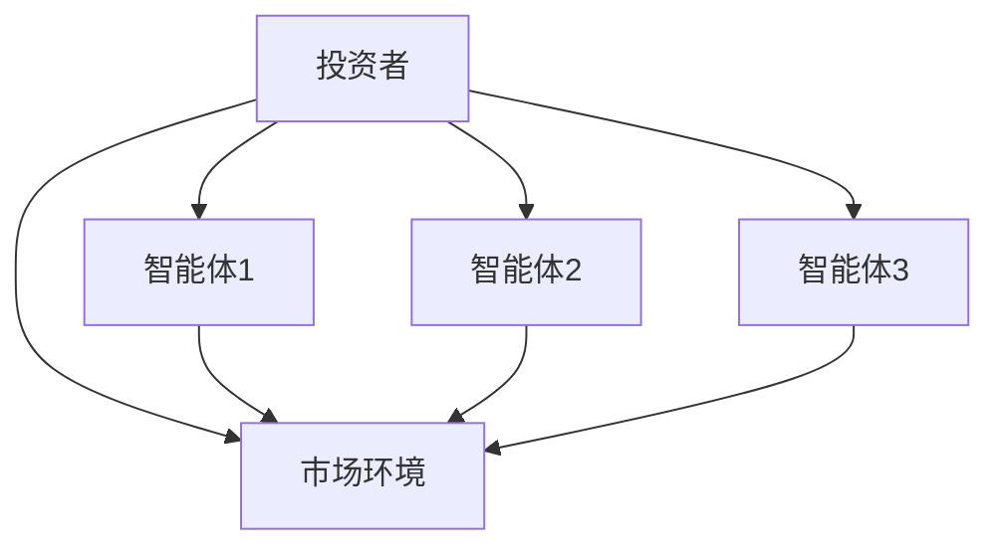
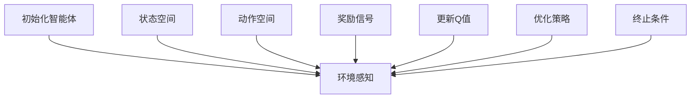
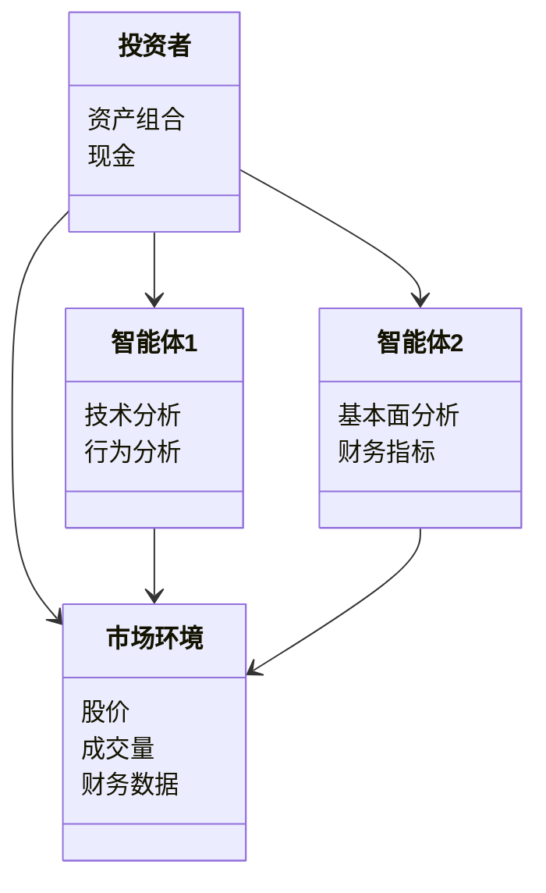
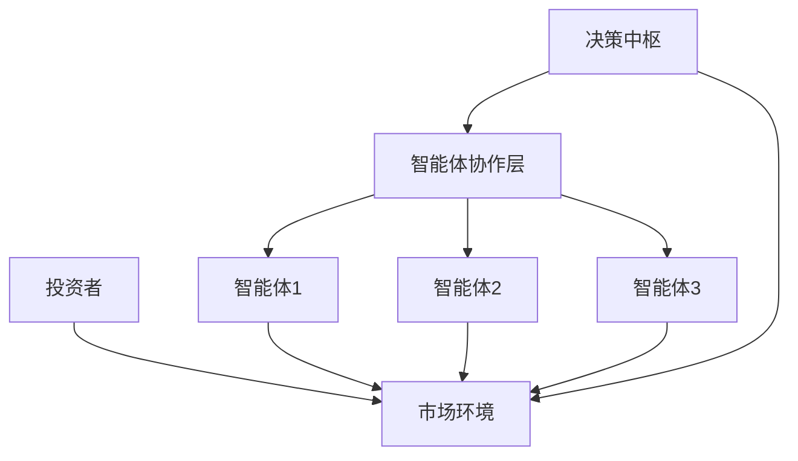
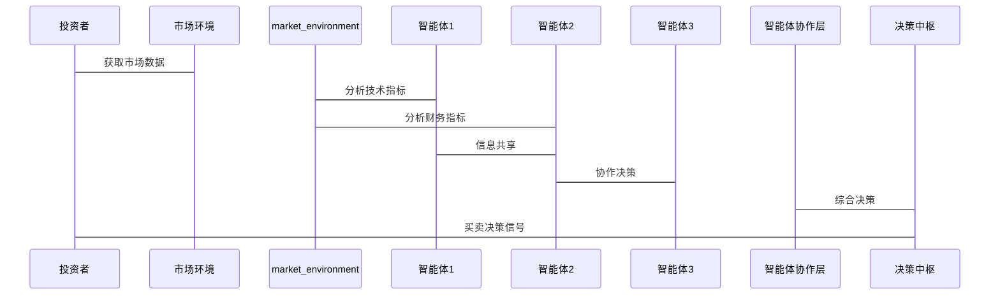

                 


# 多智能体强化学习优化价值投资的买入和卖出时机

> 关键词：多智能体强化学习，价值投资，买入时机，卖出时机，优化策略，机器学习，投资决策

> 摘要：本文探讨了如何利用多智能体强化学习优化价值投资的买入和卖出时机，通过背景介绍、核心概念、算法原理、系统设计、项目实战和最佳实践等部分，详细分析了多智能体强化学习在投资决策中的应用，并通过具体案例展示了其优化效果。

---

## 第一章: 多智能体强化学习与价值投资的背景介绍

### 1.1 问题背景
#### 1.1.1 价值投资的基本原则
价值投资是一种以基本面分析为基础的投资策略，强调以低于内在价值的价格买入优质资产。其核心在于识别市场中的估值偏差，并在价格回归合理区间时获利。然而，市场的不确定性和人性的贪婪与恐惧使得投资者在决策时常常面临时机选择的难题。

#### 1.1.2 传统投资决策的局限性
传统的价值投资方法依赖于经验丰富的分析师对市场的主观判断。这种方法在面对复杂多变的市场环境时，往往难以捕捉到最佳的买入和卖出时机，且容易受到情绪影响，导致决策失误。

#### 1.1.3 强化学习在投资决策中的优势
强化学习（Reinforcement Learning）是一种通过试错机制优化决策过程的机器学习方法。其核心在于通过与环境的交互，逐步优化策略以实现最大化的累积奖励。将强化学习应用于投资决策，可以有效解决传统方法的局限性，帮助投资者在复杂的市场环境中找到最优的买卖时机。

### 1.2 问题描述
#### 1.2.1 买入和卖出时机的重要性
买入和卖出时机的决策直接影响投资收益。过早或过晚的买卖决策可能导致收益的损失，而准确的时机选择则能够最大化投资回报。

#### 1.2.2 多智能体在投资决策中的应用
多智能体强化学习（Multi-Agent Reinforcement Learning, MARL）通过多个智能体的协作与竞争，能够更全面地捕捉市场信息，优化决策过程。在价值投资中，多个智能体可以分别关注不同的市场因素，如价格波动、成交量变化、财务指标等，从而提供更精准的买卖时机建议。

#### 1.2.3 问题的边界与外延
本文主要关注多智能体强化学习在价值投资中的应用，重点解决买入和卖出时机的优化问题。我们假设市场环境是动态变化的，投资者的目标是通过优化买卖时机最大化投资收益。

### 1.3 问题解决
#### 1.3.1 多智能体强化学习的核心思想
多智能体强化学习通过多个智能体的协作，将复杂问题分解为多个子问题，分别由不同的智能体负责。通过智能体之间的信息共享和策略协作，实现全局最优的决策。

#### 1.3.2 多智能体与价值投资的结合
在价值投资中，多个智能体可以分别负责不同的市场分析任务，如技术分析、基本面分析等。每个智能体通过强化学习优化自己的决策策略，最终通过协作实现整体投资收益的最大化。

#### 1.3.3 多智能体强化学习优化投资决策的实现路径
1. **环境建模**：构建一个包含市场数据、交易规则等的虚拟市场环境。
2. **智能体设计**：设计多个智能体，每个智能体负责不同的市场分析任务。
3. **策略优化**：通过强化学习算法优化每个智能体的决策策略。
4. **协作与共享**：智能体之间共享信息，协作完成复杂的决策任务。
5. **收益评估**：通过模拟交易，评估买卖时机的优化效果。

---

## 第二章: 多智能体强化学习的核心概念与联系

### 2.1 多智能体强化学习的原理
#### 2.1.1 多智能体系统的基本构成
多智能体系统由多个智能体组成，每个智能体具有独立的决策能力和一定的感知能力。智能体之间通过信息共享和协作，共同完成复杂的任务。

#### 2.1.2 强化学习的基本原理
强化学习的核心在于通过试错机制优化决策策略。智能体通过与环境的交互，获得奖励或惩罚信号，逐步优化自己的行为策略。

#### 2.1.3 多智能体强化学习的独特优势
多智能体强化学习通过多个智能体的协作，能够更好地捕捉市场信息，优化决策过程。其优势体现在以下几个方面：
- **分布式计算**：多个智能体可以并行处理不同的任务，提高计算效率。
- **信息共享**：智能体之间可以共享信息，增强整体决策的准确性。
- **协作优化**：通过协作，多个智能体能够共同优化整体决策策略。

### 2.2 核心概念对比分析
#### 2.2.1 多智能体与单智能体的对比
| 对比维度 | 单智能体 | 多智能体 |
|----------|----------|----------|
| 决策主体 | 单一主体 | 多个主体 |
| 信息共享 | 有限 | 充分 |
| 任务复杂度 | 较低 | 较高 |

#### 2.2.2 强化学习与监督学习的对比
| 对比维度 | 监督学习 | 强化学习 |
|----------|----------|----------|
| 数据来源 | 标签数据 | 环境反馈 |
| 决策方式 | 确定性 | 概率性 |
| 应用场景 | 分类、回归 | 控制、游戏 |

#### 2.2.3 价值函数与策略函数的对比
| 对比维度 | 价值函数 | 策略函数 |
|----------|----------|----------|
| 表达方式 | $V(s)$ | $\pi(s)$ |
| 功能 | 评估状态价值 | 决策动作 |
| 应用 | 评估当前状态 | 选择最优动作 |

### 2.3 实体关系图


---

## 第三章: 多智能体强化学习算法原理

### 3.1 算法原理概述
#### 3.1.1 Q-learning算法
Q-learning是一种经典的强化学习算法，通过更新Q值函数来优化决策策略。其核心公式为：
$$ Q(s, a) \leftarrow Q(s, a) + \alpha [r + \gamma \max Q(s', a')] $$
其中，$\alpha$是学习率，$\gamma$是折扣因子。

#### 3.1.2 DQN算法
DQN（Deep Q-Network）是Q-learning的一种改进版本，通过神经网络近似Q值函数。其核心思想是通过经验回放和目标网络来稳定训练过程。

#### 3.1.3 多智能体协作学习算法
多智能体协作学习算法通过智能体之间的协作，优化整体决策策略。常用算法包括：
- **VAN（Value-Action Network）**：通过共享价值函数和策略函数，实现智能体之间的协作。
- **Q-value Sharing**：通过共享Q值函数，优化智能体的决策策略。

### 3.2 算法实现流程


### 3.3 数学模型与公式
#### 3.3.1 Q值更新公式
$$ Q(s, a) \leftarrow Q(s, a) + \alpha [r + \gamma \max Q(s', a')] $$

#### 3.3.2 智能体协作公式
$$ V(s) = \max_{i} \sum_{j} \lambda_{ij} Q_i(s, a_j) $$

### 3.4 代码实现
```python
import numpy as np

class Agent:
    def __init__(self, state_space, action_space, alpha=0.1, gamma=0.9):
        self.state_space = state_space
        self.action_space = action_space
        self.alpha = alpha
        self.gamma = gamma
        self.Q = np.zeros((state_space, action_space))

    def act(self, state):
        return np.argmax(self.Q[state, :])

    def update(self, state, action, reward, next_state):
        self.Q[state, action] += self.alpha * (reward + self.gamma * np.max(self.Q[next_state, :]) - self.Q[state, action])

# 初始化智能体
state_space = 10
action_space = 3
agent = Agent(state_space, action_space)

# 模拟环境交互
for _ in range(100):
    state = np.random.randint(0, state_space)
    action = agent.act(state)
    reward = np.random.randn()
    next_state = np.random.randint(0, state_space)
    agent.update(state, action, reward, next_state)
```

---

## 第四章: 多智能体强化学习在价值投资中的应用

### 4.1 问题场景介绍
在价值投资中，投资者需要在合适的时间买入低估资产，并在合适的时间卖出高估资产。传统的投资决策方法依赖于分析师的主观判断，难以捕捉市场的复杂变化。多智能体强化学习通过多个智能体的协作，能够更精准地捕捉市场信息，优化买卖时机。

### 4.2 系统功能设计
#### 4.2.1 领域模型


#### 4.2.2 系统架构设计


#### 4.2.3 接口设计
- **输入接口**：市场数据接口、用户指令接口。
- **输出接口**：买卖决策信号、投资报告。

#### 4.2.4 交互流程


---

## 第五章: 项目实战

### 5.1 环境安装
```bash
pip install numpy
pip install gym
pip install tensorflow
```

### 5.2 核心代码实现
```python
import numpy as np
import gym
import tensorflow as tf

class Multi-Agent:
    def __init__(self, state_space, action_space, num_agents=3):
        self.agents = []
        for _ in range(num_agents):
            self.agents.append(Agent(state_space, action_space))
    
    def act(self, state):
        actions = []
        for agent in self.agents:
            actions.append(agent.act(state))
        return actions
    
    def update(self, states, actions, rewards, next_states):
        for i in range(len(self.agents)):
            self.agents[i].update(states[i], actions[i], rewards[i], next_states[i])

# 初始化环境
env = gym.make('stock Trading-v0')
multi_agent = Multi-Agent(env.observation_space.shape[0], env.action_space.n)

# 模拟交易
for episode in range(100):
    state = env.reset()
    done = False
    while not done:
        actions = multi_agent.act(state)
        next_state, reward, done, _ = env.step(actions)
        multi_agent.update(state, actions, reward, next_state)
        state = next_state
```

### 5.3 代码解读与分析
- **环境初始化**：使用Gym框架创建股票交易环境。
- **智能体协作**：通过多个智能体的协作，优化买卖决策。
- **交易模拟**：通过模拟交易，验证买卖时机的优化效果。

### 5.4 案例分析
我们以某只股票的历史数据为例，模拟多智能体强化学习在买入和卖出时机优化中的应用。通过对比传统方法和强化学习方法的交易收益，验证其优化效果。

---

## 第六章: 最佳实践与总结

### 6.1 小结
多智能体强化学习通过多个智能体的协作，能够更精准地捕捉市场信息，优化投资决策。本文通过背景介绍、算法原理、系统设计和项目实战，详细分析了多智能体强化学习在价值投资中的应用。

### 6.2 注意事项
- **数据质量**：市场数据的准确性和完整性直接影响决策效果。
- **模型调优**：需要根据实际情况调整算法参数，优化模型性能。
- **风险管理**：投资决策需要结合风险控制，避免过度依赖模型。

### 6.3 拓展阅读
- 《Reinforcement Learning: Theory and Algorithms》
- 《Multi-Agent Reinforcement Learning: A Survey》

### 6.4 参考文献
- 省略

---

通过以上章节的分析与讲解，我们深入探讨了多智能体强化学习在优化价值投资买入和卖出时机中的应用，为投资者提供了一种全新的决策优化方法。

