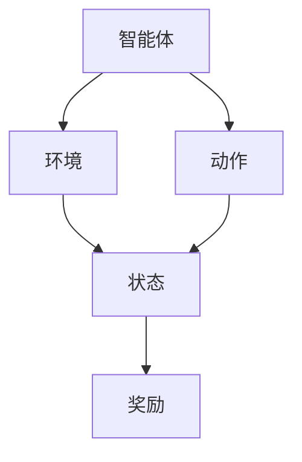
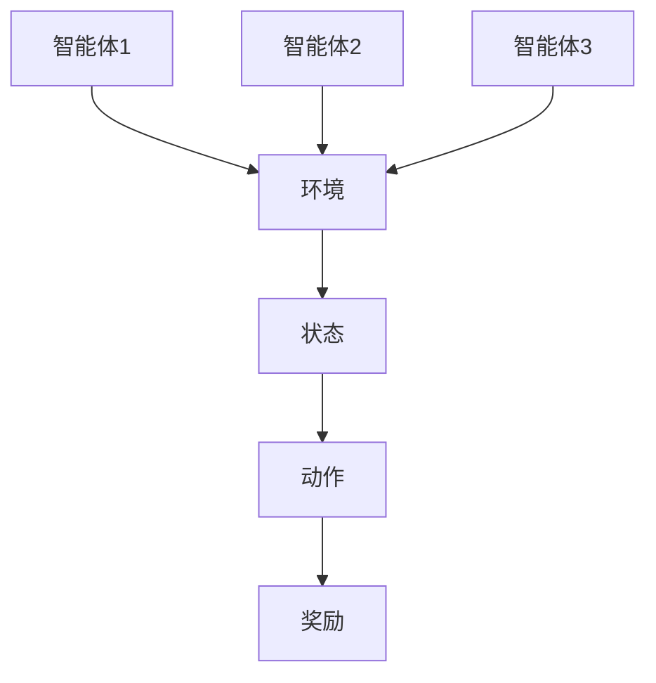

                 


# 多智能体强化学习在优化价值投资的仓位管理中的应用

> 关键词：多智能体强化学习，价值投资，仓位管理，金融投资，算法优化

> 摘要：本文探讨了多智能体强化学习在优化价值投资仓位管理中的应用。通过分析多智能体系统的核心概念、强化学习算法及其在金融投资中的应用，详细阐述了如何利用多智能体强化学习技术来优化投资组合的仓位管理，提高投资收益并降低风险。

---

# 第1章 多智能体强化学习与价值投资概述

## 1.1 多智能体强化学习的基本概念
### 1.1.1 多智能体系统的定义
多智能体系统由多个相互作用的智能体组成，每个智能体都能感知环境并做出决策。智能体之间通过协作或竞争完成共同目标。

### 1.1.2 强化学习的基本原理
强化学习是一种机器学习方法，通过智能体与环境的交互，学习最优策略以最大化累积奖励。

### 1.1.3 多智能体强化学习的特点
- 分布式决策：每个智能体独立决策。
- 协作与竞争：智能体之间可以协作或竞争。
- 复杂环境：适用于高维、动态环境。

## 1.2 价值投资与仓位管理的背景
### 1.2.1 价值投资的核心理念
价值投资关注股票的内在价值，通过长期持有优质股票实现收益。

### 1.2.2 仓位管理的重要性
仓位管理是指根据市场情况调整投资组合的规模，以平衡风险和收益。

### 1.2.3 传统仓位管理的局限性
传统方法依赖经验判断，难以应对复杂多变的市场环境。

## 1.3 多智能体强化学习在金融投资中的应用前景
### 1.3.1 金融投资中的复杂性与不确定性
金融市场的复杂性和不确定性使得传统方法难以有效应对。

### 1.3.2 多智能体强化学习的优势
多智能体系统能够模拟市场中多个投资者的行为，优化投资策略。

### 1.3.3 价值投资与多智能体强化学习的结合
通过多智能体系统模拟不同投资者行为，优化投资组合，提升收益。

---

# 第2章 多智能体强化学习的核心概念与联系

## 2.1 多智能体强化学习的理论基础
### 2.1.1 智能体与环境的定义
智能体：感知环境并采取行动的主体。环境：智能体所处的外部世界。

### 2.1.2 状态、动作与奖励的定义
- 状态：环境的当前情况。
- 动作：智能体的决策。
- 奖励：智能体行动的结果反馈。

### 2.1.3 多智能体系统中的协调与竞争
智能体之间的协作与竞争影响整体系统的优化效果。

## 2.2 多智能体强化学习的核心要素
### 2.2.1 智能体的属性与行为
- 智能体属性：目标、知识、能力。
- 智能体行为：感知、决策、行动。

### 2.2.2 环境的状态与反馈机制
环境通过状态和奖励向智能体反馈信息。

### 2.2.3 多智能体之间的交互关系
智能体之间通过信息共享、协调行动等方式进行交互。

## 2.3 多智能体强化学习的数学模型
### 2.3.1 状态空间的表示
用向量表示环境的状态，例如市场数据、资产价格等。

### 2.3.2 动作空间的表示
用动作空间表示智能体可能的决策，例如买入、卖出或持有。

### 2.3.3 奖励函数的设计
奖励函数量化智能体的决策效果，例如收益、风险等。

## 2.4 多智能体强化学习的ER实体关系图


## 2.5 本章小结
本章介绍了多智能体强化学习的核心概念和理论基础，为后续的算法实现奠定了基础。

---

# 第3章 多智能体强化学习算法原理

## 3.1 强化学习的基本算法
### 3.1.1 Q-learning算法
通过Q值表学习最优策略，适用于单智能体环境。

### 3.1.2 Deep Q-Networks (DQN)算法
使用深度神经网络近似Q值函数，适合处理高维状态空间。

### 3.1.3 多智能体强化学习的挑战
- 状态空间和动作空间的维度高。
- 智能体之间的协调与竞争复杂。

## 3.2 多智能体强化学习的算法实现
### 3.2.1 多智能体Q-learning算法
多个智能体分别学习自己的Q值表，通过环境反馈更新策略。

### 3.2.2 多智能体DQN算法
每个智能体使用深度神经网络近似Q值函数，通过经验回放和目标网络优化。

### 3.2.3 基于价值函数的多智能体算法
利用价值函数评估状态的价值，优化多个智能体的协同策略。

## 3.3 多智能体强化学习的数学模型
### 3.3.1 Q值更新公式
$$ Q_i(s,a) = Q_i(s,a) + \alpha (r + \gamma \max_j Q_j(s',a') - Q_i(s,a)) $$
其中，\( \alpha \) 是学习率，\( \gamma \) 是折扣因子。

### 3.3.2 奖励分配机制
$$ R_i = \sum_{j=1}^{n} \lambda_{ij} R_j $$
其中，\( \lambda_{ij} \) 是智能体 \( i \) 对智能体 \( j \) 的奖励权重。

## 3.4 多智能体强化学习的算法流程图


## 3.5 本章小结
本章详细介绍了多智能体强化学习的基本算法及其数学模型，为后续的应用奠定了理论基础。

---

# 第4章 多智能体强化学习在仓位管理中的应用

## 4.1 仓位管理的优化目标
### 4.1.1 最大化投资收益
通过优化投资组合配置，提高整体收益。

### 4.1.2 控制投资风险
在市场波动中保持投资组合的稳定性。

### 4.1.3 灵活应对市场变化
根据市场变化及时调整投资策略。

## 4.2 多智能体强化学习的系统架构
### 4.2.1 系统功能设计
- 数据采集：获取市场数据。
- 状态表示：将市场数据转化为智能体的状态输入。
- 动作决策：智能体根据状态输出投资决策。
- 系统反馈：根据市场变化反馈奖励。

### 4.2.2 系统架构设计


### 4.2.3 系统接口设计
- 数据接口：获取市场数据和历史数据。
- 策略接口：智能体的决策算法接口。
- 反馈接口：奖励反馈接口。

## 4.3 多智能体强化学习的实现步骤
### 4.3.1 环境数据准备
收集股票价格、市场指数等数据。

### 4.3.2 智能体模型设计
设计多个智能体，每个智能体负责不同的资产或策略。

### 4.3.3 算法实现
实现多智能体强化学习算法，训练智能体做出最优决策。

## 4.4 本章小结
本章详细描述了多智能体强化学习在仓位管理中的应用，展示了系统的架构和实现步骤。

---

# 第5章 项目实战：基于多智能体强化学习的仓位管理系统

## 5.1 项目背景与目标
### 5.1.1 项目背景
介绍项目的研究背景和意义。

### 5.1.2 项目目标
优化投资组合的仓位管理，提高投资收益。

## 5.2 环境安装与配置
### 5.2.1 安装Python与相关库
安装Python，TensorFlow，Keras等工具。

### 5.2.2 数据集准备
获取股票价格数据，清洗和预处理数据。

## 5.3 系统核心代码实现
### 5.3.1 智能体类的定义
```python
class Agent:
    def __init__(self, state_space, action_space):
        self.state_space = state_space
        self.action_space = action_space
        # 初始化Q值表或神经网络模型
```

### 5.3.2 环境类的定义
```python
class Environment:
    def __init__(self, data):
        self.data = data
        self.current_step = 0
    def get_state(self):
        return self.data[self.current_step]
    def step(self, action):
        # 更新环境状态，返回新的状态和奖励
```

### 5.3.3 训练过程实现
```python
def train_agents(agents, environment):
    for episode in range(num_episodes):
        state = environment.get_state()
        for agent in agents:
            action = agent.act(state)
            next_state, reward = environment.step(action)
            agent.learn(state, action, reward, next_state)
```

## 5.4 代码应用解读
### 5.4.1 智能体的感知与决策
解释智能体如何根据当前状态做出决策。

### 5.4.2 环境的反馈机制
说明环境如何根据智能体的行动反馈奖励。

### 5.4.3 训练过程的优化
讨论训练过程中参数调整和模型优化策略。

## 5.5 实际案例分析
### 5.5.1 案例背景
介绍具体的案例，例如训练智能体在某段时间内优化投资组合。

### 5.5.2 案例分析
展示智能体在训练过程中的表现，分析其决策是否合理。

## 5.6 本章小结
本章通过一个具体的项目实战，详细展示了多智能体强化学习在仓位管理中的应用。

---

# 第6章 总结与展望

## 6.1 本章总结
总结全文的主要内容，强调多智能体强化学习在优化价值投资仓位管理中的优势。

## 6.2 未来研究方向
提出未来可以进一步研究的方向，例如：
- 更复杂的多智能体协作机制。
- 强化学习算法的优化与创新。
- 多智能体系统在其他金融领域的应用。

## 6.3 最佳实践 tips
- 合理设计智能体的行为和奖励机制。
- 选择合适的算法和工具。
- 定期优化和调整投资策略。

## 6.4 本章小结
展望未来的研究方向，并鼓励读者将多智能体强化学习应用于实际投资中。

---

# 附录

## 附录A 参考文献
列出本文参考的文献资料。

## 附录B 工具与资源
提供相关的工具、库和资源链接，方便读者进一步学习和实践。

---

通过以上目录结构，本文系统地介绍了多智能体强化学习在优化价值投资仓位管理中的应用，从理论到实践，为读者提供了一个全面的学习和参考框架。

