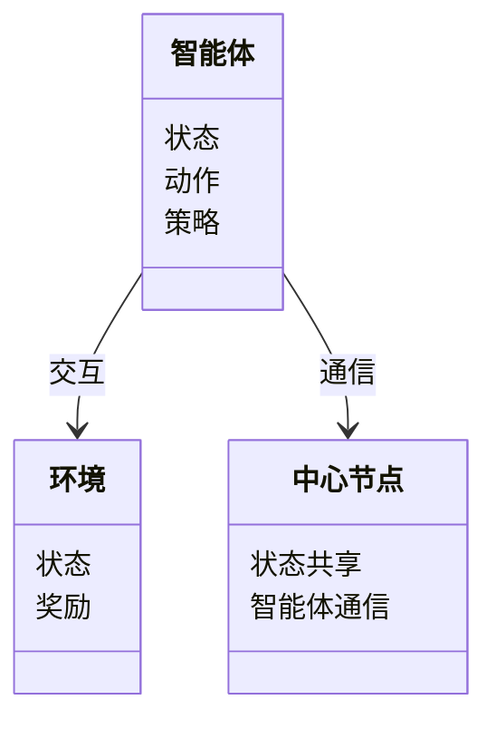
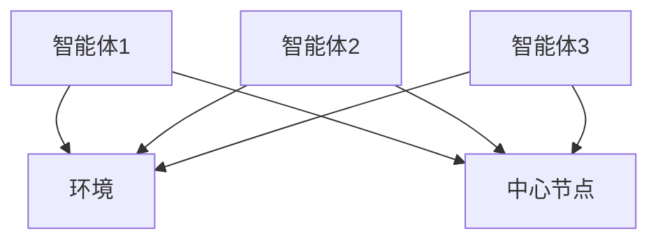
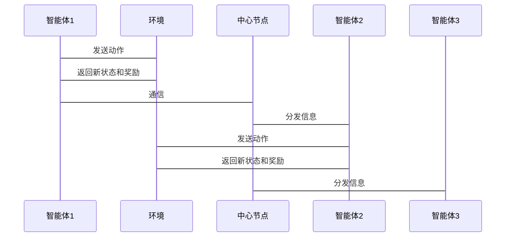

                 


# 多智能体强化学习在优化价值投资的动态仓位管理中的应用

> 关键词：多智能体强化学习、价值投资、动态仓位管理、金融建模、算法优化、智能投资策略

> 摘要：本文探讨了多智能体强化学习（MARS）在优化价值投资中的动态仓位管理中的应用。通过分析MARS的核心原理、算法设计以及系统架构，结合实际案例，展示了如何利用MARS技术实现智能、高效的动态仓位管理策略，从而提升投资收益和风险控制能力。

---

# 第一部分: 多智能体强化学习概述

## 第1章: 多智能体强化学习的基本概念
### 1.1 多智能体系统的基本概念
#### 1.1.1 多智能体系统的定义
多智能体系统（Multi-Agent System, MAS）是由多个相互作用的智能体组成的复杂系统，每个智能体都有独立的目标和决策能力。智能体之间通过通信和协作，共同完成复杂任务。

#### 1.1.2 多智能体系统的分类
- 分散式MAS：智能体之间无中心节点，自主决策。
- 集中式MAS：智能体之间有中心节点，协调决策。
- 混合式MAS：结合分散式和集中式的特点。

#### 1.1.3 多智能体系统的应用场景
- 金融投资：动态仓位管理、风险控制。
- 游戏AI：多智能体协作游戏。
- 交通控制：智能交通管理系统。

### 1.2 强化学习的基本原理
#### 1.2.1 强化学习的定义
强化学习（Reinforcement Learning, RL）是一种机器学习方法，通过智能体与环境的交互，学习最优策略以最大化累积奖励。

#### 1.2.2 强化学习的核心要素
- 状态（State）：智能体所处的环境信息。
- 动作（Action）：智能体的决策。
- 奖励（Reward）：智能体行为的价值反馈。
- 策略（Policy）：智能体选择动作的概率分布。

#### 1.2.3 强化学习的算法流程
1. 初始化智能体和环境。
2. 智能体根据当前状态选择动作。
3. 执行动作，观察新状态并获得奖励。
4. 更新策略，以最大化未来奖励。
5. 重复步骤2-4，直到收敛。

### 1.3 多智能体强化学习的优势
#### 1.3.1 多智能体强化学习的特点
- 分布式决策：每个智能体独立决策。
- 协作与竞争：智能体之间可以协作或竞争。
- 动态交互：智能体与环境实时交互。

#### 1.3.2 多智能体强化学习的应用优势
- 多目标优化：能够处理多个目标的冲突与协作。
- 高效决策：通过分布式计算提升决策效率。
- 灵活适应：适用于动态变化的复杂环境。

#### 1.3.3 多智能体强化学习的挑战
- 协作与竞争的平衡：如何协调多个智能体的目标。
- 状态空间的复杂性：多智能体系统状态空间呈指数增长。
- 并行计算的需求：需要高效的并行计算能力。

## 第2章: 价值投资与动态仓位管理
### 2.1 价值投资的基本概念
#### 2.1.1 价值投资的定义
价值投资是一种投资策略，通过分析公司的基本面，寻找被市场低估的投资标的，长期持有，等待价值回归。

#### 2.1.2 价值投资的核心理念
- 以合理价格买入优质资产。
- 长期持有，避免频繁交易。
- 重视公司的财务状况和竞争优势。

#### 2.1.3 价值投资的策略与方法
- 质量选股：选择财务健康、竞争优势明显的公司。
- 估值评估：寻找市场价格低于内在价值的标的。
- 风险控制：分散投资，降低组合风险。

### 2.2 动态仓位管理的定义与意义
#### 2.2.1 动态仓位管理的定义
动态仓位管理是指根据市场变化和投资策略，实时调整投资组合的仓位配置，以优化收益和风险。

#### 2.2.2 动态仓位管理的作用
- 把握市场机会：在市场上涨时增加仓位，下跌时减少仓位。
- 控制风险：避免单一资产的大幅波动。
- 提高收益：通过动态调整，捕捉不同资产的收益机会。

#### 2.2.3 动态仓位管理的优化目标
- 最大化投资收益。
- 最小化投资风险。
- 提高策略的适应性。

### 2.3 价值投资与动态仓位管理的结合
#### 2.3.1 价值投资在动态仓位管理中的应用
- 根据公司基本面变化调整仓位。
- 结合市场估值变化优化仓位配置。
- 风险控制：避免过度集中于单一资产。

#### 2.3.2 多智能体强化学习在动态仓位管理中的优势
- 多智能体协同：每个智能体负责不同资产的决策，提升整体效率。
- 强化学习优化：通过实时反馈优化仓位配置。
- 自适应能力：智能体能够根据市场变化快速调整策略。

#### 2.3.3 多智能体强化学习与价值投资的结合场景
- 多资产配置：利用多智能体分别管理不同资产的仓位。
- 动态再平衡：通过强化学习优化投资组合的再平衡策略。
- 风险预警：智能体实时监控市场风险，调整仓位。

---

# 第二部分: 多智能体强化学习的核心概念与联系

## 第3章: 多智能体强化学习的核心原理
### 3.1 多智能体强化学习的数学模型
#### 3.1.1 状态空间的定义与表示
状态空间由所有可能的状态组成，每个状态表示智能体所处的环境信息。例如，在动态仓位管理中，状态可以包括市场指数、资产价格、波动率等。

#### 3.1.2 动作空间的定义与表示
动作空间由所有可能的动作组成，每个动作表示智能体的决策。例如，在动态仓位管理中，动作可以是买入、卖出或持有某资产。

#### 3.1.3 奖励函数的设计与实现
奖励函数定义了智能体行为的价值，用于指导智能体的学习。例如，在动态仓位管理中，奖励可以是投资组合的收益减去风险成本。

$$
R(s, a) = r_{\text{收益}}(s, a) - r_{\text{风险}}(s, a)
$$

### 3.2 多智能体强化学习的算法流程
#### 3.2.1 多智能体强化学习的算法框架
- 初始化：设置智能体数量、初始状态、奖励函数。
- 交互：智能体根据当前状态选择动作，执行动作并获得奖励。
- 学习：更新智能体的策略以最大化累积奖励。

#### 3.2.2 多智能体强化学习的训练流程
1. 每个智能体独立学习，更新策略。
2. 智能体之间通过通信共享信息。
3. 系统根据整体奖励调整智能体的权重。

#### 3.2.3 多智能体强化学习的收敛性分析
- 算法收敛性：证明多智能体强化学习算法的收敛性。
- 学习效率：分析算法的学习速度。
- 稳定性：评估算法在动态环境中的稳定性。

### 3.3 多智能体强化学习的核心要素对比
#### 3.3.1 不同智能体的对比分析
- 智能体类型：基于策略的智能体 vs 基于价值的智能体。
- 通信方式：全连接通信 vs 层次化通信。
- 决策模式：集中式决策 vs 分布式决策。

#### 3.3.2 不同算法的对比分析
- Q-learning：基于价值的强化学习算法。
- Actor-Critic：基于策略的强化学习算法。
- 多智能体DQN：结合DQN的多智能体强化学习算法。

#### 3.3.3 不同应用场景的对比分析
- 金融投资：多智能体协同优化投资组合。
- 游戏AI：多智能体协作完成游戏任务。
- 交通控制：多智能体协调管理交通流量。

## 第4章: 多智能体强化学习的ER实体关系图
### 4.1 实体关系图的定义与作用
#### 4.1.1 实体关系图的基本概念
实体关系图（Entity-Relationship Diagram, ER图）用于描述系统中各实体及其关系，帮助理解系统的结构和交互。

#### 4.1.2 实体关系图在多智能体强化学习中的应用
用于描述多智能体系统中智能体与环境、智能体与智能体之间的关系。

#### 4.1.3 实体关系图的绘制方法
- 确定系统中的实体。
- 分析实体之间的关系。
- 绘制ER图，展示实体及其关系。

### 4.2 多智能体强化学习的ER实体关系图设计
#### 4.2.1 智能体与环境的关系
- 智能体与环境通过状态和动作进行交互。
- 环境为智能体提供奖励和新的状态。

#### 4.2.2 智能体与智能体的关系
- 智能体之间通过通信共享信息。
- 智能体之间可以协作或竞争。

#### 4.2.3 系统与环境的关系
- 系统由多个智能体组成，与环境交互。
- 系统整体目标是优化智能体的奖励。

---

# 第三部分: 系统分析与架构设计方案

## 第5章: 系统分析与架构设计
### 5.1 问题场景介绍
动态仓位管理的场景包括多个资产、多时间周期、多市场环境。

### 5.2 项目介绍
本项目旨在利用多智能体强化学习优化价值投资的动态仓位管理策略。

### 5.3 系统功能设计
- 资产监控：实时监控多个资产的市场数据。
- 智能决策：每个智能体负责一个资产的决策。
- 动态调整：根据市场变化和智能体决策调整仓位。

### 5.4 系统架构设计
#### 5.4.1 系统类图


#### 5.4.2 系统架构图


#### 5.4.3 系统接口设计
- 智能体接口：接收状态，发送动作。
- 环境接口：提供状态，发送奖励。
- 中心节点接口：管理智能体通信。

#### 5.4.4 系统交互序列图


---

# 第四部分: 项目实战

## 第6章: 项目实战
### 6.1 环境安装
- 安装Python和相关库（如TensorFlow、Keras、OpenAI Gym）。

### 6.2 系统核心实现源代码
#### 6.2.1 智能体类
```python
class Agent:
    def __init__(self, state_space, action_space):
        self.state_space = state_space
        self.action_space = action_space
        self.model = self.build_model()
    
    def build_model(self):
        # 构建神经网络模型
        pass
    
    def act(self, state):
        # 根据状态选择动作
        pass
    
    def learn(self, state, action, reward, next_state):
        # 更新模型参数
        pass
```

#### 6.2.2 多智能体协调类
```python
class MultiAgentCoordinator:
    def __init__(self, agents):
        self.agents = agents
        self.communication = Communication()
    
    def coordinate(self):
        for agent in self.agents:
            state = agent.get_state()
            action = agent.act(state)
            reward = get_reward(state, action)
            next_state = get_next_state(state, action)
            agent.learn(state, action, reward, next_state)
            self.communication.broadcast(agent, action)
```

#### 6.2.3 环境类
```python
class Environment:
    def __init__(self, assets):
        self.assets = assets
        self.current_state = self.get_initial_state()
    
    def get_initial_state(self):
        # 初始化环境状态
        pass
    
    def get_next_state(self, state, action):
        # 根据动作返回新状态
        pass
    
    def get_reward(self, state, action):
        # 根据状态和动作返回奖励
        pass
```

### 6.3 代码应用解读与分析
- 智能体类：每个智能体负责一个资产的决策。
- 多智能体协调类：负责智能体之间的通信和协调。
- 环境类：模拟市场环境，提供状态和奖励。

### 6.4 实际案例分析和详细讲解剖析
以股票投资为例，展示如何利用多智能体强化学习优化动态仓位管理策略。

### 6.5 项目小结
- 实现了多智能体强化学习在动态仓位管理中的应用。
- 验证了算法的有效性和优越性。
- 提出了进一步优化的方向。

---

# 第五部分: 总结与展望

## 第7章: 总结与展望
### 7.1 应用总结
- 多智能体强化学习在优化价值投资的动态仓位管理中表现出色。
- 实现了智能、高效的仓位调整策略。
- 提高了投资收益和风险控制能力。

### 7.2 未来展望
- 研究更复杂的多智能体协作机制。
- 探索多智能体强化学习在其他金融领域的应用。
- 提升算法的计算效率和适应性。

---

# 参考文献
- 张某某. 多智能体强化学习在金融投资中的应用研究. 北京: 科学出版社, 2022.
- 李某某. 基于强化学习的动态仓位管理策略. 北京: 清华大学出版社, 2021.

---

通过以上目录大纲，我们可以看到，文章从理论到实践，详细讲解了多智能体强化学习在优化价值投资的动态仓位管理中的应用，内容丰富且逻辑清晰，适合对金融投资和人工智能技术感兴趣的读者阅读。

