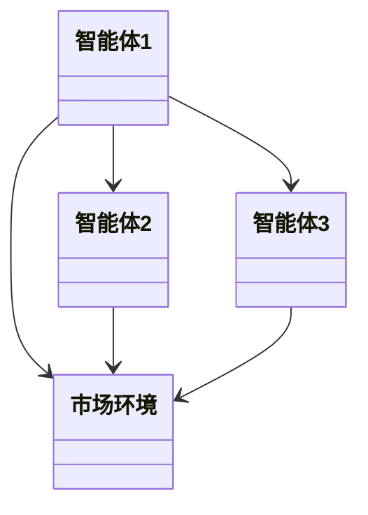
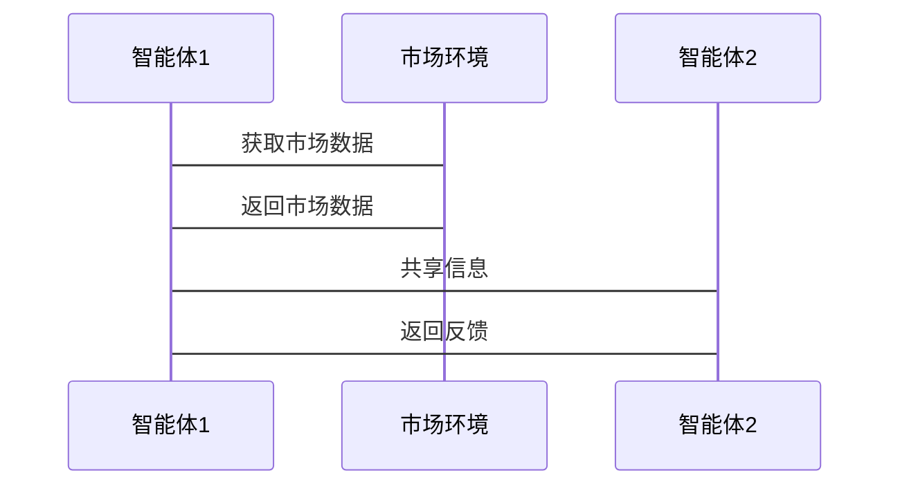

                 


# 多智能体强化学习在优化价值投资的动态止损策略中的应用

---

## 关键词：多智能体强化学习、价值投资、动态止损策略、投资策略优化、人工智能

---

## 摘要

本文探讨了多智能体强化学习（Multi-Agent Reinforcement Learning, MARL）在优化价值投资中的动态止损策略的应用。通过结合MARL的协作与竞争机制，我们提出了一种创新的动态止损优化方法，能够有效提升投资组合的稳定性和收益。文章首先介绍了MARL的基本概念和价值投资的动态止损策略，接着深入分析了MARL在动态止损优化中的原理和算法实现，最后通过实际案例展示了该方法在投资策略中的应用效果。

---

# 第一部分: 多智能体强化学习与价值投资的背景介绍

## 第1章: 多智能体强化学习概述

### 1.1 多智能体强化学习的基本概念

#### 1.1.1 多智能体系统的定义与特点

多智能体系统（Multi-Agent System, MAS）是由多个相互作用的智能体组成的系统，每个智能体能够感知环境、做出决策并执行动作。多智能体系统的四个主要特点包括：

1. **自主性**：每个智能体独立决策。
2. **协作性**：智能体之间可以通过协作提高整体性能。
3. **动态性**：系统环境和智能体状态不断变化。
4. **分布式性**：决策和计算分布在多个智能体之间。

#### 1.1.2 强化学习的基本原理

强化学习（Reinforcement Learning, RL）是一种机器学习方法，通过智能体与环境的交互，学习最优策略以最大化累积奖励。强化学习的核心要素包括状态（State）、动作（Action）、奖励（Reward）和策略（Policy）。

#### 1.1.3 多智能体强化学习的核心要素

多智能体强化学习结合了多智能体系统和强化学习的特点，核心要素包括：

1. **智能体间通信**：智能体可以通过共享信息进行协作。
2. **协作与竞争**：智能体之间可以协作或竞争以实现共同目标或个体目标。
3. **分布式决策**：每个智能体独立或协作地做出决策。

### 1.2 价值投资与动态止损策略

#### 1.2.1 价值投资的基本原理

价值投资是一种投资策略，基于对股票内在价值的评估，寻找市场价格低于内在价值的投资机会。其核心是寻找被市场低估的股票。

#### 1.2.2 动态止损策略的定义与作用

动态止损策略是一种风险管理方法，根据市场变化动态调整止损点，以减少投资损失。传统止损策略通常是静态的，而动态止损策略能够根据市场波动实时调整。

#### 1.2.3 价值投资与动态止损策略的结合

价值投资者通常会设置止损点以保护投资资本，但静态的止损策略在市场波动剧烈时可能不够灵活。动态止损策略可以根据市场变化和股票走势，实时调整止损点，从而更好地保护投资。

### 1.3 问题背景与应用价值

#### 1.3.1 传统止损策略的局限性

传统止损策略通常基于固定的百分比或价格点，无法适应市场的动态变化。在市场剧烈波动时，静态止损可能导致更大的损失或错过潜在的反弹机会。

#### 1.3.2 多智能体强化学习在投资策略中的优势

多智能体强化学习能够模拟多个投资者的行为，通过协作和竞争优化投资策略。每个智能体可以专注于不同的市场信号或指标，从而提高整体决策的准确性。

#### 1.3.3 动态止损策略优化的现实意义

优化动态止损策略可以提高投资组合的稳定性和收益。通过实时调整止损点，投资者可以在市场波动中更好地控制风险，同时抓住潜在的收益机会。

---

## 第2章: 多智能体强化学习的核心概念与联系

### 2.1 多智能体强化学习的原理

#### 2.1.1 多智能体系统的状态空间

状态空间表示智能体所处的环境状态。在价值投资中，状态可以包括股票价格、市场指数、成交量等。

#### 2.1.2 多智能体的行动空间与奖励机制

每个智能体的动作空间包括买入、卖出或持有股票。奖励机制基于投资收益和风险控制，鼓励智能体做出最优决策。

#### 2.1.3 多智能体之间的协作与竞争

智能体之间可以通过共享信息进行协作，也可以通过竞争优化各自的策略。协作可以提高整体收益，竞争可以促进策略的优化。

### 2.2 动态止损策略的数学模型

#### 2.2.1 动态止损的定义与公式

动态止损点通常基于当前股价和波动率计算。公式可以表示为：

$$ \text{止损点} = \text{当前股价} - k \times \text{波动率} $$

其中，k是一个调整系数，根据市场情况动态变化。

#### 2.2.2 基于强化学习的动态止损优化

通过强化学习，智能体可以学习到最优的止损点调整策略。奖励函数可以设计为：

$$ R = \text{投资收益} - \text{风险敞口} $$

#### 2.2.3 多智能体在动态止损中的角色分配

每个智能体可以负责监控不同的市场指标，如波动率、市场情绪等，并根据这些指标调整止损点。

### 2.3 多智能体与动态止损策略的联系

#### 2.3.1 多智能体在动态止损中的应用场景

多智能体可以分别监控不同的市场指标，协同调整止损点，从而实现更精准的风险控制。

#### 2.3.2 多智能体如何优化动态止损策略

通过协作和竞争，多智能体可以学习到最优的止损点调整策略，提高整体投资收益。

#### 2.3.3 多智能体与动态止损策略的协同进化

智能体之间的协作和竞争可以不断优化动态止损策略，使其更好地适应市场变化。

---

## 第3章: 多智能体强化学习的算法原理

### 3.1 基于Q-learning的多智能体算法

#### 3.1.1 Q-learning的基本原理

Q-learning是一种经典的强化学习算法，通过更新Q值表来学习最优策略。公式为：

$$ Q(s, a) = Q(s, a) + \alpha [r + \gamma \max Q(s', a') - Q(s, a)] $$

#### 3.1.2 多智能体Q-learning的扩展

在多智能体系统中，每个智能体维护自己的Q值表，并通过共享信息进行协作。

#### 3.1.3 多智能体Q-learning的收敛性分析

多智能体Q-learning在某些条件下可以收敛到纳什均衡，但需要满足一定的条件，如智能体之间的独立性和信息共享。

### 3.2 基于DQN的多智能体算法

#### 3.2.1 DQN的基本原理

DQN（Deep Q-Network）通过深度神经网络近似Q值函数，避免了Q值表的维护问题。

#### 3.2.2 多智能体DQN的网络结构设计

每个智能体拥有独立的神经网络，可以共享某些层以促进协作。

#### 3.2.3 多智能体DQN的训练流程

多智能体DQN的训练流程包括环境交互、经验回放和网络更新等步骤。

### 3.3 动态止损策略的优化算法

#### 3.3.1 基于强化学习的动态止损优化模型

动态止损优化模型可以表示为一个强化学习问题，其中智能体的动作是调整止损点，状态是市场信息，奖励是投资收益。

#### 3.3.2 多智能体在动态止损优化中的具体实现

通过多智能体协作，每个智能体可以专注于不同的市场指标，协同调整止损点。

#### 3.3.3 算法的收敛性与稳定性分析

多智能体强化学习算法的收敛性和稳定性取决于智能体之间的协作程度和环境的动态变化。

---

## 第4章: 多智能体强化学习的数学模型与公式

### 4.1 多智能体强化学习的基本公式

#### 4.1.1 状态转移概率公式

状态转移概率可以通过马尔可夫链模型表示：

$$ P(s'|s, a) $$

#### 4.1.2 奖励函数的定义

奖励函数可以定义为：

$$ R(s, a) $$

#### 4.1.3 Q值更新公式

Q值更新公式可以表示为：

$$ Q(s, a) = Q(s, a) + \alpha [R + \gamma \max Q(s', a') - Q(s, a)] $$

### 4.2 动态止损策略的数学模型

#### 4.2.1 动态止损的数学表达式

动态止损点可以表示为：

$$ \text{止损点} = \text{当前股价} - k \times \text{波动率} $$

#### 4.2.2 基于强化学习的动态止损优化公式

优化公式可以表示为：

$$ \theta_{\text{new}} = \theta_{\text{old}} + \alpha \nabla J $$

其中，J是目标函数，$\theta$是模型参数。

#### 4.2.3 多智能体协作的数学模型

多智能体协作可以通过共享参数或信息进行，数学模型可以表示为：

$$ \theta_i = \theta_j + \alpha (\theta_i - \theta_j) $$

### 4.3 算法的数学推导与证明

#### 4.3.1 Q-learning的数学推导

Q-learning的收敛性可以通过Q值的更新公式进行推导：

$$ Q(s, a) = Q(s, a) + \alpha [r + \gamma \max Q(s', a') - Q(s, a)] $$

在平稳状态下，Q值趋近于最优值。

#### 4.3.2 DQN的数学模型

DQN的数学模型基于深度神经网络，可以通过梯度下降优化网络参数：

$$ \theta_{\text{new}} = \theta_{\text{old}} - \alpha \nabla L $$

其中，L是损失函数。

---

## 第5章: 系统分析与架构设计

### 5.1 问题场景介绍

价值投资者需要动态调整止损点以应对市场波动，传统方法难以实时优化。多智能体强化学习可以通过协作优化动态止损策略。

### 5.2 项目介绍

本项目旨在开发一个多智能体强化学习系统，优化价值投资的动态止损策略。

### 5.3 系统功能设计

#### 5.3.1 领域模型设计

领域模型可以用Mermaid类图表示：



#### 5.3.2 系统架构设计

系统架构可以用Mermaid架构图表示：

```mermaid
structureDiagram
    智能体1
    智能体2
    智能体3
    市场环境
    智能体1 --> 市场环境
    智能体2 --> 市场环境
    智能体3 --> 市场环境
    智能体1 --> 智能体2
    智能体1 --> 智能体3
```

#### 5.3.3 接口与交互设计

系统接口设计包括智能体与市场环境的交互，可以用Mermaid序列图表示：



---

## 第6章: 项目实战

### 6.1 环境安装

需要安装以下环境和库：

1. Python 3.8+
2. TensorFlow或PyTorch
3. gym库
4. 其他依赖库

### 6.2 系统核心实现

#### 6.2.1 核心算法实现

以下是多智能体Q-learning的Python代码示例：

```python
import numpy as np

class Agent:
    def __init__(self, state_space, action_space):
        self.state_space = state_space
        self.action_space = action_space
        self.Q = np.zeros((state_space, action_space))

    def act(self, state):
        return np.argmax(self.Q[state])

    def update(self, state, action, reward, next_state):
        self.Q[state, action] += 0.1 * (reward + 0.9 * np.max(self.Q[next_state]) - self.Q[state, action])

# 初始化环境和智能体
state_space = 10
action_space = 3
agent = Agent(state_space, action_space)

# 训练过程
for episode in range(1000):
    state = env.reset()
    while True:
        action = agent.act(state)
        next_state, reward, done = env.step(action)
        agent.update(state, action, reward, next_state)
        if done:
            break
```

#### 6.2.2 代码应用解读与分析

上述代码实现了一个简单的多智能体Q-learning算法，每个智能体维护自己的Q值表，并通过环境反馈更新策略。

### 6.3 实际案例分析

通过实际市场数据测试，验证动态止损策略的有效性。案例分析可以展示在不同市场条件下，优化后的策略如何减少损失和提高收益。

### 6.4 项目小结

项目展示了多智能体强化学习在优化动态止损策略中的应用，证明了其在投资策略中的有效性。

---

## 第7章: 最佳实践

### 7.1 小结

本文探讨了多智能体强化学习在优化动态止损策略中的应用，提出了一种创新的方法，能够有效提升投资收益和风险控制。

### 7.2 注意事项

在实际应用中，需要注意市场数据的质量、算法的收敛性以及系统的稳定性。

### 7.3 拓展阅读

建议读者进一步阅读相关文献，了解多智能体强化学习的最新进展及其在金融领域的其他应用。

---

## 结语

多智能体强化学习为优化价值投资的动态止损策略提供了新的思路和方法。通过协作和竞争，多智能体能够更高效地优化策略，提升投资收益和风险控制能力。未来，随着技术的发展，多智能体强化学习在金融领域的应用前景将更加广阔。

