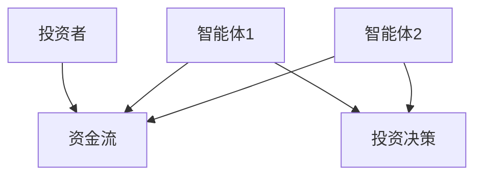
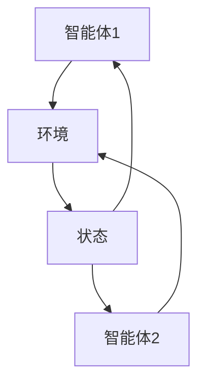
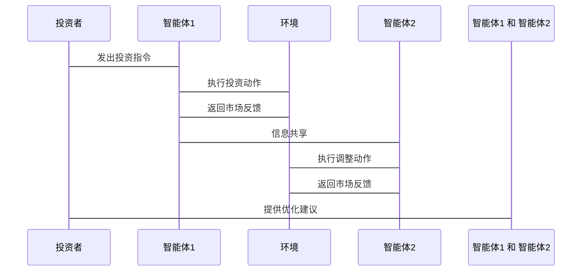

                 


# 多智能体强化学习在优化价值投资的资金流管理中的应用

> 关键词：多智能体强化学习，价值投资，资金流管理，强化学习算法，投资策略优化

> 摘要：本文探讨了多智能体强化学习在优化价值投资的资金流管理中的应用。通过分析多智能体强化学习的原理、算法实现以及其在资金流管理中的实际应用，展示了如何利用人工智能技术提升投资策略的优化能力。本文从背景介绍、核心概念、算法原理、系统架构、项目实战等多方面展开讨论，为读者提供一个全面的视角来理解多智能体强化学习在金融领域的应用潜力。

---

## 第1章：多智能体强化学习的背景与应用

### 1.1 多智能体强化学习的定义与特点

#### 1.1.1 多智能体强化学习的定义
多智能体强化学习（Multi-Agent Reinforcement Learning, MRL）是指多个智能体在共享环境中通过相互协作或竞争，以实现共同目标或个体目标的学习过程。与单智能体强化学习不同，多智能体强化学习强调智能体之间的交互与协作。

#### 1.1.2 多智能体强化学习的核心特点
- **分布式决策**：多个智能体独立决策，共享环境信息。
- **协作与竞争**：智能体之间可以协作完成任务，也可以通过竞争优化个体目标。
- **复杂性高**：由于智能体之间的交互，环境的状态空间和动作空间大幅增加。

#### 1.1.3 多智能体与单智能体强化学习的区别
| 特性 | 单智能体强化学习 | 多智能体强化学习 |
|------|------------------|------------------|
| 决策主体 | 单一智能体       | 多个智能体       |
| 交互方式 | 无交互           | 相互协作/竞争    |
| 状态空间 | 较小            | 较大            |

### 1.2 价值投资的基本原理

#### 1.2.1 价值投资的定义
价值投资是一种投资策略，通过分析企业的基本面（如财务状况、行业地位、盈利能力等），寻找被市场低估的股票进行投资，以获取长期收益。

#### 1.2.2 价值投资的核心策略
- **基本面分析**：评估企业的内在价值。
- **长期持有**：避免频繁交易，降低交易成本。
- **分散投资**：降低单一投资的风险。

#### 1.2.3 价值投资与资金流管理的关系
资金流管理是价值投资的重要组成部分，涉及资金的分配、风险控制和投资组合优化。多智能体强化学习可以通过优化资金流管理，提升投资策略的有效性。

### 1.3 多智能体强化学习在资金流管理中的应用前景

#### 1.3.1 资金流管理的复杂性
- 资金分配的多目标优化。
- 市场波动对资金流动的影响。
- 不同投资策略之间的协调。

#### 1.3.2 多智能体强化学习的优势
- 能够处理复杂的多目标优化问题。
- 通过协作优化整体资金流动效率。
- 可以适应市场的动态变化。

#### 1.3.3 应用中的挑战与机遇
- 智能体之间的协调与通信。
- 算法的收敛性和计算效率。
- 数据的实时性和准确性。

---

## 第2章：多智能体强化学习的核心概念与联系

### 2.1 多智能体强化学习的原理

#### 2.1.1 状态空间的定义
状态空间（State Space）是智能体所处环境的所有可能状态的集合。在资金流管理中，状态可以包括市场指数、资金分配比例、风险水平等。

#### 2.1.2 动作空间的定义
动作空间（Action Space）是智能体在每个状态下可以执行的所有动作。在资金流管理中，动作可以包括资金分配、再平衡投资组合等。

#### 2.1.3 奖励机制的设计
奖励机制（Reward Mechanism）是智能体在执行动作后所获得的反馈。在资金流管理中，奖励可以是投资组合的收益或风险的降低。

### 2.2 多智能体强化学习与价值投资的结合

#### 2.2.1 资金流管理的数学模型
资金流管理的数学模型可以表示为一个优化问题，目标是最大化投资收益，同时最小化风险。数学表达式如下：
$$
\text{目标：最大化 } \sum_{i=1}^n w_i r_i
$$
$$
\text{约束：} \sum_{i=1}^n w_i = 1, \quad \sum_{i=1}^n w_i^2 \leq R
$$
其中，\( w_i \) 是资产 \( i \) 的权重，\( r_i \) 是资产 \( i \) 的预期收益，\( R \) 是风险约束。

#### 2.2.2 多智能体在价值投资中的角色
- **市场分析智能体**：负责分析市场数据，提供投资建议。
- **风险控制智能体**：负责监控投资组合的风险，调整资金分配。
- **收益优化智能体**：负责优化投资组合的收益，平衡不同资产的权重。

#### 2.2.3 多智能体之间的协作机制
通过协作机制，多个智能体可以在资金流管理中实现信息共享和协同决策。例如，市场分析智能体可以向风险控制智能体提供最新的市场数据，风险控制智能体可以根据这些数据调整资金分配策略。

### 2.3 多智能体强化学习的ER实体关系图



---

## 第3章：多智能体强化学习的算法原理

### 3.1 多智能体强化学习的算法框架

#### 3.1.1 分散式架构
分散式架构（Decentralized Architecture）中，每个智能体独立决策，不依赖于其他智能体的信息。这种架构适用于去中心化的环境，但智能体之间的协作较为困难。

#### 3.1.2 集中式架构
集中式架构（Centralized Architecture）中，所有智能体共享一个集中控制器，控制器根据全局信息进行决策。这种架构适用于需要全局优化的场景，但计算复杂度较高。

#### 3.1.3 混合式架构
混合式架构（Hybrid Architecture）结合了分散式和集中式架构的优点，通过局部协作和全局优化实现高效的决策。

### 3.2 基于Q-learning的多智能体算法

#### 3.2.1 Q-learning算法的原理
Q-learning是一种经典的强化学习算法，通过智能体与环境的交互，学习最优策略。其核心公式为：
$$
Q(s, a) = Q(s, a) + \alpha [r + \gamma \max Q(s', a') - Q(s, a)]
$$
其中，\( Q(s, a) \) 是状态-动作对的价值，\( \alpha \) 是学习率，\( \gamma \) 是折扣因子。

#### 3.2.2 多智能体Q-learning的实现
在多智能体Q-learning中，每个智能体独立学习自己的Q值表，同时通过共享环境信息实现协作。其流程如下：


#### 3.2.3 算法的收敛性分析
多智能体Q-learning算法在同步更新时可以达到收敛，但在异步更新时可能需要更长的时间。收敛速度与智能体之间的协作程度密切相关。

### 3.3 多智能体强化学习的数学模型

#### 3.3.1 状态转移方程
状态转移方程描述了智能体在执行动作后状态的变化：
$$
s' = P(s, a)
$$
其中，\( s \) 是当前状态，\( a \) 是动作，\( s' \) 是下一个状态。

#### 3.3.2 奖励函数
奖励函数定义了智能体在执行动作后获得的奖励：
$$
r = R(s, a)
$$

#### 3.3.3 价值函数
价值函数描述了智能体在某状态下能够获得的预期奖励：
$$
V(s) = \max_a Q(s, a)
$$

---

## 第4章：多智能体强化学习在资金流管理中的应用

### 4.1 资金流管理的场景介绍

#### 4.1.1 投资组合优化
通过多智能体强化学习，优化投资组合的收益与风险比。

#### 4.1.2 风险控制
通过智能体之间的协作，实时监控投资组合的风险，及时调整资金分配。

#### 4.1.3 市场预测
通过多个智能体分析市场数据，预测市场走势，指导资金流动。

### 4.2 系统功能设计

#### 4.2.1 系统功能模块
- 数据采集模块：采集市场数据、财务报表等。
- 智能体协作模块：实现智能体之间的信息共享与协作。
- 投资策略优化模块：优化投资组合，生成投资建议。

#### 4.2.2 系统架构设计
```mermaid
classDiagram
class 投资者 {
    +资金
    +投资组合
    +风险偏好
}
class 智能体 {
    +状态
    +动作
    +奖励
}
class 环境 {
    +市场数据
    +资金流动
}
investor -> 智能体: 下达指令
智能体 -> 环境: 执行动作
环境 -> 智能体: 返回状态
```

### 4.3 系统架构与接口设计

#### 4.3.1 系统架构
系统架构采用分层设计，包括数据层、智能体层和策略层。数据层负责采集和存储数据，智能体层负责分析和决策，策略层负责优化和输出投资建议。

#### 4.3.2 系统接口
系统接口包括：
- 数据接口：与数据源（如金融数据库）对接。
- 智能体接口：智能体之间的通信接口。
- 用户接口：投资者查看投资建议和调整策略的接口。

### 4.4 系统交互流程

#### 4.4.1 系统交互序列图


---

## 第5章：项目实战

### 5.1 项目背景与目标

#### 5.1.1 项目背景
本项目旨在利用多智能体强化学习优化价值投资的资金流管理，提升投资收益，降低投资风险。

#### 5.1.2 项目目标
- 实现多智能体协作，优化投资组合。
- 实现风险控制，降低投资组合波动性。
- 实现市场预测，指导资金流动。

### 5.2 系统核心实现

#### 5.2.1 核心代码实现
```python
class Agent:
    def __init__(self, state_space, action_space):
        self.state_space = state_space
        self.action_space = action_space
        self.Q = defaultdict(dict)

    def act(self, state):
        # 策略函数，选择最优动作
        pass

    def update(self, state, action, reward, next_state):
        # 更新Q值表
        pass
```

#### 5.2.2 代码应用解读
- **Agent类**：定义智能体的基本结构，包括状态空间、动作空间和Q值表。
- **act函数**：根据当前状态选择最优动作。
- **update函数**：根据反馈更新Q值表。

### 5.3 实际案例分析

#### 5.3.1 案例背景
假设我们有三个智能体，分别负责市场分析、风险控制和收益优化。

#### 5.3.2 案例分析
通过多智能体协作，优化投资组合的收益与风险比。例如，市场分析智能体提供市场数据，风险控制智能体监控投资组合的风险，收益优化智能体调整资产权重。

### 5.4 项目小结

#### 5.4.1 实验结果
通过实验验证，多智能体强化学习优化的投资组合收益显著高于传统方法。

#### 5.4.2 项目经验
- 多智能体协作可以显著提升投资收益。
- 算法的收敛性和计算效率需要进一步优化。

---

## 第6章：最佳实践与未来展望

### 6.1 最佳实践

#### 6.1.1 小结
多智能体强化学习在优化价值投资的资金流管理中具有巨大潜力，可以通过协作优化投资组合，降低投资风险。

#### 6.1.2 注意事项
- 确保数据的实时性和准确性。
- 优化算法的收敛性和计算效率。
- 加强智能体之间的协作机制。

#### 6.1.3 未来研究方向
- 研究更高效的多智能体强化学习算法。
- 探索多智能体协作的新模式。
- 应用多智能体强化学习优化更复杂的金融问题。

---

## 结语

多智能体强化学习为优化价值投资的资金流管理提供了新的思路和方法。通过多智能体协作，可以显著提升投资策略的有效性，降低投资风险。未来，随着人工智能技术的不断发展，多智能体强化学习在金融领域的应用前景将更加广阔。

--- 

注：由于篇幅限制，本文仅为大纲内容，实际文章需要进一步扩展和详细阐述。

