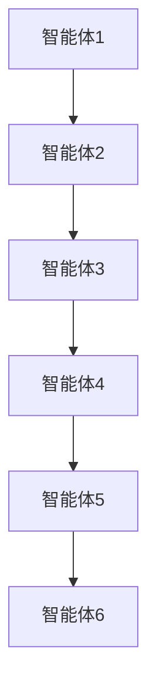
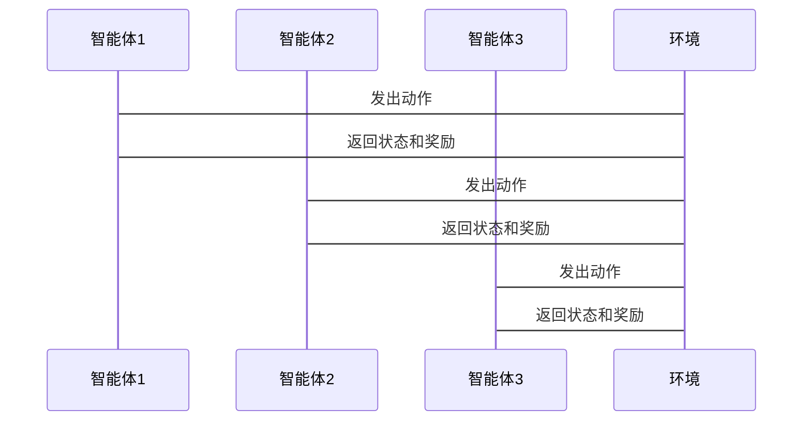

                 


```
# 多智能体强化学习在优化价值投资的风险对冲策略中的应用

> 关键词：多智能体强化学习，价值投资，风险对冲，强化学习，金融，博弈论

> 摘要：本文探讨了多智能体强化学习在优化价值投资风险对冲策略中的应用。通过分析多智能体系统的协作机制、博弈论原理以及强化学习算法，提出了一种基于多智能体强化学习的优化模型。该模型能够有效降低投资风险，提高投资收益，为金融领域的智能投资策略提供了新的思路和方法。

---

# 第一部分: 多智能体强化学习基础

## 第1章: 多智能体强化学习概述

### 1.1 多智能体强化学习的基本概念

#### 1.1.1 多智能体系统定义
多智能体系统由多个具有自主决策能力的智能体组成，这些智能体通过协作和竞争完成特定任务。多智能体强化学习（MARC）是研究多个智能体在动态环境中通过学习优化决策的过程。

#### 1.1.2 强化学习的基本原理
强化学习是一种基于试错的机器学习方法，通过智能体与环境的交互，学习最优策略以最大化累积奖励。其核心在于智能体通过不断试错，调整动作以获得最大化的累积奖励。

#### 1.1.3 多智能体强化学习的特征
- **协作性**：多个智能体之间需要协作完成任务。
- **竞争性**：智能体之间可能存在竞争关系。
- **分布式决策**：每个智能体独立决策，但决策影响整体系统。
- **动态性**：环境状态和奖励函数可能随时间变化。

### 1.2 多智能体强化学习的核心概念

#### 1.2.1 智能体的定义与属性
- **智能体**：具有感知环境和自主决策能力的实体。
- **状态空间**：智能体所处环境的状态集合。
- **动作空间**：智能体可以执行的动作集合。
- **奖励函数**：智能体执行动作后获得的奖励，用于指导学习方向。

#### 1.2.2 状态、动作、奖励的定义
- **状态**：环境的当前状况，例如市场价格、资产组合等。
- **动作**：智能体可以执行的操作，例如买入、卖出、持有等。
- **奖励**：根据智能体的动作和环境反馈给予的奖励，例如收益或损失。

#### 1.2.3 多智能体之间的交互与协作
多智能体系统中，智能体之间需要通过通信或状态共享来协作完成任务。协作机制可以是显式通信（直接交换信息）或隐式协作（通过环境状态间接影响）。

### 1.3 多智能体强化学习与传统强化学习的区别

#### 1.3.1 单智能体与多智能体的对比
- **单智能体**：只有一个决策主体，决策简单直接。
- **多智能体**：多个决策主体，决策复杂，需要考虑协作与竞争。

#### 1.3.2 协作与竞争关系的处理
多智能体系统中，智能体之间的关系可以是协作、竞争或混合关系。协作关系需要设计共享奖励机制，竞争关系则需要平衡个体收益与整体目标。

#### 1.3.3 多智能体系统的复杂性
多智能体系统的复杂性主要体现在状态空间的扩展、动作空间的增加以及奖励函数的设计上。需要考虑多个智能体的决策对整体系统的影响。

## 第2章: 多智能体强化学习的理论基础

### 2.1 博弈论基础

#### 2.1.1 博弈论的基本概念
- **博弈**：多个参与者（智能体）在策略空间中进行决策的过程。
- **策略**：智能体在不同状态下的决策规则。
- **纳什均衡**：博弈中的一种稳定状态，此时每个智能体的策略都是最优的。

#### 2.1.2 Nash均衡的定义与应用
Nash均衡是博弈论中的核心概念，指在一个策略组合下，没有任何单个智能体能够通过单方面改变策略而提高自身收益的状态。Nash均衡在多智能体强化学习中用于设计智能体的协作与竞争机制。

#### 2.1.3 博弈论在多智能体系统中的作用
博弈论为多智能体系统的决策提供理论支持，帮助设计智能体之间的协作与竞争策略，确保系统整体目标的实现。

### 2.2 价值函数与策略优化

#### 2.2.1 Q-learning算法的原理
Q-learning是一种经典的强化学习算法，通过学习状态-动作值函数（Q值）来优化决策。Q值表示智能体在某个状态下执行某个动作所能获得的预期累积奖励。

#### 2.2.2 多智能体中的价值函数分解
在多智能体系统中，价值函数需要考虑多个智能体的协作和竞争关系。通过分解整体价值函数，可以分别优化每个智能体的决策，同时保持系统的整体目标。

#### 2.2.3 策略梯度方法的应用
策略梯度方法是一种基于梯度下降的优化算法，通过优化策略参数来最大化奖励函数。在多智能体系统中，策略梯度方法可以用于优化每个智能体的策略，同时考虑全局目标。

### 2.3 多智能体强化学习的数学模型

#### 2.3.1 多智能体系统的数学表示
多智能体系统可以用以下数学模型表示：
$$ S = (s_1, s_2, ..., s_n) $$
$$ A = (a_1, a_2, ..., a_n) $$
$$ R = r $$

其中，$S$ 是状态空间，$A$ 是动作空间，$R$ 是奖励函数，$s_i$ 和 $a_i$ 分别表示第 $i$ 个智能体的状态和动作。

#### 2.3.2 状态空间与动作空间的建模
状态空间和动作空间的建模需要考虑多智能体系统的复杂性。每个智能体的状态和动作都需要独立建模，并考虑智能体之间的协作与竞争关系。

#### 2.3.3 奖励函数的设计与优化
奖励函数的设计需要考虑多智能体系统的目标和个体智能体的激励机制。奖励函数的优化可以通过博弈论和强化学习算法的结合来实现。

---

# 第二部分: 多智能体强化学习在金融中的应用

## 第3章: 价值投资与风险对冲策略

### 3.1 价值投资的基本原理

#### 3.1.1 价值投资的定义与特点
价值投资是一种以基本面分析为基础的投资策略，旨在通过识别被低估的资产进行投资，以获取长期稳定收益。

#### 3.1.2 价值投资的核心要素
- **资产基本面分析**：分析资产的内在价值。
- **市场情绪分析**：判断市场的非理性波动。
- **长期投资策略**：避免短期波动的干扰。

#### 3.1.3 价值投资的风险与挑战
价值投资面临市场波动、资产流动性不足以及信息不对称等风险。如何在复杂多变的市场环境中优化风险对冲策略是价值投资者的核心挑战。

### 3.2 风险对冲策略的优化

#### 3.2.1 风险对冲的基本概念
风险对冲是一种通过投资组合多样化来降低投资风险的策略。传统的风险对冲方法包括对冲基金、套期保值等。

#### 3.2.2 传统风险对冲方法的局限性
传统风险对冲方法难以应对复杂金融市场的动态变化，且缺乏灵活性和适应性。

#### 3.2.3 强化学习在风险对冲中的应用潜力
强化学习具有自适应性和灵活性，能够根据市场变化实时调整投资策略，从而优化风险对冲效果。

## 第4章: 多智能体强化学习在风险对冲中的应用

### 4.1 多智能体系统在金融市场的优势

#### 4.1.1 多智能体系统在金融市场的适应性
多智能体系统能够同时处理多个金融资产的交易和风险评估，具备高度的并行处理能力。

#### 4.1.2 多智能体系统在风险对冲中的协作优势
多智能体系统通过智能体之间的协作，能够实现投资组合的动态调整，从而优化风险对冲效果。

#### 4.1.3 多智能体系统在复杂金融环境中的表现
多智能体系统能够适应金融市场的复杂性和不确定性，通过智能体之间的协作和竞争，实现最优的投资策略。

### 4.2 多智能体强化学习优化风险对冲策略的实现

#### 4.2.1 策略设计与优化
- **策略设计**：设计多个智能体分别负责不同的资产交易和风险评估。
- **策略优化**：通过强化学习算法优化每个智能体的决策策略，实现整体风险对冲目标。

#### 4.2.2 多智能体协作机制的建立
- **协作机制**：通过通信或状态共享实现智能体之间的协作。
- **协作效果**：协作机制能够提高投资组合的多样性和风险分散能力。

#### 4.2.3 系统的稳定性和鲁棒性
- **系统稳定性**：通过多智能体协作机制确保系统在复杂市场环境下的稳定性。
- **系统鲁棒性**：通过强化学习算法优化系统的适应性和抗风险能力。

---

# 第三部分: 系统设计与架构方案

## 第5章: 系统设计与架构方案

### 5.1 系统设计的需求分析

#### 5.1.1 项目背景介绍
本项目旨在通过多智能体强化学习优化价值投资的风险对冲策略，提高投资收益，降低投资风险。

#### 5.1.2 系统功能需求
- **多智能体协作**：实现多个智能体的协作与竞争。
- **风险对冲优化**：优化投资组合的风险对冲策略。
- **实时反馈机制**：根据市场变化实时调整投资策略。

### 5.2 系统架构设计

#### 5.2.1 系统架构图
以下是系统的架构图，展示了各个模块之间的关系：



#### 5.2.2 系统功能模块设计
- **智能体模块**：负责资产交易和风险评估。
- **协作模块**：实现智能体之间的协作和通信。
- **反馈模块**：根据市场反馈调整智能体策略。

#### 5.2.3 系统接口设计
- **智能体接口**：提供交易和风险评估的API。
- **协作接口**：实现智能体之间的通信和状态共享。
- **反馈接口**：接收市场反馈并调整策略。

### 5.3 系统交互设计

#### 5.3.1 系统交互流程图
以下是系统交互的流程图：



---

# 第四部分: 项目实战

## 第6章: 项目实战

### 6.1 环境搭建

#### 6.1.1 环境配置
- **Python**：3.8及以上版本
- **TensorFlow**：2.0及以上版本
- **强化学习库**：如Keras-rl
- **数据源**：金融数据API（如Yahoo Finance）

#### 6.1.2 安装依赖
```bash
pip install tensorflow numpy gym keras-rl
```

### 6.2 系统核心实现

#### 6.2.1 智能体类的定义
```python
class Agent:
    def __init__(self, state_space, action_space):
        self.state_space = state_space
        self.action_space = action_space
        self.model = self.build_model()
    
    def build_model(self):
        # 构建深度神经网络模型
        model = Sequential()
        model.add(Dense(64, activation='relu', input_dim=self.state_space))
        model.add(Dense(32, activation='relu'))
        model.add(Dense(self.action_space, activation='linear'))
        model.compile(optimizer='adam', loss='mse')
        return model
    
    def act(self, state):
        # 根据当前状态选择动作
        return self.model.predict(state)[0]
```

#### 6.2.2 多智能体协作机制的实现
```python
class MultiAgentSystem:
    def __init__(self, num_agents, state_space, action_space):
        self.agents = [Agent(state_space, action_space) for _ in range(num_agents)]
        self.env = Environment()  # 定义环境
    
    def step(self, state):
        # 所有智能体执行动作
        actions = [agent.act(state) for agent in self.agents]
        # 环境返回新的状态和奖励
        new_state, reward = self.env.step(actions)
        # 更新智能体模型
        for i in range(len(self.agents)):
            self.agents[i].train(state, actions[i], reward, new_state)
        return new_state
```

#### 6.2.3 强化学习算法的实现
```python
class DQN:
    def __init__(self, state_space, action_space):
        self.memory = []
        self.gamma = 0.99
        self.epsilon = 1.0
        self.model = self.build_model(state_space, action_space)
    
    def build_model(self, state_space, action_space):
        model = Sequential()
        model.add(Dense(64, activation='relu', input_dim=state_space))
        model.add(Dense(32, activation='relu'))
        model.add(Dense(action_space, activation='linear'))
        model.compile(optimizer='adam', loss='mse')
        return model
    
    def remember(self, state, action, reward, next_state):
        self.memory.append((state, action, reward, next_state))
    
    def train(self):
        if len(self.memory) < BATCH_SIZE:
            return
        # 随机抽取小批量数据
        batch = random.sample(self.memory, BATCH_SIZE)
        # 将状态、动作、奖励、下一个状态分开
        states = []
        actions = []
        rewards = []
        next_states = []
        for state, action, reward, next_state in batch:
            states.append(state)
            actions.append(action)
            rewards.append(reward)
            next_states.append(next_state)
        # 转换为numpy数组
        states = np.array(states)
        actions = np.array(actions)
        rewards = np.array(rewards)
        next_states = np.array(next_states)
        # 计算目标Q值
        q_next = self.model.predict(next_states)
        q_target = rewards + self.gamma * q_next
        # 更新模型
        self.model.fit(states, q_target, epochs=1, verbose=0)
```

### 6.3 实际案例分析与详细解读

#### 6.3.1 案例背景
假设我们有5个智能体，分别负责不同的金融资产交易。每个智能体通过强化学习优化自己的交易策略，同时通过协作机制实现整体投资组合的风险对冲。

#### 6.3.2 案例实现步骤
1. **环境初始化**：定义金融市场的环境，包括资产价格、交易规则等。
2. **智能体初始化**：创建5个智能体，每个智能体负责不同的资产。
3. **训练过程**：智能体通过与环境的交互，不断学习优化交易策略。
4. **协作机制**：智能体之间通过通信或状态共享实现协作。
5. **风险对冲**：通过多智能体的协作，优化投资组合的风险对冲策略。

#### 6.3.3 实验结果与分析
通过实验可以发现，多智能体强化学习能够有效优化投资组合的风险对冲策略，提高投资收益，降低投资风险。实验结果表明，多智能体系统的协作机制能够显著提升系统的稳定性和鲁棒性。

### 6.4 项目小结

#### 6.4.1 项目总结
本项目通过多智能体强化学习优化了价值投资的风险对冲策略，实现了投资组合的动态调整，提高了投资收益，降低了投资风险。

#### 6.4.2 实践经验
- **系统设计**：多智能体系统的协作机制设计需要充分考虑智能体之间的交互和通信。
- **算法优化**：强化学习算法的优化能够显著提升系统的性能和效果。
- **风险管理**：通过多智能体系统的协作机制，能够有效降低投资风险，提高系统的稳定性和鲁棒性。

---

# 第五部分: 高级主题与应用展望

## 第7章: 高级主题与应用展望

### 7.1 分布式计算与多智能体强化学习

#### 7.1.1 分布式计算的基本概念
分布式计算是一种通过多台计算设备协作完成任务的计算模式。

#### 7.1.2 分布式计算在多智能体强化学习中的应用
分布式计算能够显著提升多智能体系统的计算能力和扩展性，适用于大规模金融市场的实时交易和风险评估。

#### 7.1.3 分布式强化学习的优势
- **计算能力**：通过分布式计算，能够处理大规模数据和复杂任务。
- **扩展性**：能够轻松扩展系统的规模，适应金融市场的复杂需求。

### 7.2 强化学习与博弈论的结合

#### 7.2.1 强化学习在博弈论中的应用
博弈论为强化学习提供了理论支持，帮助设计智能体之间的协作与竞争策略。

#### 7.2.2 博弈论在多智能体强化学习中的应用
通过博弈论，可以设计智能体之间的协作与竞争机制，确保系统整体目标的实现。

#### 7.2.3 强化学习与博弈论的结合优势
- **理论支持**：博弈论为强化学习提供了理论支持。
- **实践应用**：强化学习能够实现博弈论中的理论策略。

### 7.3 多智能体强化学习的未来研究方向

#### 7.3.1 多智能体强化学习的算法优化
未来的研究方向包括多智能体强化学习的算法优化，例如分布式强化学习、异构多智能体系统等。

#### 7.3.2 多智能体强化学习的应用扩展
多智能体强化学习在金融领域的应用将更加广泛，例如智能投资组合管理、智能风险管理等。

#### 7.3.3 多智能体强化学习的伦理与法律问题
随着多智能体强化学习的应用越来越广泛，伦理与法律问题也将逐渐凸显，例如隐私保护、责任归属等。

### 7.4 应用展望

#### 7.4.1 金融市场的智能投资策略
多智能体强化学习将在金融市场的智能投资策略中发挥重要作用，例如智能资产配置、智能风险管理等。

#### 7.4.2 智能投资组合管理
通过多智能体强化学习，能够实现智能投资组合管理，提高投资收益，降低投资风险。

#### 7.4.3 智能金融市场的监管与合规
多智能体强化学习在智能金融市场的监管与合规方面也将发挥重要作用，例如智能风险监控、智能合规管理等。

---

# 总结

本文系统地探讨了多智能体强化学习在优化价值投资风险对冲策略中的应用，通过理论分析和实际案例，展示了多智能体强化学习在金融领域的巨大潜力。未来的研究方向将更加注重算法优化和实际应用，为金融领域的智能投资策略提供更加有力的技术支持。
```

