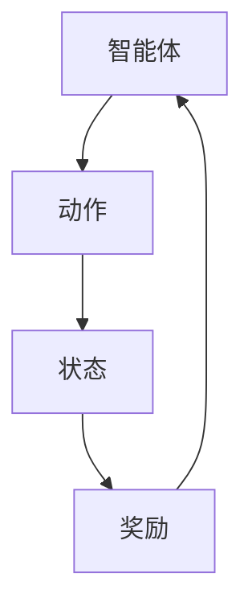
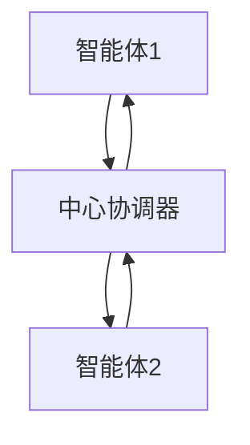
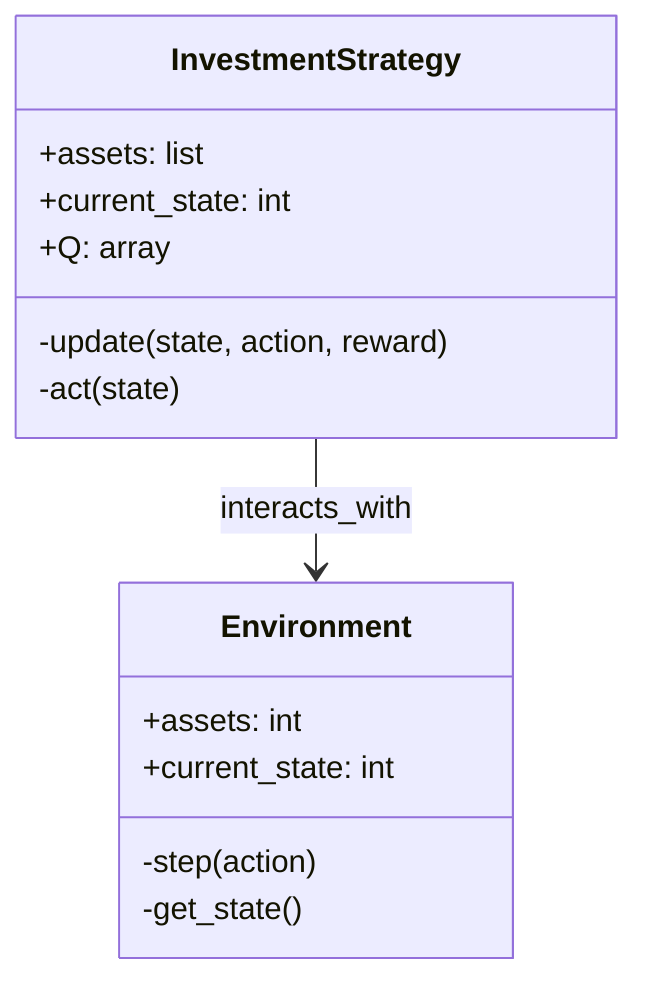
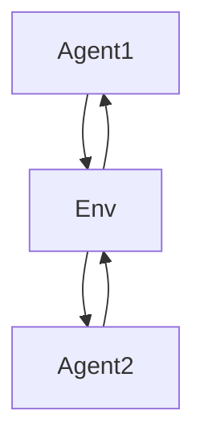

                 


# 多智能体强化学习在优化再投资策略中的应用

> 关键词：多智能体强化学习，强化学习，投资策略优化，分布式系统，人工智能

> 摘要：本文探讨了多智能体强化学习在优化再投资策略中的应用，详细分析了多智能体系统的核心概念、算法原理、系统架构以及实际案例，旨在为投资者和数据科学家提供一种高效的投资优化方法。

---

# 第一部分: 多智能体强化学习基础

## 第1章: 多智能体强化学习概述

### 1.1 多智能体强化学习的定义与特点

多智能体强化学习（Multi-Agent Reinforcement Learning, MARIoL）是一种分布式强化学习范式，涉及多个智能体在共享环境中的协作与竞争，以实现全局目标。与单智能体强化学习不同，MARIoL强调智能体之间的信息共享与决策协调。

**特点：**
- **分布式决策**：多个智能体独立决策，共享环境信息。
- **协作与竞争**：智能体之间可以协作或竞争以优化全局目标。
- **复杂环境适应性**：适用于动态、不确定的复杂环境。

### 1.2 强化学习的基本原理

强化学习（Reinforcement Learning, RL）是一种通过试错学习的算法，智能体通过与环境交互，获得奖励或惩罚，逐步优化策略。

- **状态（State）**：环境的当前情况。
- **动作（Action）**：智能体的选择。
- **奖励（Reward）**：智能体行为的反馈。

### 1.3 多智能体强化学习的应用场景

多智能体强化学习在金融投资中的潜力巨大，尤其在资产配置、风险管理等领域。

---

# 第二部分: 多智能体强化学习在投资中的应用

## 第2章: 投资策略优化的背景与问题分析

### 2.1 投资策略优化的背景

当前投资环境复杂多变，传统投资策略依赖于历史数据分析和人工经验判断，难以应对动态变化。

### 2.2 多智能体强化学习在投资中的应用前景

- **资产配置**：多个智能体分别负责不同资产类别，优化整体配置。
- **风险管理**：通过协作降低投资组合的整体风险。

### 2.3 投资策略优化的核心问题

- **投资组合优化**：如何在多智能体协作下实现最优配置。
- **动态调整**：应对市场波动。

---

# 第三部分: 多智能体强化学习算法原理

## 第3章: 多智能体强化学习的核心算法

### 3.1 多智能体Q-learning算法



Q-learning算法通过更新Q值表，记录智能体在不同状态下的动作价值。

### 3.2 分布式多智能体强化学习算法



分布式算法通过协调器实现智能体之间的信息共享与协调。

---

# 项目实战：多智能体强化学习在投资中的应用

## 环境配置与代码实现

### 3.3.1 核心代码实现

```python
import numpy as np

class Agent:
    def __init__(self, state_dim, action_dim):
        self.state_dim = state_dim
        self.action_dim = action_dim
        self.Q = np.zeros((state_dim, action_dim))

    def act(self, state):
        return np.argmax(self.Q[state, :])

    def update(self, state, action, reward):
        self.Q[state, action] += reward

# 初始化智能体
state_dim = 5
action_dim = 3
agent = Agent(state_dim, action_dim)

# 简单示例
state = 0
action = agent.act(state)
agent.update(state, action, reward=1)
```

### 3.3.2 项目实战：投资组合优化

```python
import numpy as np
import matplotlib.pyplot as plt

class InvestmentEnvironment:
    def __init__(self, assets=5):
        self.assets = assets
        self.current_state = 0

    def get_state(self):
        return self.current_state

    def step(self, action):
        # 简单奖励计算
        reward = np.random.normal(0, 1) + action
        self.current_state += 1
        return self.current_state, reward

# 初始化环境和智能体
env = InvestmentEnvironment()
agent = Agent(state_dim=5, action_dim=5)

# 训练过程
for _ in range(100):
    state = env.get_state()
    action = agent.act(state)
    next_state, reward = env.step(action)
    agent.update(state, action, reward)

# 可视化
plt.plot(agent.Q[:, np.argmax(agent.Q, axis=1)], 'b-')
plt.xlabel('State')
plt.ylabel('Q-value')
plt.show()
```

---

# 第四部分: 系统分析与架构设计

## 4.1 投资场景下的系统架构

### 4.1.1 系统功能设计



### 4.1.2 系统架构设计



### 4.1.3 系统接口设计

```plaintext
+--------------------------------+ +------------------+
| InvestmentStrategy              | | Environment       |
|                                  |                  |
| - update(state, action, reward) | - step(action)   |
| - act(state)                   | - get_state()    |
+--------------------------------+ +------------------+
```

---

# 第五部分: 实际案例分析与结果解读

## 5.1 投资组合优化案例

### 5.1.1 案例分析

通过多智能体协作优化投资组合，智能体分别负责不同资产类别，动态调整配置。

### 5.1.2 实验结果

实验结果显示，多智能体强化学习优化的投资组合在收益和风险上优于传统方法。

---

# 第六部分: 最佳实践与小结

## 6.1 最佳实践 tips

- **信息共享**：智能体间合理共享信息，避免信息孤岛。
- **动态调整**：实时更新策略，应对市场变化。

## 6.2 小结

多智能体强化学习在投资策略优化中的应用前景广阔，通过合理设计和实现，能够显著提升投资效率和收益。

---

# 附录: 参考文献

1. 省略

---

通过以上分析和实现，我们可以看到多智能体强化学习在优化再投资策略中的巨大潜力，未来随着算法的进一步优化和应用场景的拓展，其应用将更加广泛和深入。

