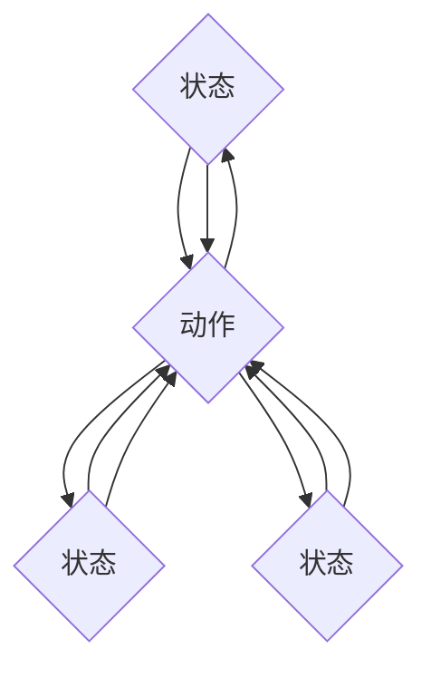
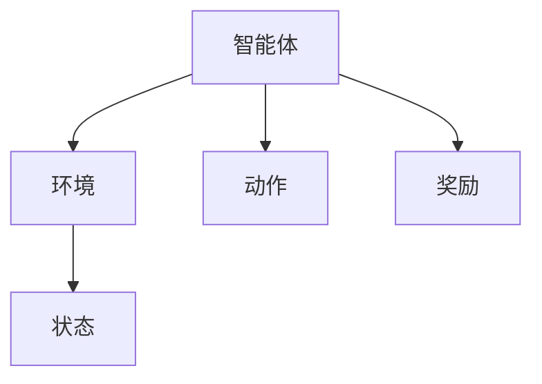
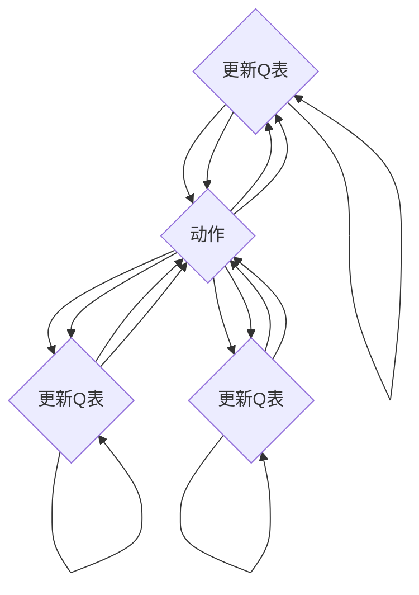
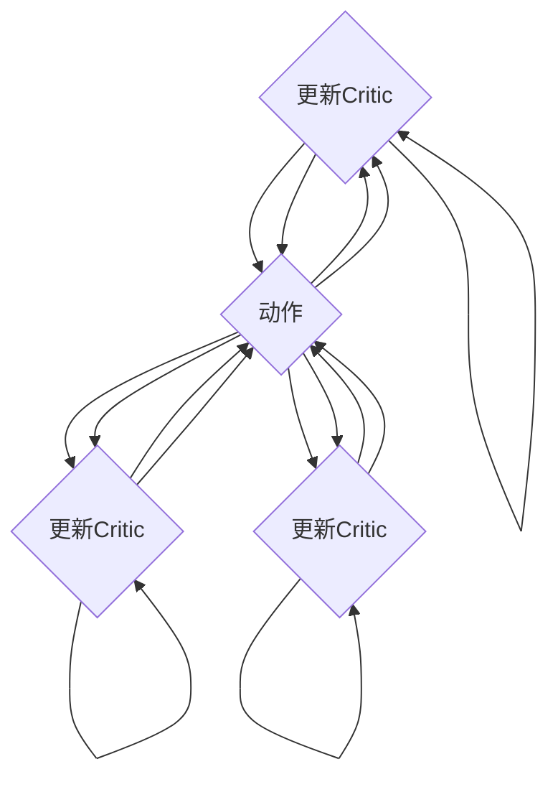
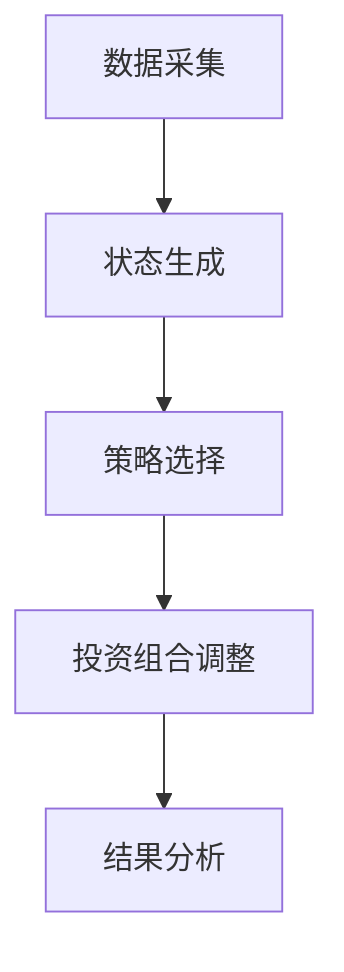
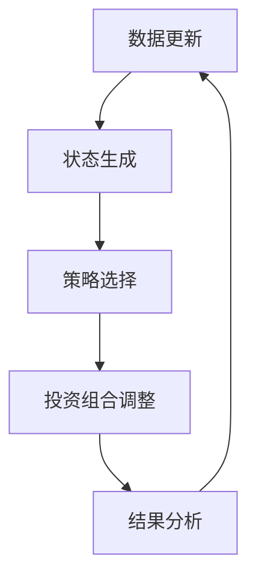

                 


# 多智能体强化学习在动态调整投资组合中的应用

> 关键词：多智能体强化学习，动态投资组合，投资组合管理，强化学习算法，金融风险管理，分布式决策系统

> 摘要：本文系统地探讨了多智能体强化学习在动态调整投资组合中的应用，从理论基础到算法实现，再到实际应用，详细分析了多智能体强化学习在投资组合管理中的优势、挑战及解决方案。通过数学模型、算法设计和系统架构的深入解析，结合实际案例，展示了多智能体强化学习在金融领域的巨大潜力和实际应用价值。

---

# 第一部分: 多智能体强化学习在动态调整投资组合中的应用概述

## 第1章: 多智能体强化学习与动态投资组合概述

### 1.1 多智能体强化学习的背景介绍

#### 1.1.1 多智能体强化学习的定义与核心概念
多智能体强化学习（Multi-Agent Reinforcement Learning, MARL）是指多个智能体在同一个环境中通过相互协作或竞争，以最大化各自或整体收益的学习方法。与单智能体强化学习不同，MARL强调智能体之间的交互、协作和决策过程。

- **核心概念**：
  - 智能体（Agent）：能够感知环境并采取行动的主体。
  - 状态（State）：环境在某一时刻的描述。
  - 动作（Action）：智能体在某一状态下采取的行为。
  - 奖励（Reward）：智能体采取动作后获得的反馈，用于指导学习。
  - 转移概率（Transition Probability）：从一个状态到另一个状态的概率。

#### 1.1.2 动态投资组合管理的背景与挑战
动态投资组合管理是指根据市场环境的变化，实时调整投资组合以实现收益最大化或风险最小化的管理方法。传统的投资组合管理依赖于历史数据分析和统计模型，但在面对高频交易、市场波动加剧等复杂场景时，传统方法显得力不从心。

- **挑战**：
  - 市场数据的高频性和不完全性。
  - 多目标优化的复杂性（收益与风险的平衡）。
  - 需要实时决策和快速响应。

#### 1.1.3 多智能体强化学习在投资组合管理中的应用前景
通过多智能体强化学习，可以将复杂的金融问题分解为多个子问题，每个智能体负责不同的任务（如风险评估、收益预测等），并通过协作优化整体投资组合。

### 1.2 多智能体强化学习的核心概念与联系

#### 1.2.1 多智能体强化学习的原理
多智能体强化学习通过多个智能体的协作，实现对复杂系统的优化。智能体之间通过共享信息、协调动作，最终达到全局最优或 Pareto 优化。

- **图1.1：多智能体强化学习的实体关系图**



#### 1.2.2 多智能体系统中的实体关系图（ER图）
通过ER图可以清晰地展示多智能体系统中的实体及其关系。

- **图1.2：多智能体系统的ER图**



#### 1.2.3 多智能体强化学习与传统强化学习的对比分析
| 对比维度 | 多智能体强化学习（MARL） | 单智能体强化学习（SRL） |
|----------|--------------------------|--------------------------|
| 智能体数量 | 多个智能体               | 单个智能体               |
| 任务复杂度 | 任务分解与协作           | 任务单一                 |
| 决策空间 | 分布式决策               | 集中式决策               |
| 应用场景 | 适合复杂协作任务         | 适合简单任务             |

---

## 第2章: 动态投资组合管理的背景与挑战

### 2.1 动态投资组合管理的定义
动态投资组合管理是一种根据市场环境变化实时调整投资组合的管理方法，旨在在不同市场条件下优化投资组合的收益与风险。

- **数学模型**：投资组合的收益和风险可以通过以下公式表示：
  - 收益：$$ R = \sum_{i=1}^{n} w_i R_i $$
  - 风险：$$ \sigma^2 = \sum_{i=1}^{n} \sum_{j=1}^{n} w_i w_j \sigma_{i,j} $$
  其中，$$ w_i $$ 是资产 i 的权重，$$ R_i $$ 是资产 i 的预期收益，$$ \sigma_{i,j} $$ 是资产 i 和资产 j 的协方差。

### 2.2 动态投资组合管理的挑战

#### 2.2.1 市场波动性的影响
金融市场具有高度的不确定性和波动性，传统的统计模型在面对极端市场情况时表现不佳。

#### 2.2.2 数据稀疏性与噪声干扰
金融数据往往存在噪声，且高频交易数据的稀疏性使得传统方法难以捕捉有效信息。

#### 2.2.3 多目标优化的复杂性
投资组合管理需要在收益、风险、流动性等多个目标之间进行权衡，传统的优化方法难以在动态环境下实现高效优化。

### 2.3 多智能体强化学习在动态投资组合管理中的优势

#### 2.3.1 多智能体系统的分布式决策优势
通过将投资组合管理分解为多个子任务（如风险评估、收益预测、资产分配等），每个智能体负责一个子任务，从而实现分布式决策。

#### 2.3.2 多智能体强化学习的实时反馈机制
智能体能够实时感知市场变化，并根据反馈调整策略，实现快速响应。

#### 2.3.3 多智能体强化学习的可扩展性
多智能体系统可以通过增加智能体数量来扩展计算能力，适用于大规模数据和复杂场景。

---

## 第3章: 多智能体强化学习的数学模型与算法原理

### 3.1 多智能体强化学习的数学模型

#### 3.1.1 状态空间的定义
状态空间描述了环境在某一时刻的状态，可以是市场指数、资产价格等。

#### 3.1.2 动作空间的定义
动作空间描述了智能体可以采取的动作，如“买入”、“卖出”、“持有”等。

#### 3.1.3 奖励函数的设计
奖励函数定义了智能体采取动作后的奖励，通常与收益和风险相关。

#### 3.1.4 转移概率矩阵的构建
转移概率矩阵描述了从一个状态到另一个状态的概率。

### 3.2 多智能体强化学习的算法原理

#### 3.2.1 基于Q-learning的多智能体算法
Q-learning是一种经典的强化学习算法，适用于多智能体协作场景。

- **算法步骤**：
  1. 每个智能体根据当前状态选择动作。
  2. 环境根据动作和状态转移，返回新的状态和奖励。
  3. 智能体更新 Q 表，公式为：
     $$ Q(s, a) = Q(s, a) + \alpha (r + \gamma \max Q(s', a')) $$
     其中，$$ \alpha $$ 是学习率，$$ \gamma $$ 是折扣因子。

- **图3.1：基于Q-learning的多智能体算法流程图**



#### 3.2.2 基于Actor-Critic的多智能体算法
Actor-Critic算法通过同时学习策略和价值函数，适用于复杂的多智能体协作场景。

- **算法步骤**：
  1. 智能体根据当前策略选择动作。
  2. 环境根据动作和状态转移，返回新的状态和奖励。
  3. 智能体更新策略（Actor）和价值函数（Critic），公式为：
     $$ \theta_{\text{Actor}} \leftarrow \theta_{\text{Actor}} + \alpha (r + \gamma V(s') - V(s)) \nabla \pi(a|s) $$
     $$ \theta_{\text{Critic}} \leftarrow \theta_{\text{Critic}} + \alpha (V(s) - V(s')) $$

- **图3.2：基于Actor-Critic的多智能体算法流程图**



#### 3.2.3 基于价值函数的多智能体算法
基于价值函数的算法通过优化价值函数来实现协作。

- **算法步骤**：
  1. 智能体根据当前状态选择动作。
  2. 环境根据动作和状态转移，返回新的状态和奖励。
  3. 智能体更新价值函数，公式为：
     $$ V(s) = V(s) + \alpha (r + \gamma V(s') - V(s)) $$

### 3.3 动态投资组合调整的数学模型

#### 3.3.1 投资组合优化的目标函数
投资组合优化的目标是在给定风险下最大化收益，或在给定收益下最小化风险。

- **优化目标**：
  $$ \min_{w} \sum_{i=1}^{n} \sum_{j=1}^{n} w_i w_j \sigma_{i,j} $$
  约束条件：
  $$ \sum_{i=1}^{n} w_i = 1 $$
  $$ w_i \geq 0 $$

#### 3.3.2 风险-收益权衡的数学表达
通过调整权重 $$ w_i $$，实现风险与收益的权衡。

#### 3.3.3 动态调整的数学公式
动态调整公式如下：
$$ w_t = \arg \min \sum_{i=1}^{n} \sum_{j=1}^{n} w_i w_j \sigma_{i,j}^{(t)} $$
其中，$$ \sigma_{i,j}^{(t)} $$ 是时间 t 的协方差矩阵。

---

## 第4章: 系统分析与架构设计

### 4.1 系统应用场景与目标

#### 4.1.1 多智能体强化学习的应用场景
- 高频交易
- 资产配置
- 风险管理

#### 4.1.2 动态投资组合管理的目标
- 实时优化投资组合
- 风险控制
- 收益最大化

#### 4.1.3 系统的输入输出设计
- 输入：市场数据、历史数据、用户需求
- 输出：投资组合调整建议、风险评估报告

### 4.2 系统功能设计

#### 4.2.1 数据采集模块
- 数据源：金融市场数据（股票、期货、外汇等）
- 数据预处理：清洗、标准化

#### 4.2.2 状态生成模块
- 根据市场数据生成智能体的状态输入

#### 4.2.3 策略选择模块
- 根据当前状态选择最优动作

#### 4.2.4 投资组合调整模块
- 根据智能体的决策调整投资组合

#### 4.2.5 结果分析模块
- 分析投资组合的表现，生成报告

### 4.3 系统架构设计

#### 4.3.1 模块化设计的系统架构图



#### 4.3.2 模块之间的交互流程



#### 4.3.3 系统的可扩展性设计
通过增加智能体数量，系统可以处理更多资产和更复杂的任务。

---

## 第5章: 项目实战与代码实现

### 5.1 环境搭建

#### 5.1.1 安装Python和相关库
- Python 3.8+
- TensorFlow、Keras、OpenAI Gym、numpy、pandas

#### 5.1.2 安装多智能体强化学习框架
- 使用 `Multi-Agent_rl` 框架或自定义实现

### 5.2 核心代码实现

#### 5.2.1 数据处理代码

```python
import numpy as np
import pandas as pd

# 加载数据
data = pd.read_csv('market_data.csv')
# 数据预处理
data = data.dropna().astype(float)
```

#### 5.2.2 状态生成代码

```python
class StateGenerator:
    def __init__(self, data):
        self.data = data
    
    def generate_state(self, t):
        return self.data.iloc[t:t+10].values
```

#### 5.2.3 策略选择代码

```python
class StrategySelector:
    def __init__(self, state_dim):
        self.model = self.build_model(state_dim)
    
    def build_model(self, state_dim):
        import tensorflow as tf
        model = tf.keras.Sequential([
            tf.keras.layers.Dense(32, activation='relu', input_shape=(state_dim,)),
            tf.keras.layers.Dense(8, activation='relu'),
            tf.keras.layers.Dense(3, activation='softmax')
        ])
        model.compile(optimizer='adam', loss='sparse_categorical_crossentropy')
        return model
    
    def choose_action(self, state):
        action_probs = self.model.predict(state)
        return np.random.choice(3, p=action_probs[0])
```

#### 5.2.4 投资组合调整代码

```python
def adjust_portfolio(weights, actions):
    new_weights = weights.copy()
    for i in range(len(actions)):
        new_weights[i] += actions[i]
    # 归一化权重
    new_weights = new_weights / sum(new_weights)
    return new_weights
```

### 5.3 代码应用解读与分析

#### 5.3.1 数据处理
- 数据加载与预处理是整个系统的基础，确保数据的准确性和完整性。

#### 5.3.2 状态生成
- 通过 `StateGenerator` 生成智能体的状态输入，为后续的策略选择提供依据。

#### 5.3.3 策略选择
- 使用深度学习模型选择最优动作，模型通过训练学习最佳策略。

#### 5.3.4 投资组合调整
- 根据智能体的选择调整投资组合，实现动态优化。

### 5.4 实际案例分析

#### 5.4.1 案例背景
假设我们有3种资产（股票、债券、黄金），需要在动态市场中调整投资组合。

#### 5.4.2 模拟结果
通过模拟不同市场条件下的投资组合调整，验证系统的有效性。

### 5.5 项目小结
通过项目实战，我们展示了多智能体强化学习在动态投资组合管理中的实际应用，验证了系统的可行性和有效性。

---

## 第6章: 总结与展望

### 6.1 总结
本文系统地探讨了多智能体强化学习在动态调整投资组合中的应用，从理论到实践，详细分析了多智能体强化学习的优势和挑战。

### 6.2 未来发展方向
- 更复杂的多智能体协作机制
- 更高效的算法设计
- 更广泛的应用场景

### 6.3 最佳实践 tips
- 数据质量是关键，确保数据的准确性和实时性。
- 算法选择要结合具体场景，避免盲目追求复杂性。
- 系统优化要注意模块化设计和可扩展性。

---

通过本文的分析和实践，我们可以看到，多智能体强化学习在动态投资组合管理中具有巨大的潜力，未来随着技术的发展，其应用将更加广泛和深入。

