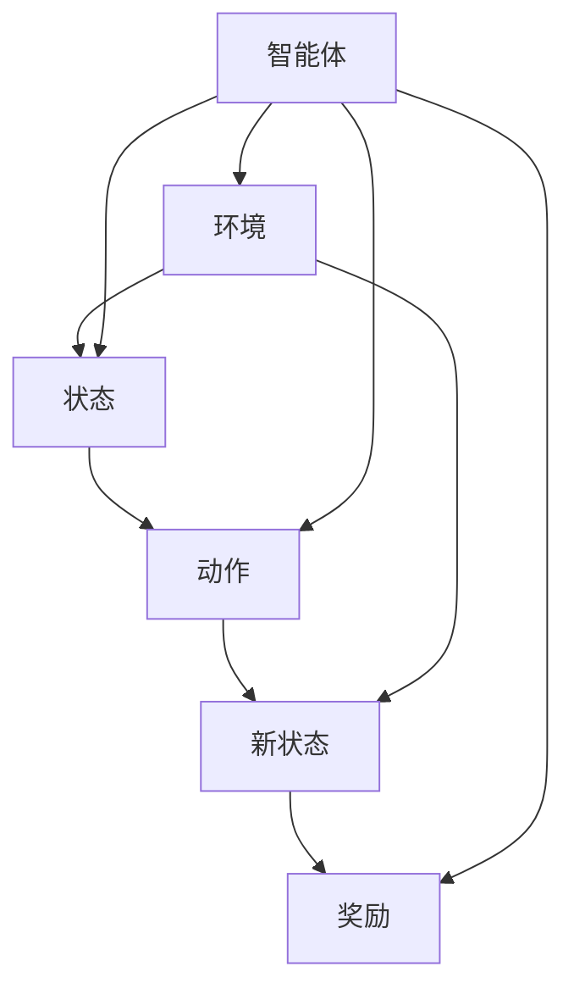

                 


# 多智能体强化学习在股票选择中的应用

> 关键词：多智能体强化学习，股票选择，强化学习，金融，人工智能

> 摘要：本文探讨了多智能体强化学习在股票选择中的应用，从基本概念到算法原理，再到系统设计和项目实战，详细分析了如何利用多智能体强化学习提升股票选择的效率和准确性。通过实际案例和代码实现，展示了该技术在金融领域的潜力和优势。

---

# 引言

在金融领域，股票选择是一项复杂且具有挑战性的任务。传统的投资策略依赖于历史数据分析和专家经验，但面对市场波动和不确定性，这些方法往往显得力不从心。近年来，人工智能技术，尤其是强化学习，为股票选择提供了一种新的解决方案。多智能体强化学习通过多个智能体协作，能够更高效地处理复杂金融市场中的多维度信息，从而优化投资决策。本文将深入探讨多智能体强化学习在股票选择中的应用，分析其优势、算法原理及实际案例。

---

## 第一部分：多智能体强化学习基础

### 第1章：多智能体强化学习概述

#### 1.1 多智能体强化学习的基本概念

- **智能体定义**：智能体是能够感知环境并采取行动以实现目标的实体。在股票选择中，每个智能体可以专注于不同的市场指标或公司基本面信息。
- **强化学习的基本原理**：通过与环境互动，智能体学习策略以最大化累积奖励。奖励机制可以是投资回报率或收益波动率等。
- **多智能体强化学习的定义**：多个智能体协作或竞争，共同完成复杂任务。在股票选择中，多个智能体可以分别关注技术分析、市场情绪和公司基本面，协作决策。

#### 1.2 多智能体与单智能体的对比

| 对比维度 | 单智能体 | 多智能体 |
|----------|----------|----------|
| 任务复杂性 | 简单任务 | 复杂任务 |
| 智能体数量 | 1        | 多个     |
| 协作性    | 无协作   | 协作或竞争 |

#### 1.3 股票选择中的应用前景

- **优势**：多智能体能够分解复杂任务，提升决策效率和准确性。
- **挑战**：需解决通信与协调问题，避免信息过载。

---

### 第2章：多智能体强化学习的核心概念

#### 2.1 状态空间与动作空间

- **状态空间**：智能体感知的环境信息，如股价、成交量等。
- **动作空间**：智能体可执行的操作，如买入、卖出或持有。

#### 2.2 价值函数与策略函数

- **价值函数**：评估状态-动作对的期望收益。
- **策略函数**：决定智能体在状态下的最优动作。

#### 2.3 协作与竞争机制

- **协作**：智能体共享信息，共同优化投资组合。
- **竞争**：智能体之间存在利益冲突，需平衡个体与全局目标。

---

## 第二部分：算法原理

### 第3章：多智能体强化学习的算法框架

#### 3.1 Q-Learning算法



#### 3.2 Actor-Critic架构

- **Actor**：负责决策，输出动作。
- **Critic**：评估动作的价值，提供反馈。

#### 3.3 算法实现

```python
import numpy as np

class DQN:
    def __init__(self, state_space, action_space):
        self.state_space = state_space
        self.action_space = action_space
        # 初始化网络模型
```

---

## 第三部分：系统设计

### 第4章：系统架构设计

#### 4.1 项目介绍

- **目标**：构建一个多智能体强化学习系统，用于股票选择。

#### 4.2 功能设计

- **数据处理模块**：获取和预处理股票数据。
- **智能体协作模块**：多个智能体协作决策。
- **策略执行模块**：根据决策执行交易。

#### 4.3 系统架构图


---

## 第四部分：项目实战

### 第5章：环境安装与数据获取

#### 5.1 环境安装

- **安装依赖**：TensorFlow、Keras、OpenAI Gym等。

#### 5.2 数据获取

- **数据源**：使用Yahoo Finance获取历史数据。

### 第6章：模型实现与结果分析

#### 6.1 模型实现

```python
import gym
from gym import spaces

class StockEnv(gym.Env):
    def __init__(self, data):
        self.data = data
        self.current_step = 0
        self.observation_space = spaces.Box(low=0, high=1, shape=(1, 1))
        self.action_space = spaces.Discrete(3)
```

#### 6.2 结果分析

- **回测结果**：展示策略的收益曲线。
- **风险指标**：分析最大回撤、夏普比率等。

---

## 第五部分：扩展阅读

### 第7章：最佳实践与注意事项

- **数据质量**：确保数据清洗和特征工程。
- **模型调参**：优化超参数提升性能。
- **风险管理**：设置止损和止盈机制。

### 第8章：未来展望

- **多模态数据融合**：结合文本、图像等多模态数据。
- **分布式训练**：提升系统的并行计算能力。

---

## 结语

多智能体强化学习为股票选择提供了新的可能性，通过协作和竞争机制，多个智能体能够更高效地处理复杂市场信息。随着技术的发展，多智能体强化学习在金融领域的应用将更加广泛和深入。

--- 

**全文完**

