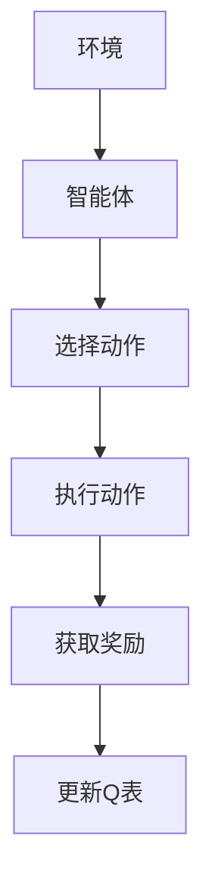
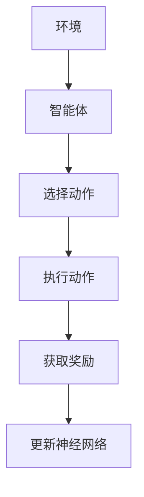
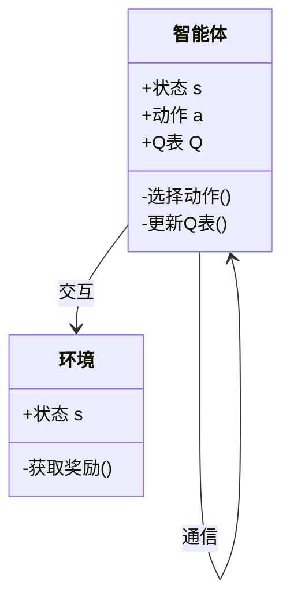

                 


# 多智能体强化学习：复杂环境下的AI Agent协作

> 关键词：多智能体强化学习、AI Agent协作、复杂环境、强化学习算法、系统设计、项目实战

> 摘要：  
多智能体强化学习（Multi-Agent Reinforcement Learning, MARL）是人工智能领域的重要研究方向，旨在研究多个智能体在复杂环境中的协作与竞争问题。本文系统地介绍了多智能体强化学习的核心概念、算法原理、系统设计与实现，以及在实际项目中的应用。通过详细分析多智能体协作的机制、算法的设计与优化，以及复杂环境下的系统实现，本文为读者提供了从理论到实践的全面指导。

---

## 第1章: 多智能体强化学习概述

### 1.1 多智能体强化学习的定义与特点

多智能体强化学习（MARL）是指多个智能体在共享或独立的环境中通过相互协作或竞争，以实现共同目标或个体目标的强化学习方法。与单智能体强化学习（SARL）相比，MARL的核心在于多个智能体之间的协作与信息共享。

#### 1.1.1 多智能体强化学习的定义
多智能体强化学习系统由多个智能体（Agent）组成，每个智能体都有自己的观测、动作和目标。智能体之间可以通过通信共享信息，从而协作完成复杂任务。MARL的主要目标是设计高效的协作机制，使得所有智能体能够共同优化整体或个体的奖励函数。

#### 1.1.2 多智能体与单智能体强化学习的区别
| 属性 | 单智能体强化学习 | 多智能体强化学习 |
|------|------------------|------------------|
| 智能体数量 | 单个智能体       | 多个智能体       |
| 信息共享 | 无               | 可能存在         |
| 协作性 | 无               | 强              |
| 复杂性 | 较低             | 较高            |

#### 1.1.3 多智能体强化学习的核心要素
1. **智能体**：智能体是环境中能够感知并自主决策的实体，具有明确的目标和行动能力。
2. **环境**：环境是智能体所处的外部世界，可以是静态或动态的，且可能包含其他智能体。
3. **协作机制**：智能体之间的通信、协调和合作方式，直接影响任务的完成效果。
4. **奖励函数**：用于衡量智能体行为的优劣，通常设计为团队奖励或个体奖励。

### 1.2 多智能体系统的结构与协作机制

多智能体系统的结构决定了协作的方式和效率。以下是几种常见的协作机制：

#### 1.2.1 多智能体系统的组成
1. **智能体**：每个智能体都有自己的观测、动作空间和策略。
2. **通信协议**：智能体之间通过某种协议进行信息交换，例如共享状态或动作。
3. **协作策略**：智能体采取的协作方式，例如任务分配或联合决策。

#### 1.2.2 多智能体协作的通信模型
智能体之间的通信可以通过以下方式实现：
1. **直接通信**：智能体之间通过共享信息或直接交换动作。
2. **间接通信**：通过中间媒介（如共享黑板）进行信息交换。

#### 1.2.3 多智能体系统的分类与应用场景
多智能体系统可以根据任务类型分为竞争型和协作型。协作型任务通常涉及团队合作，例如无人机编队、自动驾驶等。

### 1.3 强化学习在多智能体协作中的作用

强化学习（Reinforcement Learning, RL）是多智能体协作的核心技术。通过不断试错，智能体能够学习到最优策略。

#### 1.3.1 强化学习的基本原理
智能体通过与环境交互，学习如何选择动作以最大化累计奖励。常用的算法包括Q-learning和Deep Q-Networks（DQN）。

#### 1.3.2 多智能体强化学习的挑战与机遇
- **挑战**：智能体之间的协调需要复杂的通信和协作机制，且环境复杂性大幅增加。
- **机遇**：通过协作，智能体能够完成单个智能体无法完成的复杂任务。

#### 1.3.3 多智能体强化学习的未来发展方向
未来的研究方向包括更高效的协作算法、动态环境下的自适应协作机制等。

---

## 第2章: 多智能体强化学习的核心算法

### 2.1 多智能体强化学习的基本算法

#### 2.1.1 Q-learning算法
Q-learning是一种经典的强化学习算法，适用于单智能体和多智能体环境。其核心思想是通过Q表记录状态-动作对的最优价值。

##### 算法流程图


##### Q-learning公式
$$ Q(s, a) = Q(s, a) + \alpha (r + \gamma \max Q(s', a') - Q(s, a)) $$

#### 2.1.2 Deep Q-Networks (DQN) 算法
DQN通过深度神经网络近似Q值函数，适用于高维状态空间。

##### DQN算法流程图


##### DQN公式
$$ Q(s, a) = \hat{Q}(s, a) $$

#### 2.1.3 Value Approximation Networks (VAN) 算法
VAN通过近似值函数来优化多个智能体的协作策略。

##### VAN公式
$$ V(s) = \min_{i} V_i(s) $$

---

## 第3章: 多智能体强化学习的系统设计与实现

### 3.1 系统架构设计

#### 3.1.1 系统功能设计
- **环境构建**：定义智能体所处的环境和任务。
- **智能体协作**：设计智能体之间的通信和协作机制。
- **算法实现**：实现强化学习算法并进行训练。

#### 3.1.2 系统架构图


### 3.2 项目实战：交通信号灯控制

#### 3.2.1 环境配置
使用OpenAI Gym模拟交通信号灯环境。

#### 3.2.2 算法实现
实现一个简单的Q-learning算法，训练智能体控制信号灯。

##### 代码示例
```python
import gym
import numpy as np

env = gym.make('MultiAgentTrafficLight-v0')
env.reset()

num_agents = 2
Q = np.zeros((env.observation_space.shape[0], env.action_space.shape[0]))

for episode in range(1000):
    state = env.reset()
    done = False
    while not done:
        action = np.argmax(Q[state])
        next_state, reward, done, _ = env.step(action)
        Q[state][action] += 0.1 * (reward + 0.99 * np.max(Q[next_state]) - Q[state][action])
```

#### 3.2.3 实验结果分析
通过实验验证算法的有效性，观察智能体是否能够优化信号灯控制，减少等待时间。

---

## 第4章: 多智能体强化学习的高级主题

### 4.1 异构协作
异构协作是指智能体具有不同的角色和能力，能够根据任务需求动态调整协作方式。

#### 4.1.1 异构协作的实现
通过任务分配算法，动态分配智能体的角色和任务。

#### 4.1.2 异构协作的优势
能够更好地适应复杂环境，提高协作效率。

### 4.2 人机协作
人机协作是多智能体强化学习的重要方向，结合人类的决策和智能体的自主学习。

#### 4.2.1 人机协作的实现
通过人机接口，实时获取人类决策并结合智能体策略。

#### 4.2.2 人机协作的优势
结合人类的判断力和智能体的快速学习能力。

---

## 第5章: 结语与展望

### 5.1 本章总结
本文系统介绍了多智能体强化学习的核心概念、算法和系统设计，并通过案例分析展示了其实际应用。

### 5.2 未来展望
未来的研究方向包括更高效的协作算法、动态环境下的自适应协作机制，以及人机协作的优化。

### 5.3 最佳实践 Tips
1. 在设计协作机制时，需考虑通信效率和信息安全性。
2. 强化学习算法的选择应根据任务需求和环境复杂性。
3. 系统设计时，建议采用模块化架构，便于扩展和维护。

---

通过以上目录结构，您可以逐步撰写出一篇完整的《多智能体强化学习：复杂环境下的AI Agent协作》技术博客文章。每个章节的内容都需要进一步详细展开，确保涵盖所有必要的理论和实践细节。

