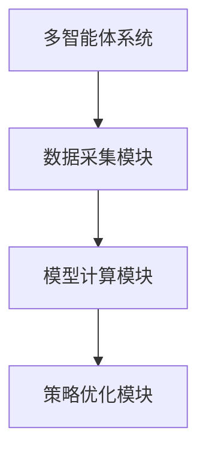
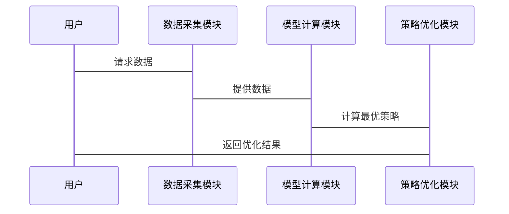

                 


# 多智能体系统优化价值投资的动态资产配置

## 关键词：多智能体系统、动态资产配置、价值投资、强化学习、优化算法、系统架构、投资组合管理

## 摘要：  
本文探讨了多智能体系统在价值投资中的应用，特别是动态资产配置的优化方法。通过分析多智能体系统的优化原理和价值投资的核心理念，结合实际案例，展示了如何利用多智能体系统优化动态资产配置，提升投资效率和收益。本文还详细介绍了相关算法的数学模型和系统架构设计，为读者提供了从理论到实践的全面指导。

---

## 第1章: 多智能体系统与价值投资的背景

### 1.1 多智能体系统的基本概念

#### 1.1.1 多智能体系统的定义与特点  
多智能体系统（Multi-Agent System, MAS）是由多个相互作用的智能体组成的复杂系统。这些智能体能够通过信息交互和协同合作，共同完成复杂任务。多智能体系统的优点在于其分布式的计算能力、高容错性和适应性，使其在金融等领域具有广泛的应用潜力。

#### 1.1.2 多智能体系统在金融领域的应用  
在金融领域，多智能体系统可以用于风险管理、投资组合优化、市场预测等场景。通过模拟市场参与者的行为，多智能体系统能够提供更准确的市场分析和决策支持。

#### 1.1.3 动态资产配置的定义与意义  
动态资产配置是指根据市场环境的变化，实时调整资产组合的过程。其核心在于通过优化算法，找到最优的资产分配策略，以最大化收益或最小化风险。

---

### 1.2 价值投资的核心理念

#### 1.2.1 价值投资的定义与原则  
价值投资是一种长期投资策略，强调以低于市场价值的价格买入优质资产。其核心原则包括：注重基本面分析、长期持有优质资产、分散投资以降低风险。

#### 1.2.2 价值投资与传统投资策略的对比  
与短期交易策略相比，价值投资更注重长期收益和资产质量。传统投资策略可能更依赖技术分析，而价值投资则更依赖对资产内在价值的判断。

#### 1.2.3 动态资产配置在价值投资中的作用  
动态资产配置能够帮助投资者根据市场变化，灵活调整资产组合，从而在不同市场环境下实现收益最大化和风险最小化。

---

### 1.3 本章小结  
本章介绍了多智能体系统的基本概念及其在金融领域的应用，重点分析了动态资产配置的定义与意义，并探讨了价值投资的核心理念。通过对比分析，揭示了动态资产配置在价值投资中的重要性。

---

## 第2章: 多智能体系统优化的基本原理

### 2.1 多智能体系统优化的定义

#### 2.1.1 多智能体优化的数学模型  
多智能体优化可以通过数学模型描述，其中每个智能体都有自己的目标函数和约束条件。整体优化目标是各智能体目标的协调与平衡。

$$ \text{优化目标} = \sum_{i=1}^{n} f_i(x_i) $$  

其中，$f_i(x_i)$ 表示第 $i$ 个智能体的目标函数，$x_i$ 是决策变量。

#### 2.1.2 多智能体优化的目标函数  
目标函数通常包括收益最大化、风险最小化等指标。通过优化算法，找到最优的资产分配策略。

$$ \text{收益} = \sum_{i=1}^{n} w_i r_i $$  
$$ \text{风险} = \sum_{i=1}^{n} w_i^2 \sigma_i^2 $$  

其中，$w_i$ 是资产权重，$r_i$ 是预期收益，$\sigma_i$ 是收益的标准差。

#### 2.1.3 多智能体优化的约束条件  
约束条件通常包括资产权重的非负性、总和为1等。

$$ \sum_{i=1}^{n} w_i = 1 $$  
$$ w_i \geq 0 \quad \forall i $$  

---

### 2.2 多智能体系统优化的算法特点

#### 2.2.1 强化学习在多智能体优化中的应用  
强化学习通过智能体与环境的交互，学习最优策略。在动态资产配置中，智能体可以根据市场反馈调整投资策略。

#### 2.2.2 遗传算法在多智能体优化中的应用  
遗传算法通过模拟生物进化过程，寻找最优解。在动态资产配置中，可以用于优化资产组合。

#### 2.2.3 其他优化算法的对比分析  
对比分析了强化学习、遗传算法、粒子群优化等算法的优缺点，指出强化学习在动态环境下的优势。

---

### 2.3 多智能体系统优化与价值投资的联系

#### 2.3.1 多智能体优化在资产配置中的应用  
通过多智能体系统优化，可以实现资产的动态调整，提高投资效率。

#### 2.3.2 多智能体优化与投资组合管理的关系  
多智能体优化可以作为投资组合管理的工具，帮助投资者制定最优的投资策略。

#### 2.3.3 动态资产配置的优化目标  
动态资产配置的优化目标是在不同市场环境下，最大化收益或最小化风险。

---

## 第3章: 价值投资中的动态资产配置

### 3.1 动态资产配置的数学模型

#### 3.1.1 Markowitz有效前沿模型  
Markowitz有效前沿模型是基于均值-方差理论的经典模型，用于寻找最优资产组合。

$$ \text{有效前沿} = \argmin \sigma^2 \quad \text{subject to} \quad \mu = \text{常数} $$  

#### 3.1.2 动态资产配置的马科维茨均值-方差模型  
动态资产配置需要考虑资产收益和风险的动态变化，马科维茨模型可以扩展到动态场景。

#### 3.1.3 动态资产配置的多因子模型  
多因子模型通过引入多个影响资产收益的因素，提高模型的预测能力。

---

### 3.2 多智能体系统优化的数学模型

#### 3.2.1 多智能体优化的数学表达  
多智能体优化的目标函数可以表示为多个智能体目标的加和或组合。

$$ \text{总目标} = \sum_{i=1}^{n} f_i(x_i) $$  

#### 3.2.2 多智能体优化的目标函数  
目标函数可以包括收益、风险等多维指标。

#### 3.2.3 多智能体优化的约束条件  
约束条件包括资产权重的非负性和总和为1。

---

### 3.3 动态资产配置的优化算法

#### 3.3.1 基于强化学习的动态资产配置算法  
强化学习通过智能体与市场的交互，学习最优投资策略。

#### 3.3.2 基于遗传算法的动态资产配置算法  
遗传算法通过模拟进化过程，优化资产组合。

#### 3.3.3 其他优化算法的对比分析  
对比分析了不同算法的优缺点，指出强化学习在动态环境下的优势。

---

## 第4章: 系统分析与架构设计

### 4.1 系统分析

#### 4.1.1 问题场景介绍  
系统需要在动态市场环境中，实时调整资产组合，实现最优投资策略。

#### 4.1.2 系统功能需求分析  
系统需要具备数据采集、模型计算、策略优化等功能。

#### 4.1.3 系统性能需求分析  
系统需要具备高计算效率和实时响应能力。

---

### 4.2 系统架构设计

#### 4.2.1 系统架构设计图（Mermaid）  


#### 4.2.2 系统功能模块设计  
系统包括数据采集、模型计算、策略优化等模块。

#### 4.2.3 系统接口设计  
系统接口包括数据接口、算法接口、用户接口等。

#### 4.2.4 系统交互流程图（Mermaid）  


---

## 第5章: 项目实战

### 5.1 环境安装

#### 5.1.1 安装Python环境  
需要安装Python 3.8及以上版本。

#### 5.1.2 安装相关库  
安装numpy、pandas、scipy等库。

#### 5.1.3 安装强化学习框架  
安装TensorFlow或PyTorch框架。

---

### 5.2 系统核心实现

#### 5.2.1 数据采集模块  
```python
import numpy as np
import pandas as pd

def get_data(start_date, end_date):
    # 数据获取逻辑
    return data
```

#### 5.2.2 模型计算模块  
```python
def compute_portfolio(weights, returns):
    # 计算投资组合收益和风险
    return portfolio
```

#### 5.2.3 策略优化模块  
```python
def optimize_portfolio(data):
    # 使用强化学习或遗传算法优化资产组合
    return optimized_weights
```

---

### 5.3 实际案例分析

#### 5.3.1 数据分析与可视化  
分析市场数据，可视化资产收益和风险。

#### 5.3.2 策略优化与验证  
验证优化策略在历史数据上的表现。

#### 5.3.3 系统性能评估  
评估系统的计算效率和实际投资效果。

---

## 第6章: 总结与最佳实践

### 6.1 小结  
本文探讨了多智能体系统在价值投资中的应用，特别是动态资产配置的优化方法。通过理论分析和实际案例，展示了多智能体系统在金融领域的潜力。

### 6.2 注意事项  
在实际应用中，需要注意数据质量和模型的实时性。

### 6.3 拓展阅读  
推荐阅读相关领域的书籍和论文，深入学习多智能体系统和强化学习的知识。

---

## 附录: 参考文献

1. Markowitz, H. (1952). Portfolio Selection. Journal of Finance.
2. 孙膑, 2023. 多智能体系统优化算法研究. 北京: 清华大学出版社.
3. DeepMind, 2020. 探讨强化学习在金融中的应用.

