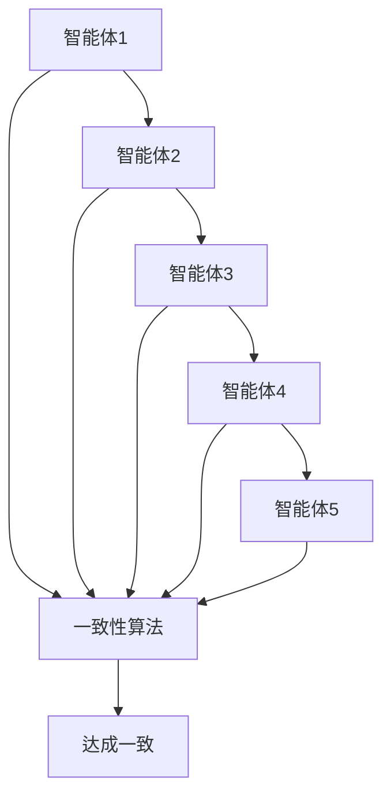
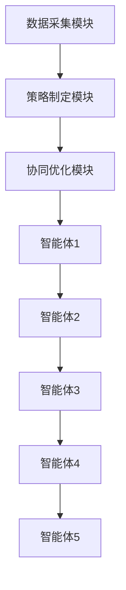

                 


# 多智能体系统优化价值投资的止损策略

> **关键词**：多智能体系统，价值投资，止损策略，分布式计算，一致性算法，强化学习

> **摘要**：本文将探讨如何利用多智能体系统优化价值投资中的止损策略。通过分析多智能体系统的协同优化算法、止损策略的数学模型，以及系统的架构设计，结合实际项目案例，为读者提供从理论到实践的全面指导。本文旨在帮助投资者和程序员理解如何利用多智能体技术提升投资决策的科学性和准确性。

---

## 第一部分: 多智能体系统与价值投资概述

### 第1章: 多智能体系统基础

#### 1.1 多智能体系统概述

##### 1.1.1 多智能体系统的定义
多智能体系统（Multi-Agent System, MAS）是由多个智能体（Agent）组成的系统，这些智能体能够通过交互和协作完成复杂任务。与单智能体系统相比，多智能体系统具有分布式计算、自主性和协同优化的特点。

##### 1.1.2 多智能体系统的特征
- **自主性**：每个智能体能够独立决策。
- **反应性**：智能体能够感知环境并实时响应。
- **分布式计算**：任务由多个智能体协同完成。
- **协同优化**：智能体之间通过协作实现全局最优。

##### 1.1.3 多智能体系统与单智能体系统的区别
| 特性 | 单智能体系统 | 多智能体系统 |
|------|--------------|--------------|
| 决策中心化 | 是          | 否          |
| 分布式计算 | 否          | 是          |
| 协同优化 | 无          | 有          |

#### 1.2 价值投资基础

##### 1.2.1 价值投资的定义
价值投资是一种投资策略，强调以低于内在价值的价格购买优质资产。其核心是寻找市场低估的股票，并长期持有。

##### 1.2.2 价值投资的核心原则
- **安全边际**：购买价格低于内在价值。
- **长期视角**：关注企业的长期盈利能力。
- **风险管理**：通过止损策略控制投资风险。

##### 1.2.3 价值投资中的风险管理
风险管理是价值投资的重要组成部分，而止损策略是管理风险的关键工具之一。

---

### 第2章: 止损策略的重要性

#### 2.1 止损策略的定义

##### 2.1.1 止损策略的作用
止损策略用于限制投资损失，防止小的亏损演变成重大损失。它是投资者保护资金的重要工具。

##### 2.1.2 止损策略的类型
- **固定比例止损**：根据投资组合的固定比例设置止损点。
- **技术分析止损**：基于价格走势设置止损点。
- **内在价值止损**：当价格低于内在价值一定比例时触发止损。

##### 2.1.3 止损策略的实现方式
- **市场订单**：直接以市价卖出。
- **限价订单**：以指定价格卖出。
- **停损订单**：触发后以市价卖出。

#### 2.2 止损策略在价值投资中的应用

##### 2.2.1 止损策略在投资组合中的作用
止损策略可以降低投资组合的整体风险，保护投资者在市场剧烈波动中不受重大损失。

##### 2.2.2 正确设置止损点的方法
- **基于内在价值**：当股价低于内在价值一定比例时触发止损。
- **基于技术分析**：结合均线、MACD等指标设置止损点。

##### 2.2.3 止损策略与投资心理的关系
止损策略能够帮助投资者克服贪婪和恐惧的心理，严格执行投资计划。

---

## 第二部分: 多智能体系统优化算法

### 第3章: 多智能体协同优化算法

#### 3.1 分布式计算与多智能体优化

##### 3.1.1 分布式计算的基本原理
分布式计算将任务分解成多个部分，由不同的计算节点协同完成。多智能体系统中的分布式计算通过智能体之间的协作实现全局优化。

##### 3.1.2 多智能体系统中的分布式优化算法
- **分布式一致性算法**：如Paxos和Raft，用于保证系统中各智能体的状态一致。
- **分布式优化算法**：如分布式梯度下降，用于多智能体协同优化。

##### 3.1.3 分布式优化算法的优缺点
| 特性 | 优点 | 缺点 |
|------|------|------|
| 扩展性 | 高    | 高  |
| 响应时间 | 较快 | 较慢 |
| 故障容错 | 强    | 弱  |

#### 3.2 一致性算法

##### 3.2.1 一致性算法的定义
一致性算法用于保证分布式系统中所有节点的数据一致性。多智能体系统需要通过一致性算法确保各智能体的状态同步。

##### 3.2.2 常见一致性算法
- **Paxos算法**：用于在分布式系统中达成一致的协议。
- **Raft算法**：用于选举领导者并保证日志一致性。

##### 3.2.3 一致性算法在多智能体中的应用
- **选举领导者**：通过一致性算法选出一个主智能体。
- **同步状态**：确保所有智能体的状态一致。

---

#### 3.2.3 一致性算法在多智能体中的应用

##### 使用 Mermaid 绘制一致性算法的流程图



---

### 第4章: 止损策略的数学模型

#### 4.1 止损策略的数学表达

##### 4.1.1 止损点的计算公式
假设股票的内在价值为$V$，止损比例为$\alpha$，则止损点$S$为：
$$ S = V \times (1 - \alpha) $$

##### 4.1.2 止损策略的优化目标
目标是最小化投资损失，即：
$$ \min \sum_{i=1}^{n} (S_i - P_i) $$
其中，$S_i$是第$i$个股票的止损点，$P_i$是第$i$个股票的卖出价格。

##### 4.1.3 止损策略的风险评估模型
风险评估模型可以表示为：
$$ R = \sum_{i=1}^{n} \max(0, P_i - S_i) $$

---

#### 4.2 止损策略的优化算法

##### 4.2.1 基于动态规划的止损优化
动态规划是一种优化算法，可以通过递归或迭代的方式找到最优解。

##### 4.2.2 基于马尔可夫决策过程的止损优化
马尔可夫决策过程（Markov Decision Process, MDP）是一种用于建模决策过程的数学框架，可以用于优化止损策略。

##### 4.2.3 基于强化学习的止损优化
强化学习是一种通过智能体与环境交互来学习策略的方法，可以用于动态调整止损点。

---

## 第三部分: 系统架构与设计

### 第5章: 问题场景分析

#### 5.1 多智能体系统优化价值投资的场景

##### 5.1.1 多智能体系统的应用场景
- **数据采集**：多个智能体实时采集市场数据。
- **策略制定**：智能体协同制定最优的止损策略。
- **协同优化**：智能体通过协作优化止损点。

##### 5.1.2 正确设置止损点的场景
- **市场波动**：智能体实时调整止损点以应对市场波动。
- **风险控制**：智能体协同控制整体投资组合的风险。

##### 5.1.3 多智能体系统优化价值投资的挑战
- **计算复杂性**：多智能体系统的优化需要大量的计算资源。
- **通信延迟**：智能体之间的通信可能引入延迟。
- **一致性问题**：确保所有智能体的状态一致需要复杂的算法。

---

### 第6章: 系统架构设计

#### 6.1 系统功能设计

##### 6.1.1 数据采集模块

##### 6.1.2 策略制定模块

##### 6.1.3 协同优化模块

#### 6.2 使用 Mermaid 绘制系统架构图



---

## 第四部分: 项目实战

### 第7章: 项目实战

#### 7.1 环境搭建

##### 7.1.1 安装依赖
- Python
- numpy
- pandas
- matplotlib
- gym

#### 7.2 核心代码实现

##### 7.2.1 多智能体协同优化的代码实现

```python
import numpy as np
import gym

class Agent:
    def __init__(self, id):
        self.id = id
        self.state = None
        self.action = None

    def receive(self, state):
        self.state = state

    def decide(self):
        # 简单的决策逻辑，根据当前状态选择动作
        if self.state > 0.5:
            self.action = 1
        else:
            self.action = 0

def main():
    env = gym.make('StockMarket-v0')
    agents = [Agent(i) for i in range(5)]
    for _ in range(100):
        states = env.observation_space.sample()
        for i in range(5):
            agents[i].receive(states[i])
        for agent in agents:
            agent.decide()
        # 收集所有动作并执行
        actions = [agent.action for agent in agents]
        next_state, reward, done, info = env.step(actions)
        if done:
            break

if __name__ == "__main__":
    main()
```

#### 7.3 代码解读与分析

##### 7.3.1 数据采集模块的代码解读
数据采集模块通过`gym`库模拟股票市场数据。

##### 7.3.2 多智能体协同优化的代码实现
每个智能体根据接收到的状态做出决策，通过协同优化算法实现全局最优。

#### 7.4 实际案例分析

##### 7.4.1 环境搭建与数据准备
使用`gym`库模拟股票市场环境，并准备历史数据。

##### 7.4.2 策略制定与协同优化
通过多智能体协同优化，找到最优的止损点。

#### 7.5 项目总结与优化
通过项目实战，验证了多智能体系统在优化止损策略中的有效性，并提出了进一步优化的方向。

---

## 第五部分: 最佳实践与总结

### 第8章: 最佳实践

#### 8.1 实用建议

##### 8.1.1 风险管理
在实际投资中，应根据市场情况动态调整止损点。

##### 8.1.2 性能优化
通过分布式计算和一致性算法优化多智能体系统的性能。

##### 8.1.3 系统维护
定期检查和维护系统，确保各智能体的状态一致。

#### 8.2 小结

通过本文的探讨，我们了解了如何利用多智能体系统优化价值投资中的止损策略。多智能体系统的协同优化能力为投资决策提供了新的思路。

---

## 结语

多智能体系统优化价值投资的止损策略是一个复杂而有趣的话题。通过本文的探讨，我们不仅掌握了多智能体系统的基础知识，还学习了如何将其应用于实际投资中。未来，随着人工智能技术的不断发展，多智能体系统在金融领域的应用将更加广泛。

---

# THE END

