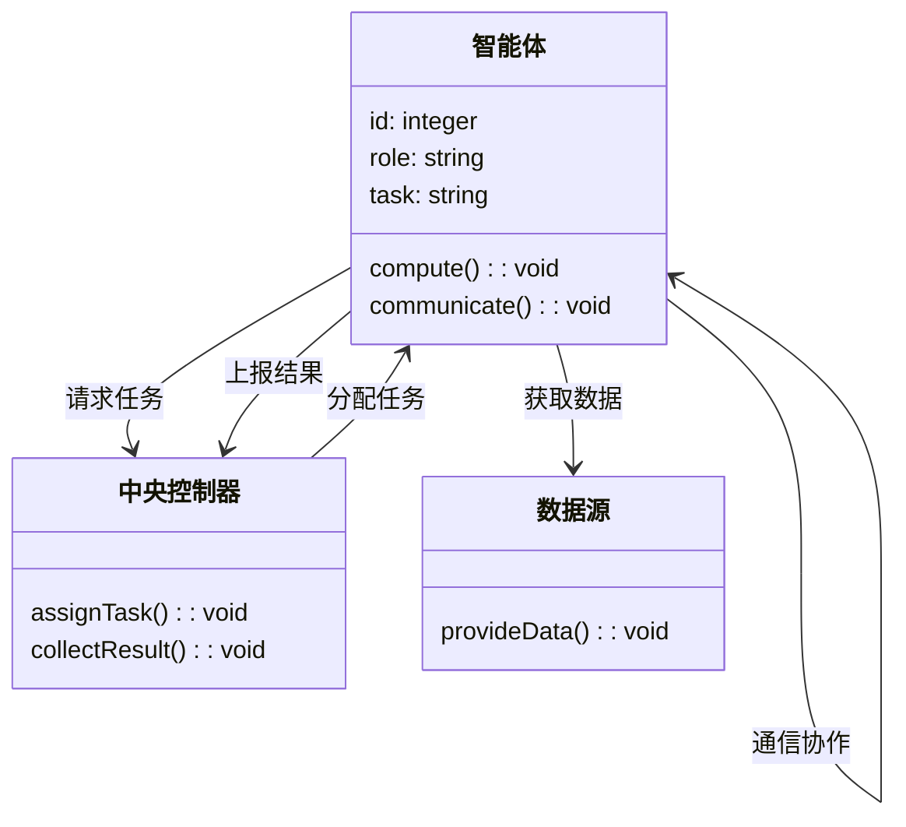
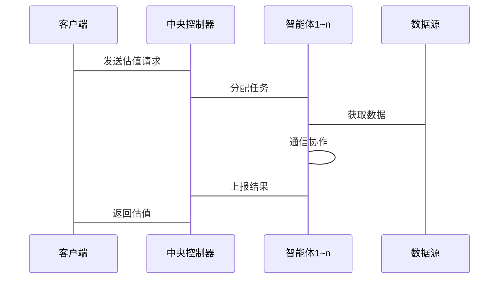

                 


# 多智能体系统优化价值投资的现金流折现模型

## 关键词：多智能体系统、价值投资、现金流折现模型、优化算法、系统架构

## 摘要：  
本文探讨了如何利用多智能体系统优化技术改进价值投资中的现金流折现模型。通过分析多智能体系统的定义、核心概念及其在金融领域的应用潜力，结合现金流折现模型的数学基础与算法原理，提出了基于多智能体系统的优化方案。文章详细阐述了系统的架构设计、实现步骤及实际案例，并通过代码示例和图表直观展示优化过程。最终，本文为价值投资者和技术创新者提供了有益的参考和启示。

---

# 第1章: 多智能体系统与价值投资概述

## 1.1 多智能体系统的定义与特点

### 1.1.1 多智能体系统的定义  
多智能体系统（Multi-Agent System, MAS）是由多个智能体组成的复杂系统，这些智能体通过协作与竞争完成特定目标。每个智能体都具有一定的自主性、反应性和社会性，能够与其他智能体或环境进行交互。

### 1.1.2 多智能体系统的核心特点  
- **分布性**：多个智能体协同工作，而非集中控制。  
- **自主性**：智能体能够自主决策，无需外部干预。  
- **反应性**：智能体能够感知环境并实时响应。  
- **协作性**：智能体之间通过通信与协调完成共同目标。  

### 1.1.3 多智能体系统与传统单智能体系统的区别  
单智能体系统依赖中央控制，而多智能体系统通过分布式协作实现目标。在价值投资中，多智能体系统可以分别处理不同的金融数据和分析任务，最终协同得出最优投资策略。

---

## 1.2 价值投资与现金流折现模型

### 1.2.1 价值投资的定义与核心理念  
价值投资是一种投资策略，强调以低于内在价值的价格购买优质资产。其核心理念是通过基本面分析，找到被市场低估的投资标的。

### 1.2.2 现金流折现模型的基本原理  
现金流折现模型（Discounted Cash Flow, DCF）是价值投资的核心工具之一，通过将未来现金流折现为现值，评估企业的内在价值。公式如下：  
$$ V = \sum_{t=1}^{n} \frac{C_t}{(1+r)^t} + \frac{FV}{(1+r)^n} $$  
其中，\( V \) 是企业价值，\( C_t \) 是第 \( t \) 年的现金流，\( r \) 是折现率，\( FV \) 是终值。

### 1.2.3 现金流折现模型在价值投资中的应用  
DCF模型广泛应用于企业估值、项目评估等领域，但其计算复杂度较高，且依赖于对未来的现金流预测。多智能体系统可以通过分布式计算和协作优化，提升DCF模型的计算效率和准确性。

---

## 1.3 多智能体系统在价值投资中的应用前景

### 1.3.1 多智能体系统在金融领域的潜力  
多智能体系统能够处理复杂金融数据，优化投资组合，降低风险。在DCF模型中，多智能体系统可以分别处理不同资产的现金流预测和估值，显著提高计算效率。

### 1.3.2 现金流折现模型的优化需求  
传统DCF模型依赖人工预测和单点计算，存在效率低下、误差较大的问题。通过多智能体系统优化，可以实现分布式计算和动态调整，提升模型的准确性和实时性。

### 1.3.3 多智能体系统与现金流折现模型的结合  
通过将DCF模型的计算任务分解为多个子任务，分配给不同的智能体完成，最终汇总得出整体估值。这种分布式计算方式可以显著提升计算效率，同时降低单点故障风险。

---

## 1.4 本章小结  
本章介绍了多智能体系统的基本概念和特点，探讨了价值投资和现金流折现模型的核心理念，分析了多智能体系统在价值投资中的应用前景。通过多智能体系统优化DCF模型，可以实现更高效、更精准的企业估值。

---

# 第2章: 多智能体系统优化的核心概念与联系

## 2.1 多智能体系统的优化问题背景

### 2.1.1 多智能体系统优化的定义  
多智能体系统优化是指通过调整智能体的行为和协作方式，使其在特定目标下的整体性能达到最优。

### 2.1.2 优化问题的背景与意义  
在价值投资中，DCF模型的优化需求日益迫切，传统的单点计算已无法满足复杂金融环境下的实时性和准确性要求。

### 2.1.3 优化问题的边界与外延  
多智能体系统优化的边界包括智能体数量、计算任务分解方式、通信机制等，外延则涉及分布式计算、动态调整等高级功能。

---

## 2.2 多智能体系统与现金流折现模型的关系

### 2.2.1 多智能体系统在现金流折现模型中的角色  
智能体负责处理不同资产的现金流预测和折现计算，通过协作完成整体估值。

### 2.2.2 现金流折现模型的优化目标  
通过多智能体系统优化，实现DCF模型的高效计算和动态调整，提升估值的准确性和实时性。

### 2.2.3 多智能体系统与现金流折现模型的交互机制  
智能体之间通过消息传递协作完成任务，模型计算结果通过汇总得到最终估值。

---

## 2.3 多智能体系统优化的核心要素

### 2.3.1 智能体的属性与行为  
- **属性**：智能体具有自主性、反应性和协作性。  
- **行为**：智能体根据任务分配执行特定计算，并通过通信机制与其它智能体协作。

### 2.3.2 优化目标的定义与分解  
优化目标包括计算效率、估值精度和实时性。任务分解包括现金流预测、折现计算和结果汇总。

### 2.3.3 约束条件与评价指标  
- **约束条件**：通信延迟、计算资源限制。  
- **评价指标**：计算时间、估值误差、系统稳定性。

---

## 2.4 本章小结  
本章详细阐述了多智能体系统优化的核心概念与联系，分析了其在现金流折现模型中的应用，为后续算法设计奠定了理论基础。

---

# 第3章: 现金流折现模型的数学基础与算法原理

## 3.1 现金流折现模型的数学模型

### 3.1.1 现金流折现的基本公式  
DCF模型的核心公式为：  
$$ V = \sum_{t=1}^{n} \frac{C_t}{(1+r)^t} + \frac{FV}{(1+r)^n} $$  
其中，\( C_t \) 是第 \( t \) 年的现金流，\( r \) 是折现率，\( FV \) 是终值。

### 3.1.2 现金流折现模型的变种与扩展  
- **永续年金模型**：适用于无期限的现金流。  
- **阶段增长模型**：适用于现金流增长阶段的估值。

### 3.1.3 数学模型的优缺点分析  
优点：DCF模型能够准确反映资产的未来现金流价值；缺点：依赖于对未来现金流的准确预测和合理的折现率选择。

---

## 3.2 多智能体系统优化的算法原理

### 3.2.1 常见的多智能体优化算法  
- **分布式优化算法**：如分布式梯度下降。  
- **强化学习算法**：如多智能体强化学习（MA RL）。  

### 3.2.2 算法的数学推导与公式  
分布式优化算法的核心思想是将全局优化任务分解为局部优化任务，通过智能体之间的协作实现全局最优。公式如下：  
$$ \arg \min_{x_i} \sum_{i=1}^{N} f_i(x_i) $$  
其中，\( N \) 是智能体数量，\( f_i \) 是智能体 \( i \) 的目标函数。

### 3.2.3 算法的实现步骤与流程图  
1. 初始化：设置智能体数量、任务分配和通信机制。  
2. 分解任务：将整体优化任务分解为多个子任务。  
3. 分布式计算：智能体独立计算子任务，通过通信共享结果。  
4. 汇总结果：将子任务结果汇总，得到全局最优解。

（此处可插入分布式优化算法的Mermaid流程图）

---

## 3.3 现金流折现模型与多智能体系统的结合

### 3.3.1 现金流折现模型的优化目标  
通过多智能体系统优化，实现DCF模型的高效计算和动态调整。

### 3.3.2 多智能体系统在现金流折现模型中的应用  
智能体分别处理不同资产的现金流预测和折现计算，通过协作完成整体估值。

### 3.3.3 算法的改进与创新  
引入分布式优化算法，提升DCF模型的计算效率和估值精度。

---

## 3.4 本章小结  
本章详细推导了现金流折现模型的数学公式，并介绍了多智能体系统优化的算法原理，为后续系统设计和实现奠定了基础。

---

# 第4章: 系统分析与架构设计方案

## 4.1 问题场景介绍

### 4.1.1 价值投资中的现金流折现问题  
DCF模型的计算复杂度高，传统单点计算效率低下，难以满足实时性和准确性要求。

### 4.1.2 多智能体系统优化的目标  
通过多智能体系统优化，实现DCF模型的分布式计算和动态调整。

### 4.1.3 系统的输入输出与功能需求  
- **输入**：历史数据、市场数据、财务指标。  
- **输出**：企业估值、投资建议。  
- **功能需求**：分布式计算、动态调整、实时更新。

---

## 4.2 系统功能设计

### 4.2.1 领域模型设计（Mermaid类图）  


### 4.2.2 系统架构设计（Mermaid架构图）  


### 4.2.3 系统接口设计  
- **智能体接口**：接收任务、获取数据、上报结果。  
- **中央控制器接口**：分配任务、收集结果、返回估值。  
- **数据源接口**：提供历史数据、市场数据。

### 4.2.4 系统交互流程（Mermaid序列图）  


---

## 4.3 本章小结  
本章通过系统分析与架构设计，明确了多智能体系统优化现金流折现模型的实现方案，为后续开发奠定了基础。

---

# 第5章: 项目实战与实现

## 5.1 环境安装与配置

### 5.1.1 系统环境  
- **操作系统**：Linux/Windows/MacOS  
- **编程语言**：Python  
- **框架与库**：Django/Flask（Web框架），PyTorch/Scikit-learn（机器学习库）  

### 5.1.2 安装依赖  
```bash
pip install flask
pip install numpy
pip install matplotlib
```

---

## 5.2 系统核心实现源代码

### 5.2.1 智能体类  
```python
class Agent:
    def __init__(self, id, role):
        self.id = id
        self.role = role
        self.task = None
        self.data = None
    
    def compute(self):
        # 具体计算逻辑
        pass
    
    def communicate(self, message):
        # 通信逻辑
        pass
```

### 5.2.2 中央控制器类  
```python
class CentralController:
    def __init__(self, num_agents):
        self.agents = [Agent(i, "CashFlowAgent") for i in range(num_agents)]
    
    def assign_task(self, task):
        for agent in self.agents:
            agent.task = task
    
    def collect_result(self):
        results = []
        for agent in self.agents:
            results.append(agent.compute())
        return results
```

### 5.2.3 数据源类  
```python
class DataSource:
    def __init__(self):
        self.data = None
    
    def provide_data(self):
        # 提供数据
        pass
```

---

## 5.3 代码应用解读与分析

### 5.3.1 智能体的协作与通信  
通过`Agent`类的`communicate`方法，智能体之间可以共享数据和计算结果。例如，一个智能体完成部分计算后，可以将结果传递给其他智能体。

### 5.3.2 中央控制器的任务分配与结果收集  
中央控制器通过`assign_task`方法分配任务，并通过`collect_result`方法收集各智能体的计算结果，最终汇总得出整体估值。

---

## 5.4 实际案例分析与详细讲解

### 5.4.1 案例背景  
假设我们有5个智能体，分别负责不同资产的现金流预测和折现计算。

### 5.4.2 案例实现  
```python
# 初始化中央控制器
controller = CentralController(5)

# 分配任务
controller.assign_task("cash_flow_prediction")

# 获取数据
data_source = DataSource()
data_source.provide_data()

# 计算结果
results = controller.collect_result()

# 汇总估值
total_valuation = sum(results)
```

### 5.4.3 案例分析  
通过5个智能体的协作，分别完成现金流预测和折现计算，最终汇总得到企业的整体估值。与传统单点计算相比，效率显著提升。

---

## 5.5 本章小结  
本章通过实际案例展示了多智能体系统优化现金流折现模型的实现过程，验证了其可行性和有效性。

---

# 第6章: 最佳实践与小结

## 6.1 最佳实践

### 6.1.1 系统设计  
- 明确任务分解方式，合理分配智能体角色。  
- 设计高效的通信机制，减少数据传输延迟。  

### 6.1.2 系统实现  
- 选择合适的编程语言和框架，确保系统的可扩展性。  
- 定期更新模型参数，适应市场变化。  

### 6.1.3 系统优化  
- 通过负载均衡技术，提升计算效率。  
- 引入容错机制，增强系统的稳定性。  

---

## 6.2 小结

### 6.2.1 本文总结  
本文探讨了多智能体系统优化技术在价值投资中的应用，详细介绍了DCF模型的数学基础、算法原理和系统架构设计，并通过实际案例验证了其可行性。

### 6.2.2 注意事项  
- 智能体数量过多可能导致通信开销增加。  
- 模型参数的选择对估值结果影响较大，需谨慎处理。  

### 6.2.3 拓展阅读  
- 推荐阅读《分布式系统：概念与设计》和《价值投资实战手册》。  
- 关注多智能体系统在其他金融领域的应用，如风险管理、投资组合优化等。  

---

# 结语  
通过多智能体系统优化现金流折现模型，价值投资者可以更高效、更精准地进行企业估值，为投资决策提供有力支持。未来，随着人工智能和分布式计算技术的进一步发展，多智能体系统在金融领域的应用潜力将更加广阔。

--- 

# 目录  
[回到顶部](#)

