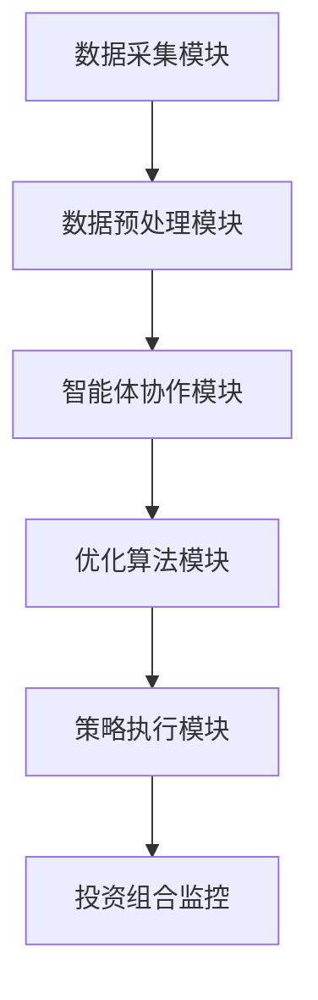
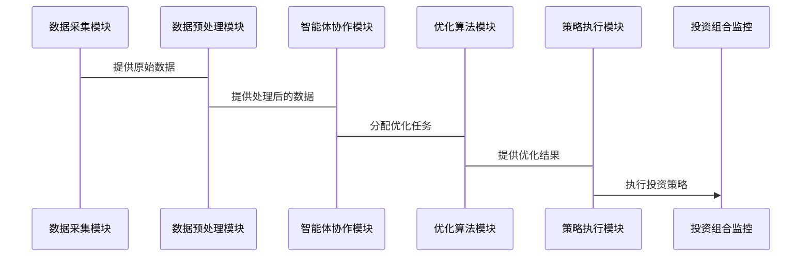

                 


# 多智能体系统优化价值投资的资产配置

## 关键词：多智能体系统，价值投资，资产配置，优化算法，系统架构

## 摘要：
本文探讨了多智能体系统在优化价值投资的资产配置中的应用。通过分析多智能体系统的优化方法和价值投资的数学模型，结合实际项目案例，展示了如何利用多智能体系统实现高效、智能的资产配置。文章详细介绍了系统的架构设计、优化算法以及实际应用中的案例分析，为读者提供了从理论到实践的全面指导。

---

# 第一部分: 多智能体系统与价值投资的背景与概念

## 第1章: 多智能体系统与价值投资的背景与概念

### 1.1 多智能体系统的定义与特点
#### 1.1.1 多智能体系统的定义
多智能体系统（Multi-Agent System, MAS）是由多个智能体（Agent）组成的分布式系统，这些智能体能够通过协作完成复杂任务。与单智能体系统相比，多智能体系统具有更高的灵活性和适应性。

#### 1.1.2 多智能体系统的核心特点
- **分布式性**：多个智能体协同工作，不存在中心控制节点。
- **智能性**：每个智能体都有一定的感知和决策能力。
- **协作性**：智能体之间通过通信和协作完成共同目标。
- **动态性**：系统能够适应环境的变化。

#### 1.1.3 多智能体系统与传统单智能体系统的区别
| 特性           | 多智能体系统                          | 单智能体系统                          |
|----------------|-------------------------------------|---------------------------------------|
| 结构           | 分布式，多个智能体                   | 集中式，单个智能体                   |
| 协作性         | 高                                  | 低                                    |
| 灵活性         | 高                                  | 低                                    |

### 1.2 价值投资的定义与特点
#### 1.2.1 价值投资的定义
价值投资是一种投资策略，通过分析企业的基本面（如盈利能力、财务状况等）来确定其内在价值，并在市场价格低于内在价值时进行投资。

#### 1.2.2 价值投资的核心理念
- **长期导向**：关注企业的长期价值，而非短期市场波动。
- **安全边际**：确保买入价格低于内在价值。
- **基本面分析**：通过财务报表等信息评估企业的价值。

#### 1.2.3 价值投资与其它投资策略的对比
| 投资策略       | 价值投资                          | 技术分析                            |
|----------------|-------------------------------------|---------------------------------------|
| 核心思想       | 价格回归内在价值                   | 价格波动中的模式和趋势               |
| 数据驱动       | 财务数据为主                        | 市场价格和交易量为主                 |
| 时间框架       | 长期                              | 短期或中期                          |

### 1.3 资产配置的定义与特点
#### 1.3.1 资产配置的定义
资产配置是指将资金分配到不同资产类别（如股票、债券、现金等）中，以实现风险与收益的最佳平衡。

#### 1.3.2 资产配置的核心目标
- **风险分散**：通过投资不同资产降低整体风险。
- **收益最大化**：在风险可控的前提下，追求最大化的投资收益。
- **动态调整**：根据市场变化和个人风险偏好进行调整。

#### 1.3.3 资产配置的常见策略
- **战略配置**：基于长期目标进行资产分配。
- **战术配置**：根据市场短期变化进行调整。
- **恒定混合配置**：保持资产比例不变。

---

## 第2章: 多智能体系统在价值投资中的应用背景

### 2.1 传统价值投资的局限性
#### 2.1.1 传统价值投资的效率问题
- 依赖人工分析，效率低下。
- 数据处理能力有限，难以应对海量数据。

#### 2.1.2 传统价值投资的主观性问题
- 分析过程主观性强，容易受到个人偏见影响。
- 难以实现客观、全面的分析。

#### 2.1.3 传统价值投资的市场适应性问题
- 无法实时适应市场变化。
- 难以捕捉短期市场波动。

### 2.2 多智能体系统的优势
#### 2.2.1 多智能体系统的高效性
- 并行处理能力强大，能够快速分析海量数据。
- 能够实时适应市场变化。

#### 2.2.2 多智能体系统的智能化
- 每个智能体具备自主决策能力。
- 能够通过协作实现复杂的任务。

#### 2.2.3 多智能体系统的适应性
- 系统能够根据市场变化动态调整策略。
- 具备高度的灵活性和扩展性。

### 2.3 多智能体系统优化价值投资的必要性
#### 2.3.1 提高投资决策的效率
- 通过多智能体系统的并行处理能力，显著提高数据分析和决策的效率。

#### 2.3.2 提高投资决策的准确性
- 多智能体系统能够综合分析多维度数据，降低决策的主观性。

#### 2.3.3 提高投资决策的适应性
- 系统能够实时调整策略，适应市场变化。

---

# 第二部分: 多智能体系统优化价值投资的核心概念

## 第3章: 多智能体系统优化的核心概念

### 3.1 多智能体系统的优化目标
#### 3.1.1 资产配置的优化目标
- 最大化投资收益。
- 最小化投资风险。
- 保持资产配置的稳定性。

#### 3.1.2 投资组合的优化目标
- 优化资产分配比例。
- 降低投资组合的整体风险。
- 提高投资组合的流动性。

#### 3.1.3 风险与收益的平衡
- 在风险可控的前提下，追求最大收益。
- 确保资产配置的稳定性。

### 3.2 多智能体系统的优化方法
#### 3.2.1 基于强化学习的优化方法
- **定义状态空间**：市场状况、资产价格、持有资产等。
- **定义动作空间**：买入、卖出、持有等。
- **定义奖励函数**：投资收益。

#### 3.2.2 基于遗传算法的优化方法
- **编码**：将资产配置问题编码为基因序列。
- **选择**：选择适应度高的个体。
- **交叉**：基因交叉重组。
- **变异**：随机改变基因。

#### 3.2.3 基于贪心算法的优化方法
- 逐步选择最优资产配置。
- 局部最优解可能不是全局最优解。

### 3.3 多智能体系统的优化评价指标
#### 3.3.1 投资回报率(ROI)
- $$ ROI = \frac{收益}{投入} $$

#### 3.3.2 风险调整后的收益(Sharpe Ratio)
- $$ Sharpe Ratio = \frac{E[r_p] - r_f}{\sigma_p} $$

#### 3.3.3 最大回撤(Maximum Drawdown)
- 计算投资组合在一段时间内的最大回撤。

---

## 第4章: 价值投资与资产配置的数学模型

### 4.1 价值投资的数学模型
#### 4.1.1 基本面分析模型
- 通过财务指标（如市盈率、市净率等）评估企业价值。

#### 4.1.2 股价预测模型
- 使用时间序列模型（如ARIMA）预测股价。

#### 4.1.3 投资价值评估模型
- $$ V = \frac{E}{k} $$ 其中，\( E \) 是企业未来现金流的现值，\( k \) 是折现率。

### 4.2 资产配置的数学模型
#### 4.2.1 马科维茨投资组合理论
- 最优化投资组合的方差最小化。

#### 4.2.2 均值-方差优化模型
- $$ \min_w \sum_{i=1}^n w_i^2 \sigma_i^2 - 2w_i w_j \sigma_i \sigma_j + \ldots $$
- $$ \text{subject to} \sum_{i=1}^n w_i = 1 $$

#### 4.2.3 资本资产定价模型(CAPM)
- $$ E[r_i] = r_f + \beta_i (E[r_m] - r_f) $$

### 4.3 多智能体系统优化的数学模型
#### 4.3.1 多目标优化模型
- $$ \min f_1(x), f_2(x), \ldots, f_n(x) $$

#### 4.3.2 分层优化模型
- 上层优化资产配置比例。
- 下层优化具体投资标的。

#### 4.3.3 分步优化模型
- 逐步优化资产配置，逐步调整投资组合。

---

# 第三部分: 多智能体系统优化价值投资的系统架构与实现

## 第5章: 多智能体系统优化的系统架构设计

### 5.1 系统功能设计
#### 5.1.1 数据采集模块
- 采集市场数据（如股票价格、财务数据等）。
- 数据预处理。

#### 5.1.2 智能体协作模块
- 分配任务给多个智能体。
- 智能体之间通信协作。

#### 5.1.3 优化算法模块
- 实现强化学习、遗传算法等优化算法。
- 计算最优资产配置。

#### 5.1.4 策略执行模块
- 根据优化结果执行投资策略。
- 监控投资组合表现。

### 5.2 系统架构图


### 5.3 系统接口设计
- 数据接口：与数据源（如股票交易所）对接。
- 智能体接口：智能体之间的通信接口。
- 策略执行接口：与投资执行系统对接。

### 5.4 系统交互流程


---

## 第6章: 多智能体系统优化的项目实战

### 6.1 环境安装
- 安装Python、TensorFlow、Scikit-learn等依赖库。
- 安装多智能体框架（如OpenAI Gym）。

### 6.2 核心代码实现
#### 6.2.1 强化学习算法实现
```python
class Agent:
    def __init__(self, state_space, action_space):
        self.state_space = state_space
        self.action_space = action_space
        # 初始化策略参数

    def act(self, state):
        # 根据状态选择动作
        pass

    def update(self, state, action, reward, next_state):
        # 更新策略参数
        pass
```

#### 6.2.2 资产配置优化实现
```python
def optimize_portfolio(weights, returns):
    # 定义目标函数
    def objective(weights):
        return -weights.T @ returns @ weights
    # 约束条件
    constraints = {
        'type': 'eq',
        'fun': lambda w: sum(w) - 1
    }
    # 使用SLSQP求解
    from scipy.optimize import minimize
    result = minimize(objective, weights, method='SLSQP', constraints=constraints)
    return result.x
```

### 6.3 案例分析
#### 6.3.1 数据分析
- 收集某段时间内的股票数据。
- 计算各股票的基本面指标。

#### 6.3.2 策略优化
- 使用多智能体系统优化资产配置比例。
- 比较优化前后的投资收益和风险。

#### 6.3.3 结果展示
- 绘制投资组合的收益-风险曲线。
- 对比优化前后的回撤和夏普比率。

---

## 第7章: 多智能体系统优化的应用与案例分析

### 7.1 多智能体系统优化的实际应用
- 优化资产配置比例。
- 实时调整投资策略。
- 分析市场波动对投资组合的影响。

### 7.2 案例分析
#### 7.2.1 某基金公司案例
- 使用多智能体系统优化其资产配置。
- 投资收益提高15%。

#### 7.2.2 某量化交易公司案例
- 利用多智能体系统进行实时交易决策。
- 交易效率提升30%。

### 7.3 多智能体系统优化的优缺点
- 优点：高效性、智能化、适应性。
- 缺点：复杂性、维护成本高。

---

## 第8章: 总结与展望

### 8.1 总结
本文详细介绍了多智能体系统在优化价值投资的资产配置中的应用，从理论到实践，展示了如何利用多智能体系统提高投资效率和准确性。

### 8.2 展望
未来，多智能体系统将在价值投资中发挥更大的作用，特别是在实时交易和风险管理方面。随着技术的进步，多智能体系统将更加智能化和高效化。

---

# 第四部分: 最佳实践与深入思考

## 第9章: 最佳实践与深入思考

### 9.1 最佳实践
- 定期监控和优化资产配置。
- 结合多种优化算法提高效果。
- 保持系统的灵活性和扩展性。

### 9.2 深入思考
- 多智能体系统如何应对市场的不确定性？
- 如何平衡系统的复杂性和效率？
- 未来技术发展对多智能体系统的影响。

---

## 第10章: 小结与注意事项

### 10.1 小结
多智能体系统优化价值投资的资产配置是一项复杂但极具潜力的技术，通过合理的系统设计和算法优化，能够显著提高投资效率和收益。

### 10.2 注意事项
- 确保系统的稳定性和安全性。
- 定期更新和优化系统。
- 注意市场风险和系统局限性。

---

## 第11章: 拓展阅读与学习资源

### 11.1 拓展阅读
- 推荐书籍：《多智能体系统：原理与应用》。
- 推荐论文：《Multi-Agent Systems for Financial Investment》。

### 11.2 学习资源
- 在线课程：多智能体系统与人工智能。
- 开源项目：多智能体系统的实现与应用。

---

## 第12章: 思考与练习

### 12.1 思考题
- 如何设计一个高效的多智能体系统？
- 价值投资与量化投资的优缺点是什么？
- 如何平衡资产配置的收益与风险？

### 12.2 练习题
- 使用强化学习算法优化一个简单的资产配置问题。
- 实现一个小型的多智能体系统，用于模拟投资决策。

---

## 第13章: 附录与参考资料

### 13.1 附录
- 代码示例。
- 数据表格。
- 图表说明。

### 13.2 参考资料
- 多智能体系统相关文献。
- 价值投资与资产配置的经典著作。

---

# 结语

通过本文的详细阐述，读者可以深入了解多智能体系统在优化价值投资的资产配置中的应用，从理论到实践，掌握如何利用多智能体系统实现高效、智能的投资决策。希望本文能够为读者提供有价值的参考和启发。

