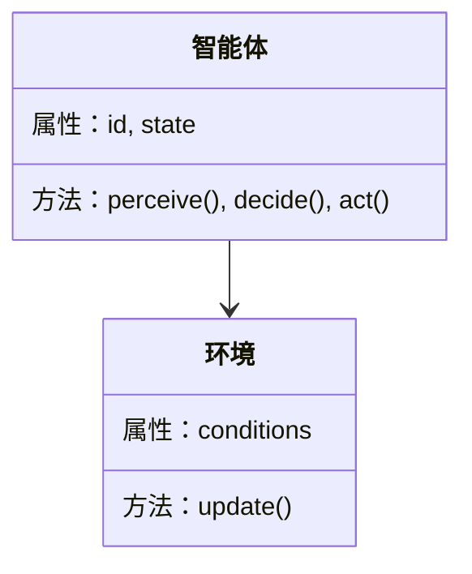
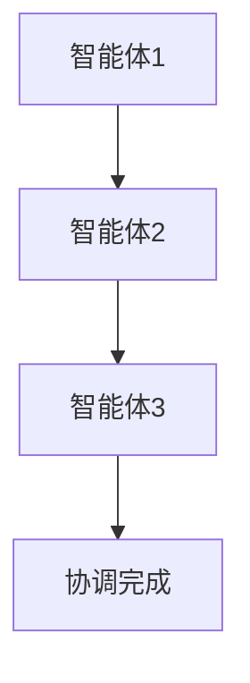
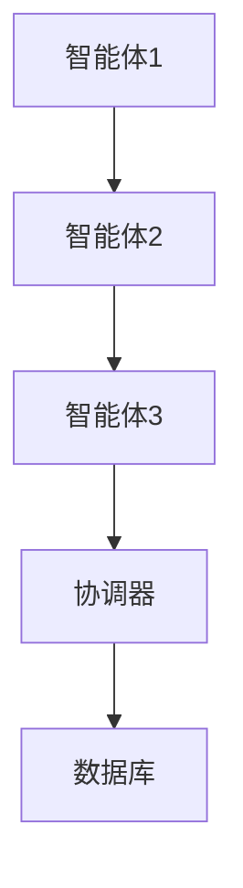

                 


# 多智能体系统分析全球经济联系

> 关键词：多智能体系统、全球经济联系、经济建模、分布式协调、博弈论

> 摘要：本文探讨了多智能体系统（MAS）在分析全球经济联系中的应用。通过MAS的建模方法、算法原理和系统架构，分析全球经济的复杂性，并提出解决方案。文章结合实际案例，详细讲解MAS在经济系统中的实现与应用，最后总结其优势与挑战。

---

# 第一部分: 多智能体系统与全球经济联系概述

## 第1章: 多智能体系统概述

### 1.1 多智能体系统的定义与特点

#### 1.1.1 多智能体系统的定义
多智能体系统（Multi-Agent System, MAS）是由多个智能体（Agent）组成的复杂系统，每个智能体能够独立感知环境、自主决策并与其他智能体交互。MAS 的核心在于分布式智能，通过智能体之间的协作完成复杂任务。

#### 1.1.2 多智能体系统的核心特点
| 特性 | 描述 |
|------|------|
| 分布式 | 智能体独立运行，无中心控制 |
| 协作性 | 智能体通过协作完成全局目标 |
| 反应性 | 能够实时感知环境并做出反应 |
| 动态性 | 系统状态随智能体交互动态变化 |

#### 1.1.3 多智能体系统与单智能体系统的区别
- **单智能体系统**：单个智能体完成任务，决策集中。
- **多智能体系统**：多个智能体协作，决策分散。


### 1.2 多智能体系统在经济分析中的作用

#### 1.2.1 经济系统复杂性的挑战
经济系统涉及多个参与者（企业、消费者、政府等），其行为复杂且相互影响，传统模型难以捕捉这些动态。

#### 1.2.2 多智能体系统在经济建模中的优势
- **分布式建模**：每个智能体代表一个经济主体，能够独立决策。
- **动态演化**：MAS 可模拟经济系统的动态变化。
- **协作与竞争**：智能体之间的协作与竞争反映经济现实。

#### 1.2.3 多智能体系统在全球经济联系中的应用前景
MAS 可用于模拟国际贸易、供应链优化、金融市场波动等复杂经济现象。

### 1.3 本章小结
MAS 的分布式特性使其成为分析复杂经济系统的理想工具。通过 MAS，可以更好地理解全球经济联系的动态。

---

## 第2章: 多智能体系统的核心概念与联系

### 2.1 多智能体系统的核心概念

#### 2.1.1 智能体的定义与属性
- **智能体**：能够感知环境、自主决策的实体。
- **属性**：
  - 感知能力：感知环境信息。
  - 决策能力：基于信息做出决策。
  - 交互能力：与其他智能体或环境交互。



#### 2.1.2 多智能体系统的结构与组成
MAS 由以下部分组成：
- **智能体**：多个具有自主性的智能体。
- **环境**：智能体所处的外部世界。
- **通信机制**：智能体之间的交互方式。
- **协调机制**：确保智能体协作的规则。

#### 2.1.3 多智能体系统的通信机制
- **直接通信**：智能体间直接交换信息。
- **间接通信**：通过共享数据库或消息中间件进行通信。

### 2.2 多智能体系统的建模方法

#### 2.2.1 基于智能体的建模方法
- **优点**：能够模拟复杂系统的动态行为。
- **步骤**：
  1. 确定智能体类型。
  2. 定义智能体属性和行为。
  3. 设计智能体间的交互规则。

#### 2.2.2 基于规则的建模方法
- **规则驱动**：智能体根据预定义规则进行决策。
- **优点**：简单易实现。

#### 2.2.3 基于博弈论的建模方法
- **博弈论**：模拟智能体之间的策略选择和冲突。
- **纳什均衡**：所有智能体策略的稳定状态。

$$ 纳什均衡定义：对于所有参与人，给定其他人的策略，每个参与人选择的策略都是最佳反应。 $$

### 2.3 多智能体系统的经济模型构建

#### 2.3.1 经济系统的智能体建模
- **企业智能体**：追求利润最大化。
- **消费者智能体**：追求效用最大化。
- **政府智能体**：制定政策影响市场。

#### 2.3.2 经济系统的交互规则设计
- **市场规则**：定价、交易规则。
- **政策规则**：税收、补贴等。

#### 2.3.3 经济系统的动态演化分析
- **系统仿真**：模拟经济系统的动态变化。
- **反馈机制**：根据仿真结果调整模型。

### 2.4 本章小结
MAS 的核心概念为理解和建模全球经济联系提供了理论基础。

---

## 第3章: 多智能体系统的算法原理

### 3.1 多智能体系统的协调与协作算法

#### 3.1.1 分布式协调算法
- **分布式协调**：智能体通过局部信息达成全局一致。
- **算法流程**：
  1. 智能体感知环境。
  2. 智能体做出决策。
  3. 智能体与其他智能体协调。



#### 3.1.2 基于博弈论的协调算法
- **纳什均衡**：所有智能体策略的稳定状态。
- **实现步骤**：
  1. 确定智能体的策略空间。
  2. 计算纳什均衡。
  3. 实现智能体间的策略协调。

#### 3.1.3 基于强化学习的协作算法
- **强化学习**：智能体通过试错学习最优策略。
- **算法流程**：
  1. 智能体采取动作。
  2. 环境返回奖励。
  3. 智能体更新策略。

### 3.2 多智能体系统的决策算法

#### 3.2.1 基于局部信息的决策算法
- **优点**：计算简单，适合分布式系统。
- **实现步骤**：
  1. 智能体感知局部信息。
  2. 基于局部信息做出决策。

#### 3.2.2 基于全局信息的决策算法
- **优点**：能够全局优化。
- **实现步骤**：
  1. 收集全局信息。
  2. 基于全局信息做出决策。

#### 3.2.3 基于机器学习的决策算法
- **机器学习**：智能体通过数据学习决策模型。
- **实现步骤**：
  1. 数据采集与预处理。
  2. 模型训练。
  3. 模型部署。

### 3.3 多智能体系统的通信与信息交换

#### 3.3.1 通信协议的设计
- **可靠通信**：确保信息准确传递。
- **安全性**：防止信息泄露。

#### 3.3.2 信息交互的实现
- **消息传递**：智能体通过消息传递信息。
- **事件驱动**：基于事件触发交互。

### 3.4 本章小结
MAS 的算法原理为实现全球经济联系的分析提供了技术支撑。

---

## 第4章: 多智能体系统的系统架构设计

### 4.1 系统功能设计

#### 4.1.1 领域模型设计
- **领域模型**：描述系统的核心业务流程。
- **类图设计**：
  ```mermaid
  classDiagram
      class 智能体 {
          属性：id, state
          方法：perceive(), decide(), act()
      }
      class 环境 {
          属性：conditions
          方法：update()
      }
      智能体 --> 环境
  ```

#### 4.1.2 系统架构设计
- **分层架构**：将系统划分为多个层次，如表示层、业务逻辑层、数据访问层。
- **微服务架构**：将系统功能模块化为多个微服务。

### 4.2 系统架构实现

#### 4.2.1 系统架构图


#### 4.2.2 系统接口设计
- **API 接口**：定义智能体之间的交互接口。
- **RESTful API**：常用 HTTP 方法（GET、POST、PUT、DELETE）。

#### 4.2.3 系统交互流程图


### 4.3 本章小结
系统架构设计为 MAS 的实现提供了清晰的框架。

---

## 第5章: 多智能体系统的项目实战

### 5.1 环境安装与配置

#### 5.1.1 开发环境选择
- **编程语言**：Python、Java。
- **框架选择**：使用 Jason、OpenCog 等 MAS 框架。

#### 5.1.2 系统环境配置
- **安装依赖**：安装所需的库和工具。
- **配置开发环境**：配置 IDE 和版本控制工具。

### 5.2 系统核心实现

#### 5.2.1 核心算法实现
- **实现步骤**：
  1. 编写智能体类。
  2. 实现智能体的感知、决策和行动方法。
  3. 实现智能体间的通信机制。

#### 5.2.2 系统功能实现
- **功能模块**：
  - 智能体管理模块：管理多个智能体。
  - 交互管理模块：处理智能体间的交互。
  - 数据存储模块：存储系统运行数据。

#### 5.2.3 系统代码实现
- **Python 实现示例**：
  ```python
  class Agent:
      def __init__(self, id):
          self.id = id
          self.state = "idle"
      
      def perceive(self, environment):
          # 感知环境
          pass
      
      def decide(self):
          # 决策
          pass
      
      def act(self):
          # 行动
          pass
  ```

### 5.3 实际案例分析

#### 5.3.1 案例背景
- **案例**：模拟国际贸易市场。
- **目标**：分析国际贸易中的价格波动。

#### 5.3.2 案例实现
- **实现步骤**：
  1. 定义智能体类型（买方、卖方）。
  2. 设计交互规则（定价、交易）。
  3. 模拟市场动态。

#### 5.3.3 案例结果分析
- **结果展示**：价格波动曲线。
- **结果解读**：分析价格波动的原因。

### 5.4 本章小结
通过实际案例分析，验证了 MAS 在经济系统分析中的有效性。

---

## 第6章: 总结与展望

### 6.1 总结
- **MAS 的优势**：分布式、协作性、动态性。
- **MAS 的应用**：全球经济联系的分析。

### 6.2 展望
- **未来挑战**：复杂系统的建模、智能体间的协同优化。
- **未来方向**：结合大数据、人工智能技术，提升 MAS 的分析能力。

### 6.3 最佳实践 tips
- **选择合适的 MAS 框架**。
- **确保系统的可扩展性**。
- **注重系统的安全性和稳定性**。

### 6.4 本章小结
MAS 在全球经济联系的分析中具有广阔的应用前景。

---

# 结语

通过本文的探讨，我们深入分析了多智能体系统在分析全球经济联系中的应用。MAS 的分布式特性为经济系统的建模与分析提供了新的视角，未来随着技术的发展，MAS 的应用将更加广泛和深入。

---

# 参考文献

（此处列出相关文献和资料）

--- 

# 附录

（此处可添加代码示例、数据表格等补充材料）

--- 

# 致谢

感谢读者的耐心阅读，感谢同行专家的指导与支持。

--- 

# 作者简介

（此处介绍作者的背景和相关著作）

